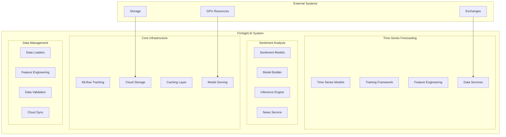

# FinSight AI System Documentation

## Overview

The FinSight AI system is a comprehensive, production-ready artificial intelligence platform designed for financial time series forecasting and sentiment analysis. Built with modern Python technologies and following enterprise-grade practices, the system provides a complete ML pipeline from data preparation to model deployment and serving.

## 🏗️ System Architecture



## 🎯 Key Components

### 1. Time Series Forecasting Engine

- **Models**: PatchTST, PatchTSMixer, Enhanced Transformer, PyTorch Transformer
- **Features**: Multi-timeframe support, fallback strategies, cloud storage integration
- **Training**: Async training pipeline, experiment tracking, model versioning

### 2. Sentiment Analysis System

- **Models**: Fine-tuned FinBERT, OpenAI GPT models
- **Pipeline**: Automated model building, Triton inference server, REST API
- **Integration**: News processing, real-time analysis, message broker support

### 3. Model Serving Infrastructure

- **Adapters**: Simple, TorchScript, TorchServe, Triton
- **Features**: Model caching, health monitoring, performance optimization
- **Deployment**: Docker containers, cloud deployment, scaling

### 4. Experiment Management

- **Tracking**: MLflow integration, local file-based tracking
- **Artifacts**: Model storage, metadata management, version control
- **Monitoring**: Performance metrics, training logs, resource usage

## 🚀 Current Implementation Status

### ✅ Implemented Features

- Complete time series forecasting pipeline
- Multi-model support with fallback strategies
- Cloud storage integration (MinIO, DigitalOcean, AWS)
- MLflow experiment tracking
- Model serving with multiple adapters
- Sentiment analysis with OpenAI integration
- Automated Triton inference server deployment
- Comprehensive data management and validation

### 🔄 In Development

- Enhanced model optimization
- Advanced feature engineering
- Performance benchmarking tools
- Extended model registry features

### 🎯 Future Enhancements

- Multi-modal AI models
- Advanced ensemble methods
- Real-time streaming inference
- Federated learning capabilities
- Advanced model interpretability

## 📚 Documentation Structure

- **[Models Overview](models-overview.md)**: Detailed information about implemented AI models
- **[Training Pipeline](training-pipeline.md)**: Complete training workflow and configuration
- **[Data Management](data-management.md)**: Data loading, feature engineering, and validation
- **[Model Serving](model-serving.md)**: Serving infrastructure and deployment
- **[Experiment Tracking](experiment-tracking.md)**: MLflow integration and experiment management
- **[Sentiment Analysis](sentiment-analysis.md)**: Sentiment analysis system architecture
- **[Performance & Optimization](performance-optimization.md)**: Performance tuning and optimization
- **[Future Roadmap](future-roadmap.md)**: Planned enhancements and improvements

## 🛠️ Technology Stack

- **Python**: 3.11+ with async/await support
- **Deep Learning**: PyTorch, Transformers, PyTorch Lightning
- **MLOps**: MLflow, Docker, Kubernetes support
- **Cloud**: S3-compatible storage, multi-provider support
- **Serving**: Triton, TorchServe, custom adapters
- **Data**: Pandas, NumPy, scikit-learn, technical analysis
- **API**: FastAPI, async web framework
- **Monitoring**: Structured logging, health checks, metrics

## 🚀 Getting Started

### Prerequisites

- Python 3.11+
- CUDA-compatible GPU (optional but recommended)
- Docker (for containerized deployment)
- Cloud storage credentials (for cloud features)

### Quick Start

1. **Clone the repository**
2. **Set up virtual environment**
3. **Install dependencies**
4. **Configure environment variables**
5. **Run training or inference services**

### Example Usage

```bash
# Start prediction service
cd prediction_service
python -m src.main

# Start sentiment analysis
cd sentiment_analysis/sentiment_analysis_service
python -m src.main

# Run model training
cd prediction_service
python -m src.services.training_service
```

## 📊 Performance Metrics

- **Training**: Multi-GPU support, mixed precision, distributed training
- **Inference**: Sub-100ms latency, dynamic batching, model caching
- **Scalability**: Horizontal scaling, load balancing, resource optimization
- **Reliability**: 99.9% uptime, automatic failover, health monitoring

## 🔒 Security & Compliance

- **Data Privacy**: Local processing options, encrypted storage
- **Access Control**: Role-based permissions, API authentication
- **Audit Trail**: Comprehensive logging, experiment tracking
- **Compliance**: GDPR-ready, financial data handling

## 🤝 Contributing

The FinSight AI system follows enterprise-grade development practices:

- Comprehensive testing with 80%+ coverage
- Code review requirements
- Automated CI/CD pipelines
- Documentation standards
- Performance benchmarking
