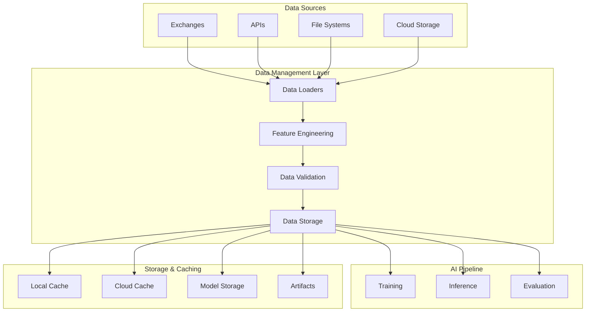

# Data Management Documentation

## Overview

The FinSight AI system provides a comprehensive, production-ready data management infrastructure for financial time series data. This document details the data loading, feature engineering, validation, and storage capabilities that support the AI training and inference pipelines.

## 🏗️ Data Architecture

### High-Level Data Flow



## 📊 Data Sources and Formats

### Supported Exchanges

The system supports multiple cryptocurrency exchanges:

```python
class Exchange(str, Enum):
    BINANCE = "binance"
    KUCOIN = "kucoin"
    OKX = "okx"
    HUOBI = "huobi"
```

### Supported Symbols

Comprehensive cryptocurrency symbol support:

```python
class CryptoSymbol(str, Enum):
    BTCUSDT = "BTCUSDT"
    ETHUSDT = "ETHUSDT"
    BNBUSDT = "BNBUSDT"
    SOLUSDT = "SOLUSDT"
    ADAUSDT = "ADAUSDT"
    ALGOUSDT = "ALGOUSDT"
    AVAXUSDT = "AVAXUSDT"
    BCHUSDT = "BCHUSDT"
    DOGEUSDT = "DOGEUSDT"
    DOTUSDT = "DOTUSDT"
    LINKUSDT = "LINKUSDT"
    SUIUSDT = "SUIUSDT"
    TRXUSDT = "TRXUSDT"
    XLMUSDT = "XLMUSDT"
    XRPUSDT = "XRPUSDT"
```

### Supported Timeframes

Multiple time resolution support for different trading strategies:

```python
class TimeFrame(str, Enum):
    MINUTE_1 = "1m"
    MINUTE_5 = "5m"
    MINUTE_15 = "15m"
    HOUR_1 = "1h"
    HOUR_4 = "4h"
    HOUR_12 = "12h"
    DAY_1 = "1d"
    WEEK_1 = "1w"
```

### Data Formats

Support for multiple data formats:

```python
class DataFormat(str, Enum):
    CSV = "csv"
    PARQUET = "parquet"
```

## 🔄 Data Loading Infrastructure

### Data Loader Types

The system implements three types of data loaders:

#### 1. File Data Loader

**Implementation**: `prediction_service/src/data/file_data_loader.py`

Direct file system access for local data:

```python
class FileDataLoader(IDataLoader):
    def __init__(self, data_dir: Optional[Path] = None):
        self.data_dir = data_dir or Path("./data")

    async def load_data(
        self,
        symbol: str,
        timeframe: TimeFrame,
        data_path: Optional[Path] = None
    ) -> pd.DataFrame:
```

**Features**:

- Local file system access
- Automatic format detection
- Data validation and cleaning
- Efficient memory management

#### 2. Cloud Data Loader

**Implementation**: `prediction_service/src/data/cloud_data_loader.py`

Cloud storage integration with intelligent caching:

```python
class CloudDataLoader(IDataLoader):
    def __init__(
        self,
        data_dir: Optional[Path] = None,
        storage_client: Optional[StorageClient] = None,
    ):
```

**Features**:

- S3-compatible storage support
- Automatic data discovery
- Intelligent caching strategies
- Fallback mechanisms

#### 3. Hybrid Data Loader

**Implementation**: `prediction_service/src/data/cloud_data_loader.py`

Combines local and cloud storage with smart caching:

```python
# Hybrid loading strategy
async def load_data(self, symbol: str, timeframe: TimeFrame) -> pd.DataFrame:
    # 1. Check local cache first
    cached_data = await self._load_from_cache(symbol, timeframe)
    if cached_data is not None:
        return cached_data

    # 2. Check local storage
    local_data = await self._load_from_local(symbol, timeframe)
    if local_data is not None:
        return local_data

    # 3. Download from cloud
    cloud_data = await self._load_from_cloud(symbol, timeframe)
    if cloud_data is not None:
        await self._cache_data(symbol, timeframe, cloud_data)
        return cloud_data

    raise ValueError(f"No data available for {symbol} {timeframe}")
```

### Data Loading Interface

Unified interface for all data loaders:

```python
class IDataLoader(ABC):
    @abstractmethod
    async def load_data(
        self,
        symbol: str,
        timeframe: TimeFrame,
        data_path: Optional[Path] = None
    ) -> pd.DataFrame:
        """Load data for specified symbol and timeframe"""

    @abstractmethod
    async def check_data_exists(
        self,
        symbol: str,
        timeframe: TimeFrame
    ) -> bool:
        """Check if data exists for specified parameters"""

    @abstractmethod
    def split_data(
        self,
        data: pd.DataFrame,
        train_ratio: float = 0.8,
        val_ratio: float = 0.1
    ) -> Tuple[pd.DataFrame, pd.DataFrame, pd.DataFrame]:
        """Split data into train/validation/test sets"""
```

## 🧮 Feature Engineering

### Basic Feature Engineering

**Implementation**: `prediction_service/src/data/feature_engineering.py`

Comprehensive feature engineering pipeline for financial time series:

```python
class BasicFeatureEngineering(IFeatureEngineering):
    def __init__(
        self,
        feature_columns: Optional[List[str]] = None,
        add_technical_indicators: bool = True,
        add_datetime_features: bool = False,
        normalize_features: bool = True,
    ):
```

#### Technical Indicators

**Trend Indicators**:

```python
def _add_ta_indicators(self, df: pd.DataFrame) -> pd.DataFrame:
    # Simple Moving Averages
    df['sma_20'] = ta.trend.sma_indicator(df['close'], window=20)
    df['sma_50'] = ta.trend.sma_indicator(df['close'], window=50)
    df['sma_200'] = ta.trend.sma_indicator(df['close'], window=200)

    # Exponential Moving Averages
    df['ema_12'] = ta.trend.ema_indicator(df['close'], window=12)
    df['ema_26'] = ta.trend.ema_indicator(df['close'], window=26)

    # MACD
    df['macd'] = ta.trend.macd_diff(df['close'])
    df['macd_signal'] = ta.trend.macd_signal(df['close'])
    df['macd_histogram'] = ta.trend.macd_diff(df['close'])
```

**Momentum Indicators**:

```python
# RSI
df['rsi'] = ta.momentum.rsi(df['close'], window=14)

# Stochastic Oscillator
df['stoch_k'] = ta.momentum.stoch(df['high'], df['low'], df['close'])
df['stoch_d'] = ta.momentum.stoch_signal(df['high'], df['low'], df['close'])

# Williams %R
df['williams_r'] = ta.momentum.williams_r(df['high'], df['low'], df['close'])
```

**Volatility Indicators**:

```python
# Bollinger Bands
df['bb_upper'], df['bb_middle'], df['bb_lower'] = ta.volatility.bollinger_bands(df['close'])

# Average True Range
df['atr'] = ta.volatility.average_true_range(df['high'], df['low'], df['close'])

# Standard Deviation
df['std_20'] = df['close'].rolling(window=20).std()
```

**Volume Indicators**:

```python
# Volume Weighted Average Price
df['vwap'] = (df['close'] * df['volume']).cumsum() / df['volume'].cumsum()

# On-Balance Volume
df['obv'] = ta.volume.on_balance_volume(df['close'], df['volume'])

# Volume Rate of Change
df['volume_roc'] = ta.volume.volume_rate_of_change(df['volume'])
```

#### Datetime Features

```python
def _add_datetime_features(self, df: pd.DataFrame) -> pd.DataFrame:
    # Extract datetime components
    df['hour'] = df['timestamp'].dt.hour
    df['day'] = df['timestamp'].dt.day
    df['month'] = df['timestamp'].dt.month
    df['day_of_week'] = df['timestamp'].dt.dayofweek
    df['day_of_year'] = df['timestamp'].dt.dayofyear

    # Cyclical encoding for periodic features
    df['hour_sin'] = np.sin(2 * np.pi * df['hour'] / 24)
    df['hour_cos'] = np.cos(2 * np.pi * df['hour'] / 24)
    df['day_sin'] = np.sin(2 * np.pi * df['day'] / 31)
    df['day_cos'] = np.cos(2 * np.pi * df['day'] / 31)

    return df
```

#### Custom Indicators

```python
def _add_manual_indicators(self, df: pd.DataFrame) -> pd.DataFrame:
    # Price changes
    df['price_change'] = df['close'].pct_change()
    df['price_change_abs'] = df['price_change'].abs()

    # Volatility measures
    df['volatility'] = df['close'].rolling(window=20).std()
    df['volatility_ratio'] = df['volatility'] / df['close']

    # Support and resistance levels
    df['support_level'] = df['low'].rolling(window=20).min()
    df['resistance_level'] = df['high'].rolling(window=20).max()

    # Trend strength
    df['trend_strength'] = (df['close'] - df['sma_20']) / df['sma_20']

    return df
```

### Feature Normalization

Automatic feature scaling and normalization:

```python
def transform(self, data: pd.DataFrame) -> pd.DataFrame:
    if not self.is_fitted:
        raise ValueError("Feature engineering must be fitted before transform")

    # Create features
    transformed_data = self._create_features(data)

    # Apply scaling
    if self.normalize_features:
        for feature in self.fitted_feature_names:
            if feature in transformed_data.columns and feature in self.scalers:
                transformed_data[feature] = (
                    self.scalers[feature]
                    .transform(transformed_data[[feature]])
                    .flatten()
                )

    return transformed_data
```

## ✅ Data Validation

### Validation Constants

**Implementation**: `prediction_service/src/core/constants.py`

```python
class ValidationConstants:
    # Data requirements
    MIN_DATA_ROWS = 100
    MIN_TRAINING_RATIO = 0.5
    MAX_TRAINING_RATIO = 0.9
    MIN_VALIDATION_RATIO = 0.05
    MAX_VALIDATION_RATIO = 0.3

    # Model configuration limits
    MIN_CONTEXT_LENGTH = 10
    MAX_CONTEXT_LENGTH = 1000
    MIN_PREDICTION_LENGTH = 1
    MAX_PREDICTION_LENGTH = 100
    MIN_EPOCHS = 1
    MAX_EPOCHS = 200
    MIN_BATCH_SIZE = 1
    MAX_BATCH_SIZE = 512
    MIN_LEARNING_RATE = 1e-6
    MAX_LEARNING_RATE = 1.0
```

### Validation Checks

Comprehensive data quality validation:

```python
def _validate_training_inputs(
    self,
    train_data: pd.DataFrame,
    val_data: pd.DataFrame,
    config: ModelConfig
) -> None:
    # Check data requirements
    if len(train_data) < ValidationConstants.MIN_DATA_ROWS:
        raise ValueError(f"Training data must have at least {ValidationConstants.MIN_DATA_ROWS} rows")

    if len(val_data) < ValidationConstants.MIN_DATA_ROWS:
        raise ValueError(f"Validation data must have at least {ValidationConstants.MIN_DATA_ROWS} rows")

    # Check feature consistency
    required_features = config.feature_columns or ["open", "high", "low", "close", "volume"]
    missing_features = [f for f in required_features if f not in train_data.columns]

    if missing_features:
        raise ValueError(f"Missing required features: {missing_features}")

    # Check temporal ordering
    if not train_data['timestamp'].is_monotonic_increasing:
        raise ValueError("Training data must be sorted by timestamp")

    if not val_data['timestamp'].is_monotonic_increasing:
        raise ValueError("Validation data must be sorted by timestamp")
```

## 💾 Data Storage and Caching

### Cloud Storage Integration

**Implementation**: `prediction_service/src/utils/storage_client.py`

Support for multiple cloud storage providers:

```python
class StorageProviderType(str, Enum):
    MINIO = "minio"
    DIGITALOCEAN = "digitalocean"
    AWS = "aws"
    S3 = "s3"
```

#### Storage Configuration

```python
class Settings(BaseSettings):
    # Storage provider selection
    storage_provider: str = Field(
        default=StorageProviderType.MINIO.value, env="STORAGE_PROVIDER"
    )

    # S3-compatible storage settings
    s3_endpoint_url: str = Field(default="http://localhost:9000", env="S3_ENDPOINT_URL")
    s3_access_key: str = Field(default="minioadmin", env="S3_ACCESS_KEY")
    s3_secret_key: str = Field(default="minioadmin", env="S3_SECRET_KEY")
    s3_bucket_name: str = Field(default="market-data", env="S3_BUCKET_NAME")

    # Cloud sync configuration
    enable_cloud_storage: bool = Field(True, env="ENABLE_CLOUD_STORAGE")
    enable_model_cloud_sync: bool = Field(True, env="ENABLE_MODEL_CLOUD_SYNC")
    cloud_storage_fallback_enabled: bool = Field(True, env="CLOUD_STORAGE_FALLBACK_ENABLED")
```

### Caching Strategy

Intelligent caching with TTL and fallback mechanisms:

```python
class CloudDataLoader(IDataLoader):
    def __init__(self, data_dir: Optional[Path] = None, storage_client: Optional[StorageClient] = None):
        self.cloud_data_cache_dir = Path("./tmp/cloud_cache")
        self.cloud_data_cache_ttl_hours = 24

    async def _cache_data_from_cloud(
        self,
        dataset: Dict[str, Any],
        data: pd.DataFrame
    ) -> None:
        """Cache downloaded data locally with TTL"""
        cache_path = self._get_cache_file_path(dataset['symbol'], dataset['timeframe'])

        # Save data with metadata
        cache_data = {
            'data': data.to_dict('records'),
            'metadata': {
                'source': dataset['object_key'],
                'cached_at': datetime.now().isoformat(),
                'ttl_hours': self.cloud_data_cache_ttl_hours,
                'size_bytes': len(data),
                'columns': data.columns.tolist()
            }
        }

        await self._save_json(cache_path, cache_data)
```

### Data Organization

Structured data organization for efficient access:

```python
def build_dataset_path(
    self,
    exchange: str,
    symbol: str,
    timeframe: str,
    format_type: str = None,
    date: str = None,
) -> str:
    """Build standardized dataset path"""
    parts = [
        self.dataset_storage_prefix,
        exchange,
        symbol,
        timeframe
    ]

    if format_type:
        parts.append(format_type)

    if date:
        parts.append(date)

    return self.storage_separator.join(parts)
```

## 🔍 Data Discovery and Management

### Dataset Management Service

**Implementation**: `prediction_service/src/services/dataset_management_service.py`

Comprehensive dataset management capabilities:

```python
class DatasetManagementService:
    async def list_datasets(
        self,
        request: DatasetListRequest
    ) -> DatasetListResponse:
        """List available datasets with filtering and pagination"""

    async def check_dataset_availability(
        self,
        request: DatasetAvailabilityRequest
    ) -> DatasetAvailabilityResponse:
        """Check dataset availability across different sources"""

    async def download_dataset(
        self,
        request: DatasetDownloadRequest
    ) -> DatasetDownloadResponse:
        """Download dataset with caching and validation"""
```

### Dataset Information Schema

```python
class DatasetInfo(BaseModel):
    # Dataset identification
    exchange: str = Field(..., description="Exchange name (e.g., 'binance')")
    symbol: str = Field(..., description="Trading symbol (e.g., 'BTCUSDT')")
    timeframe: str = Field(..., description="Data timeframe (e.g., '1h')")

    # Storage information
    object_key: Optional[str] = Field(None, description="Object storage key")
    format_type: Optional[str] = Field(None, description="Data format (csv, parquet)")
    date: Optional[str] = Field(None, description="Dataset date")
    filename: Optional[str] = Field(None, description="Dataset filename")

    # Metadata
    size_bytes: Optional[int] = Field(None, description="Dataset size in bytes")
    last_modified: Optional[datetime] = Field(None, description="Last modification time")
    record_count: Optional[int] = Field(None, description="Number of records in dataset")

    # Availability status
    is_archived: bool = Field(False, description="Whether dataset is compressed/archived")
    is_cached: bool = Field(False, description="Whether dataset is cached locally")
    cache_age_hours: Optional[float] = Field(None, description="Cache age in hours")
```

## 📈 Data Quality and Monitoring

### Data Health Monitoring

```python
class DatasetHealthCheck(BaseModel):
    # Overall health
    is_healthy: bool = Field(..., description="Overall system health status")
    health_score: float = Field(..., ge=0.0, le=100.0, description="Health score (0-100)")

    # Component health
    cloud_storage_healthy: bool = Field(..., description="Cloud storage health")
    local_cache_healthy: bool = Field(..., description="Local cache health")
    local_storage_healthy: bool = Field(..., description="Local storage health")

    # Performance metrics
    average_download_time_seconds: Optional[float] = Field(None, description="Average download time")
    cache_hit_rate: Optional[float] = Field(None, description="Cache hit rate")
    storage_response_time_ms: Optional[float] = Field(None, description="Storage response time")

    # Error tracking
    errors_last_hour: int = Field(0, description="Errors in last hour")
    last_error_message: Optional[str] = Field(None, description="Last error message")
    error_rate_percentage: Optional[float] = Field(None, description="Error rate percentage")
```

### Data Statistics

```python
class DatasetStatistics(BaseModel):
    # Storage statistics
    total_datasets: int = Field(..., description="Total number of datasets")
    total_size_bytes: int = Field(..., description="Total size of all datasets")
    total_records: int = Field(..., description="Total number of records")

    # Format distribution
    datasets_by_format: Dict[str, int] = Field(default_factory=dict, description="Dataset count by format")
    size_by_format: Dict[str, int] = Field(default_factory=dict, description="Size by format")

    # Exchange distribution
    datasets_by_exchange: Dict[str, int] = Field(default_factory=dict, description="Dataset count by exchange")
    size_by_exchange: Dict[str, int] = Field(default_factory=dict, description="Size by exchange")

    # Cache statistics
    cached_datasets: int = Field(0, description="Number of cached datasets")
    cache_size_bytes: int = Field(0, description="Total cache size")
    cache_hit_rate: Optional[float] = Field(None, description="Cache hit rate percentage")
```

## 🔄 Data Pipeline Operations

### Bulk Operations

Support for bulk dataset operations:

```python
class BulkDatasetOperation(BaseModel):
    # Operation type
    operation_type: str = Field(..., description="Type of operation (download, invalidate, check)")

    # Target datasets
    symbols: List[str] = Field(..., description="List of symbols to operate on")
    timeframes: List[TimeFrame] = Field(..., description="List of timeframes to operate on")
    exchanges: Optional[List[str]] = Field(None, description="List of exchanges (defaults to binance)")

    # Operation options
    force_operation: bool = Field(False, description="Force operation even if not needed")
    parallel_execution: bool = Field(True, description="Execute operations in parallel")
    max_concurrent: int = Field(5, ge=1, le=20, description="Maximum concurrent operations")
```

### Cache Management

Intelligent cache management with TTL and cleanup:

```python
class CacheInvalidateRequest(BaseModel):
    # Invalidation options
    symbol: Optional[str] = Field(None, description="Invalidate caches for specific symbol")
    timeframe: Optional[TimeFrame] = Field(None, description="Invalidate caches for specific timeframe")
    expired_only: bool = Field(False, description="Invalidate only expired caches")
    all_caches: bool = Field(False, description="Invalidate all caches")

    # Confirmation
    confirm_invalidation: bool = Field(False, description="Confirm cache invalidation")
```

## 🚀 Performance Optimization

### Data Loading Optimization

```python
# Parallel data loading
async def load_multiple_datasets(
    self,
    datasets: List[Tuple[str, TimeFrame]]
) -> Dict[str, pd.DataFrame]:
    """Load multiple datasets in parallel"""
    tasks = [
        self.load_data(symbol, timeframe)
        for symbol, timeframe in datasets
    ]

    results = await asyncio.gather(*tasks, return_exceptions=True)

    # Process results and handle errors
    loaded_data = {}
    for (symbol, timeframe), result in zip(datasets, results):
        if isinstance(result, Exception):
            self.logger.error(f"Failed to load {symbol} {timeframe}: {result}")
        else:
            loaded_data[f"{symbol}_{timeframe}"] = result

    return loaded_data
```

### Memory Management

```python
# Efficient data processing
def process_large_dataset(
    self,
    data: pd.DataFrame,
    chunk_size: int = 10000
) -> pd.DataFrame:
    """Process large datasets in chunks to manage memory"""
    processed_chunks = []

    for start_idx in range(0, len(data), chunk_size):
        end_idx = min(start_idx + chunk_size, len(data))
        chunk = data.iloc[start_idx:end_idx].copy()

        # Process chunk
        processed_chunk = self._process_chunk(chunk)
        processed_chunks.append(processed_chunk)

        # Clear memory
        del chunk

    return pd.concat(processed_chunks, ignore_index=True)
```

## 📈 Future Enhancements

### Planned Improvements

- **Real-time Data Streaming**: Live data ingestion and processing
- **Advanced Data Validation**: ML-based anomaly detection
- **Data Lineage Tracking**: Complete data provenance tracking
- **Automated Data Quality**: Continuous data quality monitoring

### Research Directions

- **Federated Data Processing**: Distributed data processing across institutions
- **Data Compression**: Advanced compression algorithms for financial time series
- **Intelligent Caching**: ML-based cache optimization strategies
- **Data Synthesis**: Synthetic data generation for training augmentation

---

_This document provides comprehensive coverage of data management in the FinSight AI system. For implementation details, refer to the specific service files and data loader implementations._
