# Experiment Tracking Documentation

## Introduction

The FinSight AI system implements a comprehensive experiment tracking infrastructure to monitor, manage, and optimize machine learning experiments. This document details the current implementation, architecture, and usage of the experiment tracking system.

## 🏗️ Architecture Overview

### System Components

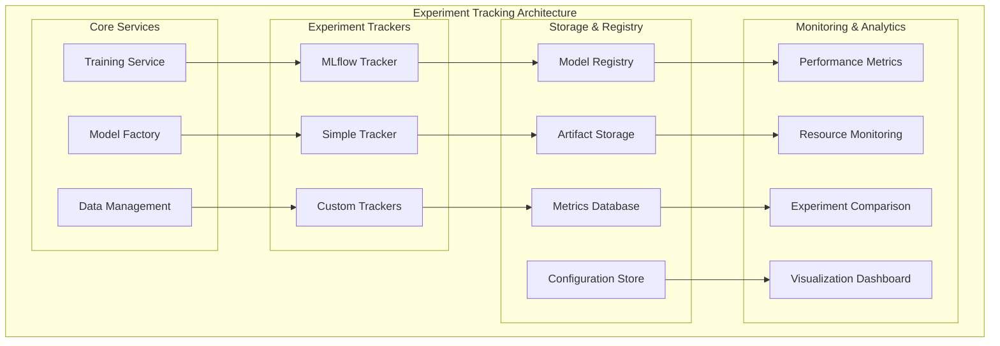

### Data Flow

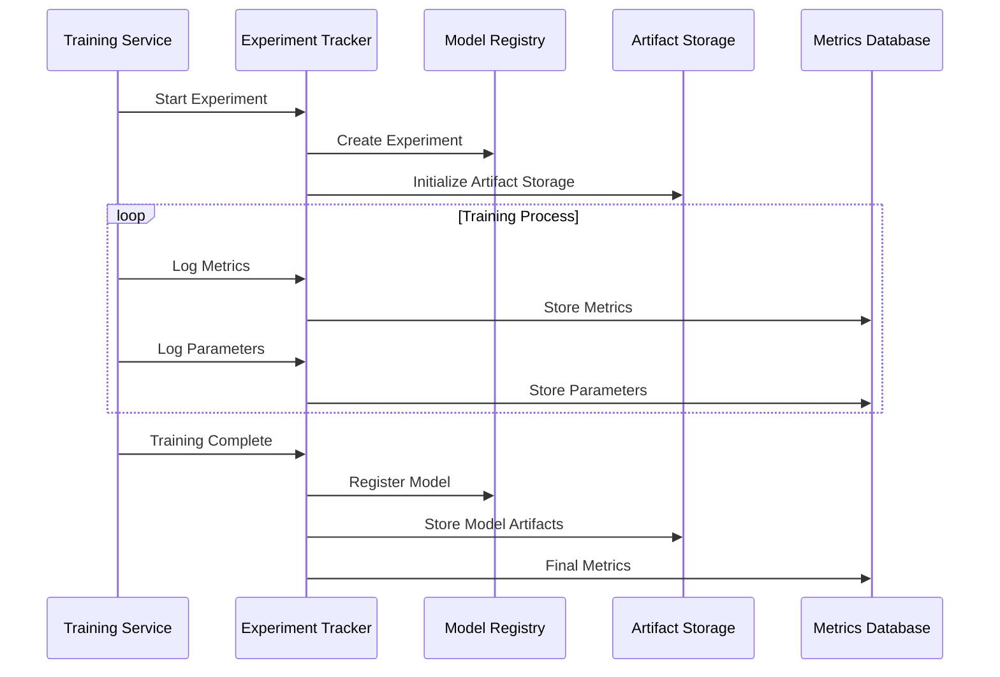

## 🔧 Current Implementation

### 1. MLflow Experiment Tracker

**Implementation**: `prediction_service/src/adapters/mlflow_experiment_tracker.py`

#### Features

- **Remote tracking**: Centralized experiment management
- **Model registry**: Versioned model storage and management
- **Artifact storage**: Comprehensive artifact management
- **Experiment comparison**: Side-by-side experiment analysis
- **Reproducibility**: Complete experiment tracking

#### Architecture

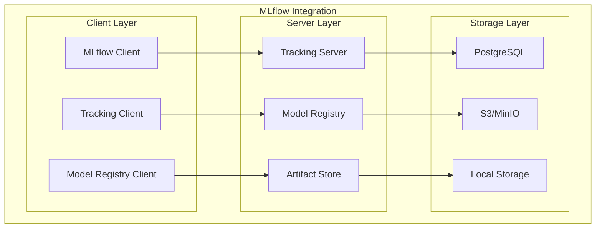

#### Implementation Details

```python
class MLflowExperimentTracker(IExperimentTracker):
    def __init__(self, tracking_uri: Optional[str] = None, experiment_name: Optional[str] = None):
        self.tracking_uri = tracking_uri or os.getenv("MLFLOW_TRACKING_URI", "http://localhost:5000")
        self.experiment_name = experiment_name or "finsight-ai"
        self.logger = LoggerFactory.get_logger("MLflowExperimentTracker")

        # Initialize MLflow
        mlflow.set_tracking_uri(self.tracking_uri)
        asyncio.create_task(self._ensure_default_experiment())

    async def _ensure_default_experiment(self) -> None:
        """Ensure default experiment exists"""
        try:
            experiment = mlflow.get_experiment_by_name(self.experiment_name)
            if experiment is None:
                mlflow.create_experiment(self.experiment_name)
                self.logger.info(f"Created MLflow experiment: {self.experiment_name}")
        except Exception as e:
            self.logger.warning(f"Could not ensure MLflow experiment: {e}")
```

#### Configuration

```python
# Environment Variables
MLFLOW_TRACKING_URI=http://localhost:5000
MLFLOW_EXPERIMENT_NAME=finsight-ai
MLFLOW_ARTIFACT_STORE=s3://finsight-mlflow/
MLFLOW_REGISTRY_URI=http://localhost:5000

# MLflow Configuration
mlflow_config = {
    "tracking_uri": "http://localhost:5000",
    "experiment_name": "finsight-ai",
    "artifact_location": "s3://finsight-mlflow/",
    "registry_uri": "http://localhost:5000"
}
```

### 2. Simple Experiment Tracker

**Implementation**: `prediction_service/src/adapters/simple_experiment_tracker.py`

#### Features

- **Local storage**: File-based experiment tracking
- **Lightweight**: Minimal dependencies and overhead
- **JSON format**: Human-readable experiment logs
- **Quick setup**: No external services required

#### Architecture

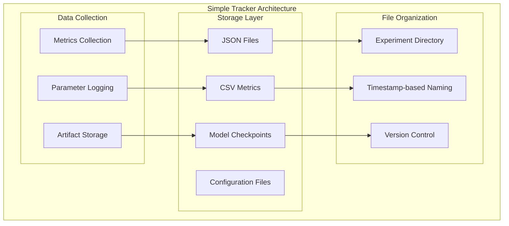

#### Implementation Details

```python
class SimpleExperimentTracker(IExperimentTracker):
    def __init__(self, base_dir: Optional[Path] = None):
        self.base_dir = base_dir or Path("./experiments")
        self.base_dir.mkdir(exist_ok=True)
        self.logger = LoggerFactory.get_logger("SimpleExperimentTracker")

        # Create subdirectories
        (self.base_dir / "metrics").mkdir(exist_ok=True)
        (self.base_dir / "models").mkdir(exist_ok=True)
        (self.base_dir / "configs").mkdir(exist_ok=True)
        (self.base_dir / "logs").mkdir(exist_ok=True)

    def _get_experiment_dir(self, experiment_id: str) -> Path:
        """Get experiment directory path"""
        timestamp = datetime.now().strftime("%Y%m%d_%H%M%S")
        return self.base_dir / f"{experiment_id}_{timestamp}"
```

#### File Structure

```
experiments/
├── experiment_001_20241201_143022/
│   ├── config.json
│   ├── metrics.json
│   ├── model.pth
│   └── training_log.txt
├── experiment_002_20241201_150145/
│   ├── config.json
│   ├── metrics.json
│   ├── model.pth
│   └── training_log.txt
└── summary.csv
```

### 3. Experiment Tracker Factory

**Implementation**: `prediction_service/src/adapters/experiment_tracker_factory.py`

#### Factory Pattern

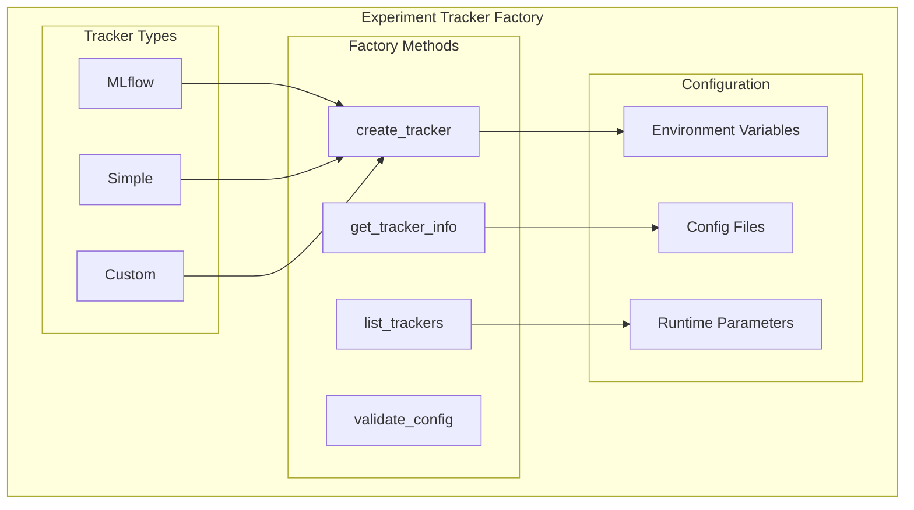

#### Implementation

```python
class ExperimentTrackerFactory:
    _tracker_classes: Dict[ExperimentTrackerType, Type[IExperimentTracker]] = {
        ExperimentTrackerType.MLFLOW: MLflowExperimentTracker,
        ExperimentTrackerType.SIMPLE: SimpleExperimentTracker,
    }

    @classmethod
    def create_tracker(
        cls,
        tracker_type: ExperimentTrackerType,
        config: Optional[Dict[str, Any]] = None
    ) -> IExperimentTracker:
        """Create experiment tracker instance"""
        if tracker_type not in cls._tracker_classes:
            raise ValueError(f"Unsupported tracker type: {tracker_type}")

        tracker_class = cls._tracker_classes[tracker_type]
        return tracker_class(**(config or {}))
```

## 📊 Experiment Lifecycle

### 1. Experiment Initialization

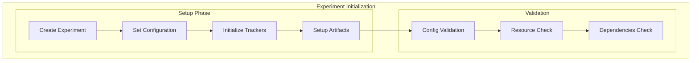

#### Implementation

```python
async def start_experiment(self, config: ExperimentConfig) -> str:
    """Start a new experiment"""
    experiment_id = str(uuid.uuid4())

    # Initialize experiment
    await self.experiment_tracker.start_experiment(
        experiment_id=experiment_id,
        config=config.dict()
    )

    # Log initial parameters
    await self.experiment_tracker.log_params({
        "experiment_id": experiment_id,
        "start_time": datetime.now().isoformat(),
        "config": config.dict()
    })

    return experiment_id
```

### 2. Training Monitoring

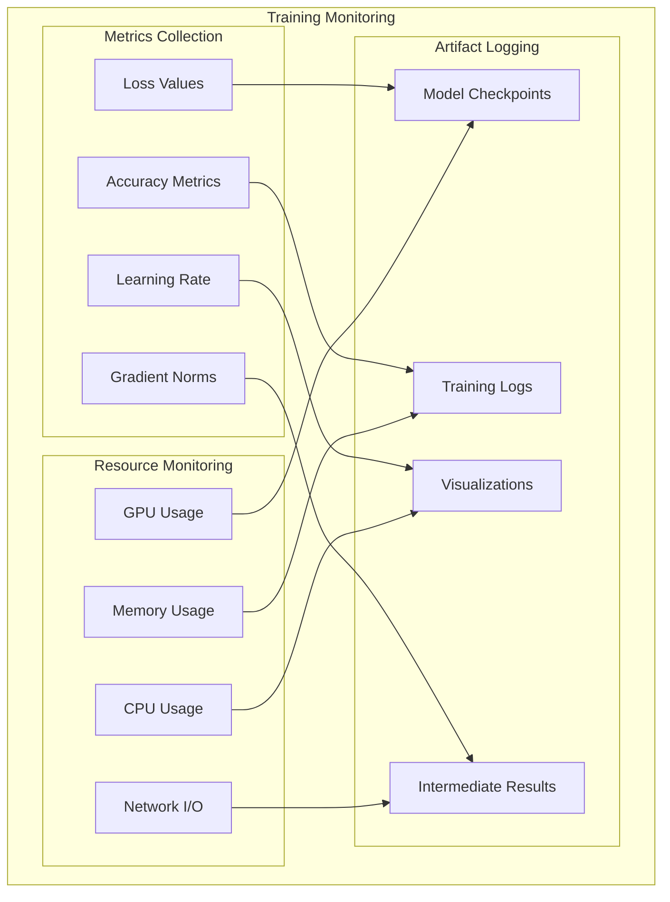

#### Metrics Logging

```python
async def log_training_metrics(self, metrics: Dict[str, Any]) -> None:
    """Log training metrics during experiment"""
    # Log to experiment tracker
    await self.experiment_tracker.log_metrics(metrics)

    # Log to monitoring system
    await self.monitoring_service.log_metrics(metrics)

    # Update real-time dashboard
    await self.dashboard_service.update_metrics(metrics)

# Example metrics
training_metrics = {
    "epoch": 10,
    "train_loss": 0.0234,
    "val_loss": 0.0345,
    "train_accuracy": 0.9876,
    "val_accuracy": 0.9765,
    "learning_rate": 0.001,
    "gradient_norm": 0.1234,
    "gpu_memory_used": 8.5,
    "training_time": 45.2
}
```

### 3. Experiment Completion

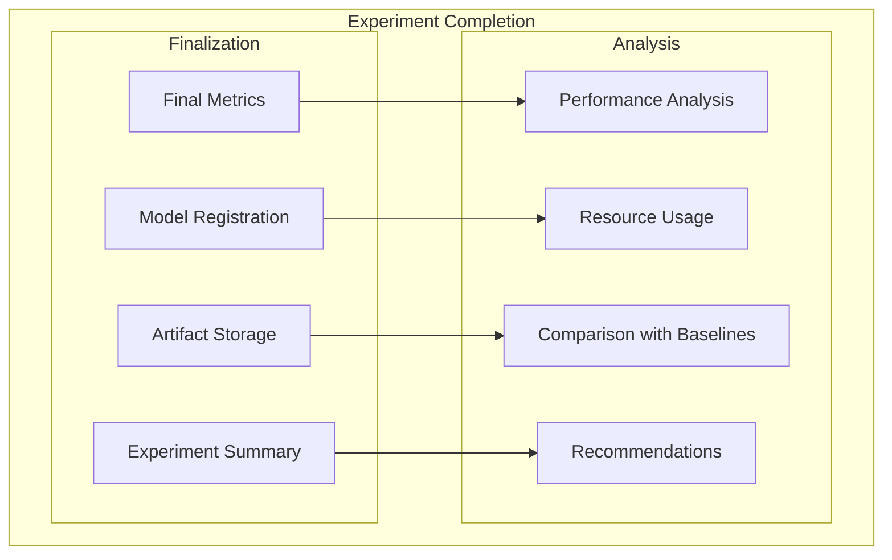

#### Completion Process

```python
async def complete_experiment(self, experiment_id: str, final_metrics: Dict[str, Any]) -> None:
    """Complete experiment and generate summary"""
    # Log final metrics
    await self.experiment_tracker.log_metrics(final_metrics)

    # Register final model
    model_path = await self.save_final_model(experiment_id)
    await self.experiment_tracker.log_artifact("final_model", model_path)

    # Generate experiment summary
    summary = await self.generate_experiment_summary(experiment_id)
    await self.experiment_tracker.log_artifact("summary", summary)

    # Mark experiment as complete
    await self.experiment_tracker.end_experiment(experiment_id)

    # Send completion notification
    await self.notification_service.send_completion_notification(experiment_id, summary)
```

## 📈 Metrics and Monitoring

### 1. Training Metrics

#### Core Metrics

```python
class TrainingMetrics(BaseModel):
    # Loss metrics
    train_loss: float
    val_loss: float
    test_loss: Optional[float] = None

    # Accuracy metrics
    train_accuracy: float
    val_accuracy: float
    test_accuracy: Optional[float] = None

    # Time metrics
    epoch_time: float
    total_training_time: float

    # Resource metrics
    gpu_memory_used: float
    cpu_usage: float
    memory_usage: float

    # Model metrics
    learning_rate: float
    gradient_norm: float
    model_size: float
```

#### Financial Metrics

```python
class FinancialMetrics(BaseModel):
    # Prediction accuracy
    mae: float  # Mean Absolute Error
    mse: float  # Mean Squared Error
    rmse: float  # Root Mean Squared Error
    mape: float  # Mean Absolute Percentage Error

    # Trading metrics
    directional_accuracy: float
    profit_loss: float
    sharpe_ratio: float
    max_drawdown: float

    # Risk metrics
    var_95: float  # Value at Risk (95%)
    expected_shortfall: float
    volatility: float
```

### 2. Resource Monitoring

#### GPU Monitoring

```python
class GPUMetrics(BaseModel):
    gpu_id: int
    memory_used: float
    memory_total: float
    utilization: float
    temperature: float
    power_draw: float

    @property
    def memory_percentage(self) -> float:
        return (self.memory_used / self.memory_total) * 100

async def monitor_gpu_resources(self) -> List[GPUMetrics]:
    """Monitor GPU resources during training"""
    try:
        import pynvml
        pynvml.nvmlInit()

        gpu_metrics = []
        device_count = pynvml.nvmlDeviceGetCount()

        for i in range(device_count):
            handle = pynvml.nvmlDeviceGetHandleByIndex(i)

            # Memory info
            memory_info = pynvml.nvmlDeviceGetMemoryInfo(handle)

            # Utilization
            utilization = pynvml.nvmlDeviceGetUtilizationRates(handle)

            # Temperature
            temperature = pynvml.nvmlDeviceGetTemperature(handle, pynvml.NVML_TEMPERATURE_GPU)

            # Power
            power = pynvml.nvmlDeviceGetPowerUsage(handle) / 1000.0  # Convert to watts

            gpu_metrics.append(GPUMetrics(
                gpu_id=i,
                memory_used=memory_info.used / 1024**3,  # GB
                memory_total=memory_info.total / 1024**3,  # GB
                utilization=utilization.gpu,
                temperature=temperature,
                power_draw=power
            ))

        return gpu_metrics

    except ImportError:
        self.logger.warning("pynvml not available for GPU monitoring")
        return []
```

#### System Monitoring

```python
class SystemMetrics(BaseModel):
    cpu_usage: float
    memory_usage: float
    disk_usage: float
    network_io: float
    timestamp: datetime

async def monitor_system_resources(self) -> SystemMetrics:
    """Monitor system resources during training"""
    import psutil

    # CPU usage
    cpu_percent = psutil.cpu_percent(interval=1)

    # Memory usage
    memory = psutil.virtual_memory()
    memory_percent = memory.percent

    # Disk usage
    disk = psutil.disk_usage('/')
    disk_percent = (disk.used / disk.total) * 100

    # Network I/O
    network = psutil.net_io_counters()
    network_io = network.bytes_sent + network.bytes_recv

    return SystemMetrics(
        cpu_usage=cpu_percent,
        memory_usage=memory_percent,
        disk_usage=disk_percent,
        network_io=network_io,
        timestamp=datetime.now()
    )
```

### 3. Real-time Dashboard

#### Dashboard Components

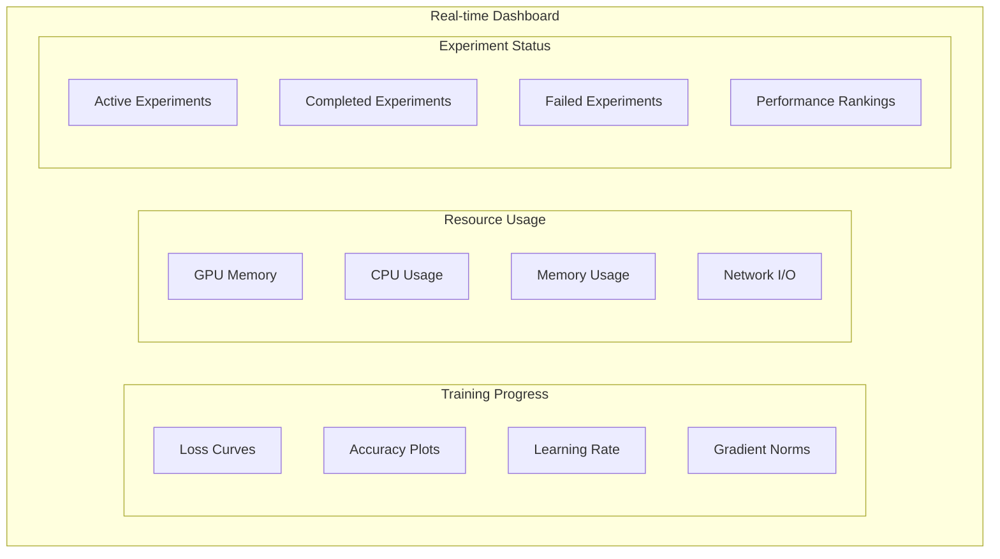

#### Dashboard Implementation

```python
class ExperimentDashboard:
    def __init__(self):
        self.metrics_buffer = []
        self.experiments = {}
        self.websocket_manager = None

    async def update_metrics(self, experiment_id: str, metrics: Dict[str, Any]) -> None:
        """Update dashboard with new metrics"""
        # Store metrics
        if experiment_id not in self.metrics_buffer:
            self.metrics_buffer[experiment_id] = []

        self.metrics_buffer[experiment_id].append({
            "timestamp": datetime.now().isoformat(),
            "metrics": metrics
        })

        # Keep only recent metrics
        if len(self.metrics_buffer[experiment_id]) > 1000:
            self.metrics_buffer[experiment_id] = self.metrics_buffer[experiment_id][-500:]

        # Broadcast to connected clients
        await self.broadcast_metrics(experiment_id, metrics)

    async def broadcast_metrics(self, experiment_id: str, metrics: Dict[str, Any]) -> None:
        """Broadcast metrics to connected dashboard clients"""
        if self.websocket_manager:
            await self.websocket_manager.broadcast({
                "type": "metrics_update",
                "experiment_id": experiment_id,
                "data": metrics
            })
```

## 🔍 Experiment Analysis

### 1. Performance Comparison

#### Comparison Metrics

```python
class ExperimentComparison(BaseModel):
    experiment_ids: List[str]
    comparison_metrics: List[str]
    results: Dict[str, Dict[str, float]]
    rankings: Dict[str, List[str]]
    recommendations: List[str]

async def compare_experiments(
    self,
    experiment_ids: List[str],
    metrics: List[str]
) -> ExperimentComparison:
    """Compare multiple experiments"""
    comparison = ExperimentComparison(
        experiment_ids=experiment_ids,
        comparison_metrics=metrics,
        results={},
        rankings={},
        recommendations=[]
    )

    # Collect results for each experiment
    for exp_id in experiment_ids:
        exp_metrics = await self.experiment_tracker.get_experiment_metrics(exp_id)
        comparison.results[exp_id] = {
            metric: exp_metrics.get(metric, 0.0)
            for metric in metrics
        }

    # Calculate rankings
    for metric in metrics:
        sorted_experiments = sorted(
            experiment_ids,
            key=lambda x: comparison.results[x][metric],
            reverse=True  # Higher is better
        )
        comparison.rankings[metric] = sorted_experiments

    # Generate recommendations
    comparison.recommendations = await self.generate_recommendations(comparison)

    return comparison
```

#### Visualization

```python
class ExperimentVisualizer:
    def __init__(self):
        self.plotly_config = {
            "displayModeBar": True,
            "displaylogo": False,
            "modeBarButtonsToRemove": ["pan2d", "lasso2d", "select2d"]
        }

    def create_comparison_chart(self, comparison: ExperimentComparison) -> go.Figure:
        """Create comparison chart for experiments"""
        fig = go.Figure()

        for metric in comparison.comparison_metrics:
            values = [comparison.results[exp_id][metric] for exp_id in comparison.experiment_ids]

            fig.add_trace(go.Bar(
                x=comparison.experiment_ids,
                y=values,
                name=metric,
                text=[f"{v:.4f}" for v in values],
                textposition="auto"
            ))

        fig.update_layout(
            title="Experiment Performance Comparison",
            xaxis_title="Experiments",
            yaxis_title="Metric Values",
            barmode="group",
            height=600
        )

        return fig

    def create_training_curves(self, experiment_id: str, metrics_history: List[Dict]) -> go.Figure:
        """Create training curves for an experiment"""
        fig = go.Figure()

        # Extract timestamps and metrics
        timestamps = [m["timestamp"] for m in metrics_history]

        # Plot loss curves
        if any("loss" in k for k in metrics_history[0]["metrics"].keys()):
            train_loss = [m["metrics"].get("train_loss", 0) for m in metrics_history]
            val_loss = [m["metrics"].get("val_loss", 0) for m in metrics_history]

            fig.add_trace(go.Scatter(
                x=timestamps,
                y=train_loss,
                name="Training Loss",
                line=dict(color="blue")
            ))

            fig.add_trace(go.Scatter(
                x=timestamps,
                y=val_loss,
                name="Validation Loss",
                line=dict(color="red")
            ))

        fig.update_layout(
            title=f"Training Curves - {experiment_id}",
            xaxis_title="Time",
            yaxis_title="Loss",
            height=500
        )

        return fig
```

### 2. Hyperparameter Analysis

#### Hyperparameter Optimization

```python
class HyperparameterAnalyzer:
    def __init__(self):
        self.optimization_history = []

    async def analyze_hyperparameters(self, experiment_ids: List[str]) -> Dict[str, Any]:
        """Analyze hyperparameter impact on performance"""
        analysis = {
            "parameter_importance": {},
            "optimal_ranges": {},
            "correlations": {},
            "recommendations": []
        }

        # Collect hyperparameters and results
        experiments_data = []
        for exp_id in experiment_ids:
            config = await self.experiment_tracker.get_experiment_config(exp_id)
            metrics = await self.experiment_tracker.get_experiment_metrics(exp_id)
            experiments_data.append({
                "config": config,
                "metrics": metrics
            })

        # Analyze parameter importance
        analysis["parameter_importance"] = await self.calculate_parameter_importance(experiments_data)

        # Find optimal parameter ranges
        analysis["optimal_ranges"] = await self.find_optimal_ranges(experiments_data)

        # Calculate parameter correlations
        analysis["correlations"] = await self.calculate_correlations(experiments_data)

        # Generate recommendations
        analysis["recommendations"] = await self.generate_hyperparameter_recommendations(analysis)

        return analysis

    async def calculate_parameter_importance(self, experiments_data: List[Dict]) -> Dict[str, float]:
        """Calculate importance of each hyperparameter"""
        # Implementation using correlation analysis or feature importance
        # This is a simplified version
        parameter_importance = {}

        for exp in experiments_data:
            for param, value in exp["config"].items():
                if param not in parameter_importance:
                    parameter_importance[param] = []
                parameter_importance[param].append({
                    "value": value,
                    "performance": exp["metrics"].get("val_accuracy", 0.0)
                })

        # Calculate importance based on performance variance
        for param, values in parameter_importance.items():
            if len(values) > 1:
                performances = [v["performance"] for v in values]
                variance = np.var(performances)
                parameter_importance[param] = variance

        return parameter_importance
```

## 🚀 Advanced Features

### 1. Automated Experiment Scheduling

#### Scheduler Architecture

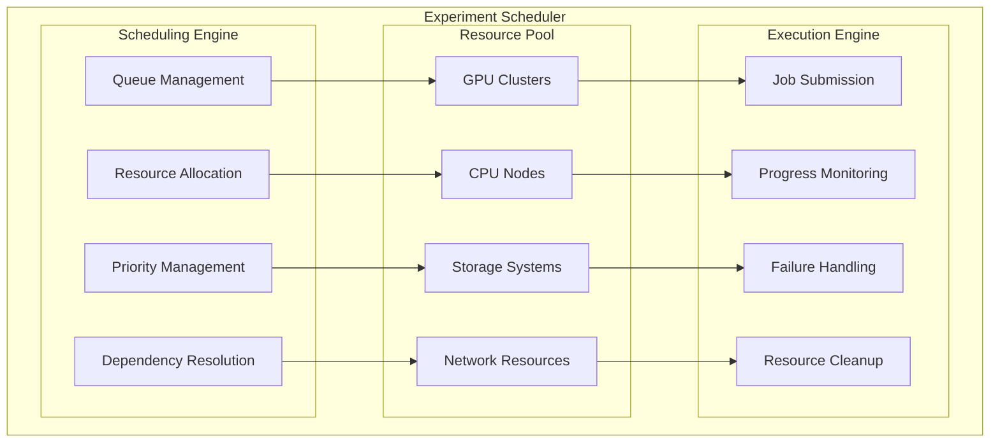

#### Implementation

```python
class ExperimentScheduler:
    def __init__(self):
        self.job_queue = asyncio.Queue()
        self.resource_pool = ResourcePool()
        self.running_experiments = {}
        self.completed_experiments = {}

    async def schedule_experiment(self, experiment_config: ExperimentConfig) -> str:
        """Schedule an experiment for execution"""
        # Create experiment job
        job = ExperimentJob(
            config=experiment_config,
            priority=experiment_config.priority,
            dependencies=experiment_config.dependencies
        )

        # Add to queue
        await self.job_queue.put(job)

        # Start scheduler if not running
        if not hasattr(self, '_scheduler_task'):
            self._scheduler_task = asyncio.create_task(self._run_scheduler())

        return job.job_id

    async def _run_scheduler(self) -> None:
        """Main scheduler loop"""
        while True:
            try:
                # Get next job from queue
                job = await self.job_queue.get()

                # Check dependencies
                if not await self._check_dependencies(job):
                    # Re-queue with delay
                    await asyncio.sleep(60)
                    await self.job_queue.put(job)
                    continue

                # Allocate resources
                resources = await self.resource_pool.allocate(job.resource_requirements)
                if not resources:
                    # Re-queue with delay
                    await asyncio.sleep(60)
                    await self.job_queue.put(job)
                    continue

                # Execute experiment
                await self._execute_experiment(job, resources)

            except asyncio.CancelledError:
                break
            except Exception as e:
                self.logger.error(f"Scheduler error: {e}")
                await asyncio.sleep(5)
```

### 2. A/B Testing Framework

#### A/B Testing Architecture

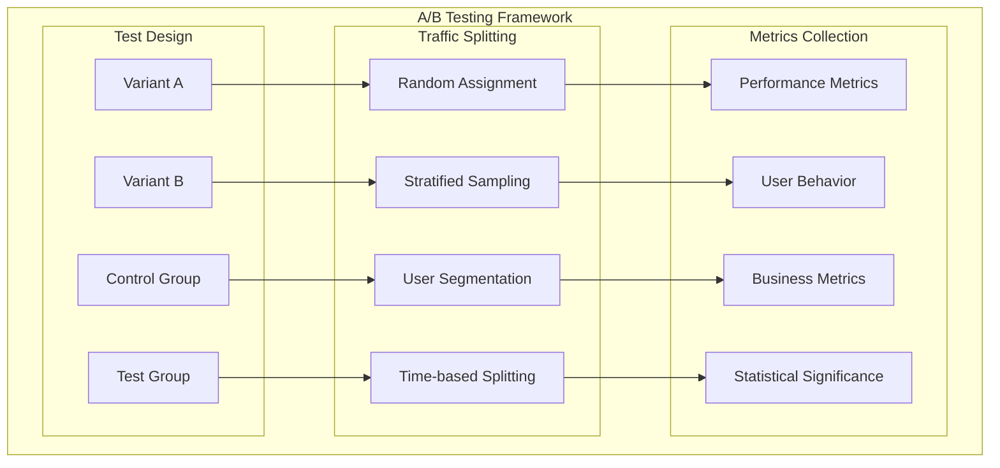

#### Implementation

```python
class ABTestFramework:
    def __init__(self):
        self.active_tests = {}
        self.test_results = {}
        self.metrics_collector = MetricsCollector()

    async def create_ab_test(
        self,
        test_name: str,
        variants: List[Dict],
        traffic_split: Dict[str, float],
        duration_days: int
    ) -> str:
        """Create a new A/B test"""
        test_id = str(uuid.uuid4())

        test_config = {
            "test_name": test_name,
            "variants": variants,
            "traffic_split": traffic_split,
            "start_date": datetime.now(),
            "end_date": datetime.now() + timedelta(days=duration_days),
            "status": "active"
        }

        self.active_tests[test_id] = test_config

        # Start metrics collection
        await self.metrics_collector.start_collection(test_id, test_config)

        return test_id

    async def assign_variant(self, test_id: str, user_id: str) -> str:
        """Assign a user to a test variant"""
        if test_id not in self.active_tests:
            raise ValueError(f"Test {test_id} not found")

        test_config = self.active_tests[test_id]

        # Simple random assignment based on traffic split
        rand_val = random.random()
        cumulative_prob = 0

        for variant, probability in test_config["traffic_split"].items():
            cumulative_prob += probability
            if rand_val <= cumulative_prob:
                return variant

        # Fallback to first variant
        return list(test_config["traffic_split"].keys())[0]

    async def collect_metrics(
        self,
        test_id: str,
        user_id: str,
        variant: str,
        metrics: Dict[str, Any]
    ) -> None:
        """Collect metrics for A/B test"""
        await self.metrics_collector.record_metrics(
            test_id=test_id,
            user_id=user_id,
            variant=variant,
            metrics=metrics
        )

    async def analyze_results(self, test_id: str) -> Dict[str, Any]:
        """Analyze A/B test results"""
        if test_id not in self.active_tests:
            raise ValueError(f"Test {test_id} not found")

        # Collect metrics for all variants
        variant_metrics = await self.metrics_collector.get_variant_metrics(test_id)

        # Perform statistical analysis
        analysis = await self._perform_statistical_analysis(variant_metrics)

        # Calculate confidence intervals
        confidence_intervals = await self._calculate_confidence_intervals(variant_metrics)

        # Determine winner
        winner = await self._determine_winner(variant_metrics, analysis)

        return {
            "test_id": test_id,
            "variant_metrics": variant_metrics,
            "statistical_analysis": analysis,
            "confidence_intervals": confidence_intervals,
            "winner": winner,
            "recommendation": self._generate_recommendation(analysis, winner)
        }
```

## 📊 Reporting and Analytics

### 1. Experiment Reports

#### Report Generation

```python
class ExperimentReporter:
    def __init__(self):
        self.template_engine = TemplateEngine()
        self.visualizer = ExperimentVisualizer()

    async def generate_experiment_report(self, experiment_id: str) -> str:
        """Generate comprehensive experiment report"""
        # Collect experiment data
        config = await self.experiment_tracker.get_experiment_config(experiment_id)
        metrics = await self.experiment_tracker.get_experiment_metrics(experiment_id)
        artifacts = await self.experiment_tracker.list_artifacts(experiment_id)

        # Generate visualizations
        training_curves = self.visualizer.create_training_curves(experiment_id, metrics)
        resource_usage = self.visualizer.create_resource_usage_chart(experiment_id, metrics)

        # Generate report
        report_data = {
            "experiment_id": experiment_id,
            "config": config,
            "metrics": metrics,
            "artifacts": artifacts,
            "training_curves": training_curves.to_html(),
            "resource_usage": resource_usage.to_html(),
            "summary": await self._generate_summary(config, metrics),
            "recommendations": await self._generate_recommendations(config, metrics)
        }

        # Render report template
        report_html = await self.template_engine.render("experiment_report.html", report_data)

        return report_html
```

### 2. Performance Analytics

#### Analytics Dashboard

```python
class PerformanceAnalytics:
    def __init__(self):
        self.metrics_aggregator = MetricsAggregator()
        self.trend_analyzer = TrendAnalyzer()

    async def generate_performance_summary(self, time_range: str = "30d") -> Dict[str, Any]:
        """Generate performance summary for specified time range"""
        # Aggregate metrics
        aggregated_metrics = await self.metrics_aggregator.aggregate(time_range)

        # Analyze trends
        trends = await self.trend_analyzer.analyze_trends(aggregated_metrics)

        # Calculate KPIs
        kpis = await self._calculate_kpis(aggregated_metrics)

        # Generate insights
        insights = await self._generate_insights(aggregated_metrics, trends)

        return {
            "time_range": time_range,
            "aggregated_metrics": aggregated_metrics,
            "trends": trends,
            "kpis": kpis,
            "insights": insights,
            "recommendations": await self._generate_recommendations(kpis, trends)
        }

    async def _calculate_kpis(self, metrics: Dict[str, Any]) -> Dict[str, float]:
        """Calculate key performance indicators"""
        return {
            "total_experiments": metrics.get("total_experiments", 0),
            "success_rate": metrics.get("success_rate", 0.0),
            "average_training_time": metrics.get("average_training_time", 0.0),
            "average_accuracy": metrics.get("average_accuracy", 0.0),
            "resource_efficiency": metrics.get("resource_efficiency", 0.0),
            "model_performance": metrics.get("model_performance", 0.0)
        }
```

## 🔒 Security and Access Control

### 1. Authentication and Authorization

#### Access Control

```python
class ExperimentAccessControl:
    def __init__(self):
        self.user_permissions = {}
        self.experiment_permissions = {}
        self.role_manager = RoleManager()

    async def check_permission(
        self,
        user_id: str,
        experiment_id: str,
        action: str
    ) -> bool:
        """Check if user has permission to perform action on experiment"""
        # Get user role
        user_role = await self.role_manager.get_user_role(user_id)

        # Get experiment permissions
        experiment_perms = self.experiment_permissions.get(experiment_id, {})

        # Check role-based permissions
        if user_role in ["admin", "researcher"]:
            return True

        # Check experiment-specific permissions
        if user_id in experiment_perms.get("owners", []):
            return True

        if user_id in experiment_perms.get("collaborators", []):
            return action in ["read", "view"]

        return False

    async def grant_permission(
        self,
        experiment_id: str,
        user_id: str,
        permission_type: str
    ) -> None:
        """Grant permission to user for experiment"""
        if experiment_id not in self.experiment_permissions:
            self.experiment_permissions[experiment_id] = {
                "owners": [],
                "collaborators": [],
                "viewers": []
            }

        if permission_type == "owner":
            self.experiment_permissions[experiment_id]["owners"].append(user_id)
        elif permission_type == "collaborator":
            self.experiment_permissions[experiment_id]["collaborators"].append(user_id)
        elif permission_type == "viewer":
            self.experiment_permissions[experiment_id]["viewers"].append(user_id)
```

### 2. Data Privacy and Compliance

#### Privacy Controls

```python
class DataPrivacyManager:
    def __init__(self):
        self.privacy_config = PrivacyConfig()
        self.data_classifier = DataClassifier()

    async def anonymize_experiment_data(self, experiment_data: Dict[str, Any]) -> Dict[str, Any]:
        """Anonymize sensitive data in experiment"""
        anonymized_data = experiment_data.copy()

        # Identify sensitive fields
        sensitive_fields = await self.data_classifier.identify_sensitive_fields(experiment_data)

        # Anonymize sensitive data
        for field in sensitive_fields:
            if field in anonymized_data:
                anonymized_data[field] = self._anonymize_value(anonymized_data[field])

        return anonymized_data

    def _anonymize_value(self, value: Any) -> str:
        """Anonymize a single value"""
        if isinstance(value, str):
            return f"ANONYMIZED_{hash(value) % 10000:04d}"
        elif isinstance(value, (int, float)):
            return f"ANONYMIZED_{hash(str(value)) % 10000:04d}"
        else:
            return "ANONYMIZED"

    async def apply_data_retention_policy(self, experiment_id: str) -> None:
        """Apply data retention policy to experiment"""
        retention_config = self.privacy_config.get_retention_config()

        # Check if experiment should be archived
        if await self._should_archive_experiment(experiment_id, retention_config):
            await self._archive_experiment(experiment_id)

        # Check if experiment should be deleted
        if await self._should_delete_experiment(experiment_id, retention_config):
            await self._delete_experiment(experiment_id)
```

## 🚀 Future Enhancements

### 1. Advanced Analytics

#### Planned Features

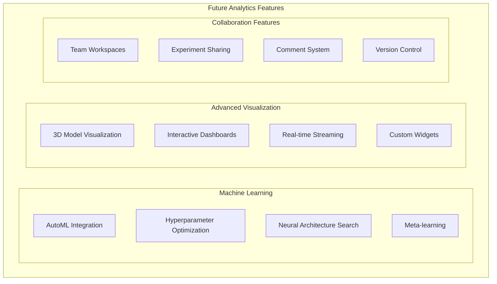

### 2. Integration Capabilities

#### External Integrations

```python
class IntegrationManager:
    def __init__(self):
        self.integrations = {
            "wandb": WeightsBiasesIntegration(),
            "tensorboard": TensorBoardIntegration(),
            "comet": CometMLIntegration(),
            "neptune": NeptuneIntegration(),
            "mlflow": MLflowIntegration()
        }

    async def sync_with_external_platform(
        self,
        experiment_id: str,
        platform: str
    ) -> None:
        """Sync experiment with external platform"""
        if platform not in self.integrations:
            raise ValueError(f"Unsupported platform: {platform}")

        integration = self.integrations[platform]

        # Get experiment data
        experiment_data = await self.experiment_tracker.get_experiment_data(experiment_id)

        # Sync to external platform
        await integration.sync_experiment(experiment_data)
```

---

_This document provides comprehensive coverage of the experiment tracking system in the FinSight AI system. For implementation details, refer to the specific tracker adapter files and training service implementations._
