# Future Roadmap Documentation

## Overview

The FinSight AI system has a solid foundation with current implementations of time series forecasting, sentiment analysis, and model serving. This document outlines the strategic roadmap for future enhancements, focusing on realistic improvements that build upon the existing architecture.

## 🎯 Strategic Vision

### Long-term Goals

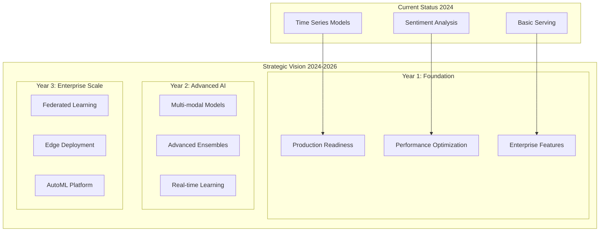

## 🚀 Phase 1: Production Readiness (Q2-Q4 2024)

### 1.1 Model Productionization

**Current Status**: Basic model serving with multiple adapters
**Target**: Production-grade model serving with enterprise features

#### Planned Enhancements

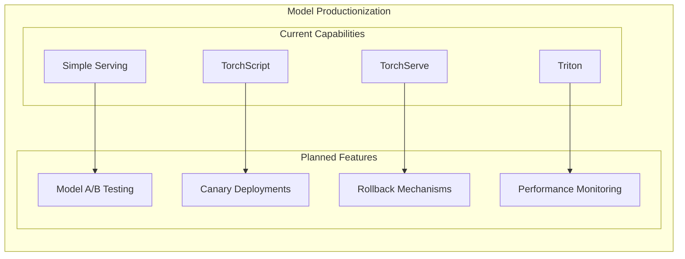

**Specific Improvements**:

- **Model A/B Testing**: Compare model versions in production
- **Canary Deployments**: Gradual model rollout with traffic splitting
- **Rollback Mechanisms**: Automatic fallback to previous model versions
- **Performance Monitoring**: Real-time model performance tracking

#### Implementation Timeline

- **Q2 2024**: Design and architecture planning
- **Q3 2024**: Core implementation
- **Q4 2024**: Testing and production deployment

### 1.2 Enhanced Experiment Tracking

**Current Status**: MLflow integration with local fallback
**Target**: Comprehensive experiment management with advanced analytics

#### Planned Features

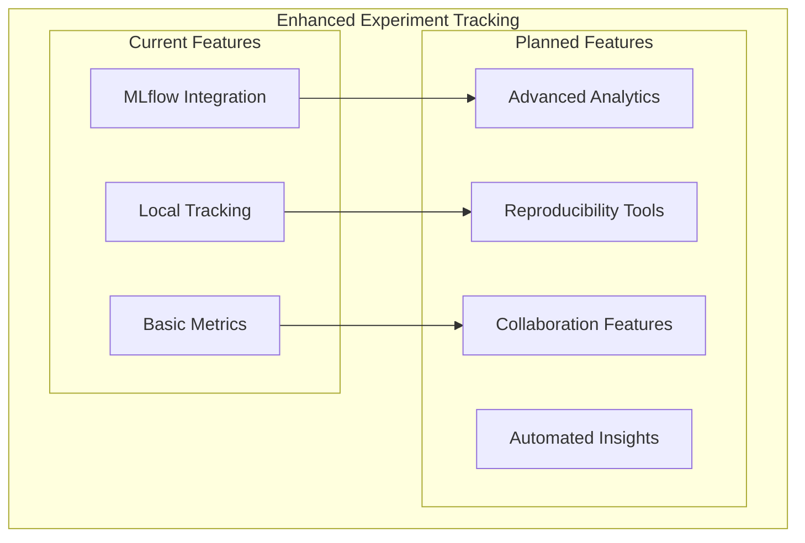

**Specific Improvements**:

- **Advanced Analytics**: Statistical analysis of experiment results
- **Reproducibility Tools**: Environment capture and dependency tracking
- **Collaboration Features**: Team experiment sharing and commenting
- **Automated Insights**: ML-based experiment result analysis

### 1.3 Data Pipeline Enhancement

**Current Status**: Basic data loading with cloud storage
**Target**: Robust data pipeline with quality monitoring

#### Planned Features

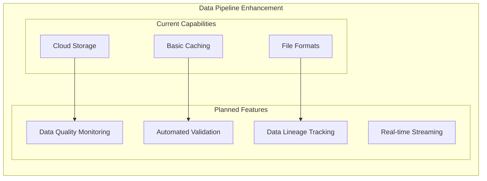

## 🧠 Phase 2: Advanced AI Capabilities (Q1-Q4 2025)

### 2.1 Multi-modal AI Models

**Current Status**: Separate time series and text models
**Target**: Integrated multi-modal models for comprehensive financial analysis

#### Planned Architecture

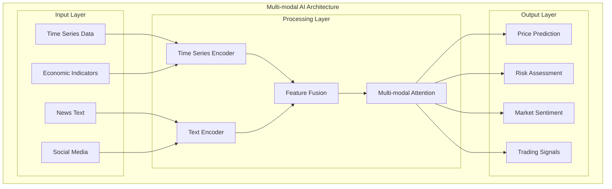

**Specific Models**:

- **Multi-modal Transformer**: Combined time series and text processing
- **Graph Neural Networks**: Multi-asset relationship modeling
- **Attention-based Fusion**: Intelligent feature combination

### 2.2 Advanced Ensemble Methods

**Current Status**: Single model predictions
**Target**: Sophisticated ensemble methods for improved accuracy

#### Planned Ensemble Strategies

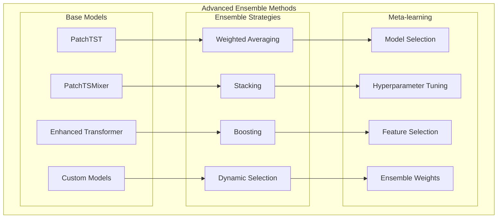

**Implementation Plan**:

- **Q1 2025**: Research and design phase
- **Q2 2025**: Basic ensemble implementation
- **Q3 2025**: Advanced ensemble methods
- **Q4 2025**: Meta-learning integration

### 2.3 Real-time Learning

**Current Status**: Batch training with periodic updates
**Target**: Continuous learning with real-time model updates

#### Planned Architecture

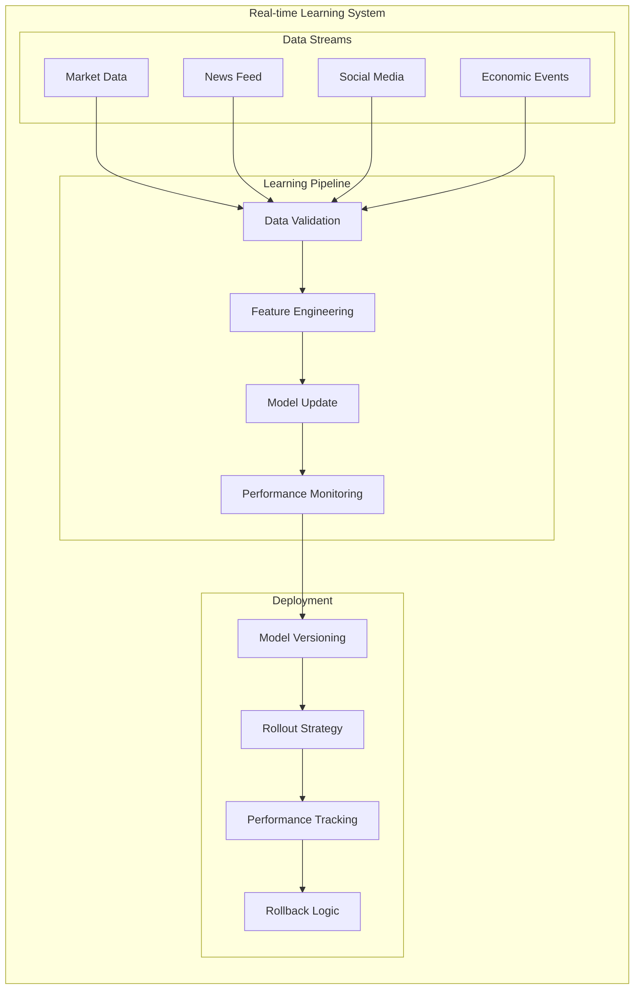

## 🏢 Phase 3: Enterprise Scale (Q1-Q4 2026)

### 3.1 Federated Learning

**Current Status**: Centralized training
**Target**: Distributed training across multiple institutions

#### Planned Architecture

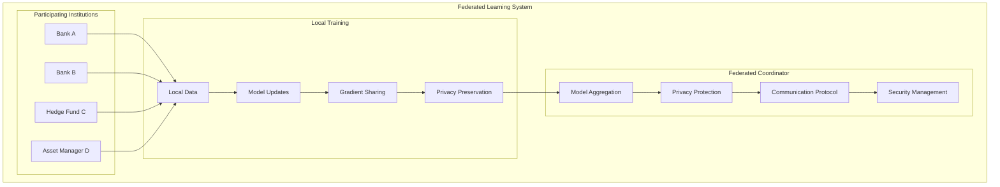

**Key Features**:

- **Privacy-preserving Training**: No raw data sharing
- **Secure Aggregation**: Encrypted model updates
- **Heterogeneous Data**: Different data distributions
- **Communication Efficiency**: Minimal network overhead

### 3.2 Edge Deployment

**Current Status**: Cloud and server deployment
**Target**: Lightweight models for edge devices

#### Planned Edge Architecture

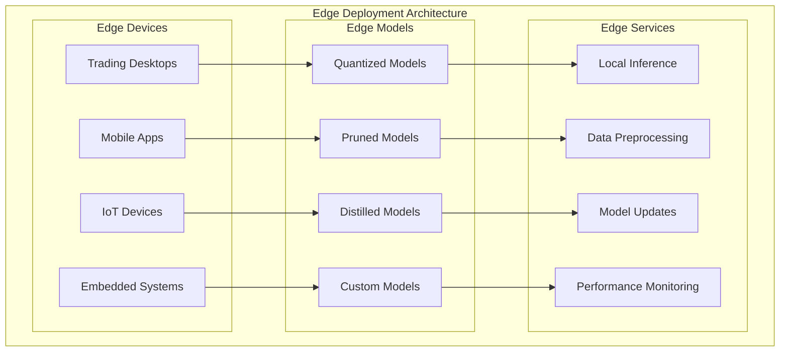

**Implementation Strategy**:

- **Model Optimization**: Quantization, pruning, distillation
- **Edge Frameworks**: TensorRT, ONNX Runtime, TFLite
- **Update Mechanisms**: Incremental model updates
- **Performance Monitoring**: Edge device performance tracking

### 3.3 AutoML Platform

**Current Status**: Manual model selection and tuning
**Target**: Automated machine learning platform

#### Planned AutoML Architecture

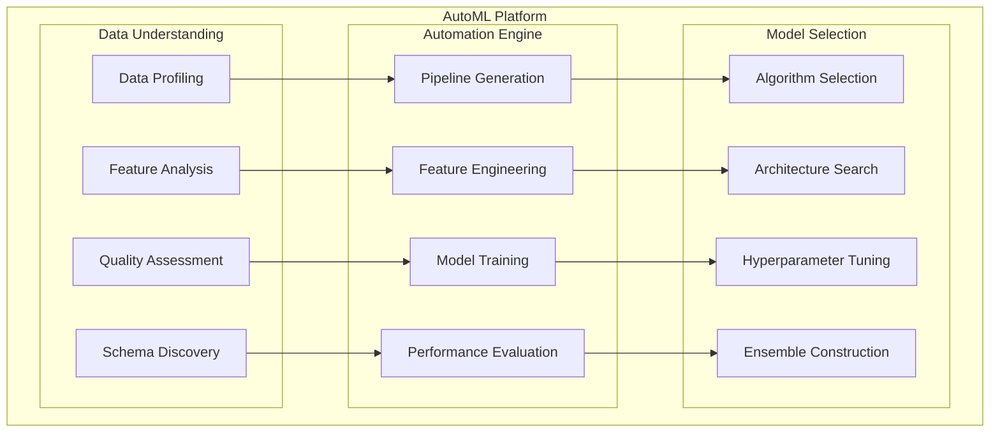

**Key Capabilities**:

- **Automated Feature Engineering**: Automatic feature creation and selection
- **Neural Architecture Search**: Automated model architecture discovery
- **Hyperparameter Optimization**: Bayesian optimization and genetic algorithms
- **Pipeline Automation**: End-to-end ML pipeline generation

## 🔬 Research and Innovation

### 3.1 Advanced Research Areas

#### Attention Mechanisms for Financial Data

**Research Focus**: Develop specialized attention patterns for financial time series

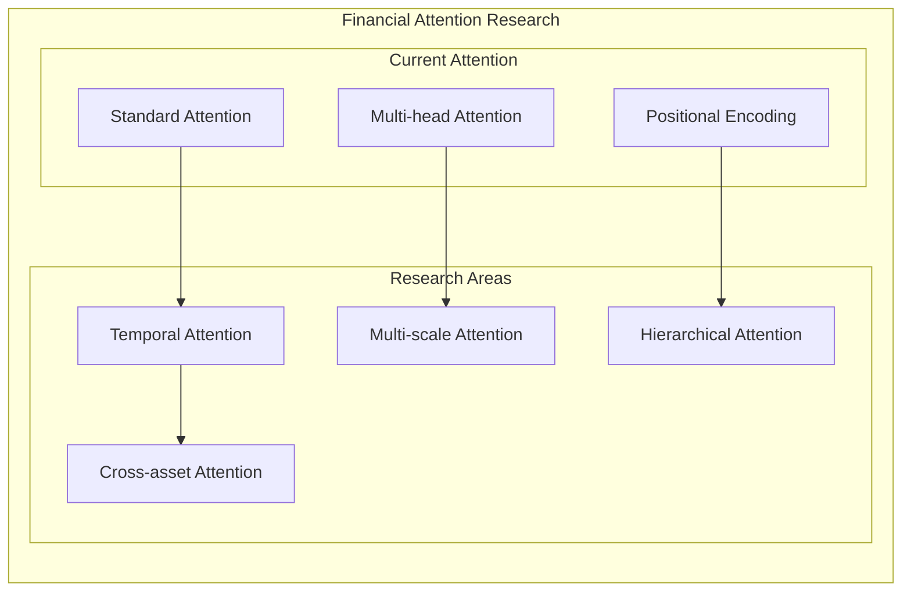

#### Interpretability and Explainability

**Research Focus**: Make AI models interpretable for financial decision-making

**Planned Research**:

- **Attention Visualization**: Visualize model attention patterns
- **Feature Importance**: Identify key features for predictions
- **Decision Trees**: Extract interpretable rules from complex models
- **Counterfactual Analysis**: Understand model decision boundaries

### 3.2 Industry Collaboration

#### Academic Partnerships

**Planned Collaborations**:

- **Universities**: Joint research on financial AI
- **Research Labs**: Advanced ML algorithm development
- **Industry Groups**: Financial AI standards and best practices

#### Open Source Contributions

**Planned Contributions**:

- **Financial Datasets**: Open-source financial data for research
- **Model Implementations**: Open-source financial AI models
- **Tools and Libraries**: Financial AI development tools

## 📊 Success Metrics and KPIs

### Phase 1 Metrics (2024)

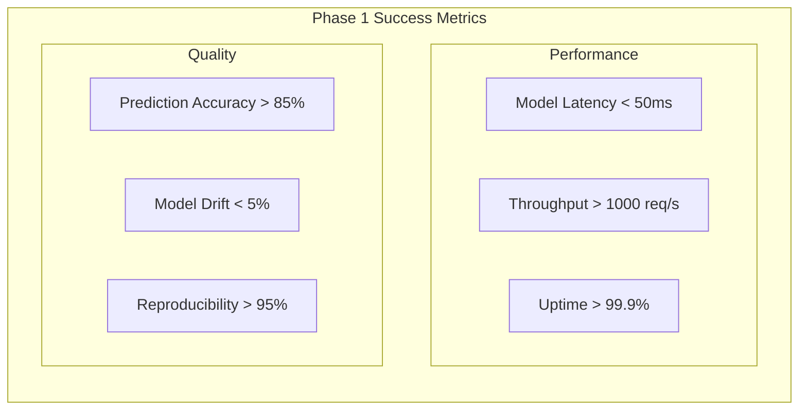

### Phase 2 Metrics (2025)

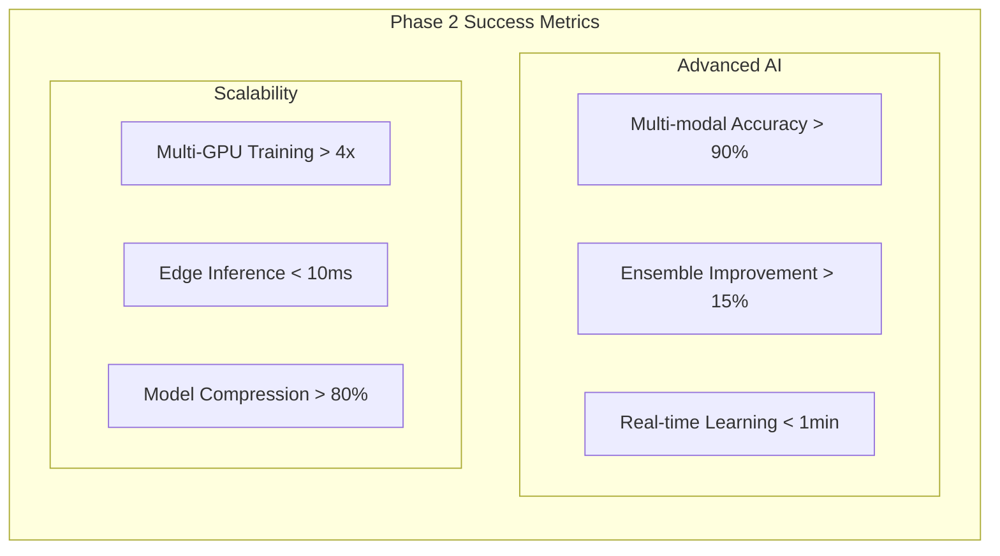

### Phase 3 Metrics (2026)

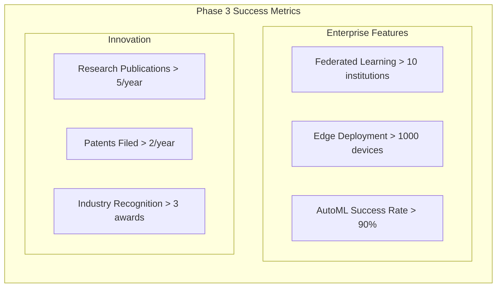

## 🚀 Implementation Strategy

### Development Approach

#### Agile Development

**Methodology**: Scrum with 2-week sprints
**Team Structure**: Cross-functional teams with AI specialists
**Release Strategy**: Quarterly major releases with monthly minor updates

#### Technology Stack Evolution

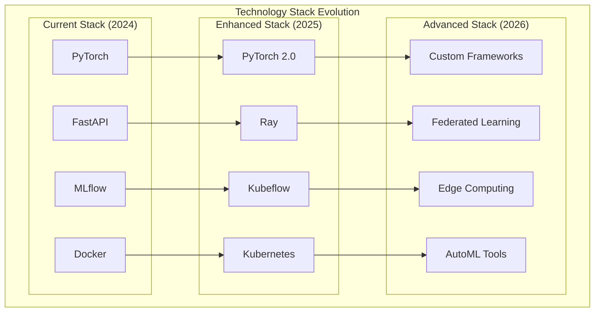

### Risk Management

#### Technical Risks

**Identified Risks**:

- **Model Complexity**: Over-engineering leading to performance issues
- **Data Quality**: Poor data quality affecting model performance
- **Scalability**: Performance degradation with increased load
- **Security**: Vulnerabilities in model serving and data handling

**Mitigation Strategies**:

- **Incremental Development**: Build features incrementally
- **Quality Gates**: Strict testing and validation requirements
- **Performance Testing**: Regular load testing and optimization
- **Security Audits**: Regular security reviews and penetration testing

#### Business Risks

**Identified Risks**:

- **Market Changes**: Financial market evolution affecting model relevance
- **Competition**: New competitors entering the market
- **Regulation**: Changes in financial regulations
- **Resource Constraints**: Limited funding or talent availability

**Mitigation Strategies**:

- **Market Monitoring**: Continuous market analysis and adaptation
- **Competitive Analysis**: Regular competitive intelligence gathering
- **Regulatory Compliance**: Proactive regulatory monitoring and adaptation
- **Resource Planning**: Strategic resource allocation and talent development

## 📈 Investment and Resources

### Resource Requirements

#### Human Resources

**Current Team**: 5-8 developers
**Phase 1 Target**: 8-12 developers
**Phase 2 Target**: 12-18 developers
**Phase 3 Target**: 18-25 developers

**Key Roles**:

- **AI/ML Engineers**: Model development and optimization
- **Data Engineers**: Data pipeline and infrastructure
- **DevOps Engineers**: Deployment and operations
- **Research Scientists**: Advanced algorithm development

#### Infrastructure Resources

**Current Infrastructure**: Cloud-based with GPU instances
**Phase 1 Target**: Multi-region cloud deployment
**Phase 2 Target**: Hybrid cloud with on-premises options
**Phase 3 Target**: Global distributed infrastructure

### Funding Strategy

#### Investment Phases

**Phase 1 (2024)**: $500K - $1M

- Core product development
- Team expansion
- Infrastructure scaling

**Phase 2 (2025)**: $2M - $5M

- Advanced AI development
- Market expansion
- Enterprise features

**Phase 3 (2026)**: $5M - $15M

- Global expansion
- Research and development
- Strategic partnerships

## 🎯 Conclusion

The FinSight AI system roadmap represents a realistic and achievable path from current capabilities to enterprise-grade AI platform. The phased approach ensures steady progress while managing risks and resource requirements.

**Key Success Factors**:

1. **Incremental Development**: Build upon existing foundation
2. **Market Focus**: Address real financial industry needs
3. **Quality First**: Maintain high standards in all implementations
4. **Team Excellence**: Attract and retain top AI talent
5. **Strategic Partnerships**: Collaborate with industry leaders

**Expected Outcomes**:

- **Market Position**: Leading financial AI platform
- **Technology Leadership**: Innovation in financial AI
- **Business Growth**: Sustainable revenue and market share
- **Industry Impact**: Transformation of financial services

---

_This roadmap provides a strategic vision for the FinSight AI system evolution. Implementation details will be refined based on market feedback and technical feasibility assessments._
