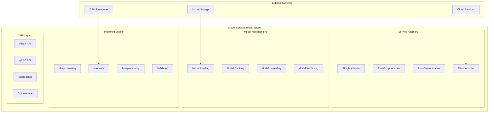

# Model Serving Documentation

## Overview

The FinSight AI system provides a comprehensive, production-ready model serving infrastructure that supports multiple serving strategies and deployment options. This document details the serving architecture, adapters, and deployment capabilities for both time series forecasting and sentiment analysis models.

## 🏗️ Serving Architecture

### High-Level Architecture



## 🔧 Serving Adapters

### Adapter Factory

**Implementation**: `prediction_service/src/adapters/adapter_factory.py`

Centralized factory for creating and managing serving adapters:

```python
class ServingAdapterFactory:
    _adapter_classes: Dict[ServingAdapterType, Type[IModelServingAdapter]] = {
        ServingAdapterType.SIMPLE: SimpleServingAdapter,
        ServingAdapterType.TRITON: TritonServingAdapter,
        ServingAdapterType.TORCHSERVE: TorchServeAdapter,
        ServingAdapterType.TORCHSCRIPT: TorchScriptServingAdapter,
    }

    @classmethod
    def create_adapter(
        cls,
        adapter_type: str,
        config: Dict[str, Any]
    ) -> IModelServingAdapter:
        """Create serving adapter instance"""
```

### Supported Adapter Types

```python
class ServingAdapterType(Enum):
    """Supported serving adapter types"""
    SIMPLE = "simple"           # In-memory serving
    TRITON = "triton"           # NVIDIA Triton Inference Server
    TORCHSERVE = "torchserve"   # PyTorch TorchServe
    TORCHSCRIPT = "torchscript" # TorchScript optimization
```

## 📊 Serving Adapter Implementations

### 1. Simple Serving Adapter

**Implementation**: `prediction_service/src/adapters/simple_serving.py`

Lightweight in-memory serving for development and testing:

```python
class SimpleServingAdapter(IModelServingAdapter):
    def __init__(self, config: Dict[str, Any]):
        self.max_models_in_memory = config.get("max_models_in_memory", 5)
        self.model_timeout_seconds = config.get("model_timeout_seconds", 3600)
        self.enable_cache = config.get("enable_cache", True)
        self.cache_size_mb = config.get("cache_size_mb", 1024)

        self.loaded_models: Dict[str, ModelInfo] = {}
        self.model_cache: Dict[str, Any] = {}
        self.last_access: Dict[str, datetime] = {}
```

#### Key Features

- **In-Memory Loading**: Models loaded directly into memory
- **LRU Caching**: Automatic model eviction based on usage
- **Memory Management**: Configurable memory limits and timeouts
- **Fast Inference**: Sub-100ms latency for cached models

#### Configuration

```python
class SimpleServingConfig(BaseModel):
    max_models_in_memory: int = Field(5, description="Maximum models to keep in memory")
    model_timeout_seconds: int = Field(3600, description="Model timeout in seconds")
    enable_cache: bool = Field(True, description="Enable model caching")
    cache_size_mb: int = Field(1024, description="Cache size limit in MB")
```

#### Model Loading

```python
async def load_model(
    self,
    model_path: str,
    symbol: str,
    timeframe: TimeFrame,
    model_type: ModelType,
    model_config: Optional[Dict[str, Any]] = None,
) -> ModelInfo:
    """Load model into memory"""

    # Check if model is already loaded
    model_id = self.generate_model_id(symbol, timeframe, model_type)
    if model_id in self.loaded_models:
        return self.loaded_models[model_id]

    # Check memory constraints
    if len(self.loaded_models) >= self.max_models_in_memory:
        await self._evict_oldest_model()

    # Load model based on type
    model = await self._load_model_by_type(
        model_path, model_type, model_config
    )

    # Create model info
    model_info = ModelInfo(
        model_id=model_id,
        symbol=symbol,
        timeframe=timeframe.value,
        model_type=model_type.value,
        model_path=model_path,
        is_loaded=True,
        loaded_at=datetime.now(),
        memory_usage_mb=self._estimate_model_memory_usage(model),
        version="1.0",
        metadata=model_config or {}
    )

    # Store model
    self.loaded_models[model_id] = model_info
    self.model_cache[model_id] = model
    self.last_access[model_id] = datetime.now()

    return model_info
```

### 2. TorchScript Serving Adapter

**Implementation**: `prediction_service/src/adapters/torchscript_serving.py`

Production-ready serving with TorchScript optimization:

```python
class TorchScriptServingAdapter(IModelServingAdapter):
    def __init__(self, config: Dict[str, Any]):
        self.device = config.get("device", "cpu")
        self.optimize_for_inference = config.get("optimize_for_inference", True)
        self.enable_fusion = config.get("enable_fusion", True)
        self.compile_mode = config.get("compile_mode", "trace")
        self.max_models_in_memory = config.get("max_models_in_memory", 5)
        self.model_timeout_seconds = config.get("model_timeout_seconds", 3600)

        self.loaded_models: Dict[str, ModelInfo] = {}
        self.torchscript_models: Dict[str, torch.jit.ScriptModule] = {}
        self.feature_engineering_cache: Dict[str, Any] = {}
```

#### Key Features

- **TorchScript Optimization**: Models compiled to TorchScript for production
- **Device Management**: CPU/GPU support with automatic device selection
- **Operator Fusion**: Automatic operator fusion for performance
- **Memory Optimization**: Efficient memory usage with model sharing

#### Model Conversion

```python
async def _convert_to_torchscript(
    self,
    model_path: Path,
    model_id: str,
    model_type: ModelType,
    model_config: Optional[Dict[str, Any]],
) -> Path:
    """Convert PyTorch model to TorchScript"""

    # Load original model
    original_model = await self._load_original_model(
        model_path, model_type, model_config
    )

    # Create example input
    example_input = self._create_example_input(original_model, model_config)

    # Convert to TorchScript
    if self.compile_mode == "trace":
        torchscript_model = torch.jit.trace(
            original_model, example_input, strict=False
        )
    else:  # script mode
        torchscript_model = torch.jit.script(original_model)

    # Optimize for inference
    if self.optimize_for_inference:
        torchscript_model = torch.jit.optimize_for_inference(torchscript_model)

    # Save TorchScript model
    torchscript_path = model_path.parent / f"{model_id}_torchscript.pt"
    torch.jit.save(torchscript_model, torchscript_path)

    return torchscript_path
```

### 3. TorchServe Adapter

**Implementation**: `prediction_service/src/adapters/torchserve_serving.py`

Enterprise-grade serving with TorchServe:

```python
class TorchServeAdapter(IModelServingAdapter):
    def __init__(self, config: Dict[str, Any]):
        self.inference_url = config.get("inference_url", "http://localhost:8080")
        self.management_url = config.get("management_url", "http://localhost:8081")
        self.model_store = config.get("model_store", "./model_store")
        self.default_workers = config.get("default_workers", 2)
        self.max_workers = config.get("max_workers", 4)
        self.batch_size = config.get("batch_size", 1)
        self.max_batch_delay = config.get("max_batch_delay", 100)
        self.timeout_seconds = config.get("timeout_seconds", 30)

        self.registered_models: Dict[str, str] = {}
        self.model_workers: Dict[str, int] = {}
```

#### Key Features

- **Model Registry**: Centralized model management
- **Dynamic Scaling**: Automatic worker scaling based on load
- **Batch Processing**: Configurable batching for throughput
- **Health Monitoring**: Built-in health checks and metrics

#### Model Registration

```python
async def _register_model(
    self,
    mar_file_path: str,
    model_id: str,
    model_config: Optional[Dict[str, Any]]
) -> str:
    """Register model with TorchServe"""

    # Prepare model archive
    mar_file = await self._create_model_archive(
        mar_file_path, model_id, model_config
    )

    # Register model
    register_url = f"{self.management_url}/models"
    register_data = {
        "model_name": model_id,
        "url": mar_file,
        "batch_size": self.batch_size,
        "max_batch_delay": self.max_batch_delay,
        "initial_workers": self.default_workers,
        "synchronous": True
    }

    async with aiohttp.ClientSession() as session:
        async with session.post(register_url, json=register_data) as response:
            if response.status == 200:
                result = await response.json()
                self.registered_models[model_id] = result.get("model_name", model_id)
                return self.registered_models[model_id]
            else:
                raise Exception(f"Failed to register model: {response.status}")
```

### 4. Triton Serving Adapter

**Implementation**: `prediction_service/src/adapters/triton_serving.py`

High-performance serving with NVIDIA Triton Inference Server:

```python
class TritonServingAdapter(IModelServingAdapter):
    def __init__(self, config: Dict[str, Any]):
        self.server_url = config.get("server_url", "localhost:8000")
        self.server_grpc_url = config.get("server_grpc_url", "localhost:8001")
        self.use_grpc = config.get("use_grpc", False)
        self.ssl = config.get("ssl", False)
        self.insecure = config.get("insecure", True)
        self.model_repository = config.get("model_repository", "/models")
        self.default_model_version = config.get("default_model_version", "1")
        self.max_batch_size = config.get("max_batch_size", 8)
        self.timeout_seconds = config.get("timeout_seconds", 30)

        self.client = None
        self.model_metadata_cache: Dict[str, Dict[str, Any]] = {}
```

#### Key Features

- **High Performance**: Optimized for GPU inference
- **Multi-Framework**: Support for PyTorch, TensorFlow, ONNX
- **Dynamic Batching**: Intelligent request batching
- **Model Versioning**: Advanced model version management

#### Model Preparation

```python
async def _prepare_triton_model(
    self,
    model_path: str,
    model_id: str,
    model_type: ModelType,
    model_config: Optional[Dict[str, Any]],
) -> str:
    """Prepare model for Triton deployment"""

    # Create Triton model directory
    model_dir = Path(self.model_repository) / model_id / self.default_model_version
    model_dir.mkdir(parents=True, exist_ok=True)

    # Convert model based on type
    if model_type in [ModelType.PATCHTST, ModelType.PATCHTSMIXER]:
        await self._convert_transformer_to_triton(model_path, model_dir)
    elif model_type == ModelType.ENHANCED_TRANSFORMER:
        await self._convert_pytorch_to_triton(model_path, model_dir)
    else:
        await self._convert_generic_to_triton(model_path, model_dir)

    # Create Triton configuration
    config = await self._create_triton_config(model_id, model_type, model_config)
    config_path = model_dir / "config.pbtxt"
    config_path.write_text(config)

    return str(model_dir)
```

## 🚀 Model Serving Operations

### Model Loading

```python
async def load_model_to_serving(
    self,
    symbol: str,
    timeframe: TimeFrame,
    model_type: ModelType,
    force_reload: bool = False,
) -> Dict[str, Any]:
    """Load model into serving adapter"""

    try:
        # Check if model exists
        if not self.model_exists(symbol, timeframe, model_type):
            return {
                "success": False,
                "error": "Model not found",
                "details": f"Model {symbol}_{timeframe}_{model_type} not available"
            }

        # Load model
        model_info = await self.serving_adapter.load_model(
            model_path=self._get_model_path(symbol, timeframe, model_type),
            symbol=symbol,
            timeframe=timeframe,
            model_type=model_type
        )

        return {
            "success": True,
            "model_info": model_info.dict(),
            "message": "Model loaded successfully"
        }

    except Exception as e:
        return {
            "success": False,
            "error": str(e),
            "details": "Failed to load model"
        }
```

### Model Inference

```python
async def predict_with_serving(
    self,
    symbol: str,
    timeframe: TimeFrame,
    model_type: ModelType,
    input_data: Dict[str, Any],
    n_steps: int = 1,
) -> Dict[str, Any]:
    """Make prediction using serving adapter"""

    try:
        # Ensure model is loaded
        model_id = self.serving_adapter.generate_model_id(symbol, timeframe, model_type)
        if model_id not in self.serving_adapter.loaded_models:
            await self.load_model_to_serving(symbol, timeframe, model_type)

        # Make prediction
        result = await self.serving_adapter.predict(
            model_id=model_id,
            input_data=input_data,
            n_steps=n_steps
        )

        return {
            "success": True,
            "predictions": result.predictions,
            "confidence": result.confidence_score,
            "inference_time_ms": result.inference_time_ms,
            "model_info": result.model_info
        }

    except Exception as e:
        return {
            "success": False,
            "error": str(e),
            "details": "Prediction failed"
        }
```

### Model Management

```python
async def list_serving_models(self) -> List[Dict[str, Any]]:
    """List models loaded in serving adapter"""

    try:
        models = await self.serving_adapter.list_loaded_models()
        return [
            {
                "model_id": model.model_id,
                "symbol": model.symbol,
                "timeframe": model.timeframe,
                "model_type": model.model_type,
                "is_loaded": model.is_loaded,
                "loaded_at": model.loaded_at.isoformat() if model.loaded_at else None,
                "memory_usage_mb": model.memory_usage_mb,
                "version": model.version
            }
            for model in models
        ]

    except Exception as e:
        return []
```

## 📊 Performance Monitoring

### Serving Statistics

```python
class ServingStats(BaseModel):
    total_predictions: int = 0
    successful_predictions: int = 0
    failed_predictions: int = 0
    average_inference_time_ms: float = 0.0
    models_loaded: int = 0
    total_memory_usage_mb: float = 0.0
    uptime_seconds: float = 0.0

    def get_success_rate(self) -> float:
        """Calculate prediction success rate"""
        if self.total_predictions == 0:
            return 0.0
        return self.successful_predictions / self.total_predictions
```

### Health Monitoring

```python
async def get_serving_health(self) -> Dict[str, Any]:
    """Get serving adapter health status"""

    try:
        health = await self.serving_adapter.health_check()

        # Get system resources
        system_info = await self._get_system_resources()

        return {
            "status": "healthy" if health else "unhealthy",
            "adapter_type": self.serving_adapter.__class__.__name__,
            "models_loaded": len(self.serving_adapter.loaded_models),
            "total_memory_mb": sum(
                m.memory_usage_mb or 0
                for m in self.serving_adapter.loaded_models.values()
            ),
            "system_resources": system_info,
            "last_check": datetime.now().isoformat()
        }

    except Exception as e:
        return {
            "status": "error",
            "error": str(e),
            "last_check": datetime.now().isoformat()
        }
```

## 🔧 Configuration Management

### Serving Configuration

```python
class ServingConfig(BaseModel):
    adapter_type: str = Field("simple", description="Type of serving adapter to use")
    simple: SimpleServingConfig = Field(default_factory=SimpleServingConfig)
    triton: TritonServingConfig = Field(default_factory=TritonServingConfig)
    torchserve: TorchServeConfig = Field(default_factory=TorchServeConfig)
    torchscript: TorchScriptServingConfig = Field(default_factory=TorchScriptServingConfig)

    # Global settings
    enable_metrics: bool = Field(True, description="Enable serving metrics")
    enable_health_checks: bool = Field(True, description="Enable health checks")
    log_level: str = Field("INFO", description="Logging level")
```

### Environment Configuration

```bash
# Serving adapter selection
SERVING_ADAPTER_TYPE=simple

# Simple adapter settings
SIMPLE_MAX_MODELS_IN_MEMORY=5
SIMPLE_MODEL_TIMEOUT_SECONDS=3600

# Triton settings
TRITON_SERVER_URL=localhost:8000
TRITON_SERVER_GRPC_URL=localhost:8001
TRITON_USE_GRPC=false
TRITON_SSL=false
TRITON_INSECURE=true

# TorchServe settings
TORCHSERVE_INFERENCE_URL=http://localhost:8080
TORCHSERVE_MANAGEMENT_URL=http://localhost:8081
TORCHSERVE_MODEL_STORE=./model_store
TORCHSERVE_BATCH_SIZE=1
TORCHSERVE_MAX_BATCH_DELAY=100
```

## 🚀 Deployment Options

### Docker Deployment

```dockerfile
# Dockerfile for serving service
FROM python:3.11-slim

WORKDIR /app

# Install dependencies
COPY requirements.txt .
RUN pip install -r requirements.txt

# Copy application
COPY src/ ./src/
COPY config/ ./config/

# Expose ports
EXPOSE 8000 8001 8002

# Start service
CMD ["python", "-m", "src.main"]
```

### Kubernetes Deployment

```yaml
# kubernetes/deployment.yaml
apiVersion: apps/v1
kind: Deployment
metadata:
  name: finsight-serving
spec:
  replicas: 3
  selector:
    matchLabels:
      app: finsight-serving
  template:
    metadata:
      labels:
        app: finsight-serving
    spec:
      containers:
        - name: serving
          image: finsight/serving:latest
          ports:
            - containerPort: 8000
            - containerPort: 8001
            - containerPort: 8002
          env:
            - name: SERVING_ADAPTER_TYPE
              value: "triton"
            - name: TRITON_SERVER_URL
              value: "triton-server:8000"
          resources:
            requests:
              memory: "2Gi"
              cpu: "1000m"
            limits:
              memory: "4Gi"
              cpu: "2000m"
```

## 📈 Performance Optimization

### Model Caching

```python
class ModelCache:
    def __init__(self, max_size: int = 10, ttl_seconds: int = 1800):
        self.max_size = max_size
        self.ttl_seconds = ttl_seconds
        self.cache: Dict[str, Tuple[Any, datetime]] = {}

    def get(self, key: str) -> Optional[Any]:
        """Get model from cache if not expired"""
        if key in self.cache:
            model, timestamp = self.cache[key]
            if (datetime.now() - timestamp).total_seconds() < self.ttl_seconds:
                return model
            else:
                del self.cache[key]
        return None

    def put(self, key: str, model: Any) -> None:
        """Add model to cache with eviction if needed"""
        if len(self.cache) >= self.max_size:
            # Remove oldest entry
            oldest_key = min(self.cache.keys(), key=lambda k: self.cache[k][1])
            del self.cache[oldest_key]

        self.cache[key] = (model, datetime.now())
```

### Batch Processing

```python
async def batch_predict(
    self,
    requests: List[Dict[str, Any]],
    batch_size: int = 32
) -> List[Dict[str, Any]]:
    """Process multiple prediction requests in batches"""

    results = []

    for i in range(0, len(requests), batch_size):
        batch = requests[i:i + batch_size]

        # Prepare batch input
        batch_input = self._prepare_batch_input(batch)

        # Make batch prediction
        batch_result = await self.serving_adapter.predict(
            model_id=batch[0]["model_id"],
            input_data=batch_input,
            n_steps=batch[0]["n_steps"]
        )

        # Process batch results
        batch_results = self._process_batch_results(batch_result, batch)
        results.extend(batch_results)

    return results
```

## 🔒 Security and Monitoring

### Authentication and Authorization

```python
class ServingSecurity:
    def __init__(self):
        self.api_keys: Set[str] = set()
        self.rate_limits: Dict[str, RateLimiter] = {}

    async def authenticate_request(self, request: Request) -> bool:
        """Authenticate incoming request"""
        api_key = request.headers.get("X-API-Key")
        if not api_key or api_key not in self.api_keys:
            return False
        return True

    async def check_rate_limit(self, client_id: str) -> bool:
        """Check rate limiting for client"""
        if client_id not in self.rate_limits:
            self.rate_limits[client_id] = RateLimiter(max_requests=100, window_seconds=60)

        return self.rate_limits[client_id].allow_request()
```

### Metrics Collection

```python
class ServingMetrics:
    def __init__(self):
        self.metrics: Dict[str, Any] = {
            "total_requests": 0,
            "successful_requests": 0,
            "failed_requests": 0,
            "average_latency_ms": 0.0,
            "requests_per_second": 0.0
        }

    def record_request(self, success: bool, latency_ms: float):
        """Record request metrics"""
        self.metrics["total_requests"] += 1

        if success:
            self.metrics["successful_requests"] += 1
        else:
            self.metrics["failed_requests"] += 1

        # Update average latency
        total = self.metrics["total_requests"]
        current_avg = self.metrics["average_latency_ms"]
        self.metrics["average_latency_ms"] = (
            (current_avg * (total - 1) + latency_ms) / total
        )
```

## 📈 Future Enhancements

### Planned Improvements

- **Auto-scaling**: Automatic scaling based on load
- **Model A/B Testing**: Support for model comparison
- **Advanced Caching**: ML-based cache optimization
- **Real-time Monitoring**: Live performance dashboards

### Research Directions

- **Model Compression**: Advanced model quantization
- **Edge Deployment**: Lightweight serving for edge devices
- **Federated Serving**: Distributed model serving
- **Adaptive Batching**: Dynamic batch size optimization

---

_This document provides comprehensive coverage of model serving in the FinSight AI system. For implementation details, refer to the specific adapter files and serving implementations._
