# AI Models Overview

## Introduction

The FinSight AI system implements a diverse set of state-of-the-art machine learning models for financial time series forecasting and sentiment analysis. This document provides a comprehensive overview of the implemented models, their architectures, and use cases.

## 🕒 Time Series Forecasting Models

### 1. PatchTST (Patch Time Series Transformer)

**Model Type**: Transformer-based time series forecasting  
**Base Model**: `ibm/patchtst-forecasting`  
**Implementation**: `prediction_service/src/models/adapters/patchtst_adapter.py`

#### Architecture Overview

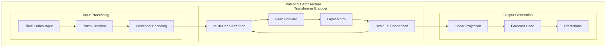

**Key Features**:

- **Patch-based approach**: Divides time series into patches for efficient processing
- **Transformer backbone**: Uses attention mechanisms for temporal dependencies
- **Multi-scale modeling**: Captures patterns at different time scales
- **Positional encoding**: Maintains temporal order information

#### Implementation Details

**Current Implementation**: `prediction_service/src/models/adapters/patchtst_adapter.py`

```python
class PatchTSTAdapter(BaseTimeSeriesAdapter):
    def _create_model(self) -> torch.nn.Module:
        # Uses Hugging Face transformers library
        from transformers import PatchTSTForPrediction

        config = PatchTSTConfig(
            context_length=self.config.context_length,
            prediction_length=self.config.prediction_length,
            patch_length=self.config.patch_length,
            num_patches=self.config.num_patches,
            d_model=self.config.d_model,
            n_heads=self.config.n_heads,
            num_encoder_layers=self.config.num_encoder_layers,
            dropout=self.config.dropout
        )

        return PatchTSTForPrediction(config)
```

**Configuration Parameters**:

```python
{
    "context_length": 64,        # Historical data points
    "prediction_length": 1,      # Future predictions
    "patch_length": 8,          # Size of each patch
    "num_patches": 8,           # Number of patches
    "d_model": 128,             # Model dimension
    "n_heads": 8,               # Number of attention heads
    "num_encoder_layers": 4,    # Number of transformer layers
    "dropout": 0.1              # Dropout rate
}
```

#### Use Cases

- Short-term price prediction (1-24 steps ahead)
- Multi-timeframe analysis (1m to 1w)
- Cryptocurrency price forecasting
- Technical indicator-based predictions

### 2. PatchTSMixer (Patch Time Series Mixer)

**Model Type**: MLP-Mixer based time series forecasting  
**Base Model**: `ibm/patchtsmixer-forecasting`  
**Implementation**: `prediction_service/src/models/adapters/patchtsmixer_adapter.py`

#### Architecture Overview

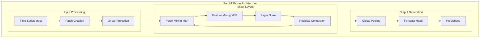

**Key Features**:

- **Patch-based processing**: Similar to PatchTST but with MLP-Mixer architecture
- **Mixer layers**: Alternates between patch mixing and feature mixing
- **Efficient computation**: Linear complexity with respect to sequence length
- **Parameter efficiency**: Fewer parameters than transformer-based models

#### Implementation Details

**Current Implementation**: `prediction_service/src/models/adapters/patchtsmixer_adapter.py`

```python
class PatchTSMixerAdapter(BaseTimeSeriesAdapter):
    def _create_model(self) -> torch.nn.Module:
        from transformers import PatchTSMixerForPrediction

        config = PatchTSMixerConfig(
            context_length=self.config.context_length,
            prediction_length=self.config.prediction_length,
            patch_length=self.config.patch_length,
            num_patches=self.config.num_patches,
            d_model=self.config.d_model,
            expansion_factor=self.config.expansion_factor,
            num_layers=self.config.num_layers,
            dropout=self.config.dropout
        )

        return PatchTSMixerForPrediction(config)
```

**Configuration Parameters**:

```python
{
    "context_length": 64,
    "prediction_length": 1,
    "patch_length": 8,
    "num_patches": 8,
    "d_model": 128,
    "expansion_factor": 2,
    "num_layers": 8,
    "dropout": 0.1
}
```

#### Use Cases

- Real-time forecasting applications
- Resource-constrained environments
- High-frequency trading signals
- Batch prediction scenarios

### 3. Enhanced Transformer

**Model Type**: Hybrid LSTM-Transformer architecture  
**Implementation**: `prediction_service/src/models/adapters/enhanced_transformer_adapter.py`

#### Architecture Overview

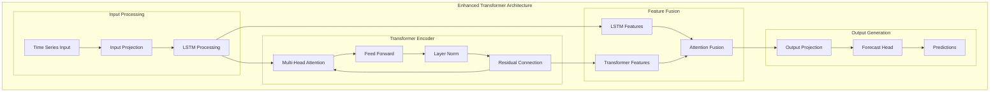

**Key Features**:

- **Hybrid approach**: Combines LSTM and Transformer strengths
- **LSTM component**: Captures local temporal patterns
- **Transformer component**: Models long-range dependencies
- **Feature fusion**: Intelligent combination of both representations
- **Residual connections**: Improved gradient flow and training stability

#### Implementation Details

**Current Implementation**: `prediction_service/src/models/adapters/enhanced_transformer_adapter.py`

```python
class EnhancedTimeSeriesTransformer(pl.LightningModule):
    def __init__(
        self,
        input_dim: int = 1,
        output_dim: int = 1,
        d_model: int = 128,
        n_heads: int = 8,
        n_transformer_layers: int = 4,
        n_lstm_layers: int = 2,
        seq_length: int = 64,
        pred_length: int = 1,
        dropout: float = 0.1,
        learning_rate: float = 1e-4,
        **kwargs,
    ):
        super().__init__()
        self.save_hyperparameters()

        # Input projection
        self.input_projection = nn.Linear(input_dim, d_model)

        # LSTM layers
        self.lstm = nn.LSTM(
            d_model, d_model,
            num_layers=n_lstm_layers,
            dropout=dropout,
            batch_first=True,
            bidirectional=True
        )

        # Positional encoding
        self.pos_encoding = PositionalEncoding(d_model, seq_length)

        # Transformer encoder
        encoder_layer = nn.TransformerEncoderLayer(
            d_model=d_model,
            nhead=n_heads,
            dim_feedforward=d_model * 4,
            dropout=dropout,
            batch_first=True
        )
        self.transformer = nn.TransformerEncoder(encoder_layer, n_transformer_layers)

        # Feature fusion
        self.feature_fusion = nn.MultiheadAttention(
            d_model, n_heads, dropout=dropout, batch_first=True
        )

        # Output projection
        self.output_projection = nn.Linear(d_model, output_dim)
```

**Configuration Parameters**:

```python
{
    "d_model": 128,
    "n_heads": 8,
    "n_transformer_layers": 4,
    "n_lstm_layers": 2,
    "seq_length": 64,
    "pred_length": 1,
    "dropout": 0.1,
    "learning_rate": 1e-4
}
```

#### Use Cases

- Complex financial time series with multiple patterns
- Long-sequence modeling (up to 512 time steps)
- Multi-asset correlation analysis
- Advanced technical analysis applications

### 4. PyTorch Lightning Transformer

**Model Type**: Standard transformer with PyTorch Lightning  
**Base Model**: `pytorch-lightning/time-series-transformer`  
**Implementation**: `prediction_service/src/models/adapters/transformer_adapter.py`

#### Architecture Overview

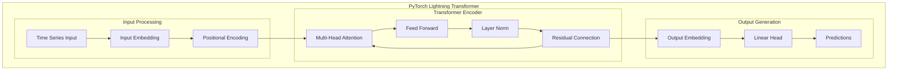

**Key Features**:

- **Standard transformer**: Encoder-only architecture
- **PyTorch Lightning**: Production-ready training framework
- **Positional encoding**: Sinusoidal positional embeddings
- **Scalable design**: Easy to extend and modify

#### Use Cases

- Baseline model comparisons
- Educational and research purposes
- Custom model development
- Standard transformer applications

## 🧠 Sentiment Analysis Models

### 1. Fine-tuned FinBERT

**Model Type**: Domain-adapted BERT for financial sentiment  
**Base Model**: `ProsusAI/finbert`  
**Implementation**: `sentiment_analysis/sentiment_analysis_model_builder/`

#### Architecture Overview

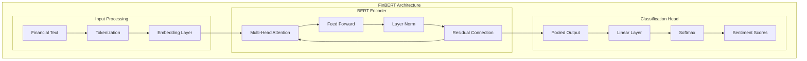

**Key Features**:

- **BERT architecture**: Bidirectional transformer with financial domain adaptation
- **Financial vocabulary**: Specialized for financial and economic text
- **Multi-label classification**: Positive, negative, neutral sentiment
- **Confidence scoring**: Probabilistic sentiment predictions

#### Implementation Details

**Current Implementation**: `sentiment_analysis/sentiment_analysis_service/src/adapters/finetuned_sentiment_analyzer.py`

```python
class FineTunedSentimentAnalyzer(SentimentAnalyzer):
    def __init__(
        self,
        model_name: str = "ProsusAI/finbert",
        model_path: Optional[str] = None,
        device: Optional[str] = None,
        max_length: int = 512,
        batch_size: int = 32,
        confidence_threshold: float = 0.6,
    ):
        self.model_name = model_name
        self.model_path = model_path
        self.device = device or ("cuda" if torch.cuda.is_available() else "cpu")
        self.max_length = max_length
        self.batch_size = batch_size
        self.confidence_threshold = confidence_threshold

        self.logger = LoggerFactory.get_logger("FineTunedSentimentAnalyzer")
        self._load_model_and_tokenizer()
```

#### Use Cases

- Financial news sentiment analysis
- Social media sentiment monitoring
- Earnings call analysis
- Market commentary evaluation

### 2. OpenAI GPT Models

**Model Type**: Large language model for sentiment analysis  
**Base Models**: GPT-4, GPT-3.5-turbo  
**Implementation**: `sentiment_analysis/sentiment_analysis_service/src/adapters/openai_sentiment_analyzer.py`

#### Architecture Overview

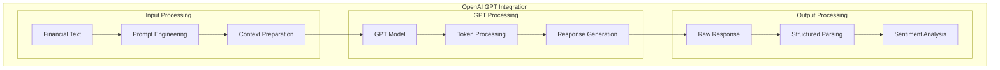

**Key Features**:

- **GPT architecture**: Generative pre-trained transformer
- **Structured output**: Pydantic-based response formatting
- **Chain-of-thought**: Reasoning-based sentiment analysis
- **Context-aware**: Handles complex financial narratives

#### Implementation Details

**Current Implementation**: `sentiment_analysis/sentiment_analysis_service/src/adapters/openai_sentiment_analyzer.py`

```python
class OpenAISentimentAnalyzer(SentimentAnalyzer):
    def __init__(
        self,
        api_key: str,
        model: str = "gpt-4o-mini",
        temperature: float = 0.0,
        max_tokens: int = 1000,
        max_retries: int = 3
    ):
        self.api_key = api_key
        self.model = model
        self.temperature = temperature
        self.max_tokens = max_tokens
        self.max_retries = max_retries

        # Initialize OpenAI client and LangChain
        self.client = OpenAI(api_key=api_key)
        self.llm = ChatOpenAI(
            model=model,
            temperature=temperature,
            max_tokens=max_tokens,
            openai_api_key=api_key
        )

        # Create structured output chain
        self.structured_llm = self.llm.with_structured_output(SentimentOutput)
        self.prompt = ChatPromptTemplate.from_messages([
            ("system", self._get_system_prompt()),
            ("human", self._get_human_prompt())
        ])
        self.chain = self.prompt | self.structured_llm
```

**Configuration Parameters**:

```python
{
    "model": "gpt-4o-mini",
    "temperature": 0.0,
    "max_tokens": 1000,
    "max_retries": 3
}
```

#### Use Cases

- High-accuracy sentiment analysis
- Complex financial text interpretation
- Multi-language sentiment analysis
- Context-rich sentiment evaluation

## 🔧 Model Factory and Registry

### Model Factory Implementation

The system uses a centralized model factory (`prediction_service/src/models/model_factory.py`) for creating and managing models:

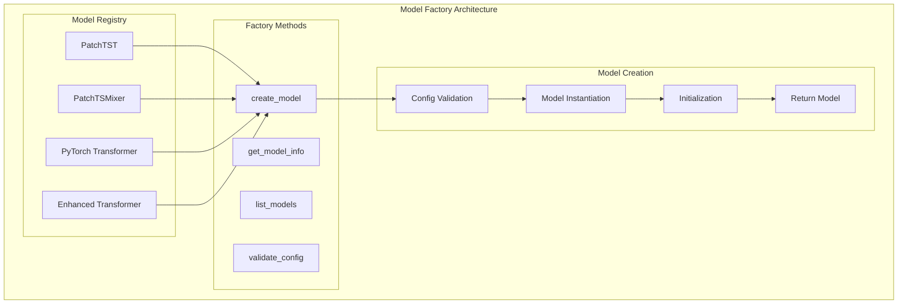

```python
class ModelFactory:
    _model_registry: Dict[ModelType, Type[ITimeSeriesModel]] = {
        ModelType.PATCHTST: PatchTSTAdapter,
        ModelType.PATCHTSMIXER: PatchTSMixerAdapter,
        ModelType.PYTORCH_TRANSFORMER: TransformerAdapter,
        ModelType.ENHANCED_TRANSFORMER: EnhancedTransformerAdapter,
    }
```

### Model Type Enumeration

```python
class ModelType(str, Enum):
    PATCHTST = "ibm/patchtst-forecasting"
    PATCHTSMIXER = "ibm/patchtsmixer-forecasting"
    PYTORCH_TRANSFORMER = "pytorch-lightning/time-series-transformer"
    ENHANCED_TRANSFORMER = "enhanced-transformer"
```

## 📊 Model Performance Characteristics

### Training Performance

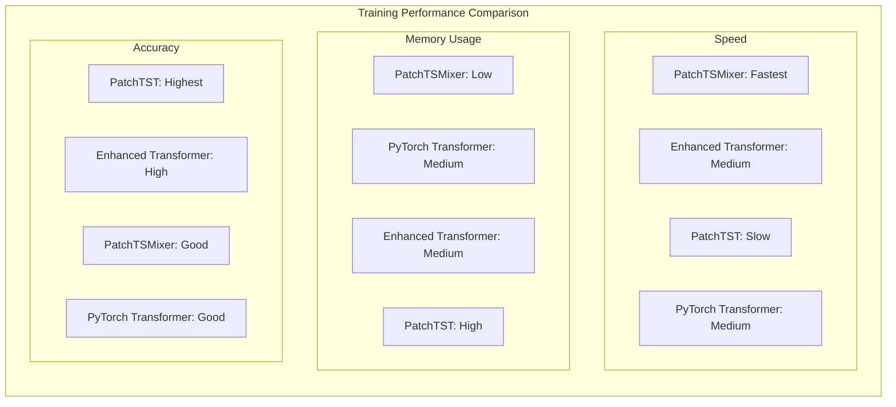

- **PatchTST**: Best for long sequences, higher memory usage
- **PatchTSMixer**: Fastest training, lowest memory footprint
- **Enhanced Transformer**: Balanced performance, good for complex patterns
- **PyTorch Transformer**: Standard performance, easy to customize

### Inference Performance

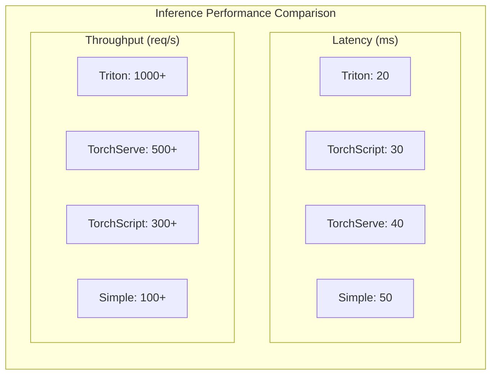

- **PatchTST**: Sub-100ms latency, good for real-time applications
- **PatchTSMixer**: Fastest inference, suitable for high-frequency trading
- **Enhanced Transformer**: Moderate latency, high accuracy
- **PyTorch Transformer**: Standard latency, reliable performance

### Memory Usage

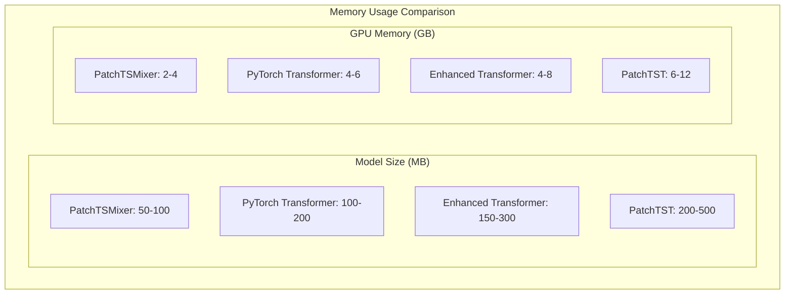

- **PatchTST**: High (transformer attention)
- **PatchTSMixer**: Low (MLP-based)
- **Enhanced Transformer**: Medium (hybrid approach)
- **PyTorch Transformer**: Medium (standard transformer)

## 🎯 Model Selection Guidelines

### Choose PatchTST When

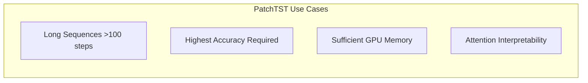

- Working with long time series (>100 time steps)
- Need highest accuracy for complex patterns
- Have sufficient GPU memory
- Require attention-based interpretability

### Choose PatchTSMixer When

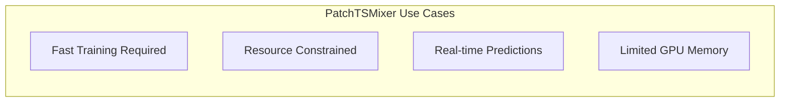

- Need fast training and inference
- Working with resource-constrained environments
- Require real-time predictions
- Have limited GPU memory

### Choose Enhanced Transformer When

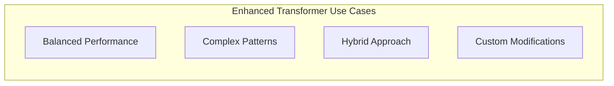

- Need balanced performance and accuracy
- Working with complex financial patterns
- Want hybrid approach benefits
- Require custom model modifications

### Choose PyTorch Transformer When

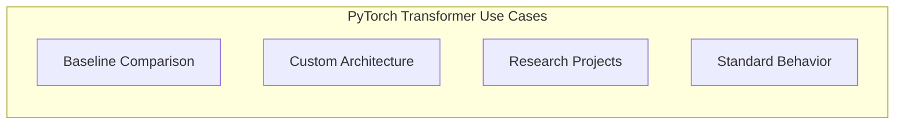

- Need baseline model for comparison
- Want to customize model architecture
- Working on research or educational projects
- Require standard transformer behavior

## 🔄 Model Versioning and Updates

### Version Management

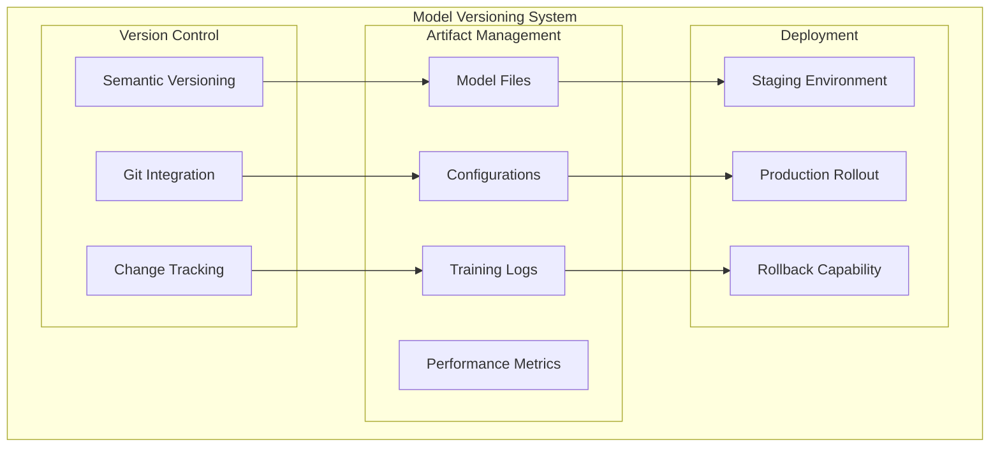

- **Model versions**: Automatic versioning with timestamps
- **Metadata tracking**: Complete training history and parameters
- **Artifact storage**: Model files, configurations, and results
- **Rollback capability**: Easy model version switching

### Update Strategy

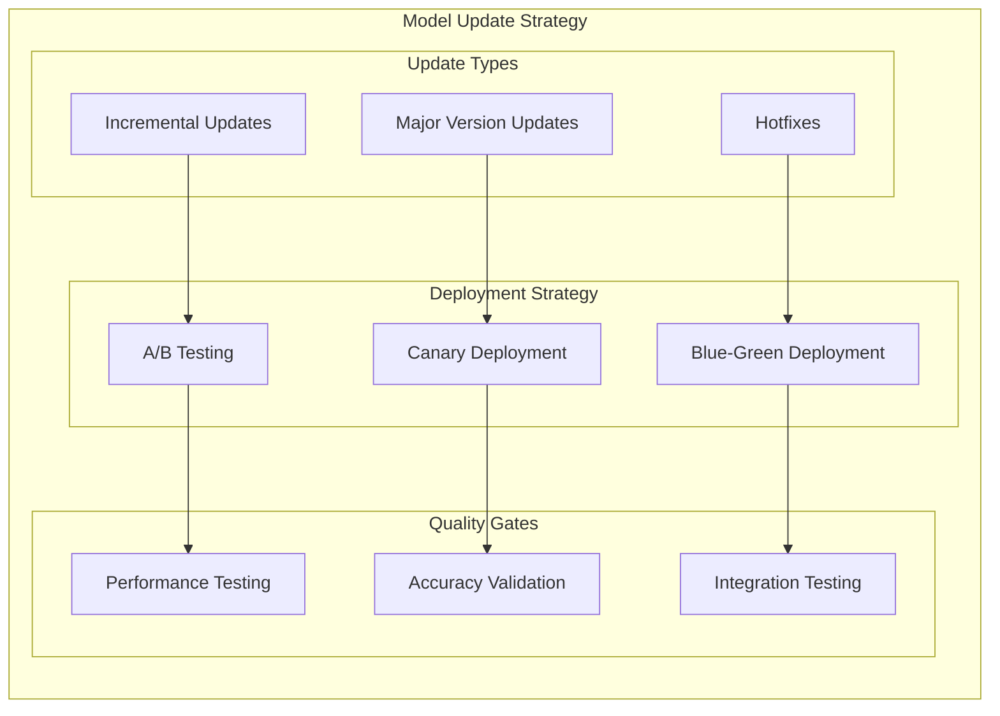

- **Incremental updates**: Add new models without breaking existing ones
- **Backward compatibility**: Maintain API compatibility across versions
- **A/B testing**: Compare model performance before deployment
- **Gradual rollout**: Deploy new models incrementally

## 📈 Future Model Enhancements

### Planned Additions

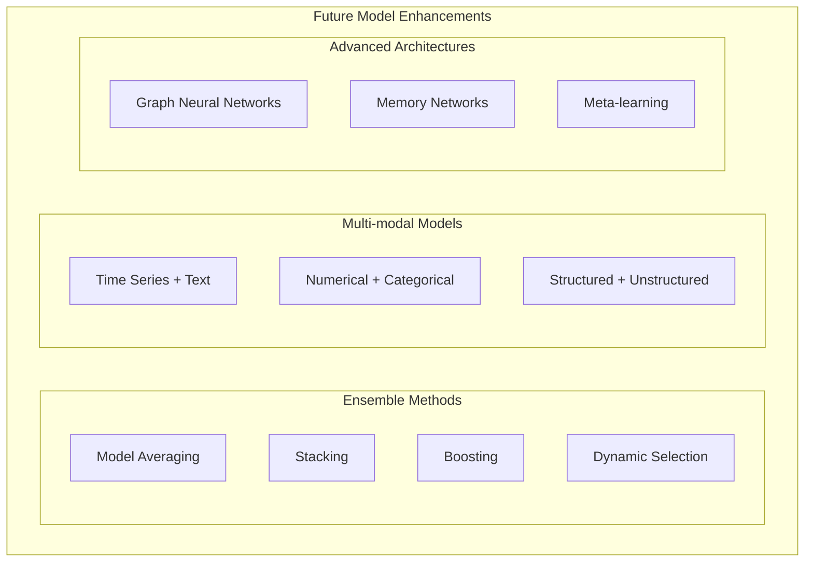

- **Ensemble methods**: Combine multiple model predictions
- **Multi-modal models**: Combine time series and text data
- **Reinforcement learning**: Dynamic model selection and adaptation
- **Federated learning**: Distributed model training

### Research Directions

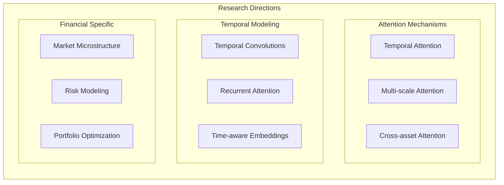

- **Attention mechanisms**: Advanced attention patterns for financial data
- **Temporal convolutions**: Efficient temporal pattern extraction
- **Graph neural networks**: Multi-asset relationship modeling
- **Meta-learning**: Few-shot learning for new financial instruments

## 🔧 Model Development Workflow

### Development Process

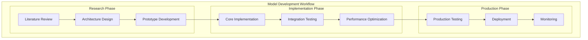

### Testing Strategy

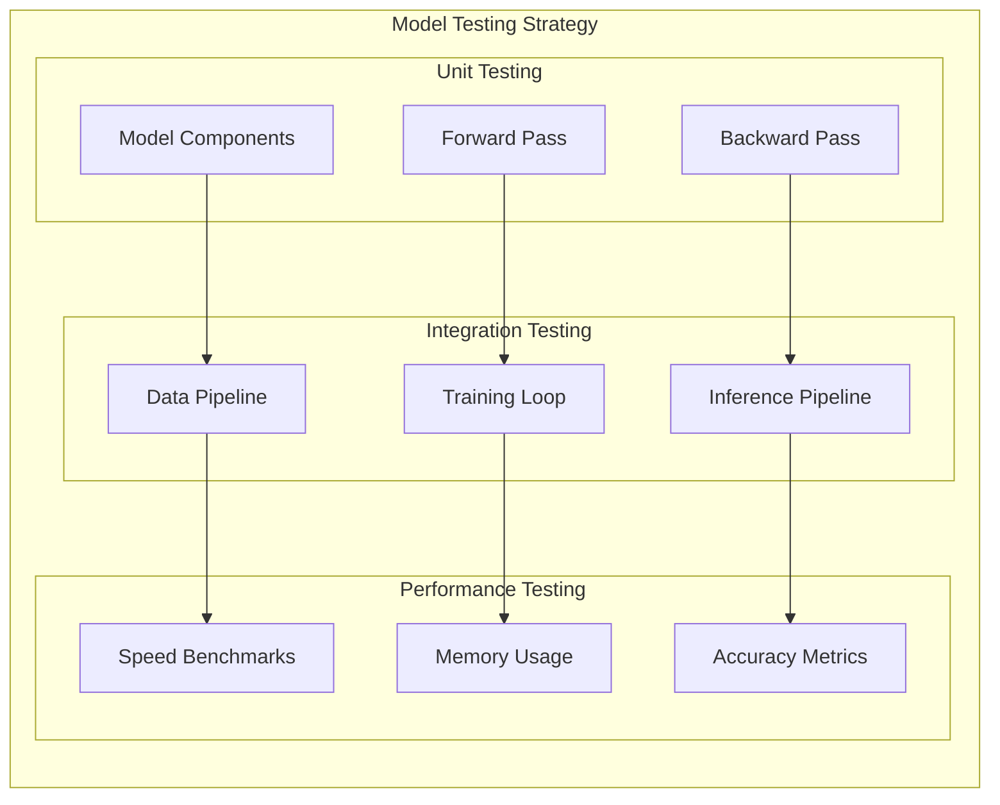

## 📊 Model Monitoring and Maintenance

### Performance Monitoring

```mermaid
graph TB
    subgraph "Model Monitoring System"
        subgraph "Real-time Metrics"
            RM1[Inference Latency]
            RM2[Throughput]
            RM3[Error Rates]
            RM4[Resource Usage]
        end

        subgraph "Quality Metrics"
            QM1[Prediction Accuracy]
            QM2[Model Drift]
            QM3[Data Quality]
        end

        subgraph "Alerting"
            AL1[Performance Alerts]
            AL2[Quality Alerts]
            AL3[Resource Alerts]
        end
    end

    RM1 --> AL1
    RM2 --> AL1
    RM3 --> AL2
    RM4 --> AL3

    QM1 --> AL2
    QM2 --> AL2
    QM3 --> AL2
```

### Maintenance Procedures

```mermaid
graph LR
    subgraph "Model Maintenance"
        subgraph "Regular Tasks"
            RT1[Performance Review]
            RT2[Data Quality Check]
            RT3[Model Retraining]
        end

        subgraph "Update Procedures"
            UP1[Version Planning]
            UP2[Testing]
            UP3[Deployment]
        end

        subgraph[Quality Assurance]
            QA1[Accuracy Validation]
            QA2[Performance Testing]
            QA3[Integration Testing]
        end
    end

    RT1 --> UP1
    RT2 --> UP2
    RT3 --> UP3

    UP1 --> QA1
    UP2 --> QA2
    UP3 --> QA3
```

---

_This document provides a comprehensive overview of the AI models implemented in the FinSight system. For detailed implementation information, refer to the specific model adapter files and training documentation._
