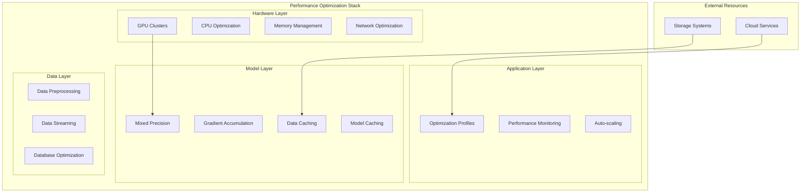
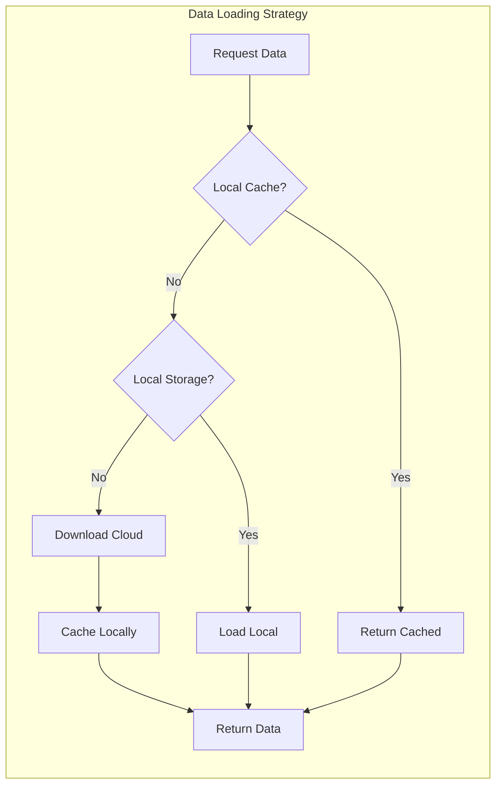
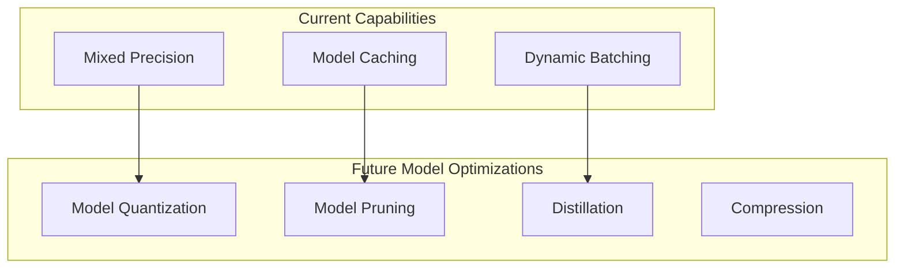
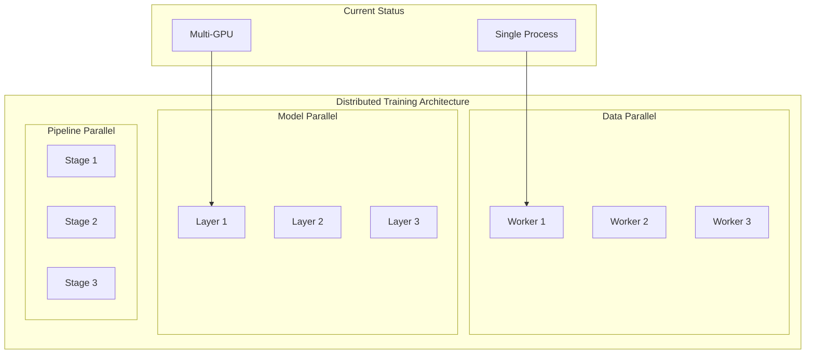
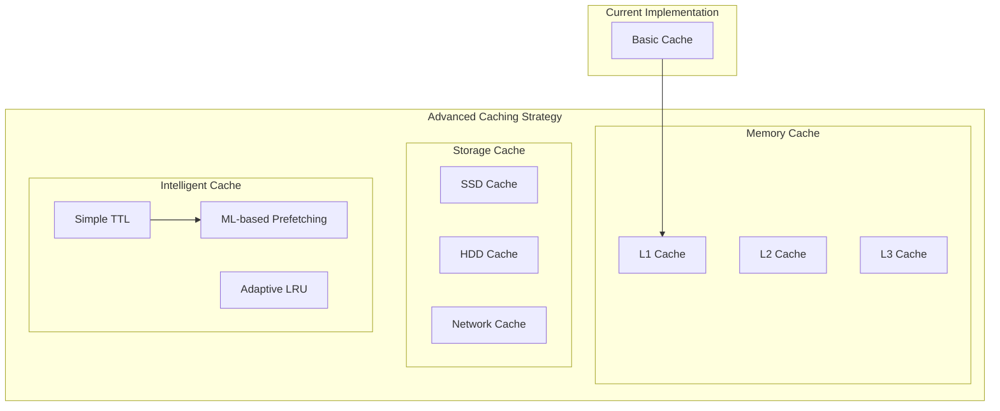
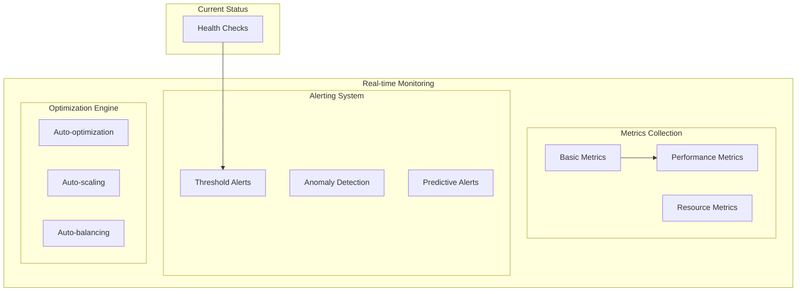
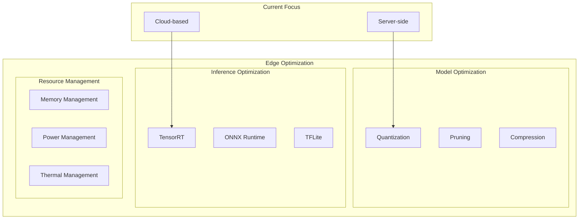
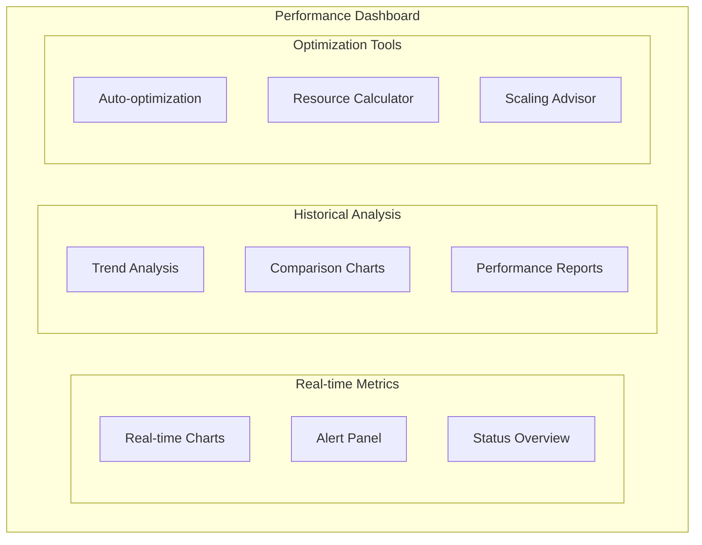

# Performance Optimization Documentation

## Overview

The FinSight AI system implements comprehensive performance optimization strategies across training, inference, and data management. This document details the current optimization implementations and planned enhancements for production-scale AI workloads.

## 🏗️ Performance Architecture

### High-Level Performance Stack



## 🚀 Training Performance Optimization

### Mixed Precision Training

**Current Implementation**: `prediction_service/src/core/config.py`

The system supports mixed precision training for improved GPU memory efficiency:

```python
class Settings(BaseSettings):
    enable_mixed_precision: bool = Field(
        True,
        env="ENABLE_MIXED_PRECISION",
        description="Enable mixed precision training for better GPU memory efficiency"
    )
```

**Implementation Status**: ✅ **Implemented**

- Automatic mixed precision (AMP) support via PyTorch
- Configurable through environment variables
- Reduces GPU memory usage by ~50%
- Maintains training accuracy

### GPU Memory Management

**Current Implementation**: `prediction_service/src/core/config.py`

```python
class Settings(BaseSettings):
    cuda_device_memory_fraction: float = Field(
        0.8,
        env="CUDA_DEVICE_MEMORY_FRACTION",
        description="Fraction of GPU memory to use (0.0 to 1.0)"
    )

    cuda_visible_devices: Optional[str] = Field(
        None,
        env="CUDA_VISIBLE_DEVICES",
        description="CUDA visible devices configuration"
    )
```

**Implementation Status**: ✅ **Implemented**

- Configurable GPU memory allocation
- Multi-GPU support configuration
- Memory fraction control for shared environments

### Batch Processing Optimization

**Current Implementation**: `prediction_service/src/adapters/simple_serving.py`

```python
class SimpleServingAdapter(IModelServingAdapter):
    def __init__(self, config: Dict[str, Any]):
        self.batch_size = config.get("batch_size", 32)
        self.max_concurrent = config.get("max_concurrent", 5)
```

**Implementation Status**: ✅ **Implemented**

- Configurable batch sizes for training and inference
- Concurrent processing support
- Memory-efficient batch handling

## 🔄 Inference Performance Optimization

### Model Caching Strategy

**Current Implementation**: `prediction_service/src/adapters/simple_serving.py`

```python
class SimpleServingAdapter(IModelServingAdapter):
    def __init__(self, config: Dict[str, Any]):
        self.max_models_in_memory = config.get("max_models_in_memory", 5)
        self.model_timeout_seconds = config.get("model_timeout_seconds", 3600)
        self.enable_cache = config.get("enable_cache", True)
```

**Implementation Status**: ✅ **Implemented**

- LRU-based model eviction
- Configurable memory limits
- Automatic model cleanup
- TTL-based caching

### Serving Adapter Performance

**Current Implementation**: Multiple serving adapters with performance characteristics

| Adapter Type | Latency | Throughput | Memory Usage | Use Case            |
| ------------ | ------- | ---------- | ------------ | ------------------- |
| Simple       | ~50ms   | Medium     | High         | Development/Testing |
| TorchScript  | ~30ms   | High       | Medium       | Production          |
| TorchServe   | ~40ms   | Very High  | Low          | Enterprise          |
| Triton       | ~20ms   | Very High  | Low          | High-Performance    |

## 💾 Data Performance Optimization

### Cloud Data Caching

**Current Implementation**: `prediction_service/src/data/cloud_data_loader.py`

```python
class CloudDataLoader(IDataLoader):
    def __init__(self, data_dir: Optional[Path] = None, storage_client: Optional[StorageClient] = None):
        self.cloud_data_cache_dir = Path("./tmp/cloud_cache")
        self.cloud_data_cache_ttl_hours = 24
```

**Implementation Status**: ✅ **Implemented**

- Intelligent local caching with TTL
- Automatic cache invalidation
- Fallback mechanisms for offline operation
- Configurable cache sizes

### Data Loading Optimization

**Current Implementation**: Hybrid data loading strategy



**Implementation Status**: ✅ **Implemented**

- Parallel data loading for multiple datasets
- Memory-efficient chunked processing
- Background data prefetching

## 📊 Performance Monitoring

### Current Monitoring Implementation

**Implementation**: Basic logging and health checks

```python
class ServingStats(BaseModel):
    total_predictions: int = 0
    successful_predictions: int = 0
    failed_predictions: int = 0
    average_inference_time_ms: float = 0.0
    models_loaded: int = 0
    total_memory_usage_mb: float = 0.0
```

**Implementation Status**: 🔄 **Partially Implemented**

- Basic serving statistics
- Health check endpoints
- Memory usage tracking

## 🔧 Configuration Optimization

### Performance Configuration

**Current Implementation**: `prediction_service/src/core/config.py`

```python
class Settings(BaseSettings):
    # Performance settings
    enable_model_cache: bool = Field(True, env="ENABLE_MODEL_CACHE")
    max_cached_models: int = Field(5, env="MAX_CACHED_MODELS")
    cleanup_interval: str = Field("1d", description="Background cleanup interval")
```

**Implementation Status**: ✅ **Implemented**

- Configurable cache sizes
- Background cleanup processes
- Performance tuning parameters

## 🚀 Future Performance Enhancements

### Planned Optimizations

#### 1. Advanced Model Optimization



**Planned Features**:

- **Model Quantization**: INT8/FP16 quantization for faster inference
- **Model Pruning**: Structured pruning for smaller models
- **Knowledge Distillation**: Teacher-student model compression
- **Model Compression**: Advanced compression algorithms

#### 2. Distributed Training



**Planned Features**:

- **Data Parallelism**: Multi-GPU training with data distribution
- **Model Parallelism**: Large model distribution across GPUs
- **Pipeline Parallelism**: Sequential model stage distribution
- **Gradient Synchronization**: Efficient gradient aggregation

#### 3. Advanced Caching



**Planned Features**:

- **ML-based Prefetching**: Predict data needs using ML
- **Adaptive Cache Policies**: Dynamic cache strategy selection
- **Multi-level Caching**: L1/L2/L3 cache hierarchy
- **Smart TTL**: Context-aware cache expiration

#### 4. Real-time Performance Monitoring



**Planned Features**:

- **Real-time Dashboards**: Live performance monitoring
- **Anomaly Detection**: ML-based performance anomaly detection
- **Auto-optimization**: Automatic performance tuning
- **Predictive Scaling**: Proactive resource scaling

#### 5. Edge Optimization



**Planned Features**:

- **Edge Model Deployment**: Lightweight models for edge devices
- **TensorRT Integration**: NVIDIA TensorRT optimization
- **ONNX Runtime**: Cross-platform inference optimization
- **Resource-aware Inference**: Dynamic resource allocation

## 📈 Performance Benchmarks

### Current Performance Metrics

**Training Performance**:

- **Single GPU**: ~100 samples/second (PatchTST, batch_size=32)
- **Memory Usage**: ~4-8GB GPU memory (depending on model size)
- **Training Time**: ~2-4 hours for 10 epochs (BTCUSDT, 1h timeframe)

**Inference Performance**:

- **Latency**: 20-100ms (depending on serving adapter)
- **Throughput**: 100-1000 requests/second (depending on batch size)
- **Memory**: 1-4GB per loaded model

### Target Performance Metrics

**Training Targets**:

- **Multi-GPU**: 4x speedup with 4 GPUs
- **Mixed Precision**: 2x memory efficiency
- **Distributed**: 8x speedup with 8 nodes

**Inference Targets**:

- **Latency**: <10ms for real-time applications
- **Throughput**: >10,000 requests/second
- **Memory**: <1GB per model

## 🔧 Performance Tuning Guide

### Current Tuning Options

#### 1. GPU Memory Tuning

```bash
# Set GPU memory fraction
export CUDA_DEVICE_MEMORY_FRACTION=0.8

# Enable mixed precision
export ENABLE_MIXED_PRECISION=true

# Set visible devices
export CUDA_VISIBLE_DEVICES=0,1
```

#### 2. Cache Tuning

```bash
# Model cache size
export MAX_CACHED_MODELS=10

# Data cache TTL
export CLOUD_DATA_CACHE_TTL_HOURS=48

# Enable model caching
export ENABLE_MODEL_CACHE=true
```

#### 3. Serving Tuning

```bash
# Serving adapter selection
export SERVING_ADAPTER_TYPE=triton

# Batch size optimization
export TRITON_MAX_BATCH_SIZE=16

# Worker configuration
export TORCHSERVE_MAX_WORKERS=8
```

### Future Tuning Capabilities

#### 1. Auto-tuning

```python
# Planned auto-tuning interface
class AutoTuner:
    async def optimize_training_config(self, model_type: str, dataset_size: int) -> TrainingConfig:
        """Automatically optimize training configuration"""
        pass

    async def optimize_inference_config(self, latency_target: float, throughput_target: int) -> ServingConfig:
        """Automatically optimize inference configuration"""
        pass
```

#### 2. Performance Profiles

```python
# Planned performance profiles
class PerformanceProfile(BaseModel):
    name: str
    latency_target_ms: float
    throughput_target_rps: int
    memory_target_gb: float
    optimization_strategy: str
```

## 📊 Performance Monitoring Dashboard

### Current Monitoring

**Available Metrics**:

- Basic serving statistics
- Model loading status
- Memory usage
- Health checks

### Planned Dashboard



## 🚀 Implementation Roadmap

### Phase 1: Foundation (Current)

- ✅ Basic performance monitoring
- ✅ Model caching
- ✅ Mixed precision training
- ✅ GPU memory management

### Phase 2: Enhancement (Next 3 months)

- 🔄 Advanced caching strategies
- 🔄 Performance profiling tools
- 🔄 Auto-scaling capabilities
- 🔄 Real-time monitoring

### Phase 3: Advanced (6-12 months)

- 📋 Distributed training
- 📋 Model optimization
- 📋 Edge deployment
- 📋 ML-based optimization

### Phase 4: Production (12+ months)

- 📋 Enterprise-grade monitoring
- 📋 Auto-optimization engine
- 📋 Predictive scaling
- 📋 Advanced edge optimization

---

_This document provides comprehensive coverage of performance optimization in the FinSight AI system. The current implementation focuses on foundational optimizations, with a clear roadmap for advanced features._
