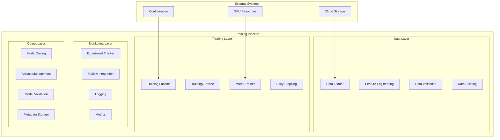

# Training Pipeline Documentation

## Overview

The FinSight AI system provides a comprehensive, production-ready training pipeline for both time series forecasting and sentiment analysis models. This document details the complete training workflow, from data preparation to model deployment.

## 🏗️ Training Architecture

### High-Level Architecture



## 🔄 Training Workflow

### 1. Data Preparation Phase

#### Data Loading

The system supports multiple data sources through a unified data loading interface:

```python
# Supported data loaders
class DataLoaderType(str, Enum):
    LOCAL = "local"      # Local file system
    CLOUD = "cloud"      # Cloud storage only
    HYBRID = "hybrid"    # Local + cloud with caching
```

**Implementation**: `prediction_service/src/data/`

- **File Data Loader**: Direct file system access
- **Cloud Data Loader**: S3-compatible storage integration
- **Hybrid Data Loader**: Intelligent caching and fallback

#### Feature Engineering

Comprehensive feature engineering pipeline for financial time series:

```python
class BasicFeatureEngineering(IFeatureEngineering):
    def __init__(self,
                 feature_columns: Optional[List[str]] = None,
                 add_technical_indicators: bool = True,
                 add_datetime_features: bool = False,
                 normalize_features: bool = True):
```

**Supported Features**:

- **OHLCV Data**: Open, High, Low, Close, Volume
- **Technical Indicators**: RSI, MACD, Bollinger Bands, Moving Averages
- **Datetime Features**: Hour, day, month, day of week
- **Custom Indicators**: User-defined technical analysis

**Technical Indicators Implemented**:

```python
def _add_ta_indicators(self, df: pd.DataFrame) -> pd.DataFrame:
    # Trend indicators
    df['sma_20'] = ta.trend.sma_indicator(df['close'], window=20)
    df['ema_20'] = ta.trend.ema_indicator(df['close'], window=20)

    # Momentum indicators
    df['rsi'] = ta.momentum.rsi(df['close'], window=14)
    df['macd'] = ta.trend.macd_diff(df['close'])

    # Volatility indicators
    df['bb_upper'], df['bb_middle'], df['bb_lower'] = ta.volatility.bollinger_bands(df['close'])
```

#### Data Validation

Comprehensive validation ensures data quality:

```python
class ValidationConstants:
    MIN_DATA_ROWS = 100
    MIN_TRAINING_RATIO = 0.5
    MAX_TRAINING_RATIO = 0.9
    MIN_VALIDATION_RATIO = 0.05
    MAX_VALIDATION_RATIO = 0.3
```

**Validation Checks**:

- Minimum data requirements
- Data completeness
- Feature consistency
- Temporal ordering
- Outlier detection

### 2. Model Training Phase

#### Training Facade

Unified interface for model training operations:

```python
class ModelTrainingFacade:
    async def train_model(
        self,
        symbol: str,
        timeframe: TimeFrame,
        model_type: ModelType,
        train_data: pd.DataFrame,
        val_data: pd.DataFrame,
        feature_engineering: Any,
        config: ModelConfig,
        run_id: Optional[str] = None,
    ) -> Dict[str, Any]:
```

**Key Features**:

- **Async Training**: Non-blocking training operations
- **Progress Tracking**: Real-time training progress updates
- **Error Handling**: Comprehensive error management
- **Resource Management**: GPU memory and CPU utilization

#### Training Service

Production-grade training orchestration:

```python
class TrainingService:
    async def start_async_training(
        self, request: AsyncTrainingRequest
    ) -> AsyncTrainingResponse:

    async def get_training_status(
        self, job_id: str
    ) -> TrainingJobStatusResponse:
```

**Training Job Management**:

- **Job Queuing**: Priority-based job scheduling
- **Resource Allocation**: Dynamic GPU/CPU assignment
- **Progress Monitoring**: Real-time status updates
- **Failure Recovery**: Automatic retry mechanisms

#### Model Configuration

Flexible model configuration system:

```python
class ModelConfig(BaseModel):
    # Training parameters
    context_length: int = Field(64, ge=10, le=512)
    prediction_length: int = Field(1, ge=1, le=24)
    num_epochs: int = Field(10, ge=1, le=200)
    batch_size: int = Field(32, ge=1, le=512)
    learning_rate: float = Field(1e-3, ge=1e-6, le=1.0)

    # Model-specific parameters
    patch_length: int = Field(8, ge=4, le=32)
    num_patches: int = Field(8, ge=4, le=64)
    d_model: int = Field(128, ge=64, le=512)
    n_heads: int = Field(8, ge=4, le=16)
```

### 3. Experiment Tracking Phase

#### MLflow Integration

Professional experiment tracking and model registry:

```python
class MLflowExperimentTracker(IExperimentTracker):
    async def start_run(
        self,
        experiment_id: Optional[str] = None,
        run_name: Optional[str] = None,
        tags: Optional[Dict[str, str]] = None,
        nested: bool = False,
    ) -> str:
```

**Tracking Features**:

- **Parameters**: All training hyperparameters
- **Metrics**: Training and validation metrics
- **Artifacts**: Model files and visualizations
- **Tags**: Custom metadata and categorization

#### Local Tracking

File-based experiment tracking for offline environments:

```python
class SimpleExperimentTracker(IExperimentTracker):
    def __init__(self, base_dir: Optional[Path] = None):
        self.base_dir = base_dir or Path("./experiments")
```

**Features**:

- **JSON Storage**: Human-readable experiment data
- **File Organization**: Structured directory hierarchy
- **Version Control**: Git-friendly storage format
- **Offline Support**: No external dependencies

### 4. Model Output Phase

#### Model Saving

Multi-format model export capabilities:

```python
async def _save_trained_model(
    self,
    model: ITimeSeriesModel,
    symbol: str,
    timeframe: TimeFrame,
    model_type: ModelType,
    config: ModelConfig,
    training_result: Dict[str, Any],
) -> str:
```

**Supported Formats**:

- **PyTorch**: Native `.pt` format
- **TorchScript**: Production-ready scripted models
- **ONNX**: Cross-platform model format
- **Triton**: NVIDIA Triton inference server format

#### Artifact Management

Comprehensive artifact storage and versioning:

```python
class MLflowArtifactHelper:
    @staticmethod
    def prepare_model_artifacts(model_path: str | Path) -> Dict[str, Any]:
        """Prepare model artifacts for MLflow logging"""
```

**Artifact Types**:

- **Model Files**: Trained model weights
- **Configurations**: Training parameters and settings
- **Visualizations**: Training curves and predictions
- **Metadata**: Complete training history

## 🚀 Training Execution

### Synchronous Training

Direct model training with immediate results:

```python
# Example synchronous training
training_result = await training_service.train_model(
    symbol="BTCUSDT",
    timeframe=TimeFrame.HOUR_1,
    model_type=ModelType.PATCHTST,
    train_data=train_df,
    val_data=val_df,
    feature_engineering=feature_eng,
    config=model_config
)
```

### Asynchronous Training

Background training with job management:

```python
# Start async training
response = await training_service.start_async_training(
    AsyncTrainingRequest(
        symbol="BTCUSDT",
        timeframe=TimeFrame.HOUR_1,
        model_type=ModelType.PATCHTST,
        config=model_config
    )
)

# Check training status
status = await training_service.get_training_status(response.job_id)
```

### Batch Training

Multiple model training with resource management:

```python
# Batch training configuration
batch_config = {
    "symbols": ["BTCUSDT", "ETHUSDT", "BNBUSDT"],
    "timeframes": [TimeFrame.HOUR_1, TimeFrame.DAY_1],
    "model_types": [ModelType.PATCHTST, ModelType.PATCHTSMIXER],
    "max_concurrent": 3
}
```

## 📊 Training Monitoring

### Real-Time Metrics

Comprehensive training metrics collection:

```python
# Training metrics
training_metrics = {
    "loss": current_loss,
    "val_loss": validation_loss,
    "learning_rate": current_lr,
    "epoch": current_epoch,
    "batch": current_batch
}

# Validation metrics
validation_metrics = {
    "mae": mean_absolute_error,
    "mse": mean_squared_error,
    "rmse": root_mean_squared_error,
    "mape": mean_absolute_percentage_error
}
```

### Progress Tracking

Detailed training progress monitoring:

```python
class TrainingProgressUpdate(BaseModel):
    job_id: str
    status: TrainingJobStatus
    progress: float = Field(..., ge=0.0, le=1.0)
    current_epoch: int
    total_epochs: int
    current_loss: float
    validation_loss: Optional[float] = None
    eta_seconds: Optional[int] = None
```

### Health Monitoring

System health and resource monitoring:

```python
class BackgroundTaskHealthResponse(BaseModel):
    is_healthy: bool
    active_jobs: int
    queued_jobs: int
    failed_jobs: int
    system_resources: Dict[str, Any]
    last_health_check: datetime
```

## 🔧 Configuration Management

### Environment Variables

Comprehensive configuration through environment variables:

```bash
# Training configuration
DEFAULT_CONTEXT_LENGTH=64
DEFAULT_PREDICTION_LENGTH=1
DEFAULT_NUM_EPOCHS=10
DEFAULT_BATCH_SIZE=32
DEFAULT_LEARNING_RATE=1e-3

# Device configuration
FORCE_CPU=false
CUDA_VISIBLE_DEVICES=0
CUDA_DEVICE_MEMORY_FRACTION=0.8
ENABLE_MIXED_PRECISION=true

# MLflow configuration
MLFLOW_TRACKING_URI=http://localhost:5000
MLFLOW_EXPERIMENT_NAME=finsight-ml
```

### Configuration Validation

Automatic configuration validation and defaults:

```python
@field_validator("context_length")
@classmethod
def validate_context_length(cls, v):
    if v < 10 or v > 512:
        raise ValueError("context_length must be between 10 and 512")
    return v

@field_validator("learning_rate")
@classmethod
def validate_learning_rate(cls, v):
    if v < 1e-6 or v > 1.0:
        raise ValueError("learning_rate must be between 1e-6 and 1.0")
    return v
```

## 🎯 Training Optimization

### Performance Tuning

Optimization strategies for faster training:

```python
# Mixed precision training
if settings.enable_mixed_precision:
    scaler = torch.cuda.amp.GradScaler()

# Gradient accumulation
if gradient_accumulation_steps > 1:
    loss = loss / gradient_accumulation_steps

# Learning rate scheduling
scheduler = torch.optim.lr_scheduler.ReduceLROnPlateau(
    optimizer, mode='min', factor=0.5, patience=5
)
```

### Resource Management

Efficient GPU and memory utilization:

```python
# GPU memory management
torch.cuda.empty_cache()
torch.cuda.set_per_process_memory_fraction(
    settings.cuda_device_memory_fraction
)

# Model caching
if settings.enable_model_cache:
    model_cache = ModelCache(
        max_size=settings.max_cached_models,
        ttl_seconds=settings.model_cache_ttl_seconds
    )
```

## 🔄 Training Pipeline Extensions

### Custom Model Training

Adding new model types to the pipeline:

```python
# 1. Create model adapter
class CustomModelAdapter(BaseTimeSeriesAdapter):
    def _create_model(self) -> torch.nn.Module:
        # Custom model architecture
        pass

    def _train_model(self, train_dataset, val_dataset, **kwargs):
        # Custom training logic
        pass

# 2. Register with factory
ModelFactory.register_model(ModelType.CUSTOM, CustomModelAdapter)

# 3. Add to configuration
enabled_models = [
    ModelType.PATCHTST,
    ModelType.PATCHTSMIXER,
    ModelType.CUSTOM
]
```

### Custom Feature Engineering

Extending the feature engineering pipeline:

```python
class CustomFeatureEngineering(BasicFeatureEngineering):
    def _add_custom_features(self, df: pd.DataFrame) -> pd.DataFrame:
        # Custom feature calculations
        df['custom_indicator'] = self._calculate_custom_indicator(df)
        return df

    def _calculate_custom_indicator(self, df: pd.DataFrame) -> pd.Series:
        # Custom indicator implementation
        pass
```

## 📈 Future Enhancements

### Planned Improvements

- **Distributed Training**: Multi-GPU and multi-node training
- **AutoML Integration**: Automated hyperparameter optimization
- **Advanced Scheduling**: Intelligent job scheduling and resource allocation
- **Real-time Training**: Streaming data training capabilities

### Research Directions

- **Meta-learning**: Learning to learn for new financial instruments
- **Few-shot Learning**: Training with limited data
- **Active Learning**: Intelligent data selection for training
- **Federated Learning**: Distributed training across multiple institutions

---

_This document provides comprehensive coverage of the training pipeline in the FinSight AI system. For implementation details, refer to the specific service files and model adapters._
