# FinSight Platform Architecture

## Table of Contents

1. [System Overview](#system-overview)
2. [Architecture Principles](#architecture-principles)
3. [Platform Architecture](#platform-architecture)
4. [Service Architecture](#service-architecture)
5. [Component Interactions](#component-interactions)
6. [Data Flow Diagrams](#data-flow-diagrams)
7. [Technology Stack](#technology-stack)
8. [Infrastructure Architecture](#infrastructure-architecture)
9. [Security Architecture](#security-architecture)
10. [Performance & Scalability](#performance--scalability)
11. [Monitoring & Observability](#monitoring--observability)
12. [Future Enhancements](#future-enhancements)

## System Overview

FinSight is a comprehensive AI-powered financial analysis platform built using **Microservices Architecture** with **Hexagonal Design Patterns**. The platform is designed for high scalability, maintainability, and extensibility, providing end-to-end solutions for cryptocurrency market analysis.

### Platform Components

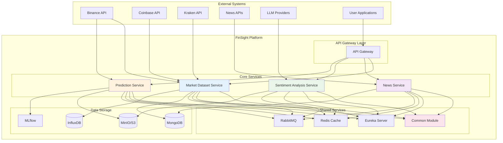

## Architecture Principles

### 1. Hexagonal Architecture (Ports & Adapters)

The platform follows **Hexagonal Architecture** principles, ensuring:

- **Core Domain Independence**: Business logic is isolated from external dependencies
- **Interface Segregation**: Clear, focused interfaces for each component
- **Dependency Inversion**: Core domain doesn't depend on external systems
- **Testability**: Easy mocking and testing with dependency injection

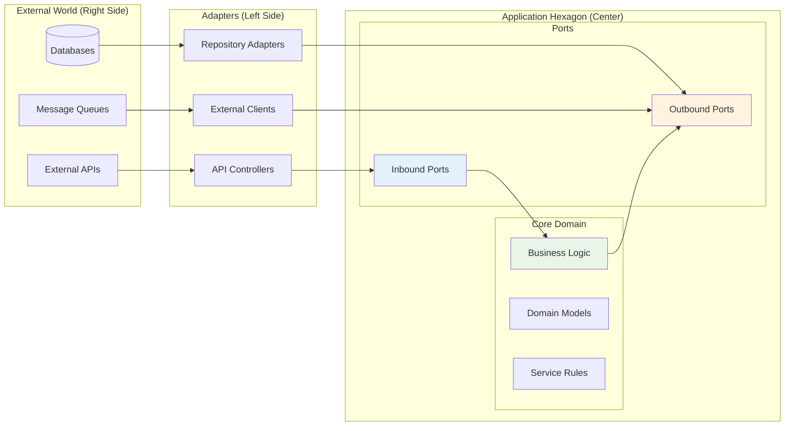

### 2. Microservices Design

Each service follows **Microservices Architecture** principles:

- **Service Independence**: Independent development, deployment, and scaling
- **Service Discovery**: Dynamic service registration with Eureka
- **Inter-Service Communication**: REST APIs, gRPC, and message queues
- **Event-Driven**: Asynchronous processing with RabbitMQ

### 3. AI/ML First Design

Platform optimized for AI/ML workflows:

- **Model Lifecycle Management**: Comprehensive MLflow integration
- **Multiple Serving Options**: Support for various production serving backends
- **GPU Optimization**: CUDA support for high-performance inference
- **Experiment Tracking**: Reproducible training and evaluation

## Platform Architecture

### High-Level System Architecture

```mermaid
graph TB
    subgraph "Client Layer"
        Web[Web Dashboard]
        Mobile[Mobile App]
        API_Client[API Clients]
        Scheduler[Cron Jobs]
    end

    subgraph "API Gateway Layer"
        Gateway[API Gateway/Load Balancer]
        Auth[Authentication]
        RateLimit[Rate Limiting]
        CORS[CORS Management]
    end

    subgraph "Service Layer"
        subgraph "Core Business Services"
            MDS[Market Dataset Service<br/>Port: 8000]
            NS[News Service<br/>Port: 8001]
            SAS[Sentiment Analysis Service<br/>Port: 8002]
            PS[Prediction Service<br/>Port: 8003]
        end

        subgraph "Shared Services"
            Common[Common Module]
            Logger[Logger Factory]
            Cache[Cache Factory]
        end
    end

    subgraph "Infrastructure Layer"
        subgraph "Service Discovery"
            Eureka[Eureka Server<br/>Port: 8761]
        end

        subgraph "Message Broker"
            RabbitMQ[RabbitMQ<br/>Port: 5672]
            RabbitMQ_UI[RabbitMQ Management<br/>Port: 15672]
        end

        subgraph "Caching"
            Redis[Redis<br/>Port: 6379]
            Redis_UI[RedisInsight<br/>Port: 8001]
        end
    end

    subgraph "Data Layer"
        subgraph "Databases"
            MongoDB[(MongoDB<br/>Port: 27017)]
            InfluxDB[(InfluxDB<br/>Port: 8086)]
            PostgreSQL[(PostgreSQL<br/>Port: 5432)]
        end

        subgraph "Object Storage"
            MinIO[(MinIO<br/>Port: 9000)]
            MinIO_UI[(MinIO Console<br/>Port: 9001)]
        end

        subgraph "ML Infrastructure"
            MLflow[MLflow<br/>Port: 5000]
        end
    end

    subgraph "External Integrations"
        Binance[Binance API]
        NewsAPIs[News APIs]
        LLMProviders[LLM Providers]
    end

    Web --> Gateway
    Mobile --> Gateway
    API_Client --> Gateway
    Scheduler --> Gateway

    Gateway --> Auth
    Gateway --> RateLimit
    Gateway --> CORS

    Gateway --> MDS
    Gateway --> NS
    Gateway --> SAS
    Gateway --> PS

    MDS --> Common
    NS --> Common
    SAS --> Common
    PS --> Common

    MDS --> Eureka
    NS --> Eureka
    SAS --> Eureka
    PS --> Eureka

    MDS --> RabbitMQ
    NS --> RabbitMQ
    SAS --> RabbitMQ
    PS --> RabbitMQ

    MDS --> Redis
    NS --> Redis
    SAS --> Redis
    PS --> Redis

    MDS --> MongoDB
    MDS --> InfluxDB
    NS --> MongoDB
    SAS --> MinIO
    PS --> MinIO
    PS --> MLflow
    MLflow --> PostgreSQL

    Binance --> MDS
    Binance --> PS
    NewsAPIs --> NS
    LLMProviders --> SAS

    style MDS fill:#e3f2fd
    style NS fill:#f3e5f5
    style SAS fill:#e8f5e8
    style PS fill:#fff3e0
    style Common fill:#fce4ec
```

## Service Architecture

### 1. Market Dataset Service Architecture

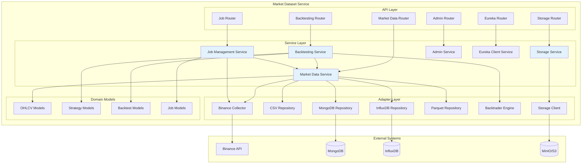

### 2. News Service Architecture

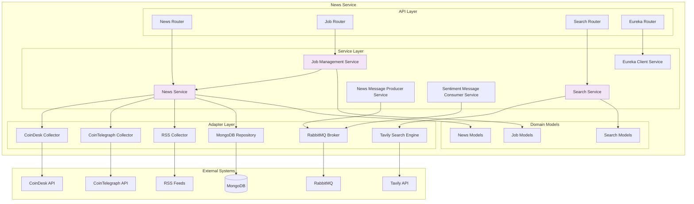

### 3. Sentiment Analysis Service Architecture

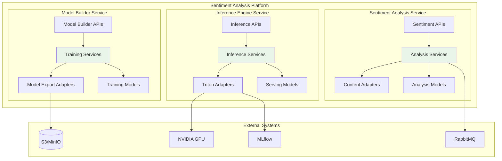

### 4. Prediction Service Architecture

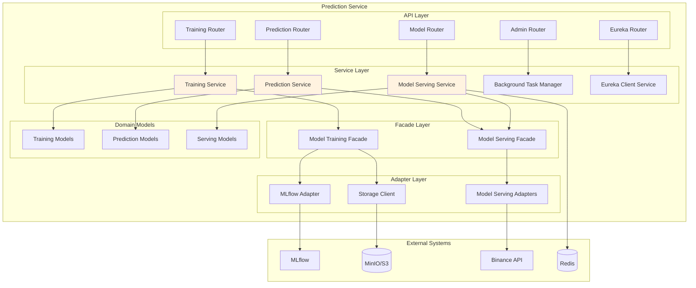

## Component Interactions

### Service-to-Service Communication

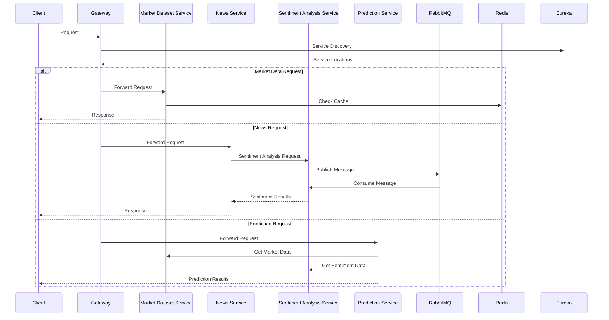

### Event-Driven Architecture

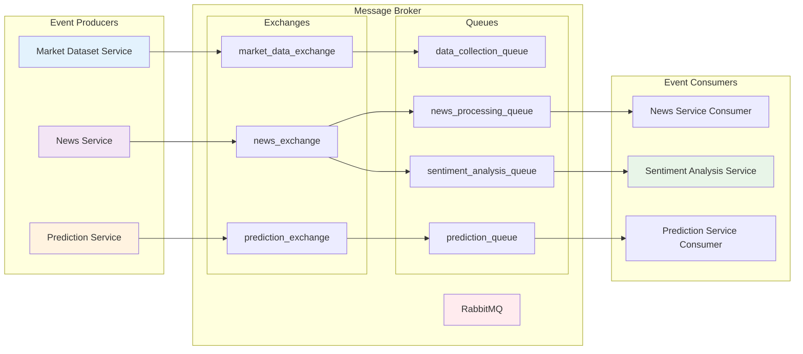

## Data Flow Diagrams

### 1. Market Data Collection Flow

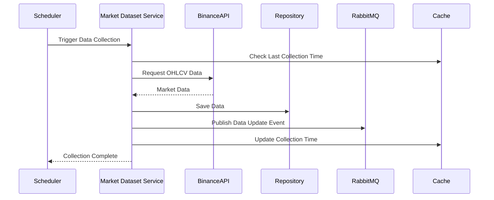

### 2. News Processing Flow

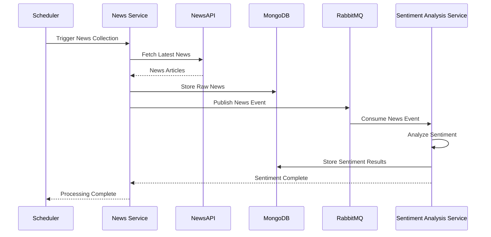

### 3. Prediction Workflow

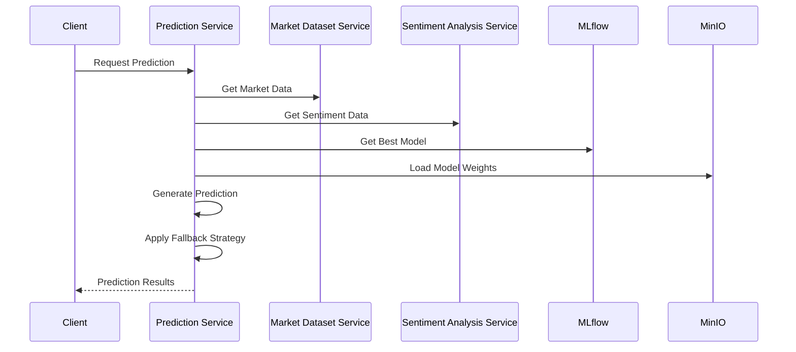

## Technology Stack

### Backend Technologies

| Component             | Technology | Version | Purpose                           |
| --------------------- | ---------- | ------- | --------------------------------- |
| **API Framework**     | FastAPI    | 0.115+  | REST API development              |
| **Async Runtime**     | asyncio    | 3.12+   | Asynchronous programming          |
| **Validation**        | Pydantic   | 2.0+    | Data validation and serialization |
| **Database ORM**      | Motor      | 3.3+    | Async MongoDB driver              |
| **Message Broker**    | RabbitMQ   | 4.1+    | Event-driven messaging            |
| **Caching**           | Redis      | 7.2+    | Distributed caching               |
| **Service Discovery** | Eureka     | 2.0+    | Microservices registration        |

### AI/ML Technologies

| Component               | Technology    | Version | Purpose                    |
| ----------------------- | ------------- | ------- | -------------------------- |
| **Deep Learning**       | PyTorch       | 2.0+    | Neural network framework   |
| **Transformer Models**  | Hugging Face  | 4.30+   | Pre-trained models         |
| **Model Serving**       | Triton Server | 2.40+   | Production inference       |
| **Experiment Tracking** | MLflow        | 2.8+    | Model lifecycle management |
| **Time Series**         | PatchTST      | Latest  | Time series forecasting    |
| **Sentiment Analysis**  | FinBERT       | Custom  | Financial text analysis    |

### Infrastructure Technologies

| Component            | Technology        | Version    | Purpose                 |
| -------------------- | ----------------- | ---------- | ----------------------- |
| **Containerization** | Docker            | 20.10+     | Application packaging   |
| **Orchestration**    | Kubernetes        | 1.24+      | Container orchestration |
| **Object Storage**   | MinIO/S3          | 8.5+       | Model and data storage  |
| **Databases**        | MongoDB, InfluxDB | 5.0+, 2.0+ | Data persistence        |
| **Monitoring**       | Prometheus        | 2.45+      | Metrics collection      |
| **Logging**          | Custom Logger     | -          | Structured logging      |

## Infrastructure Architecture

### Development Environment

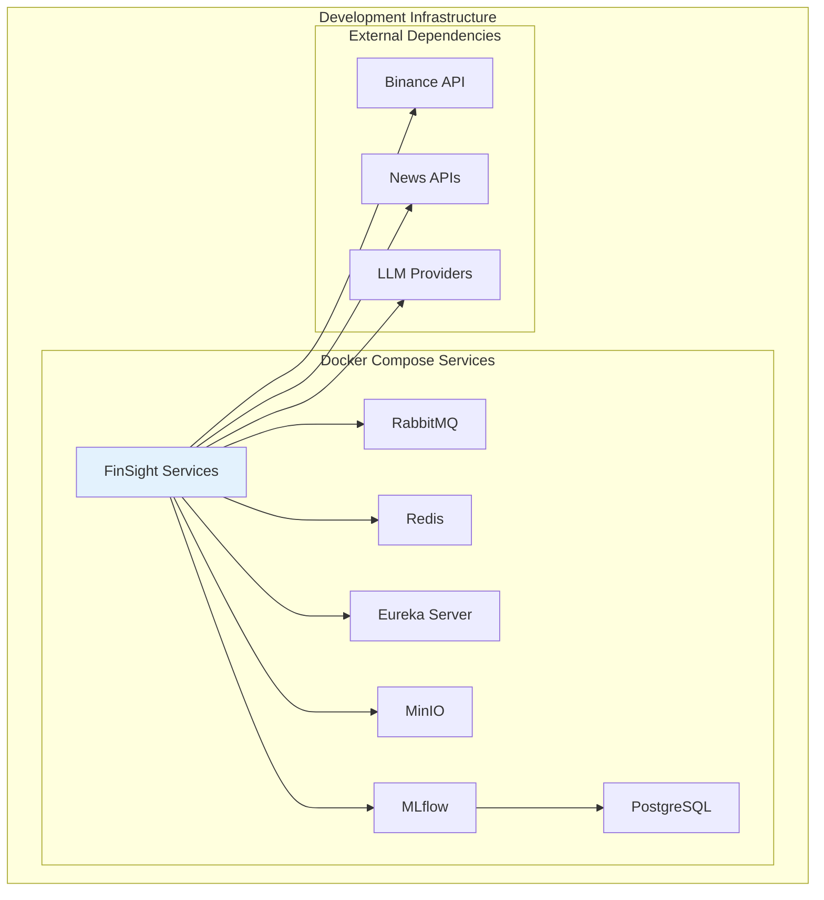

### Production Environment

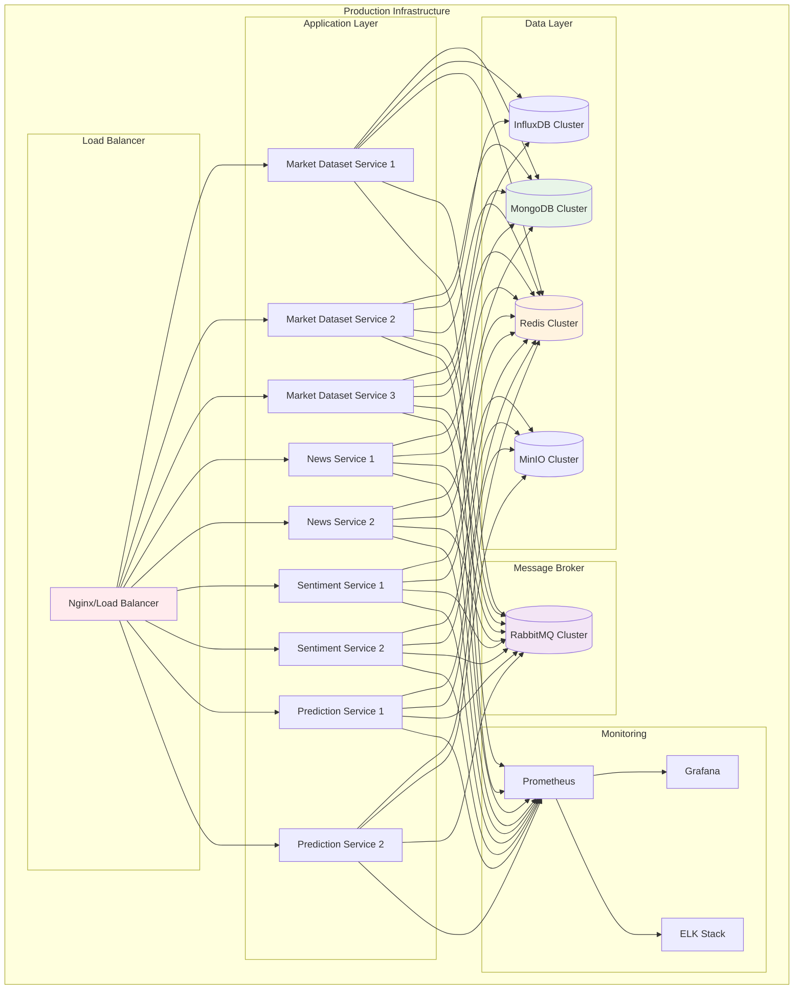

## Security Architecture

### Security Layers

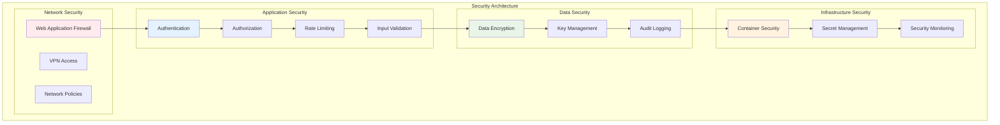

### Authentication & Authorization Flow

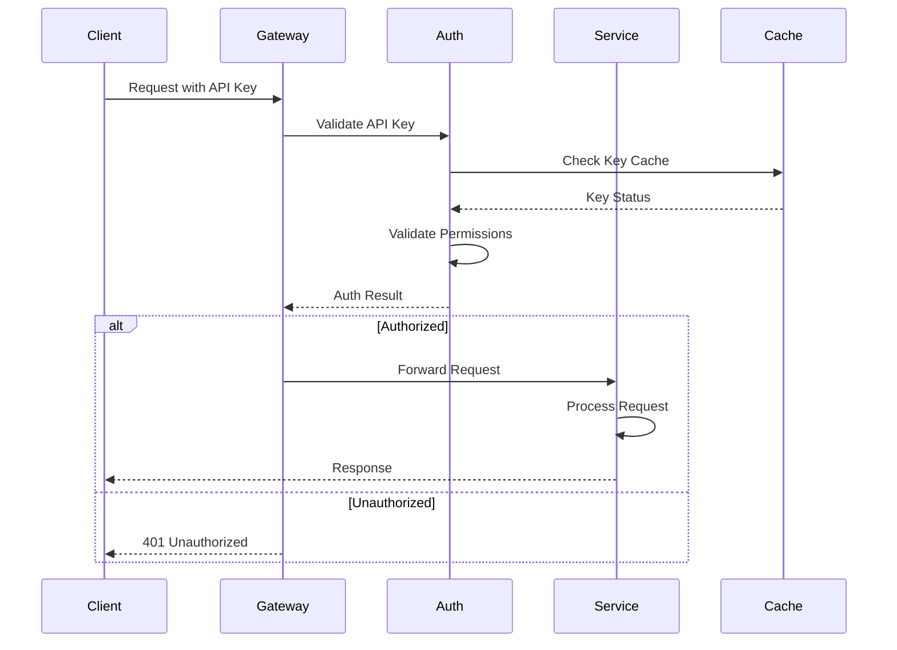

## Performance & Scalability

### Scalability Patterns

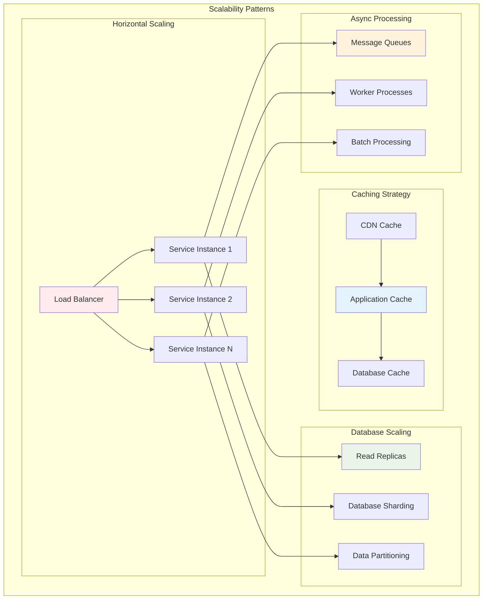

### Performance Optimization

| Component           | Optimization Strategy          | Implementation                      |
| ------------------- | ------------------------------ | ----------------------------------- |
| **API Layer**       | Connection pooling, async I/O  | FastAPI with uvicorn                |
| **Database**        | Query optimization, indexing   | MongoDB indexes, InfluxDB retention |
| **Caching**         | Multi-level caching            | Redis + application cache           |
| **Model Serving**   | GPU acceleration, batching     | Triton Server with dynamic batching |
| **Data Processing** | Parallel processing, streaming | asyncio + message queues            |

## Monitoring & Observability

### Monitoring Stack

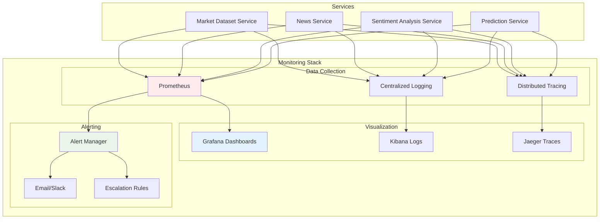

### Key Metrics

| Category           | Metrics                                 | Collection Method  |
| ------------------ | --------------------------------------- | ------------------ |
| **Application**    | Request rate, response time, error rate | Prometheus metrics |
| **Business**       | Data collection rate, model accuracy    | Custom metrics     |
| **Infrastructure** | CPU, memory, disk usage                 | Node exporter      |
| **Database**       | Query performance, connection count     | MongoDB exporter   |
| **Message Queue**  | Queue depth, throughput                 | RabbitMQ exporter  |

## Future Enhancements

### 1. API Gateway Implementation

**Current State**: Direct service access through load balancer

**Future Enhancement**: Dedicated API Gateway with advanced features

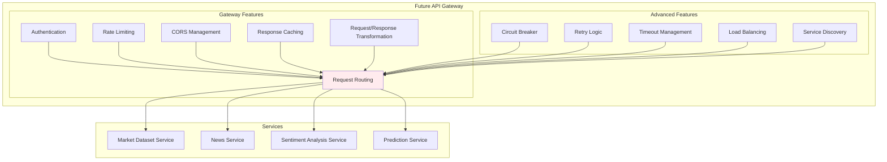

### 2. Real-Time Streaming

**Current State**: Batch processing with scheduled jobs

**Future Enhancement**: Real-time streaming with Apache Kafka

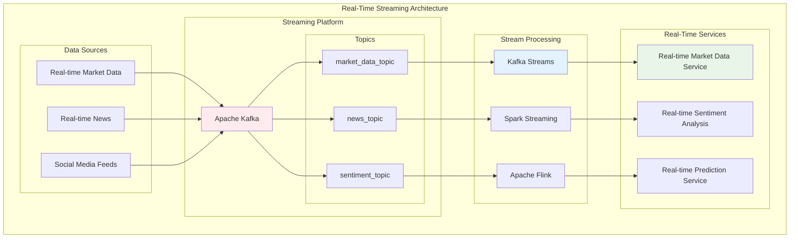

### 3. Advanced AI/ML Features

**Current State**: Basic model training and serving

**Future Enhancements**: Advanced ML features

```mermaid
graph TB
    subgraph "Advanced AI/ML Platform"
        subgraph "Model Development"
            AutoML[AutoML Pipeline]
            HyperOpt[Hyperparameter Optimization]
            FeatureStore[Feature Store]
            ModelRegistry[Model Registry]
        end

        subgraph "Advanced Serving"
            A_BTesting[A/B Testing]
            CanaryDeploy[Canary Deployment]
            BlueGreen[Blue-Green Deployment]
            ModelVersioning[Model Versioning]
        end

        subgraph "Advanced Analytics"
            Explainability[Model Explainability]
            BiasDetection[Bias Detection]
            DriftDetection[Data Drift Detection]
            PerformanceMonitoring[Performance Monitoring]
        end

        subgraph "MLOps Pipeline"
            CI_CD[ML CI/CD Pipeline]
            ExperimentTracking[Experiment Tracking]
            ModelGovernance[Model Governance]
            Compliance[Compliance & Audit]
        end
    end

    AutoML --> ModelRegistry
    HyperOpt --> ModelRegistry
    FeatureStore --> AutoML

    ModelRegistry --> A_BTesting
    ModelRegistry --> CanaryDeploy
    ModelRegistry --> BlueGreen

    A_BTesting --> Explainability
    CanaryDeploy --> BiasDetection
    BlueGreen --> DriftDetection

    Explainability --> CI_CD
    BiasDetection --> ExperimentTracking
    DriftDetection --> ModelGovernance

    CI_CD --> Compliance

    style AutoML fill:#ffebee
    style ModelRegistry fill:#e3f2fd
    style A_BTesting fill:#e8f5e8
    style CI_CD fill:#fff3e0
```

### 4. Multi-Asset Support

**Current State**: Cryptocurrency-only support

**Future Enhancement**: Multi-asset class support

```mermaid
graph TB
    subgraph "Multi-Asset Platform"
        subgraph "Asset Classes"
            Crypto[Cryptocurrencies]
            Stocks[Equities]
            Forex[Foreign Exchange]
            Commodities[Commodities]
            Bonds[Fixed Income]
        end

        subgraph "Data Sources"
            Binance[Binance API]
            AlphaVantage[Alpha Vantage]
            YahooFinance[Yahoo Finance]
            Bloomberg[Bloomberg API]
            Reuters[Reuters API]
        end

        subgraph "Asset-Specific Services"
            CryptoService[Crypto Service]
            StockService[Stock Service]
            ForexService[Forex Service]
            CommodityService[Commodity Service]
        end

        subgraph "Unified Platform"
            UnifiedAPI[Unified API]
            CrossAsset[Cross-Asset Analysis]
            PortfolioAnalytics[Portfolio Analytics]
            RiskManagement[Risk Management]
        end
    end

    Binance --> CryptoService
    AlphaVantage --> StockService
    YahooFinance --> StockService
    Bloomberg --> ForexService
    Reuters --> CommodityService

    Crypto --> CryptoService
    Stocks --> StockService
    Forex --> ForexService
    Commodities --> CommodityService

    CryptoService --> UnifiedAPI
    StockService --> UnifiedAPI
    ForexService --> UnifiedAPI
    CommodityService --> UnifiedAPI

    UnifiedAPI --> CrossAsset
    UnifiedAPI --> PortfolioAnalytics
    UnifiedAPI --> RiskManagement

    style UnifiedAPI fill:#ffebee
    style CrossAsset fill:#e3f2fd
    style PortfolioAnalytics fill:#e8f5e8
```

### 5. Cloud-Native Deployment

**Current State**: Docker Compose for development

**Future Enhancement**: Full cloud-native deployment

```mermaid
graph TB
    subgraph "Cloud-Native Architecture"
        subgraph "Container Orchestration"
            Kubernetes[Kubernetes Cluster]
            Istio[Istio Service Mesh]
            Helm[Helm Charts]
        end

        subgraph "Cloud Services"
            CloudLoadBalancer[Cloud Load Balancer]
            AutoScaler[Horizontal Pod Autoscaler]
            CloudStorage[Cloud Object Storage]
            ManagedDatabases[Managed Databases]
        end

        subgraph "DevOps Pipeline"
            GitOps[GitOps Workflow]
            CI_CD[CI/CD Pipeline]
            Monitoring[Cloud Monitoring]
            Security[Cloud Security]
        end

        subgraph "Multi-Region"
            Region1[Primary Region]
            Region2[Secondary Region]
            CDN[Content Delivery Network]
            GlobalLoadBalancer[Global Load Balancer]
        end
    end

    Kubernetes --> Istio
    Istio --> Helm

    Kubernetes --> AutoScaler
    AutoScaler --> CloudLoadBalancer

    Kubernetes --> CloudStorage
    Kubernetes --> ManagedDatabases

    Helm --> GitOps
    GitOps --> CI_CD
    CI_CD --> Monitoring
    Monitoring --> Security

    Region1 --> CDN
    Region2 --> CDN
    CDN --> GlobalLoadBalancer

    style Kubernetes fill:#ffebee
    style Istio fill:#e3f2fd
    style CI_CD fill:#e8f5e8
    style GlobalLoadBalancer fill:#fff3e0
```

---

_This architecture documentation provides a comprehensive overview of the FinSight platform's current state and future enhancement roadmap. For detailed implementation guides and service-specific documentation, refer to the individual service documentation._
