# FinSight Technical Architecture

## Table of Contents

1. [Architecture Overview](#architecture-overview)
2. [System Design Principles](#system-design-principles)
3. [Service Architecture](#service-architecture)
4. [Data Flow Architecture](#data-flow-architecture)
5. [Infrastructure Architecture](#infrastructure-architecture)
6. [Security Architecture](#security-architecture)
7. [AI/ML Architecture](#aiml-architecture)
8. [Deployment Architecture](#deployment-architecture)
9. [Performance & Scalability](#performance--scalability)
10. [Monitoring & Observability](#monitoring--observability)

## Architecture Overview

FinSight is built as a microservices-based platform with a focus on AI/ML capabilities, real-time data processing, and scalable financial analysis. The architecture follows hexagonal design principles with clear separation of concerns and robust error handling.

### High-Level Architecture

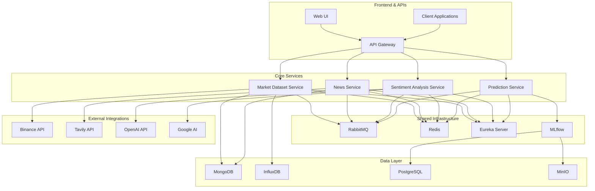

## System Design Principles

### 1. Hexagonal Architecture (Ports & Adapters)

Each service implements hexagonal architecture with clear boundaries:

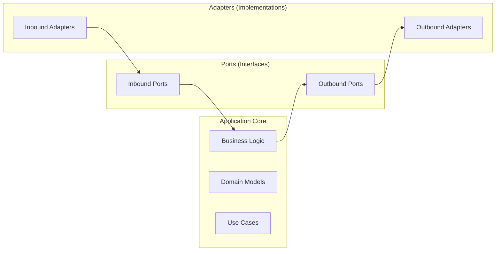

**Key Benefits:**

- **Testability**: Easy to mock dependencies
- **Flexibility**: Adapters can be swapped without changing business logic
- **Maintainability**: Clear separation of concerns
- **Scalability**: Individual components can be scaled independently

### 2. Event-Driven Architecture

Services communicate through events using RabbitMQ:

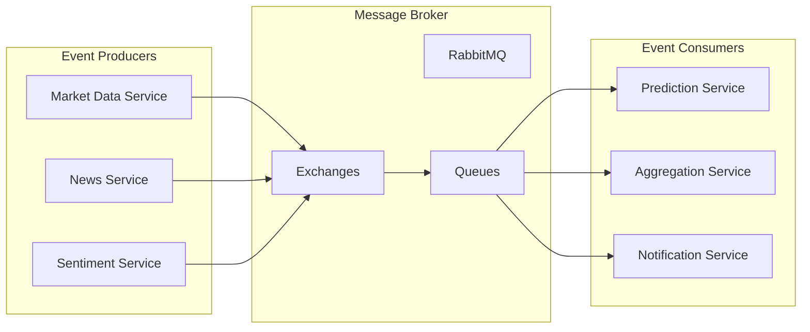

### 3. CQRS Pattern

Command Query Responsibility Segregation for data operations:

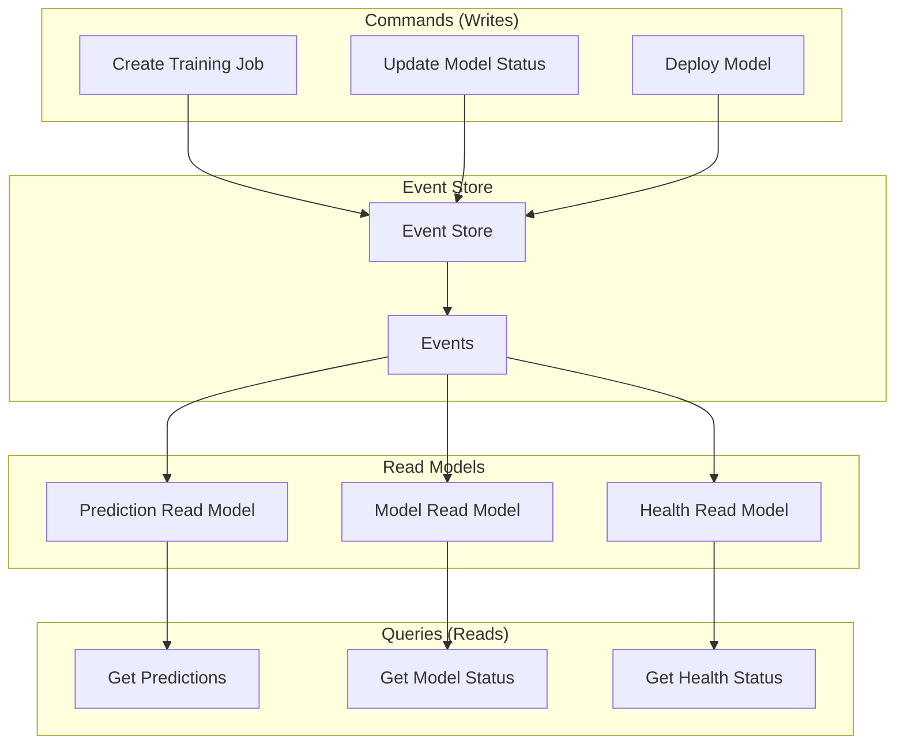

## Service Architecture

### Market Dataset Service

**Purpose**: Financial data collection, storage, and backtesting

**Architecture Components:**

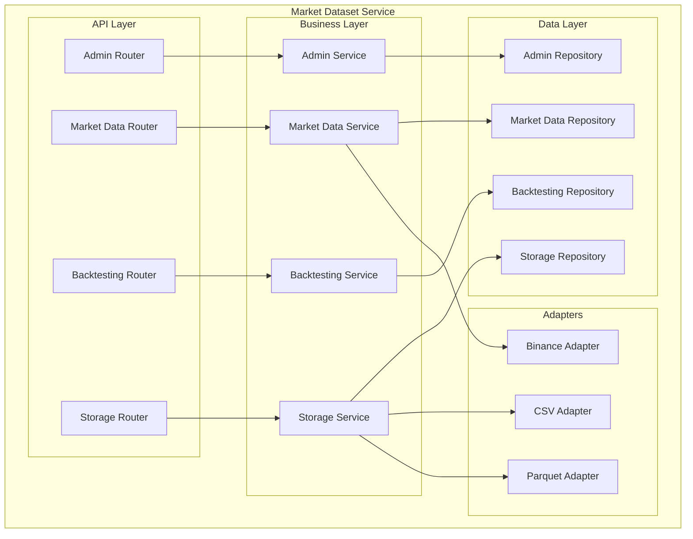

**Key Features:**

- Real-time data collection from Binance API
- Multiple storage backends (CSV, Parquet, MongoDB, InfluxDB)
- Advanced backtesting strategies
- Data validation and quality checks

### News Service

**Purpose**: News aggregation, processing, and search integration

**Architecture Components:**

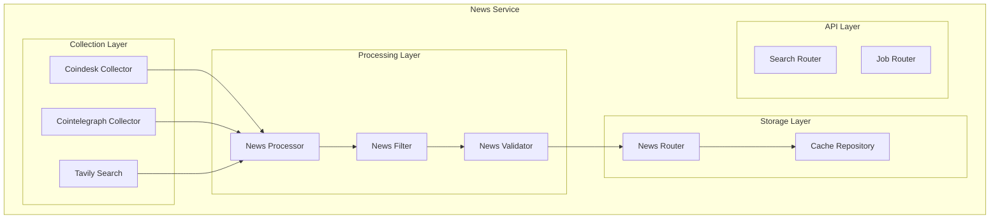

**Key Features:**

- Multi-source news collection
- Parallel processing with configurable workers
- Tavily search integration
- Caching and rate limiting

### Sentiment Analysis Service

**Purpose**: Financial sentiment analysis using AI models

**Architecture Components:**

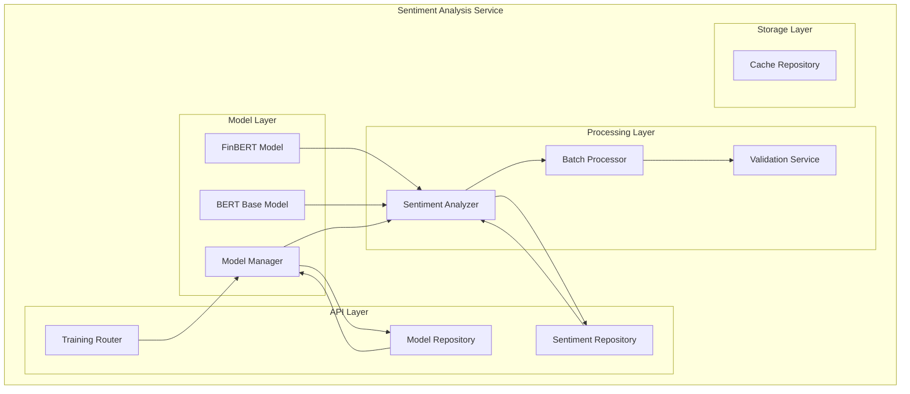

**Key Features:**

- Multiple AI models (FinBERT, BERT)
- Batch processing capabilities
- Model versioning and management
- GPU acceleration support

### Prediction Service

**Purpose**: AI-powered time series forecasting

**Architecture Components:**

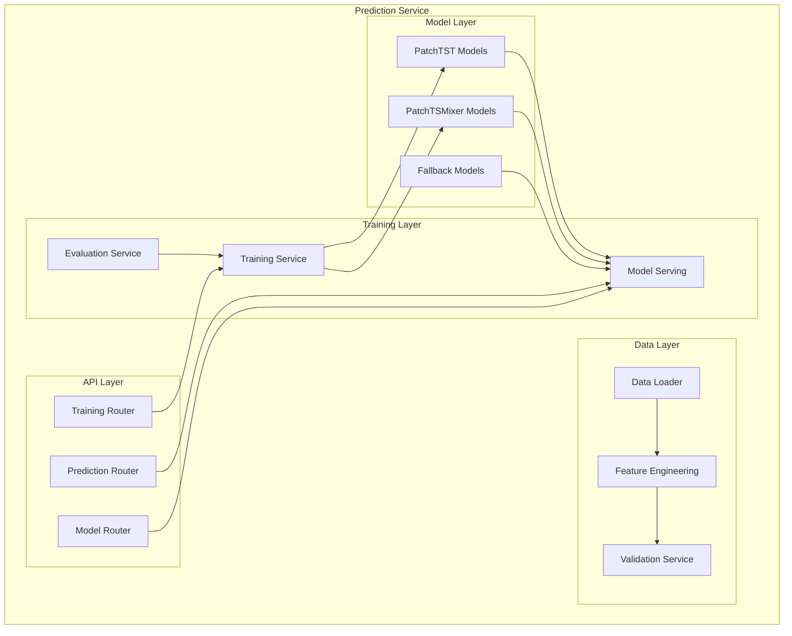

**Key Features:**

- Advanced AI models (PatchTST, PatchTSMixer)
- Intelligent fallback strategies
- MLflow integration
- Multiple serving backends

## Data Flow Architecture

### Real-Time Data Pipeline

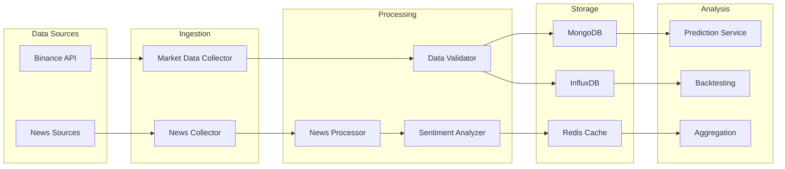

### Batch Processing Pipeline

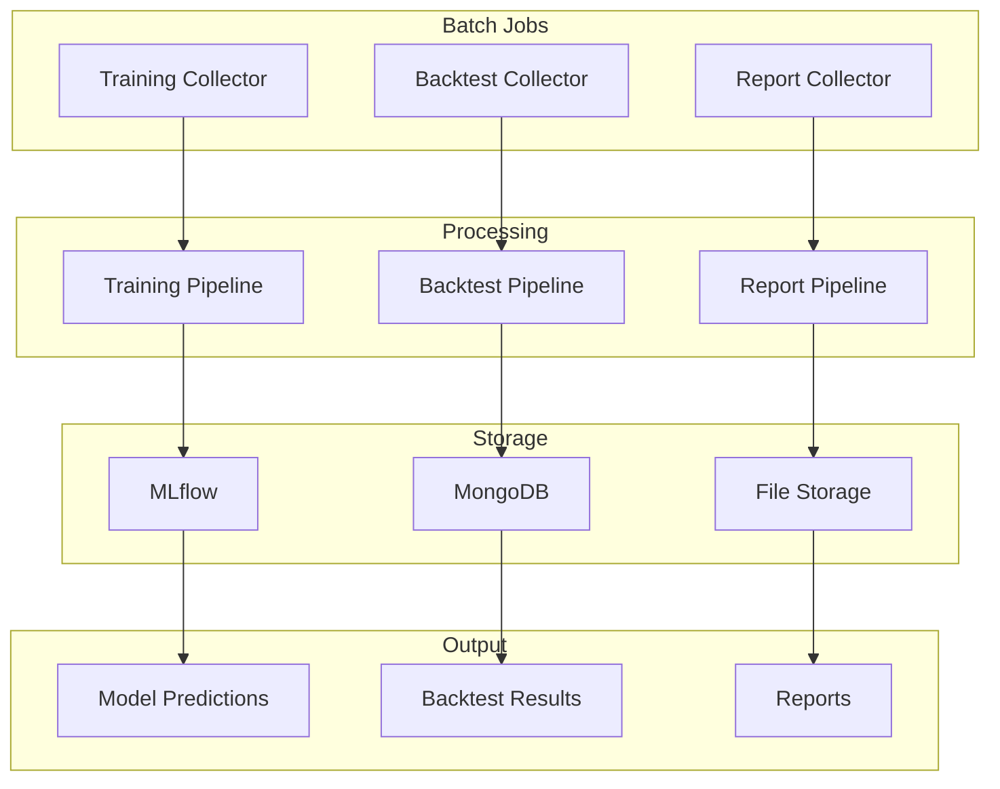

## Infrastructure Architecture

### Container Architecture

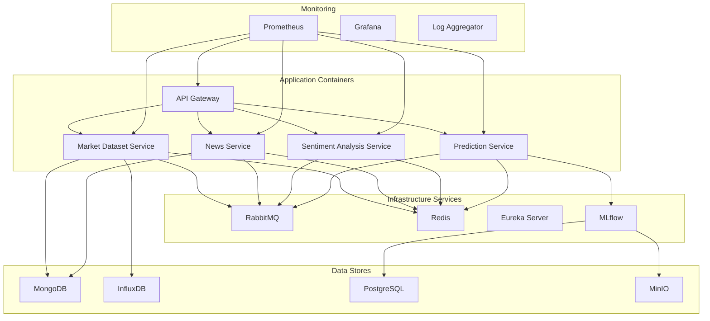

### Network Architecture

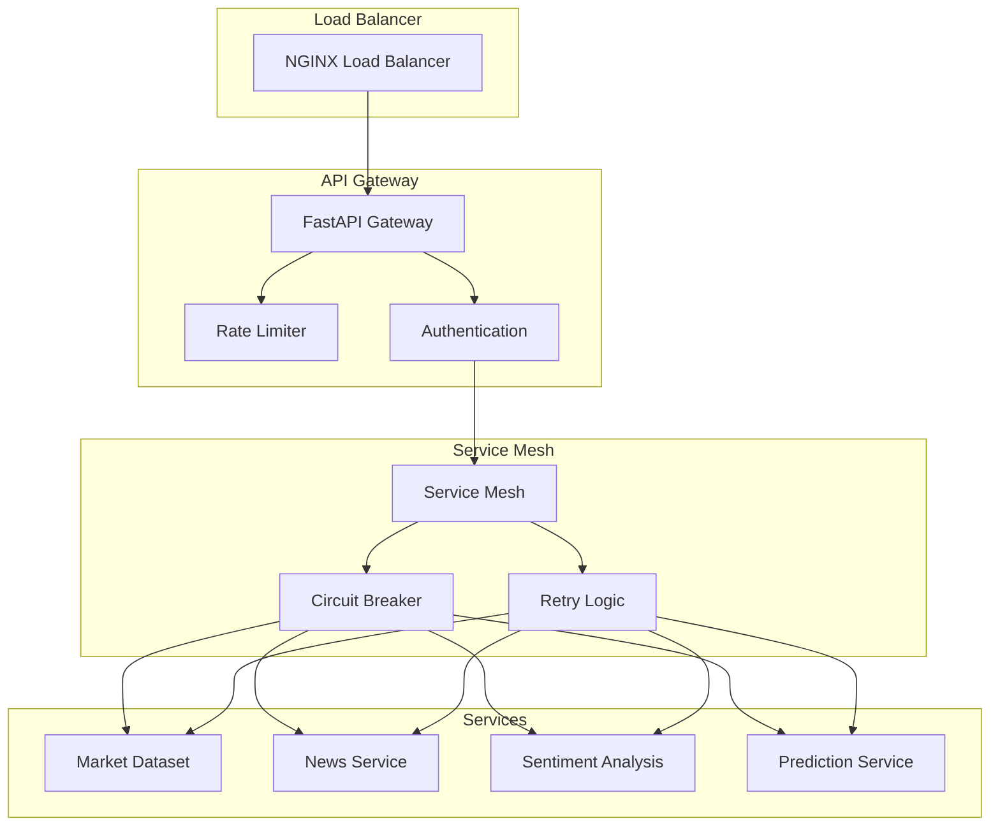

## Security Architecture

### Authentication & Authorization

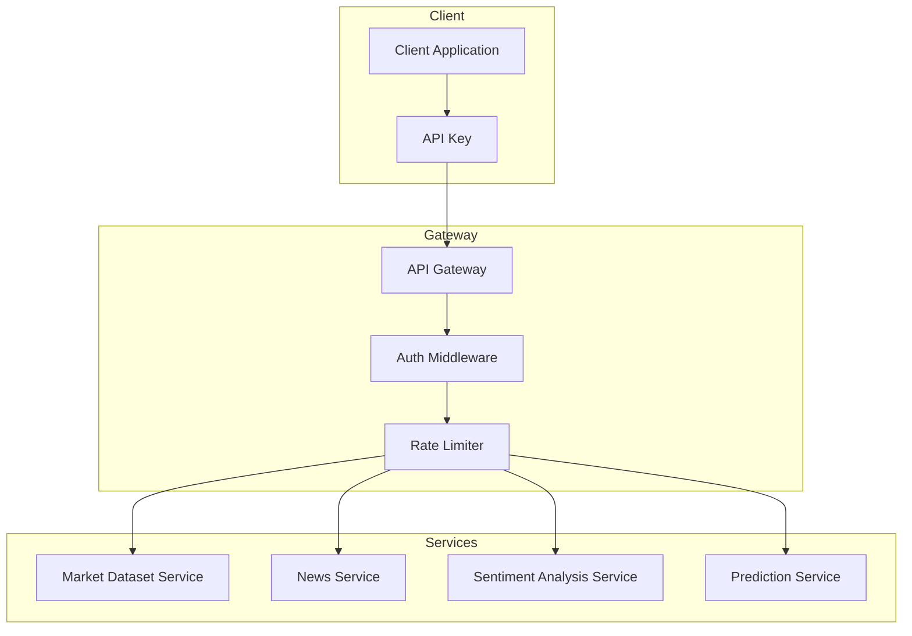

### Data Security

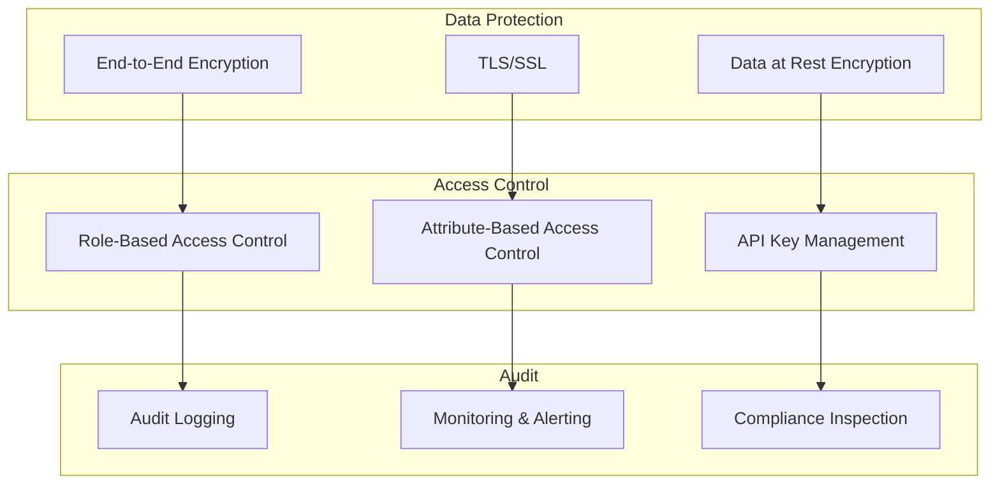

## AI/ML Architecture

### Model Training Pipeline

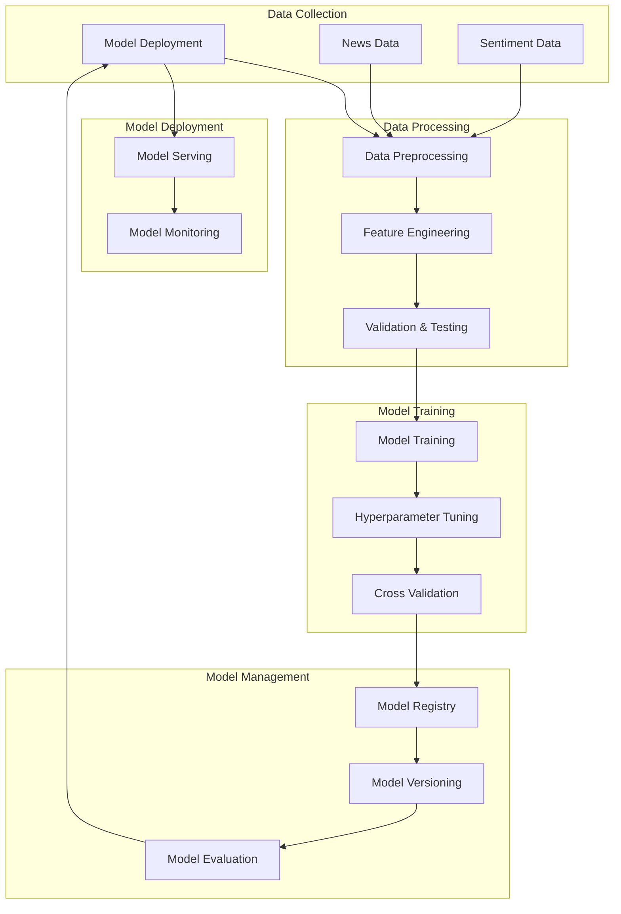

### Model Serving Architecture

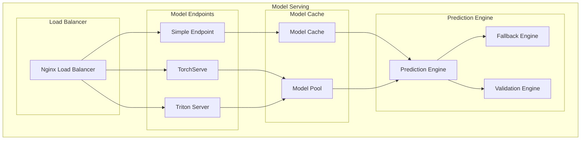

## Deployment Architecture

### Development Environment

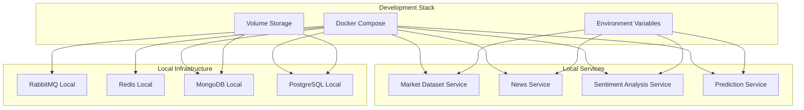

### Production Environment

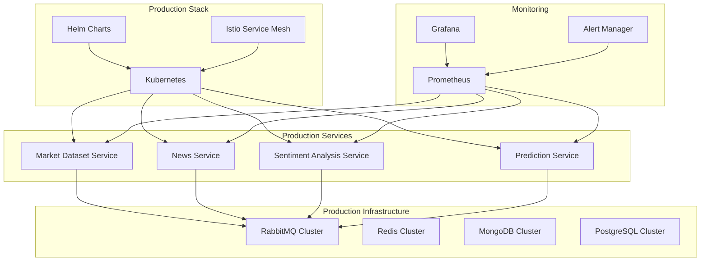

## Performance & Scalability

### Scaling Strategies

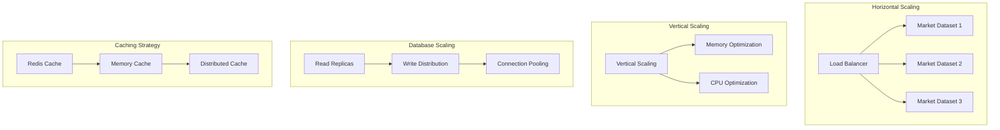

### Performance Optimization

**Optimization Areas:**

1. **Database Optimization**

   - Connection pooling
   - Query optimization
   - Indexing strategies
   - Read replicas

2. **Caching Strategy**

   - Redis for distributed caching
   - In-memory caching for frequently accessed data
   - Cache invalidation strategies

3. **Async Processing**

   - Event-driven architecture
   - Background job processing
   - Non-blocking I/O operations

4. **Load Balancing**
   - Round-robin load balancing
   - Health check integration
   - Circuit breaker patterns

## Monitoring & Observability

### Monitoring Stack

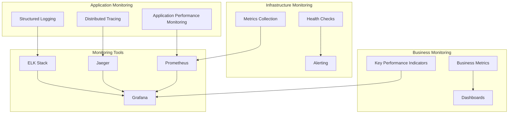

### Key Metrics

**Application Metrics:**

- Response time and throughput
- Error rates and availability
- Resource utilization (CPU, memory, disk)
- Database query performance

**Business Metrics:**

- Prediction accuracy
- Model performance
- Data quality metrics
- User engagement metrics

**Infrastructure Metrics:**

- Service health status
- Dependency health checks
- Resource allocation
- Cost optimization metrics

---

_This architecture documentation provides a comprehensive overview of the FinSight platform's technical implementation, design patterns, and system components._
