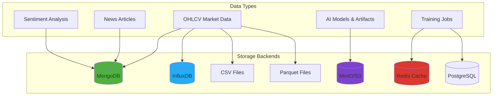
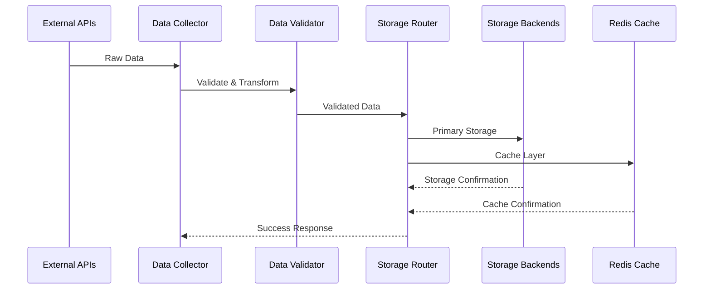
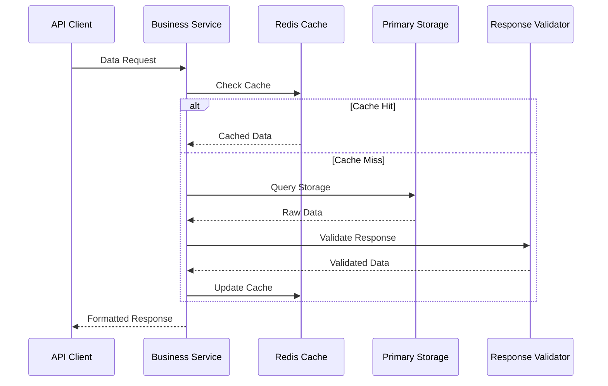

# 1. Database Design

## 📊 Overview

The FinSight platform implements a **multi-storage architecture** that supports various data types and access patterns. The system is designed with flexibility in mind, allowing services to choose the most appropriate storage backend for their specific requirements.

## 🏗️ Database Architecture

### Multi-Storage Strategy

The platform employs a **hybrid storage approach** that combines different database technologies based on data characteristics:



### Storage Backend Selection

| Data Type             | Primary Storage  | Secondary Storage | Rationale                                       |
| --------------------- | ---------------- | ----------------- | ----------------------------------------------- |
| **OHLCV Data**        | MongoDB/InfluxDB | CSV/Parquet       | Time-series optimization + document flexibility |
| **News Articles**     | MongoDB          | Redis (cache)     | Document storage + fast retrieval               |
| **Sentiment Results** | MongoDB          | MinIO             | Structured data + long-term storage             |
| **AI Models**         | MinIO/S3         | Local files       | Large binary files + versioning                 |
| **Training Jobs**     | Redis/PostgreSQL | File system       | Job state + MLflow integration                  |
| **Cache Data**        | Redis            | Memory            | Fast access + distributed caching               |

## 🗄️ Database Implementations

### 1. MongoDB - Document Storage

**Purpose**: Primary storage for structured data including news articles, sentiment analysis results, and OHLCV data.

**Implementation Details**:

```python
# Market Dataset Service - MongoDB Repository
class MongoDBMarketDataRepository(MarketDataRepository):
    def __init__(
        self,
        connection_string: str = "mongodb://localhost:27017/",
        database_name: str = "finsight_market_data",
        ohlcv_collection: str = "ohlcv",
    ):
        self.client = AsyncIOMotorClient(connection_string)
        self.db = self.client[database_name]
        self.ohlcv_collection = self.db[ohlcv_collection]
        self._setup_ohlcv_collection()

    async def save_ohlcv(
        self, exchange: str, symbol: str, timeframe: str, data: List[OHLCVSchema]
    ) -> bool:
        """Save OHLCV data to MongoDB with proper indexing."""
        try:
            # Convert schemas to MongoDB documents
            documents = [self._convert_schema_to_document(item) for item in data]

            # Bulk insert with ordered=False for better performance
            result = await self.ohlcv_collection.insert_many(documents, ordered=False)
            return len(result.inserted_ids) == len(documents)
        except Exception as e:
            logger.error(f"Failed to save OHLCV data: {e}")
            return False
```

**Key Features**:

- **Async Operations**: Uses Motor driver for non-blocking database operations
- **Automatic Indexing**: Creates compound indexes for optimal query performance
- **Bulk Operations**: Supports batch inserts and updates for high-throughput scenarios
- **Error Handling**: Comprehensive error handling with logging and fallback strategies

### 2. InfluxDB - Time-Series Data

**Purpose**: Optimized storage for high-frequency market data and time-series analytics.

**Implementation Details**:

```python
# Market Dataset Service - InfluxDB Repository
class InfluxMarketDataRepository(MarketDataRepository):
    def __init__(
        self,
        url: str = "http://localhost:8086",
        token: str = "",
        org: str = "finsight",
        bucket: str = "market_data",
    ):
        self.client = InfluxDBClient(url=url, token=token, org=org)
        self.write_api = self.client.write_api()
        self.query_api = self.client.query_api()
        self.bucket = bucket
        self.org = org

    async def save_ohlcv(
        self, exchange: str, symbol: str, timeframe: str, data: List[OHLCVSchema]
    ) -> bool:
        """Save OHLCV data to InfluxDB with proper tagging."""
        try:
            points = []
            for item in data:
                point = Point("ohlcv") \
                    .tag("exchange", exchange) \
                    .tag("symbol", symbol) \
                    .tag("timeframe", timeframe) \
                    .field("open", item.open) \
                    .field("high", item.high) \
                    .field("low", item.low) \
                    .field("close", item.close) \
                    .field("volume", item.volume) \
                    .time(item.timestamp)
                points.append(point)

            # Batch write for optimal performance
            self.write_api.write(bucket=self.bucket, record=points)
            return True
        except Exception as e:
            logger.error(f"Failed to save OHLCV data to InfluxDB: {e}")
            return False
```

**Key Features**:

- **Time-Series Optimization**: Built-in support for time-based queries and aggregations
- **Tagging Strategy**: Efficient filtering by exchange, symbol, and timeframe
- **Batch Operations**: Optimized for high-volume data ingestion
- **Retention Policies**: Automatic data lifecycle management

### 3. Redis - Caching & Job Management

**Purpose**: High-performance caching, session management, and job state persistence.

**Implementation Details**:

```python
# Common Module - Redis Cache Implementation
class RedisCache(CacheInterface):
    def __init__(self, redis_url: str = "redis://localhost:6379"):
        self.redis = redis.from_url(redis_url, decode_responses=True)
        self.default_ttl = 300  # 5 minutes default

    async def set(self, key: str, value: Any, ttl: Optional[int] = None) -> bool:
        """Set cache value with optional TTL."""
        try:
            serialized_value = json.dumps(value, default=str)
            ttl = ttl or self.default_ttl
            return self.redis.setex(key, ttl, serialized_value)
        except Exception as e:
            logger.error(f"Failed to set cache value: {e}")
            return False

    async def get(self, key: str) -> Optional[Any]:
        """Get cache value with automatic deserialization."""
        try:
            value = self.redis.get(key)
            if value is None:
                return None
            return json.loads(value)
        except Exception as e:
            logger.error(f"Failed to get cache value: {e}")
            return None
```

**Key Features**:

- **JSON Serialization**: Automatic serialization/deserialization of complex objects
- **TTL Management**: Configurable expiration times for different data types
- **Error Handling**: Graceful degradation when Redis is unavailable
- **Connection Pooling**: Efficient connection management for high-concurrency scenarios

### 4. MinIO/S3 - Object Storage

**Purpose**: Storage for large files, AI models, and long-term data archival.

**Implementation Details**:

```python
# Market Dataset Service - Storage Client
class StorageClient:
    def __init__(self, config: Dict[str, Any]):
        self.client = boto3.client(
            's3',
            endpoint_url=config.get('endpoint_url'),
            aws_access_key_id=config.get('access_key'),
            aws_secret_access_key=config.get('secret_key'),
            region_name=config.get('region_name'),
            config=Config(
                max_pool_connections=config.get('max_pool_connections', 50)
            )
        )
        self.bucket_name = config.get('bucket_name')

    async def upload_file(self, local_path: Path, object_key: str) -> bool:
        """Upload file to object storage with progress tracking."""
        try:
            with open(local_path, 'rb') as file:
                self.client.upload_fileobj(
                    file,
                    self.bucket_name,
                    object_key,
                    Config=TransferConfig(
                        multipart_threshold=1024 * 25,
                        max_concurrency=10,
                        multipart_chunksize=1024 * 25,
                        use_threads=True
                    )
                )
            return True
        except Exception as e:
            logger.error(f"Failed to upload file: {e}")
            return False
```

**Key Features**:

- **Multi-Provider Support**: Compatible with AWS S3, DigitalOcean Spaces, and MinIO
- **Multipart Uploads**: Efficient handling of large files
- **Connection Pooling**: Optimized for high-throughput scenarios
- **Progress Tracking**: Real-time upload progress monitoring

## 🔧 Database Optimization Strategies

### 1. Indexing Strategy

**MongoDB Indexes**:

```javascript
// Compound index for OHLCV queries
db.ohlcv.createIndex(
  {
    exchange: 1,
    symbol: 1,
    timeframe: 1,
    timestamp: -1,
  },
  { background: true }
);

// Text index for news search
db.news.createIndex(
  {
    title: "text",
    content: "text",
    summary: "text",
  },
  {
    background: true,
    weights: {
      title: 10,
      summary: 5,
      content: 1,
    },
  }
);

// TTL index for automatic cleanup
db.cache.createIndex({ expires_at: 1 }, { expireAfterSeconds: 0 });
```

**InfluxDB Optimization**:

```sql
-- Retention policy for different timeframes
CREATE RETENTION POLICY "ohlcv_1m" ON "market_data" DURATION 30d REPLICATION 1;
CREATE RETENTION POLICY "ohlcv_1h" ON "market_data" DURATION 90d REPLICATION 1;
CREATE RETENTION POLICY "ohlcv_1d" ON "market_data" DURATION 365d REPLICATION 1;

-- Continuous queries for data aggregation
CREATE CONTINUOUS QUERY "ohlcv_1h_agg" ON "market_data"
BEGIN
    SELECT mean(open) as open, max(high) as high, min(low) as low,
           last(close) as close, sum(volume) as volume
    FROM "ohlcv_1m"
    GROUP BY time(1h), exchange, symbol
END;
```

### 2. Connection Pooling

**MongoDB Connection Management**:

```python
class MongoDBMarketDataRepository(MarketDataRepository):
    def __init__(self, connection_string: str, database_name: str):
        # Configure connection pool
        self.client = AsyncIOMotorClient(
            connection_string,
            maxPoolSize=50,           # Maximum connections in pool
            minPoolSize=10,           # Minimum connections in pool
            maxIdleTimeMS=30000,      # Max idle time for connections
            waitQueueTimeoutMS=5000,  # Wait queue timeout
            serverSelectionTimeoutMS=5000,  # Server selection timeout
            connectTimeoutMS=10000,   # Connection timeout
            socketTimeoutMS=20000     # Socket timeout
        )
        self.db = self.client[database_name]
```

**Redis Connection Pooling**:

```python
class RedisCache(CacheInterface):
    def __init__(self, redis_url: str):
        # Configure connection pool
        self.redis = redis.from_url(
            redis_url,
            decode_responses=True,
            max_connections=20,        # Maximum connections in pool
            retry_on_timeout=True,     # Retry on timeout
            socket_connect_timeout=5,  # Connection timeout
            socket_timeout=10,         # Socket timeout
            health_check_interval=30   # Health check interval
        )
```

### 3. Query Optimization

**MongoDB Query Optimization**:

```python
async def get_ohlcv(self, query: OHLCVQuerySchema) -> List[OHLCVSchema]:
    """Optimized OHLCV data retrieval with projection and pagination."""
    try:
        # Build filter with proper indexing
        filter_dict = {
            "exchange": query.exchange,
            "symbol": query.symbol,
            "timeframe": query.timeframe
        }

        if query.start_date:
            filter_dict["timestamp"] = {"$gte": query.start_date}
        if query.end_date:
            filter_dict["timestamp"] = {"$lte": query.end_date}

        # Use projection to limit returned fields
        projection = {
            "_id": 0,
            "timestamp": 1,
            "open": 1,
            "high": 1,
            "low": 1,
            "close": 1,
            "volume": 1
        }

        # Execute query with proper sorting and limit
        cursor = self.ohlcv_collection.find(
            filter_dict,
            projection=projection
        ).sort("timestamp", -1)

        if query.limit:
            cursor = cursor.limit(query.limit)

        # Convert to schemas
        documents = await cursor.to_list(length=query.limit or 1000)
        return [self._convert_document_to_schema(doc) for doc in documents]

    except Exception as e:
        logger.error(f"Failed to retrieve OHLCV data: {e}")
        return []
```

**InfluxDB Query Optimization**:

```python
async def get_ohlcv(self, query: OHLCVQuerySchema) -> List[OHLCVSchema]:
    """Optimized InfluxDB query with proper time range and aggregation."""
    try:
        # Build Flux query with optimization
        flux_query = f'''
        from(bucket: "{self.bucket}")
            |> range(start: {query.start_date}, stop: {query.end_date})
            |> filter(fn: (r) => r["_measurement"] == "ohlcv")
            |> filter(fn: (r) => r["exchange"] == "{query.exchange}")
            |> filter(fn: (r) => r["symbol"] == "{query.symbol}")
            |> filter(fn: (r) => r["timeframe"] == "{query.timeframe}")
            |> pivot(rowKey:["_time"], columnKey: ["_field"], valueColumn: "_value")
            |> sort(columns: ["_time"], desc: true)
        '''

        if query.limit:
            flux_query += f'|> limit(n: {query.limit})'

        # Execute query
        result = self.query_api.query(flux_query)

        # Convert to schemas
        schemas = []
        for table in result:
            for record in table.records:
                schema = OHLCVSchema(
                    timestamp=record.get_time(),
                    open=record.get_value("open"),
                    high=record.get_value("high"),
                    low=record.get_value("low"),
                    close=record.get_value("close"),
                    volume=record.get_value("volume"),
                    symbol=query.symbol,
                    exchange=query.exchange,
                    timeframe=query.timeframe
                )
                schemas.append(schema)

        return schemas

    except Exception as e:
        logger.error(f"Failed to retrieve OHLCV data from InfluxDB: {e}")
        return []
```

## 📊 Data Flow Architecture

### 1. Data Ingestion Pipeline



### 2. Data Retrieval Pipeline



## 🔒 Data Security & Compliance

### 1. Data Encryption

- **At Rest**: Database-level encryption for sensitive data
- **In Transit**: TLS/SSL encryption for all database connections
- **API Keys**: Secure storage in environment variables and secrets management

### 2. Access Control

- **Database Users**: Role-based access control with minimal privileges
- **API Authentication**: API key-based authentication for all data access
- **Rate Limiting**: Comprehensive rate limiting to prevent abuse

### 3. Data Validation

- **Input Validation**: Pydantic schema validation for all data inputs
- **Output Sanitization**: Automatic sanitization of sensitive information
- **Audit Logging**: Comprehensive logging of all data access and modifications

## 📈 Performance Monitoring

### 1. Database Metrics

- **Query Performance**: Response time monitoring for all database operations
- **Connection Pooling**: Connection utilization and pool health metrics
- **Storage Utilization**: Disk space and memory usage monitoring

### 2. Caching Metrics

- **Cache Hit Rate**: Monitoring of cache effectiveness
- **Memory Usage**: Redis memory utilization and eviction metrics
- **Response Times**: Cache operation latency monitoring

### 3. Health Checks

```python
async def check_database_health(self) -> Dict[str, Any]:
    """Comprehensive database health check."""
    health_status = {
        "mongodb": "unknown",
        "influxdb": "unknown",
        "redis": "unknown",
        "overall": "unknown"
    }

    try:
        # Check MongoDB
        await self.mongodb_client.admin.command('ping')
        health_status["mongodb"] = "healthy"
    except Exception as e:
        health_status["mongodb"] = f"unhealthy: {str(e)}"

    try:
        # Check InfluxDB
        self.influxdb_client.ping()
        health_status["influxdb"] = "healthy"
    except Exception as e:
        health_status["influxdb"] = f"unhealthy: {str(e)}"

    try:
        # Check Redis
        self.redis_client.ping()
        health_status["redis"] = "healthy"
    except Exception as e:
        health_status["redis"] = f"unhealthy: {str(e)}"

    # Determine overall health
    if all(status == "healthy" for status in health_status.values() if status != "overall"):
        health_status["overall"] = "healthy"
    else:
        health_status["overall"] = "degraded"

    return health_status
```

## 🚀 Future Enhancements

### 1. Database Scaling

- **Read Replicas**: Implementation of MongoDB read replicas for improved query performance
- **Sharding**: Horizontal partitioning for large datasets
- **Multi-Region**: Geographic distribution for improved latency

### 2. Advanced Caching

- **Distributed Caching**: Redis Cluster for high availability
- **Cache Warming**: Proactive cache population for frequently accessed data
- **Intelligent Eviction**: ML-based cache eviction strategies

### 3. Data Analytics

- **Real-time Analytics**: Stream processing for live data analysis
- **Data Warehousing**: Integration with analytical databases for complex queries
- **Machine Learning**: Automated data quality assessment and optimization

---

_This database design demonstrates a sophisticated, production-ready approach to data management, combining multiple storage technologies to optimize for different use cases while maintaining consistency and reliability._
