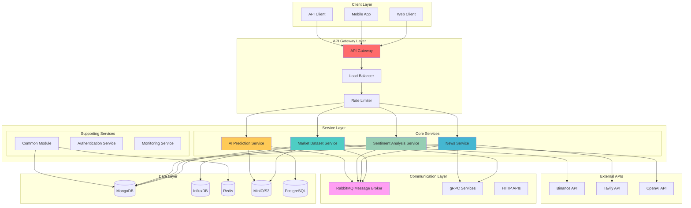

# 2. System Architecture

## 🏗️ Overview

The FinSight platform implements a **microservices architecture** that provides scalability, maintainability, and fault tolerance. The system is designed with clear separation of concerns, allowing each service to operate independently while maintaining cohesive functionality through well-defined interfaces and communication patterns.

## 🎯 Architecture Principles

### 1. **Microservices Design**

- **Single Responsibility**: Each service focuses on a specific business domain
- **Independent Deployment**: Services can be deployed, scaled, and updated independently
- **Technology Diversity**: Services can use different technologies based on requirements
- **Fault Isolation**: Failures in one service don't cascade to others

### 2. **Hexagonal Architecture (Ports & Adapters)**

- **Core Business Logic**: Isolated from external dependencies
- **Port Interfaces**: Define contracts for external interactions
- **Adapter Implementations**: Handle specific technology integrations
- **Dependency Inversion**: High-level modules don't depend on low-level modules

### 3. **Event-Driven Communication**

- **Asynchronous Processing**: Non-blocking communication between services
- **Loose Coupling**: Services communicate through events without direct dependencies
- **Scalability**: Easy to add new services that react to existing events
- **Fault Tolerance**: Failed events can be retried or processed later

## 🏛️ System Architecture Overview



## 🔧 Core Components

### 1. **API Gateway & Load Balancing**

**Purpose**: Centralized entry point for all client requests with load distribution and rate limiting.

**Implementation Details**:

```python
# FastAPI-based API Gateway with rate limiting
from fastapi import FastAPI, Depends, HTTPException
from slowapi import Limiter, _rate_limit_exceeded_handler
from slowapi.util import get_remote_address
from slowapi.errors import RateLimitExceeded

app = FastAPI(title="FinSight API Gateway", version="1.0.0")

# Rate limiting configuration
limiter = Limiter(key_func=get_remote_address)
app.state.limiter = limiter
app.add_exception_handler(RateLimitExceeded, _rate_limit_exceeded_handler)

# Service routing with health checks
@app.get("/health")
async def health_check():
    """Comprehensive health check for all services."""
    services = {
        "market_data": await check_service_health("market_data"),
        "news": await check_service_health("news"),
        "sentiment": await check_service_health("sentiment"),
        "prediction": await check_service_health("prediction")
    }

    overall_health = all(status == "healthy" for status in services.values())
    return {
        "status": "healthy" if overall_health else "degraded",
        "services": services,
        "timestamp": datetime.utcnow().isoformat()
    }

@app.middleware("http")
async def add_correlation_id(request: Request, call_next):
    """Add correlation ID for request tracing."""
    correlation_id = str(uuid.uuid4())
    request.state.correlation_id = correlation_id

    response = await call_next(request)
    response.headers["X-Correlation-ID"] = correlation_id
    return response
```

**Key Features**:

- **Rate Limiting**: Per-client rate limiting with configurable thresholds
- **Health Monitoring**: Real-time health checks for all downstream services
- **Request Tracing**: Correlation IDs for distributed request tracking
- **Load Distribution**: Intelligent routing based on service health and load

### 2. **Service Discovery & Communication**

**Purpose**: Enable services to find and communicate with each other dynamically.

**Implementation Details**:

```python
# Eureka Client Service for service discovery
class EurekaClientService:
    def __init__(self, eureka_server_url: str, app_name: str, instance_id: str):
        self.eureka_server_url = eureka_server_url
        self.app_name = app_name
        self.instance_id = instance_id
        self.heartbeat_interval = 30  # seconds
        self.heartbeat_task = None

    async def register_service(self):
        """Register service with Eureka server."""
        try:
            registration_data = {
                "instance": {
                    "instanceId": self.instance_id,
                    "hostName": socket.gethostname(),
                    "app": self.app_name,
                    "ipAddr": self._get_local_ip(),
                    "status": "UP",
                    "overriddenstatus": "UNKNOWN",
                    "port": {"$": 8000, "@enabled": "true"},
                    "securePort": {"$": 8443, "@enabled": "false"},
                    "countryId": 1,
                    "dataCenterInfo": {
                        "@class": "com.netflix.appinfo.InstanceInfo$DefaultDataCenterInfo",
                        "name": "MyOwn"
                    },
                    "leaseInfo": {
                        "renewalIntervalInSecs": self.heartbeat_interval,
                        "durationInSecs": 90,
                        "registrationTimestamp": 0,
                        "lastRenewalTimestamp": 0,
                        "evictionTimestamp": 0,
                        "serviceUpTimestamp": 0
                    },
                    "metadata": {
                        "@class": "java.util.Collections$EmptyMap"
                    }
                }
            }

            async with aiohttp.ClientSession() as session:
                async with session.post(
                    f"{self.eureka_server_url}/eureka/apps/{self.app_name}",
                    json=registration_data
                ) as response:
                    if response.status == 204:
                        logger.info(f"Successfully registered {self.app_name}")
                        await self._start_heartbeat()
                        return True
                    else:
                        logger.error(f"Failed to register service: {response.status}")
                        return False

        except Exception as e:
            logger.error(f"Service registration failed: {e}")
            return False

    async def _start_heartbeat(self):
        """Start heartbeat to keep service registered."""
        self.heartbeat_task = asyncio.create_task(self._heartbeat_loop())

    async def _heartbeat_loop(self):
        """Continuous heartbeat loop."""
        while True:
            try:
                await asyncio.sleep(self.heartbeat_interval)
                await self._send_heartbeat()
            except Exception as e:
                logger.error(f"Heartbeat failed: {e}")
                break
```

**Key Features**:

- **Automatic Registration**: Services automatically register with discovery server
- **Health Monitoring**: Continuous health checks and status updates
- **Load Balancing**: Client-side load balancing based on service instances
- **Fault Tolerance**: Automatic failover to healthy service instances

### 3. **Message Broker (RabbitMQ)**

**Purpose**: Enable asynchronous communication between services with guaranteed message delivery.

**Implementation Details**:

```python
# RabbitMQ Message Broker Implementation
class RabbitMQBroker:
    def __init__(self, connection_string: str):
        self.connection_string = connection_string
        self.connection = None
        self.channel = None
        self.exchange_name = "finsight.events"
        self.dead_letter_exchange = "finsight.dlx"
        self.dead_letter_queue = "finsight.dlq"

    async def connect(self):
        """Establish connection to RabbitMQ."""
        try:
            self.connection = await aio_pika.connect_robust(self.connection_string)
            self.channel = await self.connection.channel()

            # Declare exchanges
            await self.channel.declare_exchange(
                self.exchange_name,
                aio_pika.ExchangeType.TOPIC,
                durable=True
            )

            await self.channel.declare_exchange(
                self.dead_letter_exchange,
                aio_pika.ExchangeType.DIRECT,
                durable=True
            )

            # Declare dead letter queue
            await self.channel.declare_queue(
                self.dead_letter_queue,
                durable=True
            )

            await self.channel.queue_bind(
                self.dead_letter_queue,
                self.dead_letter_exchange,
                routing_key="dead.letter"
            )

            logger.info("Successfully connected to RabbitMQ")
            return True

        except Exception as e:
            logger.error(f"Failed to connect to RabbitMQ: {e}")
            return False

    async def publish_event(self, event_type: str, payload: Dict[str, Any], routing_key: str):
        """Publish event to message broker."""
        try:
            if not self.connection or self.connection.is_closed:
                await self.connect()

            message = aio_pika.Message(
                body=json.dumps(payload).encode(),
                delivery_mode=aio_pika.DeliveryMode.PERSISTENT,
                headers={
                    "event_type": event_type,
                    "timestamp": datetime.utcnow().isoformat(),
                    "correlation_id": str(uuid.uuid4())
                }
            )

            await self.channel.default_exchange.publish(
                message,
                routing_key=routing_key
            )

            logger.info(f"Published event {event_type} with routing key {routing_key}")
            return True

        except Exception as e:
            logger.error(f"Failed to publish event: {e}")
            return False

    async def consume_events(self, queue_name: str, callback: Callable):
        """Consume events from specified queue."""
        try:
            # Declare queue with dead letter configuration
            queue = await self.channel.declare_queue(
                queue_name,
                durable=True,
                arguments={
                    "x-dead-letter-exchange": self.dead_letter_exchange,
                    "x-dead-letter-routing-key": "dead.letter",
                    "x-message-ttl": 300000  # 5 minutes TTL
                }
            )

            # Bind queue to exchange
            await queue.bind(self.exchange_name, routing_key=f"*.{queue_name}")

            async def process_message(message):
                async with message.process():
                    try:
                        payload = json.loads(message.body.decode())
                        await callback(payload)
                        logger.info(f"Successfully processed message from {queue_name}")
                    except Exception as e:
                        logger.error(f"Failed to process message: {e}")
                        # Message will be rejected and sent to dead letter queue
                        await message.reject(requeue=False)

            # Start consuming
            await queue.consume(process_message)
            logger.info(f"Started consuming events from {queue_name}")

        except Exception as e:
            logger.error(f"Failed to setup event consumption: {e}")
```

**Key Features**:

- **Guaranteed Delivery**: Persistent messages with acknowledgment
- **Dead Letter Queue**: Failed messages are routed to DLQ for analysis
- **Topic Routing**: Flexible message routing based on routing keys
- **Message TTL**: Automatic message expiration for time-sensitive data

### 4. **gRPC Services**

**Purpose**: High-performance, type-safe communication between services.

**Implementation Details**:

```protobuf
// news_service.proto
syntax = "proto3";

package finsight.news;

service NewsService {
    rpc CollectNews(NewsCollectionRequest) returns (NewsCollectionResponse);
    rpc GetNews(NewsQueryRequest) returns (NewsQueryResponse);
    rpc SearchNews(NewsSearchRequest) returns (NewsSearchResponse);
}

message NewsCollectionRequest {
    string source = 1;
    repeated string keywords = 2;
    int32 max_articles = 3;
    string time_range = 4;
}

message NewsCollectionResponse {
    bool success = 1;
    string message = 2;
    int32 articles_collected = 3;
    string job_id = 4;
}

message NewsQueryRequest {
    string source = 1;
    string start_date = 2;
    string end_date = 3;
    int32 limit = 4;
    int32 offset = 5;
}

message NewsQueryResponse {
    repeated NewsArticle articles = 1;
    int32 total_count = 2;
    bool has_more = 3;
}

message NewsArticle {
    string id = 1;
    string title = 2;
    string content = 3;
    string summary = 4;
    string source = 5;
    string published_at = 6;
    string url = 7;
    repeated string tags = 8;
}

message NewsSearchRequest {
    string query = 1;
    string source = 2;
    string start_date = 3;
    string end_date = 4;
    int32 limit = 5;
}

message NewsSearchResponse {
    repeated NewsArticle articles = 1;
    int32 total_count = 2;
    float search_time_ms = 3;
}
```

**gRPC Server Implementation**:

```python
# gRPC Server Implementation
class NewsGRPCService(news_service_pb2_grpc.NewsServiceServicer):
    def __init__(self, news_service: NewsService):
        self.news_service = news_service

    async def CollectNews(
        self,
        request: news_service_pb2.NewsCollectionRequest,
        context: grpc.aio.ServicerContext
    ) -> news_service_pb2.NewsCollectionResponse:
        """Collect news articles from specified sources."""
        try:
            # Convert gRPC request to internal format
            collection_request = NewsCollectionRequest(
                source=request.source,
                keywords=list(request.keywords),
                max_articles=request.max_articles,
                time_range=request.time_range
            )

            # Execute news collection
            result = await self.news_service.collect_news(collection_request)

            # Convert response to gRPC format
            return news_service_pb2.NewsCollectionResponse(
                success=result.success,
                message=result.message,
                articles_collected=result.articles_collected,
                job_id=result.job_id
            )

        except Exception as e:
            logger.error(f"gRPC CollectNews failed: {e}")
            context.set_code(grpc.StatusCode.INTERNAL)
            context.set_details(f"Internal error: {str(e)}")
            return news_service_pb2.NewsCollectionResponse(
                success=False,
                message=f"Error: {str(e)}",
                articles_collected=0,
                job_id=""
            )

    async def GetNews(
        self,
        request: news_service_pb2.NewsQueryRequest,
        context: grpc.aio.ServicerContext
    ) -> news_service_pb2.NewsQueryResponse:
        """Retrieve news articles based on query parameters."""
        try:
            # Convert gRPC request to internal format
            query_request = NewsQueryRequest(
                source=request.source,
                start_date=request.start_date,
                end_date=request.end_date,
                limit=request.limit,
                offset=request.offset
            )

            # Execute news query
            result = await self.news_service.get_news(query_request)

            # Convert articles to gRPC format
            articles = []
            for article in result.articles:
                grpc_article = news_service_pb2.NewsArticle(
                    id=article.id,
                    title=article.title,
                    content=article.content,
                    summary=article.summary,
                    source=article.source,
                    published_at=article.published_at.isoformat(),
                    url=article.url,
                    tags=article.tags
                )
                articles.append(grpc_article)

            return news_service_pb2.NewsQueryResponse(
                articles=articles,
                total_count=result.total_count,
                has_more=result.has_more
            )

        except Exception as e:
            logger.error(f"gRPC GetNews failed: {e}")
            context.set_code(grpc.StatusCode.INTERNAL)
            context.set_details(f"Internal error: {str(e)}")
            return news_service_pb2.NewsQueryResponse(
                articles=[],
                total_count=0,
                has_more=False
            )
```

**Key Features**:

- **Type Safety**: Protocol buffer definitions ensure data consistency
- **High Performance**: Binary protocol with HTTP/2 for efficient communication
- **Bidirectional Streaming**: Support for real-time data streaming
- **Code Generation**: Automatic client and server code generation

## 🔄 Service Communication Patterns

### 1. **Synchronous Communication (HTTP/gRPC)**

**Use Cases**:

- **Request-Response**: Direct service-to-service calls for immediate responses
- **Data Retrieval**: Fetching data that requires immediate processing
- **Service Discovery**: Health checks and status inquiries

**Implementation**:

```python
# HTTP Client for synchronous communication
class HTTPClient:
    def __init__(self, base_url: str, timeout: int = 30):
        self.base_url = base_url
        self.timeout = timeout
        self.session = None

    async def get(self, endpoint: str, params: Dict[str, Any] = None) -> Dict[str, Any]:
        """Make GET request to service."""
        try:
            if not self.session:
                self.session = aiohttp.ClientSession(
                    timeout=aiohttp.ClientTimeout(total=self.timeout)
                )

            url = f"{self.base_url}{endpoint}"
            async with self.session.get(url, params=params) as response:
                if response.status == 200:
                    return await response.json()
                else:
                    logger.error(f"HTTP GET failed: {response.status}")
                    return None

        except Exception as e:
            logger.error(f"HTTP GET error: {e}")
            return None

    async def post(self, endpoint: str, data: Dict[str, Any] = None) -> Dict[str, Any]:
        """Make POST request to service."""
        try:
            if not self.session:
                self.session = aiohttp.ClientSession(
                    timeout=aiohttp.ClientTimeout(total=self.timeout)
                )

            url = f"{self.base_url}{endpoint}"
            async with self.session.post(url, json=data) as response:
                if response.status in [200, 201]:
                    return await response.json()
                else:
                    logger.error(f"HTTP POST failed: {response.status}")
                    return None

        except Exception as e:
            logger.error(f"HTTP POST error: {e}")
            return None
```

### 2. **Asynchronous Communication (Message Queues)**

**Use Cases**:

- **Event Processing**: Handling events that don't require immediate responses
- **Background Jobs**: Long-running tasks that can be processed asynchronously
- **Data Synchronization**: Keeping data consistent across services

**Implementation**:

```python
# Event-driven service communication
class EventDrivenService:
    def __init__(self, broker: RabbitMQBroker):
        self.broker = broker
        self.event_handlers = {}

    def register_handler(self, event_type: str, handler: Callable):
        """Register event handler for specific event type."""
        if event_type not in self.event_handlers:
            self.event_handlers[event_type] = []
        self.event_handlers[event_type].append(handler)

    async def publish_event(self, event_type: str, payload: Dict[str, Any]):
        """Publish event to message broker."""
        routing_key = f"{event_type}.{self.service_name}"
        await self.broker.publish_event(event_type, payload, routing_key)

    async def handle_event(self, event_type: str, payload: Dict[str, Any]):
        """Handle incoming event."""
        if event_type in self.event_handlers:
            for handler in self.event_handlers[event_type]:
                try:
                    await handler(payload)
                except Exception as e:
                    logger.error(f"Event handler failed: {e}")
                    # Event will be sent to dead letter queue
                    raise
        else:
            logger.warning(f"No handler registered for event type: {event_type}")

# Example: News Service publishing sentiment analysis events
class NewsService(EventDrivenService):
    def __init__(self, broker: RabbitMQBroker):
        super().__init__(broker)
        self.service_name = "news"

        # Register event handlers
        self.register_handler("sentiment_analysis_completed", self.handle_sentiment_result)
        self.register_handler("news_collection_completed", self.handle_collection_result)

    async def collect_news(self, request: NewsCollectionRequest) -> NewsCollectionResult:
        """Collect news and publish events for downstream processing."""
        try:
            # Collect news articles
            articles = await self._collect_from_sources(request)

            # Save to database
            saved_count = await self._save_articles(articles)

            # Publish event for sentiment analysis
            await self.publish_event("news_collected", {
                "articles_count": saved_count,
                "source": request.source,
                "collection_time": datetime.utcnow().isoformat()
            })

            return NewsCollectionResult(
                success=True,
                message=f"Collected {saved_count} articles",
                articles_collected=saved_count,
                job_id=str(uuid.uuid4())
            )

        except Exception as e:
            logger.error(f"News collection failed: {e}")
            return NewsCollectionResult(
                success=False,
                message=f"Error: {str(e)}",
                articles_collected=0,
                job_id=""
            )

    async def handle_sentiment_result(self, payload: Dict[str, Any]):
        """Handle sentiment analysis completion."""
        try:
            # Update news articles with sentiment results
            await self._update_sentiment_scores(payload)
            logger.info(f"Updated sentiment scores for {payload.get('articles_count', 0)} articles")
        except Exception as e:
            logger.error(f"Failed to handle sentiment result: {e}")
```

## 🛡️ Security Architecture

### 1. **Authentication & Authorization**

**Implementation**:

```python
# API Key Authentication Middleware
class APIKeyAuth:
    def __init__(self, valid_api_keys: Set[str]):
        self.valid_api_keys = valid_api_keys

    async def __call__(self, request: Request):
        api_key = request.headers.get("X-API-Key")
        if not api_key:
            raise HTTPException(
                status_code=401,
                detail="API key required"
            )

        if api_key not in self.valid_api_keys:
            raise HTTPException(
                status_code=403,
                detail="Invalid API key"
            )

        request.state.api_key = api_key
        return True

# Rate Limiting Middleware
class RateLimitMiddleware:
    def __init__(self, requests_per_minute: int = 60):
        self.requests_per_minute = requests_per_minute
        self.requests = {}

    async def __call__(self, request: Request):
        client_ip = request.client.host
        current_time = time.time()

        # Clean old requests
        self.requests = {
            ip: times for ip, times in self.requests.items()
            if current_time - max(times) < 60
        }

        # Check rate limit
        if client_ip in self.requests:
            recent_requests = [t for t in self.requests[client_ip]
                             if current_time - t < 60]
            if len(recent_requests) >= self.requests_per_minute:
                raise HTTPException(
                    status_code=429,
                    detail="Rate limit exceeded"
                )
            self.requests[client_ip].append(current_time)
        else:
            self.requests[client_ip] = [current_time]

        return True
```

### 2. **Data Encryption**

**Implementation**:

```python
# Data Encryption Utilities
class DataEncryption:
    def __init__(self, encryption_key: str):
        self.encryption_key = encryption_key.encode()
        self.cipher_suite = Fernet(self.encryption_key)

    def encrypt_data(self, data: str) -> str:
        """Encrypt sensitive data."""
        try:
            encrypted_data = self.cipher_suite.encrypt(data.encode())
            return base64.b64encode(encrypted_data).decode()
        except Exception as e:
            logger.error(f"Encryption failed: {e}")
            raise

    def decrypt_data(self, encrypted_data: str) -> str:
        """Decrypt sensitive data."""
        try:
            decoded_data = base64.b64decode(encrypted_data.encode())
            decrypted_data = self.cipher_suite.decrypt(decoded_data)
            return decrypted_data.decode()
        except Exception as e:
            logger.error(f"Decryption failed: {e}")
            raise

# Secure Configuration Management
class SecureConfig:
    def __init__(self):
        self.encryption = DataEncryption(os.getenv("ENCRYPTION_KEY"))

    def get_secure_value(self, key: str) -> str:
        """Get encrypted configuration value."""
        encrypted_value = os.getenv(key)
        if encrypted_value:
            return self.encryption.decrypt_data(encrypted_value)
        return os.getenv(key)
```

## 📊 Monitoring & Observability

### 1. **Health Checks**

**Implementation**:

```python
# Comprehensive Health Check System
class HealthCheckService:
    def __init__(self, services: Dict[str, Any]):
        self.services = services

    async def check_service_health(self, service_name: str) -> Dict[str, Any]:
        """Check health of specific service."""
        try:
            service = self.services.get(service_name)
            if not service:
                return {"status": "unknown", "error": "Service not found"}

            # Check service-specific health
            if hasattr(service, 'health_check'):
                health_result = await service.health_check()
                return health_result
            else:
                # Default health check
                return {"status": "healthy", "message": "Service available"}

        except Exception as e:
            return {"status": "unhealthy", "error": str(e)}

    async def check_database_health(self) -> Dict[str, Any]:
        """Check health of all database connections."""
        health_status = {}

        # Check MongoDB
        try:
            await self.mongodb_client.admin.command('ping')
            health_status["mongodb"] = "healthy"
        except Exception as e:
            health_status["mongodb"] = f"unhealthy: {str(e)}"

        # Check Redis
        try:
            self.redis_client.ping()
            health_status["redis"] = "healthy"
        except Exception as e:
            health_status["redis"] = f"unhealthy: {str(e)}"

        # Check InfluxDB
        try:
            self.influxdb_client.ping()
            health_status["influxdb"] = "healthy"
        except Exception as e:
            health_status["influxdb"] = f"unhealthy: {str(e)}"

        return health_status

    async def comprehensive_health_check(self) -> Dict[str, Any]:
        """Perform comprehensive health check of entire system."""
        health_results = {
            "timestamp": datetime.utcnow().isoformat(),
            "overall_status": "unknown",
            "services": {},
            "databases": {},
            "external_apis": {}
        }

        # Check services
        for service_name in self.services:
            health_results["services"][service_name] = await self.check_service_health(service_name)

        # Check databases
        health_results["databases"] = await self.check_database_health()

        # Check external APIs
        health_results["external_apis"] = await self.check_external_api_health()

        # Determine overall status
        all_healthy = all(
            status.get("status") == "healthy"
            for status in health_results["services"].values()
        ) and all(
            status == "healthy"
            for status in health_results["databases"].values()
        )

        health_results["overall_status"] = "healthy" if all_healthy else "degraded"

        return health_results
```

### 2. **Metrics Collection**

**Implementation**:

```python
# Metrics Collection Service
class MetricsService:
    def __init__(self):
        self.metrics = {
            "request_count": 0,
            "error_count": 0,
            "response_times": [],
            "active_connections": 0
        }
        self.lock = asyncio.Lock()

    async def record_request(self, response_time: float, success: bool = True):
        """Record request metrics."""
        async with self.lock:
            self.metrics["request_count"] += 1
            if not success:
                self.metrics["error_count"] += 1

            self.metrics["response_times"].append(response_time)

            # Keep only last 1000 response times
            if len(self.metrics["response_times"]) > 1000:
                self.metrics["response_times"] = self.metrics["response_times"][-1000:]

    async def get_metrics(self) -> Dict[str, Any]:
        """Get current metrics."""
        async with self.lock:
            response_times = self.metrics["response_times"]
            avg_response_time = sum(response_times) / len(response_times) if response_times else 0

            return {
                "request_count": self.metrics["request_count"],
                "error_count": self.metrics["error_count"],
                "error_rate": self.metrics["error_count"] / max(self.metrics["request_count"], 1),
                "avg_response_time": avg_response_time,
                "min_response_time": min(response_times) if response_times else 0,
                "max_response_time": max(response_times) if response_times else 0,
                "active_connections": self.metrics["active_connections"]
            }

# Metrics Middleware
class MetricsMiddleware:
    def __init__(self, metrics_service: MetricsService):
        self.metrics_service = metrics_service

    async def __call__(self, request: Request, call_next):
        start_time = time.time()

        try:
            response = await call_next(request)
            response_time = time.time() - start_time

            await self.metrics_service.record_request(response_time, success=True)
            return response

        except Exception as e:
            response_time = time.time() - start_time
            await self.metrics_service.record_request(response_time, success=False)
            raise
```

## 🚀 Performance Optimization

### 1. **Connection Pooling**

**Implementation**:

```python
# Database Connection Pool Manager
class ConnectionPoolManager:
    def __init__(self, config: Dict[str, Any]):
        self.config = config
        self.pools = {}
        self._initialize_pools()

    def _initialize_pools(self):
        """Initialize connection pools for different databases."""
        # MongoDB connection pool
        if "mongodb" in self.config:
            self.pools["mongodb"] = AsyncIOMotorClient(
                self.config["mongodb"]["connection_string"],
                maxPoolSize=self.config["mongodb"].get("max_pool_size", 50),
                minPoolSize=self.config["mongodb"].get("min_pool_size", 10),
                maxIdleTimeMS=self.config["mongodb"].get("max_idle_time_ms", 30000)
            )

        # Redis connection pool
        if "redis" in self.config:
            self.pools["redis"] = redis.from_url(
                self.config["redis"]["url"],
                max_connections=self.config["redis"].get("max_connections", 20),
                retry_on_timeout=True
            )

    async def get_connection(self, pool_name: str):
        """Get connection from specified pool."""
        if pool_name not in self.pools:
            raise ValueError(f"Pool {pool_name} not found")

        return self.pools[pool_name]

    async def close_all_pools(self):
        """Close all connection pools."""
        for pool_name, pool in self.pools.items():
            if hasattr(pool, 'close'):
                await pool.close()
            elif hasattr(pool, 'connection_pool'):
                pool.connection_pool.disconnect()
```

### 2. **Caching Strategy**

**Implementation**:

```python
# Multi-Level Caching Strategy
class MultiLevelCache:
    def __init__(self, config: Dict[str, Any]):
        self.l1_cache = {}  # In-memory cache
        self.l2_cache = RedisCache(config.get("redis_url"))  # Redis cache
        self.l1_ttl = config.get("l1_ttl", 60)  # 1 minute
        self.l2_ttl = config.get("l2_ttl", 300)  # 5 minutes

    async def get(self, key: str) -> Optional[Any]:
        """Get value from multi-level cache."""
        # Check L1 cache first
        if key in self.l1_cache:
            value, timestamp = self.l1_cache[key]
            if time.time() - timestamp < self.l1_ttl:
                return value
            else:
                del self.l1_cache[key]

        # Check L2 cache
        value = await self.l2_cache.get(key)
        if value is not None:
            # Update L1 cache
            self.l1_cache[key] = (value, time.time())
            return value

        return None

    async def set(self, key: str, value: Any, ttl: Optional[int] = None):
        """Set value in multi-level cache."""
        # Set in L1 cache
        self.l1_cache[key] = (value, time.time())

        # Set in L2 cache
        await self.l2_cache.set(key, value, ttl or self.l2_ttl)

    async def invalidate(self, key: str):
        """Invalidate key in all cache levels."""
        if key in self.l1_cache:
            del self.l1_cache[key]
        await self.l2_cache.delete(key)
```

## 🔄 Fault Tolerance & Resilience

### 1. **Circuit Breaker Pattern**

**Implementation**:

```python
# Circuit Breaker Implementation
class CircuitBreaker:
    def __init__(self, failure_threshold: int = 5, recovery_timeout: int = 60):
        self.failure_threshold = failure_threshold
        self.recovery_timeout = recovery_timeout
        self.failure_count = 0
        self.last_failure_time = None
        self.state = "CLOSED"  # CLOSED, OPEN, HALF_OPEN

    async def call(self, func: Callable, *args, **kwargs):
        """Execute function with circuit breaker protection."""
        if self.state == "OPEN":
            if time.time() - self.last_failure_time > self.recovery_timeout:
                self.state = "HALF_OPEN"
            else:
                raise Exception("Circuit breaker is OPEN")

        try:
            result = await func(*args, **kwargs)
            self._on_success()
            return result
        except Exception as e:
            self._on_failure()
            raise

    def _on_success(self):
        """Handle successful execution."""
        self.failure_count = 0
        self.state = "CLOSED"

    def _on_failure(self):
        """Handle failed execution."""
        self.failure_count += 1
        self.last_failure_time = time.time()

        if self.failure_count >= self.failure_threshold:
            self.state = "OPEN"

# Circuit Breaker Usage
class ResilientService:
    def __init__(self):
        self.circuit_breaker = CircuitBreaker(failure_threshold=3, recovery_timeout=30)

    async def call_external_api(self, endpoint: str) -> Dict[str, Any]:
        """Call external API with circuit breaker protection."""
        return await self.circuit_breaker.call(
            self._make_api_call, endpoint
        )

    async def _make_api_call(self, endpoint: str) -> Dict[str, Any]:
        """Make actual API call."""
        async with aiohttp.ClientSession() as session:
            async with session.get(endpoint) as response:
                if response.status == 200:
                    return await response.json()
                else:
                    raise Exception(f"API call failed: {response.status}")
```

### 2. **Retry Pattern**

**Implementation**:

```python
# Retry Pattern Implementation
class RetryHandler:
    def __init__(self, max_retries: int = 3, base_delay: float = 1.0):
        self.max_retries = max_retries
        self.base_delay = base_delay

    async def execute_with_retry(self, func: Callable, *args, **kwargs):
        """Execute function with exponential backoff retry."""
        last_exception = None

        for attempt in range(self.max_retries + 1):
            try:
                return await func(*args, **kwargs)
            except Exception as e:
                last_exception = e

                if attempt < self.max_retries:
                    delay = self.base_delay * (2 ** attempt)
                    logger.warning(f"Attempt {attempt + 1} failed, retrying in {delay}s: {e}")
                    await asyncio.sleep(delay)
                else:
                    logger.error(f"All {self.max_retries + 1} attempts failed")
                    break

        raise last_exception

# Retry Usage
class DataCollectionService:
    def __init__(self):
        self.retry_handler = RetryHandler(max_retries=3, base_delay=2.0)

    async def collect_data(self, source: str) -> List[Dict[str, Any]]:
        """Collect data with retry mechanism."""
        return await self.retry_handler.execute_with_retry(
            self._collect_from_source, source
        )

    async def _collect_from_source(self, source: str) -> List[Dict[str, Any]]:
        """Actual data collection logic."""
        # Implementation details...
        pass
```

---

_This system architecture demonstrates a production-ready, scalable design that balances performance, maintainability, and reliability while providing clear separation of concerns and robust error handling._
