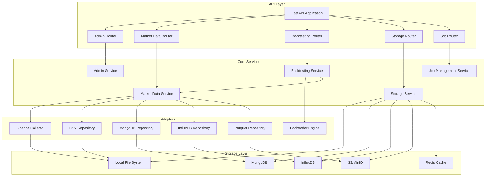

# FinSight Market Dataset Service

A comprehensive, enterprise-grade market data management and backtesting service for cryptocurrency trading strategies. Built with FastAPI, featuring multi-storage support, automated data collection, and advanced backtesting capabilities.

## 🚀 Core Features

### **Market Data Management**

- **Multi-Exchange Support**: Binance, Coinbase, Kraken, and more
- **Multi-Storage Backends**: CSV, MongoDB, InfluxDB, Parquet, S3-compatible storage
- **Automated Data Collection**: Scheduled collection with gap detection and validation
- **Data Quality Assurance**: Comprehensive validation and integrity checks
- **Cross-Repository Operations**: Seamless data migration and format conversion

### **Advanced Backtesting Engine**

- **Multiple Engines**: Backtrader, TA4J, ZOOT, and custom implementations
- **Strategy Library**: Moving Average Crossover, RSI, Bollinger Bands, MACD, and more
- **Performance Analytics**: Sharpe ratio, drawdown analysis, risk metrics
- **Historical Analysis**: Comprehensive trade history and equity curve tracking
- **Strategy Comparison**: Multi-strategy backtesting and performance comparison

### **Enterprise Architecture**

- **Hexagonal Architecture**: Clean separation of concerns with ports and adapters
- **Service Discovery**: Eureka client integration for microservices
- **Multi-Format Support**: CSV, Parquet, MongoDB, InfluxDB, and object storage
- **Scalable Design**: Horizontal scaling with load balancing support
- **Production Ready**: Comprehensive monitoring, logging, and error handling

## 🏗️ Architecture Overview



## 🛠️ Technology Stack

### **Core Framework**

- **FastAPI**: High-performance async web framework
- **Pydantic v2**: Data validation and serialization
- **Python 3.12+**: Modern Python with type hints

### **Data Storage**

- **MongoDB**: Document storage with Motor async driver
- **InfluxDB**: Time-series data storage
- **CSV/Parquet**: File-based storage with pandas
- **S3/MinIO**: Object storage for large datasets
- **Redis**: Caching and session management

### **Backtesting Engines**

- **Backtrader**: Professional backtesting framework
- **TA4J**: Technical analysis library
- **Custom Engines**: Extensible strategy framework

### **Infrastructure**

- **Docker**: Containerization and deployment
- **Eureka**: Service discovery and registration
- **APScheduler**: Job scheduling and automation
- **Structured Logging**: Comprehensive observability

## 📋 Prerequisites

### **System Requirements**

- **Python**: 3.12 or higher
- **Memory**: 4GB+ RAM (8GB+ for production)
- **Storage**: 20GB+ available disk space
- **Network**: Stable internet connection for API access

### **External Dependencies**

- **MongoDB**: 5.0+ (optional, for document storage)
- **InfluxDB**: 2.0+ (optional, for time-series data)
- **Redis**: 6.0+ (optional, for caching)
- **MinIO/S3**: Object storage (optional)
- **Eureka Server**: 2.0+ (optional, for service discovery)

## 🚀 Quick Start

### **Local Development**

#### 1. Clone and Setup

```bash
git clone <repository-url>
cd market_dataset_service

# Create virtual environment
python -m venv .venv
source .venv/bin/activate  # On Windows: .venv\Scripts\activate

# Install dependencies
pip install -r requirements.txt
```

#### 2. Configure Environment

```bash
# Copy environment template
cp env.example .env

# Edit configuration
nano .env
```

#### 3. Start Dependencies (Optional)

```bash
# Start MongoDB, Redis, MinIO
docker-compose up -d mongodb redis minio
```

#### 4. Run Service

```bash
# Run with Python
python -m src.main

# Or with uvicorn
uvicorn src.app:app --host 0.0.0.0 --port 8000 --reload
```

### **Docker Deployment**

#### 1. Build and Run

```bash
# Build image
docker build -t finsight/market-dataset-service:latest .

# Run with Docker Compose
docker-compose up -d
```

#### 2. Access Services

- **API Documentation**: <http://localhost:8000/docs>
- **Health Check**: <http://localhost:8000/health>
- **MinIO Console**: <http://localhost:9001>

## 📚 Documentation

### **API Documentation**

- [API Reference](docs/api.md) - Complete endpoint documentation
- [OpenAPI Schema](openapi.json) - Machine-readable API specification
- [Postman Collection](postman_collection.json) - Ready-to-use API tests

### **Configuration & Deployment**

- [Configuration Guide](docs/configuration.md) - Environment variables and settings
- [Architecture Documentation](docs/architecture.md) - System design and components
- [Deployment Guide](docs/deployment.md) - Production deployment instructions

### **Development**

- [Strategy Development](docs/strategies.md) - Creating custom trading strategies
- [Data Pipeline](docs/data-pipeline.md) - Data collection and processing
- [Testing Guide](docs/testing.md) - Unit and integration testing

## 🔧 Configuration

### **Key Environment Variables**

```bash
# Service Configuration
APP_NAME=market-dataset-service
DEBUG=false
ENVIRONMENT=production

# Storage Configuration
STORAGE_PROVIDER=minio  # minio, digitalocean, aws
REPOSITORY_TYPE=csv     # csv, mongodb, influxdb, parquet

# Exchange Configuration
BINANCE_API_KEY=your_api_key
BINANCE_SECRET_KEY=your_secret_key

# Admin Access
API_KEY=your_admin_api_key
```

### **Storage Options**

- **CSV**: Simple file-based storage (default)
- **MongoDB**: Document storage for complex queries
- **InfluxDB**: Time-series optimized storage
- **Parquet**: Columnar storage for analytics
- **S3/MinIO**: Object storage for large datasets

## 🧪 Testing

### **Run Tests**

```bash
# Install test dependencies
pip install -r requirements-dev.txt

# Run all tests
pytest tests/ -v

# Run with coverage
pytest tests/ --cov=src --cov-report=html

# Run specific test categories
pytest tests/unit/ -v
pytest tests/integration/ -v
pytest tests/api/ -v
```

### **Test Coverage**

- **Unit Tests**: Core business logic and utilities
- **Integration Tests**: Database and external service integration
- **API Tests**: Endpoint functionality and validation
- **Performance Tests**: Load testing and benchmarking

## 📊 Monitoring & Observability

### **Health Checks**

- **Service Health**: `/health` - Overall service status
- **Storage Health**: `/admin/storage/health` - Storage connectivity
- **Job Health**: `/jobs/health` - Background job status

### **Metrics & Logging**

- **Structured Logging**: JSON format with correlation IDs
- **Performance Metrics**: Request latency, throughput, error rates
- **Business Metrics**: Data collection rates, backtest performance

### **Monitoring Endpoints**

```bash
# Health check
curl http://localhost:8000/health

# System statistics
curl http://localhost:8000/admin/stats

# Storage information
curl http://localhost:8000/storage/stats
```

## 🔒 Security

### **Authentication**

- **API Key Authentication**: Required for admin endpoints
- **Rate Limiting**: Configurable request limits
- **Input Validation**: Comprehensive Pydantic validation

### **Data Protection**

- **Environment Variables**: Sensitive data in environment variables
- **Encryption**: TLS for all external communications
- **Access Control**: Role-based access for different operations

## 🤝 Contributing

### **Development Setup**

1. Fork the repository
2. Create a feature branch
3. Follow coding standards (Black, isort, mypy)
4. Add comprehensive tests
5. Submit a pull request

### **Code Quality**

```bash
# Format code
black src/ tests/
isort src/ tests/

# Type checking
mypy src/

# Linting
flake8 src/ tests/
```

## 📄 License

This project is licensed under the MIT License - see the [LICENSE](LICENSE) file for details.

## 🆘 Support

### **Getting Help**

- **Documentation**: Check the [docs](docs/) directory
- **Issues**: Report bugs and feature requests on GitHub
- **Discussions**: Join community discussions for questions

### **Troubleshooting**

- **Service Won't Start**: Check logs and configuration
- **Data Collection Issues**: Verify API keys and network connectivity
- **Performance Problems**: Review storage configuration and resource limits

## 🔄 Roadmap

### **Upcoming Features**

- **Real-time Data Streaming**: WebSocket support for live data
- **Advanced Analytics**: Machine learning integration
- **Multi-Asset Support**: Stocks, forex, and commodities
- **Cloud Deployment**: Kubernetes and cloud-native features
- **Mobile API**: Optimized endpoints for mobile applications

---
