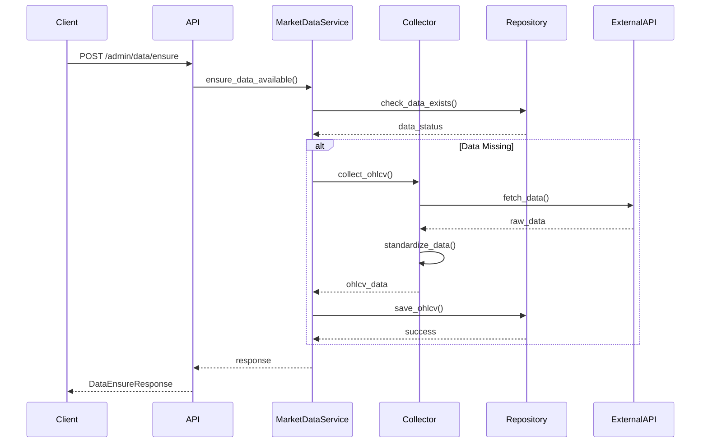
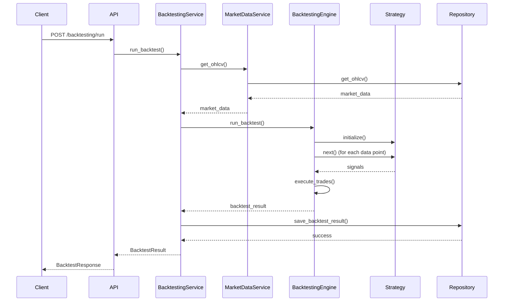
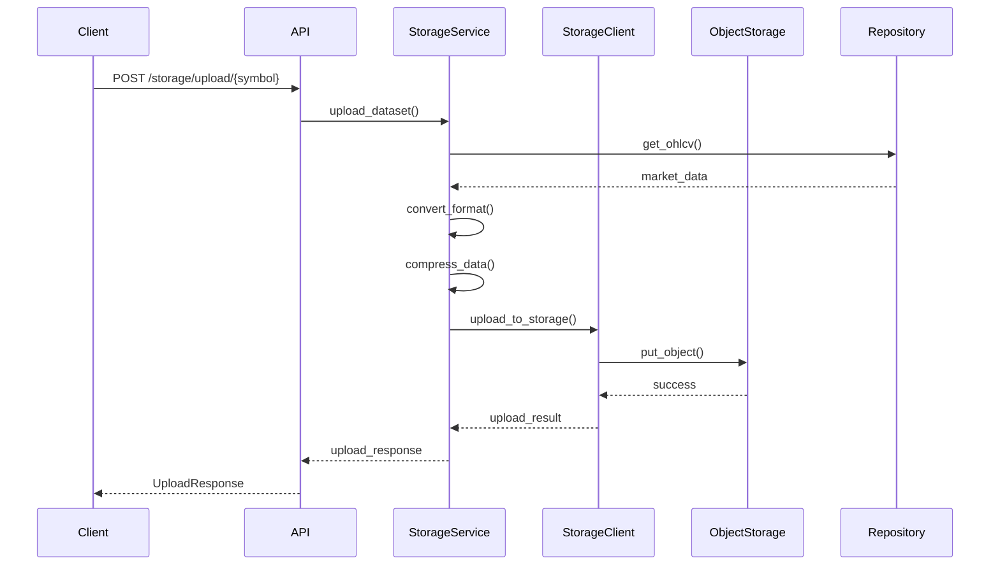
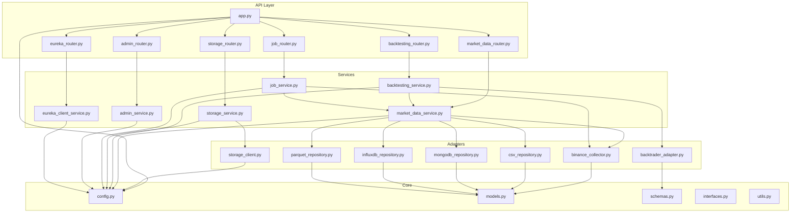
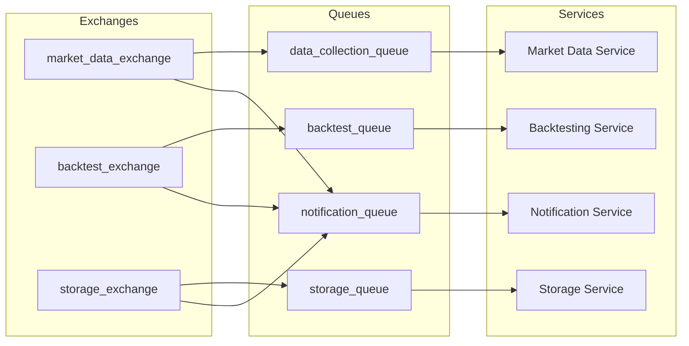
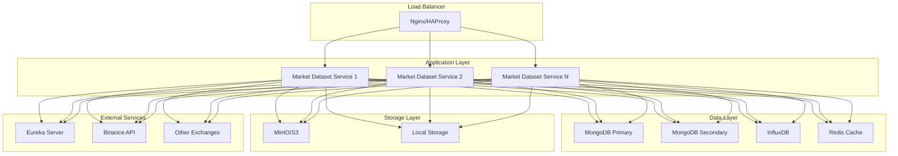

# Architecture & Design Documentation

## System Overview

The FinSight Market Dataset Service is built using **Hexagonal Architecture** (Ports & Adapters) principles, providing a clean separation between the core business logic and external dependencies. The system is designed for high scalability, maintainability, and extensibility.

## Architecture Principles

### 1. Hexagonal Architecture (Ports & Adapters)

- **Core Domain**: Contains business logic and domain models
- **Ports**: Define interfaces for external interactions
- **Adapters**: Implement external system integrations
- **Dependency Inversion**: Core domain doesn't depend on external systems

### 2. Design Patterns

- **Repository Pattern**: Abstract data access layer
- **Factory Pattern**: Create complex objects and services
- **Strategy Pattern**: Pluggable backtesting engines and strategies
- **Observer Pattern**: Event-driven data collection
- **Circuit Breaker Pattern**: Resilient external API calls
- **Retry Pattern**: Exponential backoff with jitter

### 3. SOLID Principles

- **Single Responsibility**: Each class has one reason to change
- **Open/Closed**: Open for extension, closed for modification
- **Liskov Substitution**: Implementations are interchangeable
- **Interface Segregation**: Focused, cohesive interfaces
- **Dependency Inversion**: Depend on abstractions, not concretions

## System Architecture Diagram

```mermaid
graph TB
    subgraph "External Systems"
        A[Binance API]
        B[Coinbase API]
        C[Kraken API]
        D[Eureka Server]
        E[MinIO/S3]
        F[MongoDB]
        G[InfluxDB]
    end

    subgraph "API Layer (FastAPI)"
        H[Admin Router]
        I[Market Data Router]
        J[Backtesting Router]
        K[Storage Router]
        L[Job Router]
        M[Eureka Router]
    end

    subgraph "Core Services"
        N[Market Data Service]
        O[Backtesting Service]
        P[Storage Service]
        Q[Job Management Service]
        R[Admin Service]
        S[Eureka Client Service]
    end

    subgraph "Adapters Layer"
        T[Binance Collector]
        U[CSV Repository]
        V[MongoDB Repository]
        W[InfluxDB Repository]
        X[Parquet Repository]
        Y[Backtrader Engine]
        Z[Storage Client]
    end

    subgraph "Core Domain"
        AA[OHLCV Models]
        BB[Strategy Models]
        CC[Backtest Models]
        DD[Job Models]
    end

    subgraph "Infrastructure"
        EE[Configuration]
        FF[Logging]
        GG[Caching]
        HH[Error Handling]
    end

    %% External connections
    A --> T
    B --> T
    C --> T
    D --> S
    E --> Z
    F --> V
    G --> W

    %% API to Services
    H --> R
    I --> N
    J --> O
    K --> P
    L --> Q
    M --> S

    %% Services to Adapters
    N --> T
    N --> U
    N --> V
    N --> W
    N --> X
    O --> Y
    O --> N
    P --> Z
    Q --> T
    Q --> N

    %% Services to Domain
    N --> AA
    O --> BB
    O --> CC
    Q --> DD

    %% Infrastructure
    EE --> N
    EE --> O
    EE --> P
    EE --> Q
    EE --> S
    FF --> N
    FF --> O
    FF --> P
    FF --> Q
    FF --> S
    GG --> N
    GG --> O
    GG --> P
    HH --> N
    HH --> O
    HH --> P
    HH --> Q
    HH --> S
```



## Core Components

### 1. API Layer (FastAPI)

#### Routers

- **Admin Router** (`/admin/*`): System administration and monitoring
- **Market Data Router** (`/market-data/*`): OHLCV data operations
- **Backtesting Router** (`/backtesting/*`): Strategy backtesting
- **Storage Router** (`/storage/*`): Object storage operations
- **Job Router** (`/jobs/*`): Background job management
- **Eureka Router** (`/eureka/*`): Service discovery management

#### Key Features

- **OpenAPI Documentation**: Auto-generated API documentation
- **Request Validation**: Pydantic models for input validation
- **Error Handling**: Centralized exception handling
- **Authentication**: API key-based authentication
- **Rate Limiting**: Configurable request limits
- **CORS Support**: Cross-origin resource sharing

### 2. Core Services

#### Market Data Service

```python
class MarketDataService:
    """Core service for market data operations."""

    async def get_ohlcv(self, query: OHLCVQuerySchema) -> List[OHLCVSchema]
    async def save_ohlcv(self, data: List[OHLCVSchema]) -> bool
    async def get_statistics(self, symbol: str, timeframe: str) -> OHLCVStatsSchema
    async def ensure_data_completeness(self, symbol: str, timeframe: str) -> bool
```

**Responsibilities:**

- Data retrieval and storage
- Data validation and quality checks
- Gap detection and filling
- Statistics calculation
- Data completeness assurance

#### Backtesting Service

```python
class BacktestingService:
    """Core service for backtesting operations."""

    async def run_backtest(self, request: BacktestRequest) -> BacktestResult
    async def compare_strategies(self, requests: List[BacktestRequest]) -> List[BacktestResult]
    async def get_strategy_recommendations(self, symbol: str) -> List[Dict[str, Any]]
```

**Responsibilities:**

- Strategy execution
- Performance calculation
- Risk metrics computation
- Trade analysis
- Strategy comparison

#### Storage Service

```python
class MarketDataStorageService:
    """Core service for object storage operations."""

    async def upload_dataset(self, request: DatasetUploadRequest) -> Dict[str, Any]
    async def download_dataset(self, request: DatasetDownloadRequest) -> Dict[str, Any]
    async def convert_format(self, request: FormatConversionRequest) -> Dict[str, Any]
```

**Responsibilities:**

- Object storage management
- Format conversion
- Data compression
- Storage optimization
- Backup and recovery

#### Job Management Service

```python
class MarketDataJobManagementService:
    """Core service for background job management."""

    async def start_job(self, request: JobStartRequest) -> JobOperationResponse
    async def stop_job(self, request: JobStopRequest) -> JobOperationResponse
    async def run_manual_job(self, request: ManualJobRequest) -> ManualJobResponse
```

**Responsibilities:**

- Scheduled data collection
- Job scheduling and execution
- Progress monitoring
- Error handling and retry
- Resource management

### 3. Adapters Layer

#### Data Collectors

```python
class BinanceMarketDataCollector(MarketDataCollector):
    """Binance exchange data collector."""

    def collect_ohlcv(self, symbol: str, timeframe: str, start_date: str, end_date: str) -> List[OHLCVSchema]
    def get_available_symbols(self) -> List[str]
    def get_available_timeframes(self) -> List[str]
```

**Features:**

- Rate limiting and throttling
- Error handling and retry
- Data validation
- Exchange-specific optimizations

#### Repository Adapters

```python
class CSVMarketDataRepository(MarketDataRepository):
    """CSV file-based data repository."""

    async def save_ohlcv(self, exchange: str, symbol: str, timeframe: str, data: List[OHLCVSchema]) -> bool
    async def get_ohlcv(self, query: OHLCVQuerySchema) -> List[OHLCVSchema]
    async def get_storage_info(self) -> Dict[str, Any]
```

**Supported Repositories:**

- **CSV**: File-based storage with pandas
- **MongoDB**: Document storage with Motor
- **InfluxDB**: Time-series storage
- **Parquet**: Columnar storage for analytics

#### Backtesting Engines

```python
class BacktraderAdapter(BacktestingEngine):
    """Backtrader-based backtesting engine."""

    async def run_backtest(self, request: BacktestRequest, market_data: List[OHLCVSchema], strategy_config: StrategyConfig) -> BacktestResult
    def validate_strategy_config(self, strategy_config: StrategyConfig) -> bool
    def get_supported_strategies(self) -> List[str]
```

**Supported Engines:**

- **Backtrader**: Professional backtesting framework
- **TA4J**: Technical analysis library
- **ZOOT**: Custom backtesting engine
- **Custom Engines**: Extensible framework

### 4. Core Domain Models

#### OHLCV Data Model

```python
class OHLCVSchema(BaseModel):
    """Standardized OHLCV data model."""

    timestamp: datetime
    open: float
    high: float
    low: float
    close: float
    volume: float
    symbol: str
    exchange: str
    timeframe: str
```

#### Strategy Models

```python
class StrategyConfig(BaseModel):
    """Strategy configuration model."""

    strategy_type: StrategyType
    parameters: Dict[str, Any]
    position_sizing: Optional[str]
    position_size: float
```

#### Backtest Models

```python
class BacktestResult(BaseModel):
    """Comprehensive backtest result model."""

    backtest_id: Optional[str]
    symbol: str
    timeframe: str
    strategy_type: StrategyType
    start_date: datetime
    end_date: datetime
    initial_capital: float
    final_capital: float
    metrics: PerformanceMetrics
    trades: List[TradeResult]
    equity_curve: List[EquityCurvePoint]
```

## Data Flow Diagrams

### 1. Market Data Collection Flow



### 2. Backtesting Flow



### 3. Storage Operations Flow



## Module Dependencies

### Dependency Graph



## Database Schema

### MongoDB Collections

#### OHLCV Collection

```javascript
{
  "_id": ObjectId,
  "timestamp": ISODate,
  "open": Number,
  "high": Number,
  "low": Number,
  "close": Number,
  "volume": Number,
  "symbol": String,
  "exchange": String,
  "timeframe": String,
  "created_at": ISODate,
  "updated_at": ISODate
}
```

**Indexes:**

- `{exchange: 1, symbol: 1, timeframe: 1, timestamp: 1}` (Compound index)
- `{timestamp: 1}` (TTL index for data retention)
- `{symbol: 1, timestamp: 1}` (Query optimization)

#### Backtest Results Collection

```javascript
{
  "_id": ObjectId,
  "backtest_id": String,
  "symbol": String,
  "timeframe": String,
  "strategy_type": String,
  "start_date": ISODate,
  "end_date": ISODate,
  "initial_capital": Number,
  "final_capital": Number,
  "metrics": {
    "total_return": Number,
    "annual_return": Number,
    "max_drawdown": Number,
    "sharpe_ratio": Number,
    "total_trades": Number,
    "win_rate": Number
  },
  "trades": Array,
  "equity_curve": Array,
  "execution_time_seconds": Number,
  "created_at": ISODate
}
```

**Indexes:**

- `{backtest_id: 1}` (Unique index)
- `{symbol: 1, strategy_type: 1, created_at: -1}` (Query optimization)
- `{created_at: 1}` (TTL index for cleanup)

### InfluxDB Schema

#### OHLCV Measurement

```sql
-- Measurement: ohlcv
-- Tags: exchange, symbol, timeframe
-- Fields: open, high, low, close, volume
-- Timestamp: timestamp

-- Example query
SELECT * FROM ohlcv
WHERE exchange = 'binance'
  AND symbol = 'BTCUSDT'
  AND timeframe = '1h'
  AND time >= '2024-01-01T00:00:00Z'
  AND time <= '2024-01-02T00:00:00Z'
```

## Message Queue Architecture

### RabbitMQ Setup (Future Enhancement)



### Message Formats

#### Data Collection Message

```json
{
  "message_type": "data_collection_request",
  "exchange": "binance",
  "symbol": "BTCUSDT",
  "timeframe": "1h",
  "start_date": "2024-01-01T00:00:00Z",
  "end_date": "2024-01-02T00:00:00Z",
  "priority": "high",
  "correlation_id": "req_123456789"
}
```

#### Backtest Message

```json
{
  "message_type": "backtest_request",
  "backtest_id": "bt_123456789",
  "symbol": "BTCUSDT",
  "timeframe": "1h",
  "strategy_type": "moving_average_crossover",
  "strategy_params": {
    "short_window": 10,
    "long_window": 30
  },
  "start_date": "2024-01-01T00:00:00Z",
  "end_date": "2024-01-31T00:00:00Z",
  "initial_capital": 10000.0,
  "correlation_id": "bt_123456789"
}
```

## Caching Strategy

### Redis Cache Structure

#### Cache Keys

```bash
# OHLCV data cache
ohlcv:{exchange}:{symbol}:{timeframe}:{start_date}:{end_date}

# Statistics cache
stats:{exchange}:{symbol}:{timeframe}

# Backtest results cache
backtest:{backtest_id}

# Strategy configurations cache
strategy:{strategy_type}

# System statistics cache
system:stats
```

#### Cache TTL Configuration

```python
CACHE_TTL_CONFIG = {
    "ohlcv_data": 300,      # 5 minutes
    "statistics": 600,       # 10 minutes
    "backtest_results": 3600, # 1 hour
    "strategy_configs": 86400, # 24 hours
    "system_stats": 300,     # 5 minutes
}
```

### Cache Invalidation Strategy

- **Time-based**: Automatic expiration
- **Event-based**: Invalidate on data updates
- **Manual**: Admin-triggered invalidation
- **Pattern-based**: Bulk invalidation by pattern

## Error Handling & Resilience

### Exception Hierarchy

```python
class FinSightError(Exception):
    """Base exception for FinSight services."""
    pass

class ValidationError(FinSightError):
    """Data validation errors."""
    pass

class RepositoryError(FinSightError):
    """Database/storage errors."""
    pass

class CollectionError(FinSightError):
    """Data collection errors."""
    pass

class BacktestingServiceError(FinSightError):
    """Backtesting service errors."""
    pass

class StorageError(FinSightError):
    """Object storage errors."""
    pass
```

### Circuit Breaker Pattern

```python
class CircuitBreaker:
    """Circuit breaker for external API calls."""

    def __init__(self, failure_threshold: int = 5, recovery_timeout: int = 60):
        self.failure_threshold = failure_threshold
        self.recovery_timeout = recovery_timeout
        self.failure_count = 0
        self.last_failure_time = None
        self.state = "CLOSED"  # CLOSED, OPEN, HALF_OPEN
```

### Retry Strategy

```python
class RetryStrategy:
    """Exponential backoff with jitter retry strategy."""

    def __init__(self, max_attempts: int = 3, base_delay: float = 1.0, max_delay: float = 60.0):
        self.max_attempts = max_attempts
        self.base_delay = base_delay
        self.max_delay = max_delay
```

## Security Architecture

### Authentication & Authorization

- **API Key Authentication**: Required for admin endpoints
- **Rate Limiting**: Per-endpoint and per-client limits
- **Input Validation**: Comprehensive Pydantic validation
- **CORS Configuration**: Configurable cross-origin policies

### Data Protection

- **Encryption**: TLS for all external communications
- **Sensitive Data**: Environment variable storage
- **Access Control**: Role-based access patterns
- **Audit Logging**: Comprehensive access logging

### Security Headers

```python
SECURITY_HEADERS = {
    "X-Content-Type-Options": "nosniff",
    "X-Frame-Options": "DENY",
    "X-XSS-Protection": "1; mode=block",
    "Strict-Transport-Security": "max-age=31536000; includeSubDomains",
    "Content-Security-Policy": "default-src 'self'",
}
```

## Performance Considerations

### Optimization Strategies

- **Async Operations**: Non-blocking I/O throughout
- **Connection Pooling**: Database and HTTP connection pools
- **Caching**: Multi-level caching strategy
- **Batch Operations**: Bulk data processing
- **Compression**: Data compression for storage

### Resource Management

- **Memory Management**: Efficient data structures
- **CPU Optimization**: Parallel processing where appropriate
- **I/O Optimization**: Async I/O and batching
- **Storage Optimization**: Partitioning and indexing

### Monitoring & Metrics

- **Performance Metrics**: Response times, throughput
- **Resource Metrics**: CPU, memory, disk usage
- **Business Metrics**: Data collection rates, backtest performance
- **Error Metrics**: Error rates, failure patterns

## Scalability Patterns

### Horizontal Scaling

- **Stateless Design**: No session state
- **Load Balancing**: Multiple service instances
- **Database Sharding**: Partition data by symbol/timeframe
- **Cache Distribution**: Redis cluster for caching

### Vertical Scaling

- **Resource Optimization**: Efficient resource usage
- **Connection Pooling**: Optimize database connections
- **Memory Management**: Efficient data structures
- **CPU Optimization**: Parallel processing

### Auto-scaling

- **Metrics-based**: Scale based on performance metrics
- **Time-based**: Scale based on time patterns
- **Event-based**: Scale based on business events
- **Predictive**: ML-based scaling predictions

## Monitoring & Observability

### Health Checks

```python
HEALTH_CHECK_ENDPOINTS = {
    "/health": "Overall service health",
    "/admin/health": "Detailed system health",
    "/jobs/health": "Job service health",
    "/storage/health": "Storage health",
}
```

### Logging Strategy

- **Structured Logging**: JSON format with correlation IDs
- **Log Levels**: DEBUG, INFO, WARNING, ERROR, CRITICAL
- **Log Aggregation**: Centralized log collection
- **Log Retention**: Configurable retention policies

### Metrics Collection

- **Application Metrics**: Request rates, response times
- **Business Metrics**: Data collection rates, backtest performance
- **Infrastructure Metrics**: CPU, memory, disk usage
- **Custom Metrics**: Domain-specific measurements

### Tracing

- **Distributed Tracing**: Request correlation across services
- **Performance Tracing**: Detailed performance analysis
- **Error Tracing**: Error propagation tracking
- **Business Tracing**: Business process tracking

## Deployment Architecture

### Container Architecture



### Environment Configurations

#### Development

- Single service instance
- Local databases
- Debug logging enabled
- Hot reload enabled

#### Staging

- Multiple service instances
- Production-like databases
- Performance monitoring
- Integration testing

#### Production

- Auto-scaling service instances
- High-availability databases
- Comprehensive monitoring
- Disaster recovery

## Future Enhancements

### Planned Features

- **Real-time Data Streaming**: WebSocket support
- **Machine Learning Integration**: ML-based strategies
- **Multi-Asset Support**: Stocks, forex, commodities
- **Advanced Analytics**: Portfolio optimization
- **Cloud-Native Features**: Kubernetes deployment

### Architecture Evolution

- **Event Sourcing**: Event-driven architecture
- **CQRS**: Command Query Responsibility Segregation
- **Microservices**: Service decomposition
- **API Gateway**: Centralized API management
- **Service Mesh**: Inter-service communication

### Technology Upgrades

- **GraphQL**: Flexible API queries
- **gRPC**: High-performance RPC
- **Apache Kafka**: Event streaming
- **Elasticsearch**: Advanced search capabilities
- **Apache Spark**: Big data processing
