# Architecture & Design Documentation

## System Overview

The FinSight News Service is a microservice designed for high-performance news aggregation, processing, and distribution. Built with a hexagonal architecture pattern, it provides both REST and gRPC APIs while integrating with external news sources, sentiment analysis services, and message queues.

## Architecture Principles

### Hexagonal Architecture (Ports & Adapters)

The service follows hexagonal architecture principles with clear separation between:

- **Core Domain**: Business logic and domain models
- **Ports**: Interfaces defining service contracts
- **Adapters**: External system integrations and API implementations

### Design Patterns

- **Repository Pattern**: Abstract data access layer
- **Factory Pattern**: Dynamic service instantiation
- **Facade Pattern**: Simplified interfaces for complex subsystems
- **Strategy Pattern**: Pluggable parsing and collection strategies
- **Observer Pattern**: Event-driven message publishing

## System Architecture

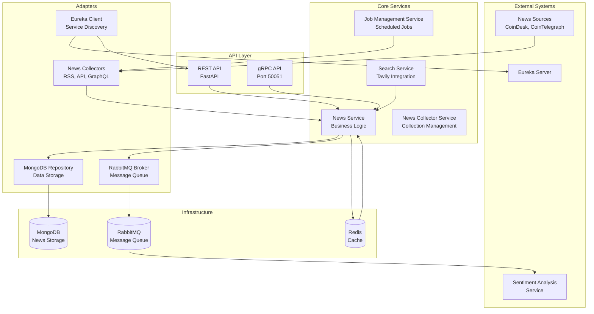

## Core Components

### 1. API Layer

#### REST API (FastAPI)

- **Port**: 8000 (configurable)
- **Features**:
  - OpenAPI/Swagger documentation
  - Request/response validation
  - Rate limiting
  - CORS support
  - Authentication middleware

#### gRPC API

- **Port**: 50051 (configurable)
- **Features**:
  - High-performance binary protocol
  - Streaming support
  - Strong typing
  - Bi-directional communication

### 2. Core Services

#### News Service

**Location**: `src/services/news_service.py`

Primary business logic service handling:

- News item storage and retrieval
- Search operations with filtering
- Duplicate detection
- Cache management
- Message publishing for sentiment analysis

**Key Methods**:

```python
async def store_news_item(self, news_item: NewsItem) -> NewsStorageResult
async def search_news(self, search_request: NewsSearchRequest) -> List[NewsItem]
async def get_recent_news(self, source: Optional[NewsSource], hours: int) -> List[NewsItem]
async def get_news_by_tags(self, tags: List[str], limit: int) -> List[NewsItem]
```

#### News Collector Service

**Location**: `src/services/news_collector_service.py`

Manages news collection from multiple sources:

- Multi-source collection orchestration
- Fallback mechanisms
- Collection statistics
- Error handling and retry logic

#### Job Management Service

**Location**: `src/services/job_management_service.py`

Handles scheduled news collection:

- Cron job scheduling
- Job status monitoring
- Configuration management
- Manual job execution

#### Search Service

**Location**: `src/services/search_service.py`

Integrates with Tavily search engine:

- Web search capabilities
- Financial sentiment analysis
- Content filtering
- Result processing

### 3. Adapters

#### News Collectors

**Location**: `src/adapters/`

Multiple collector implementations:

##### RSS News Collector

- **File**: `rss_news_collector.py`
- **Sources**: RSS feeds
- **Features**: Feed parsing, content extraction

##### API News Collectors

- **CoinDesk API**: `api_coindesk_news_collector.py`
- **CoinTelegraph API**: `api_cointelegraph_news_collector.py`
- **Features**: REST/GraphQL API integration, rate limiting

##### Tavily Search Engine

- **File**: `tavily_search_engine.py`
- **Features**: Web search, content crawling

#### MongoDB Repository

**Location**: `src/repositories/mongo_news_repository.py`

Data persistence layer:

- Async MongoDB operations
- Connection pooling
- Index management
- Query optimization

#### RabbitMQ Broker

**Location**: `src/adapters/rabbitmq_broker.py`

Message queue integration:

- Publish/subscribe patterns
- Message routing
- Dead letter queues
- Connection management

#### Eureka Client

**Location**: `src/services/eureka_client_service.py`

Service discovery integration:

- Automatic registration
- Health check reporting
- Heartbeat management
- Failover handling

### 4. Core Domain

#### Models

**Location**: `src/models/`

##### News Model

```python
class NewsModel(BaseModel):
    id: Optional[str]
    source: NewsSource
    title: str
    url: HttpUrl
    description: Optional[str]
    published_at: datetime
    author: Optional[str]
    tags: List[str]
    metadata: Dict[str, Any]
    url_hash: str
    guid_source_hash: Optional[str]
```

#### Schemas

**Location**: `src/schemas/`

Comprehensive Pydantic schemas for:

- Request/response models
- Data validation
- API documentation
- Type safety

#### Interfaces

**Location**: `src/interfaces/`

Abstract base classes defining contracts:

- `NewsRepositoryInterface`
- `NewsCollectorInterface`
- `MessageBroker`
- `SearchEngine`

## Data Flow

### 1. News Collection Flow

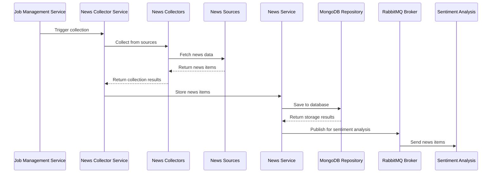

### 2. News Search Flow

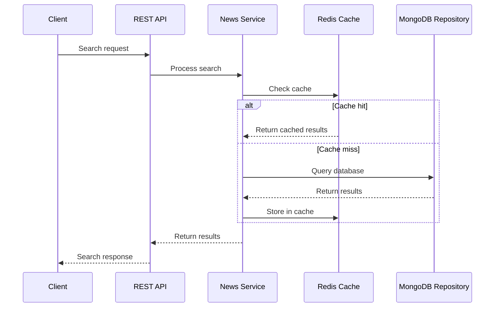

### 3. Message Publishing Flow

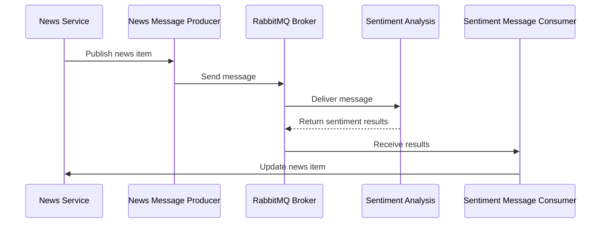

## Module Dependencies

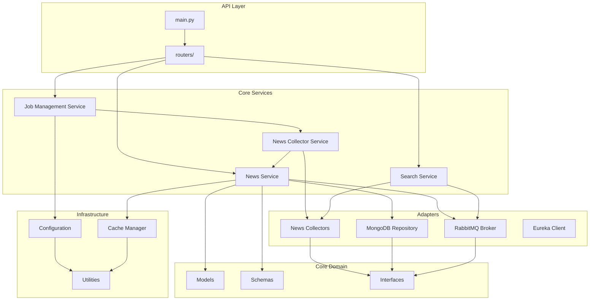

## Database Schema

### MongoDB Collections

#### news_items Collection

```javascript
{
  "_id": ObjectId,
  "source": "coindesk" | "cointelegraph",
  "title": "Article Title",
  "url": "https://example.com/article",
  "description": "Article description...",
  "published_at": ISODate("2024-01-15T10:00:00Z"),
  "fetched_at": ISODate("2024-01-15T10:05:00Z"),
  "author": "Author Name",
  "guid": "unique-guid",
  "tags": ["bitcoin", "cryptocurrency"],
  "metadata": {
    "sentiment": "positive",
    "score": 0.85
  },
  "url_hash": "sha256-hash",
  "guid_source_hash": "sha256-hash"
}
```

#### Indexes

```javascript
// Primary indexes
{ "url_hash": 1 }  // Unique index for duplicate detection
{ "guid_source_hash": 1 }  // Unique index for GUID-based duplicates
{ "published_at": -1 }  // For time-based queries
{ "source": 1, "published_at": -1 }  // Compound index for source + time

// Search indexes
{ "title": "text", "description": "text" }  // Text search
{ "tags": 1 }  // Tag-based queries
{ "url": 1 }  // URL lookups
```

## Message Queue Architecture

### RabbitMQ Exchanges and Queues

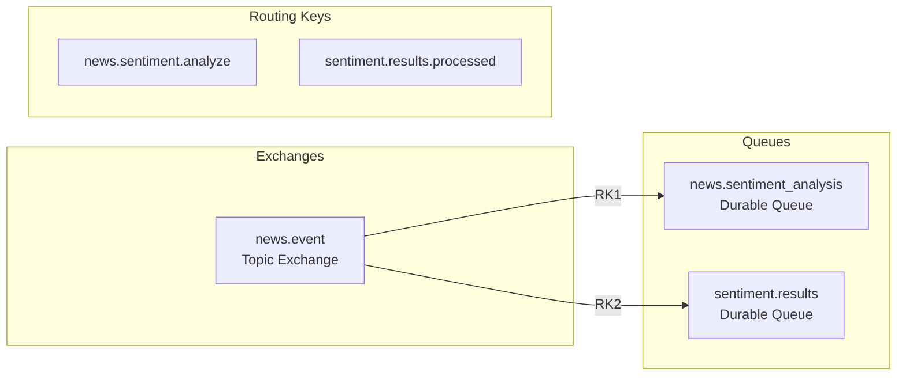

### Message Formats

#### News Message (to Sentiment Analysis)

```json
{
  "id": "news_item_id",
  "url": "https://example.com/article",
  "title": "Article Title",
  "description": "Article description...",
  "source": "coindesk",
  "published_at": "2024-01-15T10:00:00Z",
  "author": "Author Name",
  "tags": ["bitcoin", "cryptocurrency"],
  "fetched_at": "2024-01-15T10:05:00Z",
  "message_timestamp": "2024-01-15T10:05:00Z",
  "metadata": {}
}
```

#### Sentiment Result Message

```json
{
  "news_id": "news_item_id",
  "url": "https://example.com/article",
  "title": "Article Title",
  "sentiment_label": "positive",
  "sentiment_scores": {
    "positive": 0.85,
    "negative": 0.1,
    "neutral": 0.05
  },
  "confidence": 0.92,
  "reasoning": "Analysis reasoning...",
  "processed_at": "2024-01-15T10:06:00Z",
  "processing_time_ms": 1250.5,
  "analyzer_version": "1.0.0",
  "metadata": {}
}
```

## Caching Strategy

### Redis Cache Structure

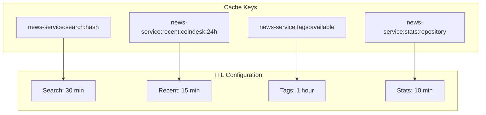

### Cache Invalidation Strategy

- **Time-based**: Automatic expiration using TTL
- **Event-based**: Invalidation on news item updates
- **Pattern-based**: Bulk invalidation using patterns
- **Manual**: Admin-triggered cache clearing

## Error Handling & Resilience

### Circuit Breaker Pattern

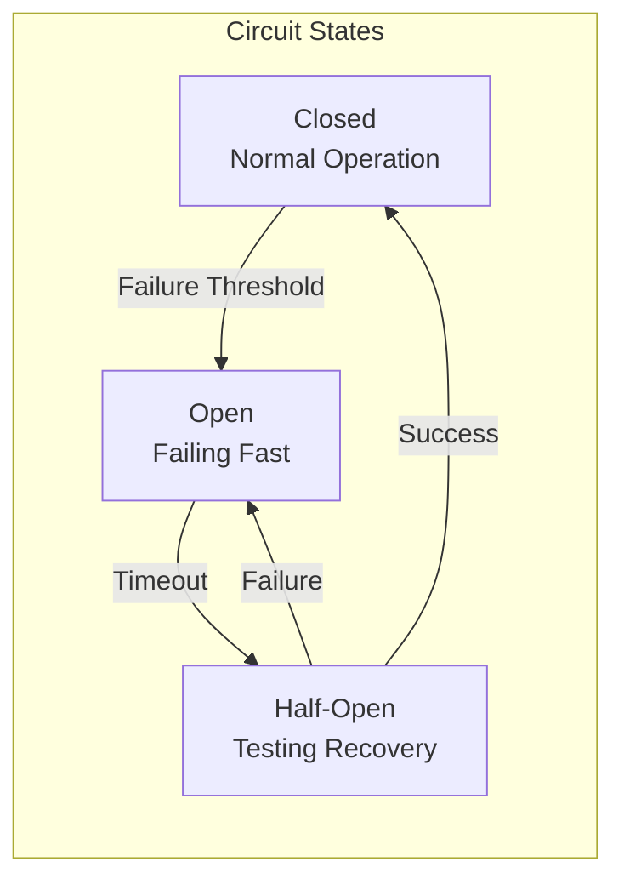

### Retry Strategy

- **Exponential Backoff**: Increasing delays between retries
- **Jitter**: Random delay variation to prevent thundering herd
- **Maximum Attempts**: Configurable retry limits
- **Retryable Errors**: Specific error types for retry logic

### Graceful Degradation

- **Cache Fallback**: Return cached data when database is unavailable
- **Partial Results**: Return available data when some sources fail
- **Default Responses**: Provide meaningful defaults for failed operations
- **Health Checks**: Monitor service dependencies

## Security Architecture

### Authentication & Authorization

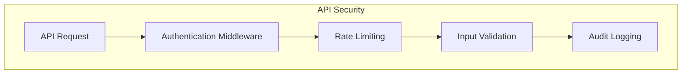

### Data Protection

- **Input Validation**: Pydantic schema validation
- **SQL Injection Prevention**: Parameterized queries
- **XSS Protection**: Content sanitization
- **Rate Limiting**: Request throttling
- **Audit Logging**: Comprehensive access logs

## Performance Considerations

### Optimization Strategies

#### Database Optimization

- **Indexing**: Strategic index placement for common queries
- **Connection Pooling**: Efficient database connection management
- **Query Optimization**: Aggregation pipelines and projection
- **Sharding**: Horizontal scaling for large datasets

#### Caching Optimization

- **Multi-level Caching**: Redis + in-memory caching
- **Cache Warming**: Pre-populate frequently accessed data
- **Cache Partitioning**: Distribute cache load
- **Compression**: Reduce memory usage

#### API Optimization

- **Pagination**: Efficient large result set handling
- **Compression**: Gzip response compression
- **Async Processing**: Non-blocking I/O operations
- **Connection Reuse**: HTTP/2 and connection pooling

### Scalability Patterns

#### Horizontal Scaling

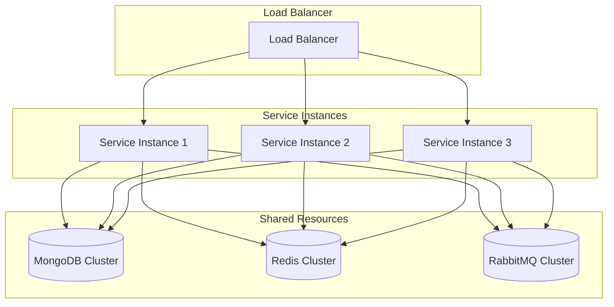

#### Data Partitioning

- **Source-based**: Partition by news source
- **Time-based**: Partition by date ranges
- **Geographic**: Partition by region
- **Functional**: Partition by service type

## Monitoring & Observability

### Metrics Collection

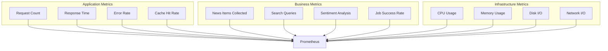

### Logging Strategy

- **Structured Logging**: JSON format with correlation IDs
- **Log Levels**: Configurable per component
- **Log Aggregation**: Centralized log collection
- **Log Retention**: Configurable retention policies

### Health Checks

- **Liveness Probe**: Service availability check
- **Readiness Probe**: Service readiness check
- **Dependency Health**: Database, cache, message queue status
- **Custom Health**: Business logic health checks

## Deployment Architecture

### Container Architecture

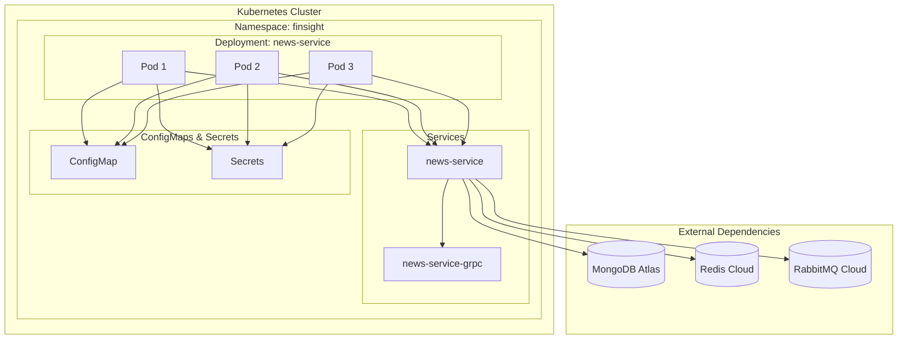

### Service Mesh Integration

- **Istio**: Traffic management and security
- **Envoy Proxy**: Sidecar proxy for service communication
- **Service Discovery**: Automatic service registration
- **Load Balancing**: Intelligent traffic distribution

## Future Enhancements

### Planned Improvements

1. **GraphQL API**: Add GraphQL endpoint for flexible queries
2. **Real-time Updates**: WebSocket support for live news updates
3. **Machine Learning**: Content classification and recommendation
4. **Multi-language Support**: Internationalization and localization
5. **Advanced Analytics**: Business intelligence and reporting
6. **Event Sourcing**: Event-driven architecture for audit trails
7. **CQRS**: Command Query Responsibility Segregation
8. **Micro-frontends**: Modular frontend architecture

### Technology Evolution

- **gRPC Streaming**: Real-time bidirectional communication
- **GraphQL Federation**: Distributed GraphQL architecture
- **Event Streaming**: Apache Kafka integration
- **Serverless**: Function-as-a-Service integration
- **Edge Computing**: CDN and edge processing
- **AI/ML Pipeline**: Automated content analysis
