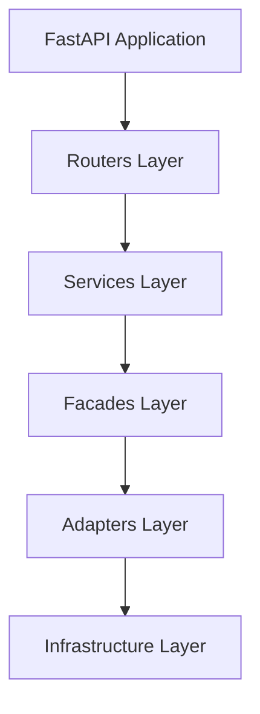

# FinSight Prediction Service

[](https://www.python.org/downloads/)
[](https://fastapi.tiangolo.com/)
[](LICENSE)

> **AI-Powered Financial Time Series Prediction Service**  
> Advanced machine learning service for cryptocurrency price forecasting using state-of-the-art transformer models

## 🚀 Overview

The FinSight Prediction Service is a production-ready, enterprise-grade AI service designed for financial time series forecasting. Built with modern Python technologies and following microservices architecture principles, it provides robust model training, serving, and prediction capabilities for cryptocurrency markets.

### ✨ Key Features

- **🤖 Advanced AI Models**: Support for PatchTST, PatchTSMixer, and custom transformer architectures
- **📊 Intelligent Fallback**: Smart model selection with timeframe and symbol fallback strategies
- **☁️ Cloud-Native**: Built-in support for cloud storage (AWS S3, DigitalOcean Spaces, MinIO)
- **🔧 Multiple Serving Backends**: Simple, TorchScript, TorchServe, and Triton Inference Server
- **📈 Experiment Tracking**: MLflow integration for model lifecycle management
- **🔄 Async Processing**: Full asynchronous support for high-performance operations
- **📋 Job Management**: Comprehensive training job orchestration with Redis/file-based persistence
- **🔍 Service Discovery**: Eureka client integration for microservices architecture
- **🧹 Automated Cleanup**: Background maintenance and resource management

## 🏗️ Architecture Overview

The service follows a **Hexagonal Architecture** pattern with clear separation of concerns:



```mermaid

┌─────────────────────────────────────────────────────────────┐
│ FastAPI Application │
├─────────────────────────────────────────────────────────────┤
│ Routers Layer (API Endpoints) │
├─────────────────────────────────────────────────────────────┤
│ Services Layer (Business Logic) │
├─────────────────────────────────────────────────────────────┤
│ Facades Layer (Unified Interfaces) │
├─────────────────────────────────────────────────────────────┤
│ Adapters Layer (External Integrations) │
├─────────────────────────────────────────────────────────────┤
│ Infrastructure Layer (Storage, ML Frameworks) │
└─────────────────────────────────────────────────────────────┘

```

### Core Components

- **Training Service**: Handles model training with async job management
- **Prediction Service**: Provides intelligent prediction with fallback strategies
- **Model Serving**: Multiple serving backends for production deployment
- **Data Management**: Hybrid local/cloud data loading and caching
- **Experiment Tracking**: MLflow integration for model versioning

## 🚀 Quick Start

### Prerequisites

- Python 3.12+
- Docker & Docker Compose
- Redis (optional, for job persistence)
- MLflow (optional, for experiment tracking)

### Local Development

1. **Clone and Setup**

   ```bash
   cd prediction_service
   python -m venv .venv
   source .venv/bin/activate  # On Windows: .venv\Scripts\activate
   pip install -r requirements.txt
   ```

2. **Environment Configuration**

   ```bash
   cp env.example .env
   # Edit .env with your configuration
   ```

3. **Run the Service**

   ```bash
   python -m src.main
   ```

4. **Access the API**
   - API Documentation: <http://localhost:8000/docs>
   - Health Check: <http://localhost:8000/health>
   - Root Info: <http://localhost:8000/>

### Docker Deployment

1. **Start with Docker Compose**

   ```bash
   docker-compose up -d
   ```

2. **Access the Service**
   - API: <http://localhost:8001>
   - Eureka Server: <http://localhost:8761>

## 📚 Documentation

- **[API Documentation](docs/api.md)** - Complete API reference with examples
- **[Configuration Guide](docs/configuration.md)** - Environment variables and settings
- **[Architecture & Design](docs/architecture.md)** - Detailed system architecture
- **[Deployment Guide](docs/deployment.md)** - Production deployment instructions

## 🔧 Configuration

The service is highly configurable through environment variables. Key configuration areas:

- **Model Training**: Context length, epochs, batch size, learning rate
- **Serving Backends**: Simple, TorchScript, TorchServe, Triton
- **Cloud Storage**: AWS S3, DigitalOcean Spaces, MinIO
- **Service Discovery**: Eureka client settings
- **Fallback Strategies**: Model selection priorities

See [Configuration Guide](docs/configuration.md) for complete details.

## 🧪 Testing

### Unit Tests

```bash
pytest tests/ -v
```

### Integration Tests

```bash
pytest tests/ -m integration -v
```

### API Testing

```bash
# Test prediction endpoint
curl -X POST "http://localhost:8000/prediction/predict" \
  -H "Content-Type: application/json" \
  -d '{
    "symbol": "BTCUSDT",
    "timeframe": "1d",
    "n_steps": 1,
    "enable_fallback": true
  }'
```

## 📊 Performance

- **Model Loading**: < 2 seconds for standard models
- **Prediction Latency**: < 100ms for single predictions
- **Training Throughput**: Configurable batch processing
- **Memory Usage**: Intelligent model caching and eviction
- **Scalability**: Horizontal scaling support with load balancing

## 🔒 Security

- **Input Validation**: Comprehensive Pydantic schema validation
- **Rate Limiting**: Configurable API rate limiting
- **Error Handling**: Structured error responses without information leakage
- **Logging**: Secure logging with sensitive data filtering

## 🤝 Contributing

1. Fork the repository
2. Create a feature branch (`git checkout -b feature/amazing-feature`)
3. Commit your changes (`git commit -m 'Add amazing feature'`)
4. Push to the branch (`git push origin feature/amazing-feature`)
5. Open a Pull Request

## 📄 License

This project is licensed under the MIT License - see the [LICENSE](LICENSE) file for details.

## 🆘 Support

- **Documentation**: [docs/](docs/) directory
- **Issues**: GitHub Issues for bug reports and feature requests
- **Discussions**: GitHub Discussions for questions and community support

## 🔗 Related Services

- **[Market Dataset Service](../market_dataset_service/)** - Financial data collection and management
- **[News Service](../news_service/)** - News aggregation and sentiment analysis
- **[Sentiment Analysis Service](../sentiment_analysis/)** - AI-powered sentiment analysis

---
