# FinSight Prediction Service - Architecture & Design

> **Complete System Architecture Documentation and Design Patterns**

## 🌐 Overview

The FinSight Prediction Service is built using **Hexagonal Architecture** (Ports & Adapters) principles, providing a robust, scalable, and maintainable foundation for AI-powered financial time series forecasting.

### Key Architectural Features

- **Clean Architecture**: Clear separation of concerns with dependency inversion
- **Hexagonal Design**: Adapter pattern for external integrations
- **Event-Driven**: Asynchronous processing with message queues
- **Microservices-Ready**: Service discovery and health monitoring
- **Cloud-Native**: Stateless design with externalized configuration

## 🏗️ Architecture Principles

### 1. Separation of Concerns

- **Domain Layer**: Core business logic and entities
- **Application Layer**: Use cases and orchestration
- **Infrastructure Layer**: External integrations and persistence
- **Interface Layer**: API endpoints and controllers

### 2. Dependency Inversion

- High-level modules don't depend on low-level modules
- Both depend on abstractions
- Abstractions don't depend on details

### 3. Single Responsibility

- Each module has one reason to change
- Clear boundaries and interfaces
- Focused functionality

### 4. Open/Closed Principle

- Open for extension, closed for modification
- Plugin architecture for serving adapters
- Configurable fallback strategies

## 🏛️ System Architecture

### High-Level Architecture Diagram

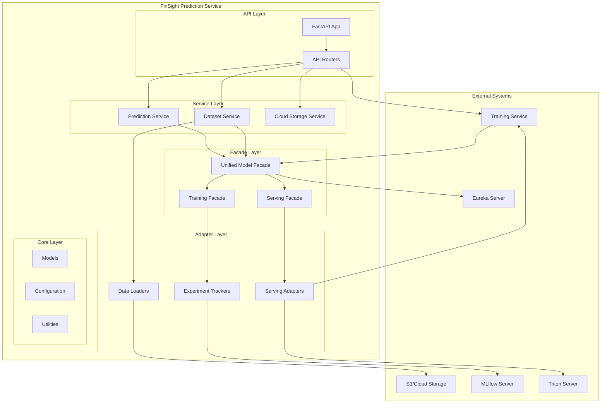

### Component Interaction Flow

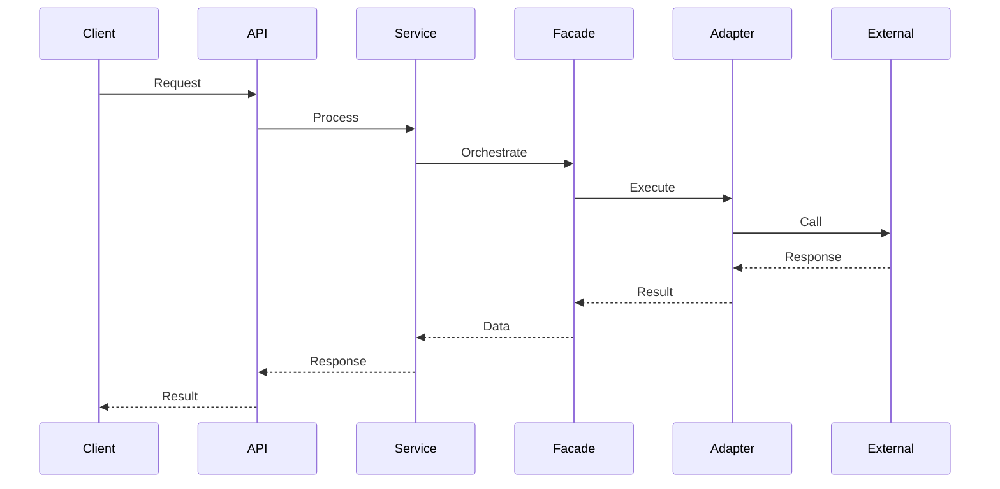

## 🧩 Module Architecture

### 1. API Layer (`src/routers/`)

**Purpose**: HTTP endpoint definitions and request/response handling

**Components**:

- **Training Router**: Model training endpoints
- **Prediction Router**: Prediction endpoints
- **Models Router**: Model management endpoints
- **Serving Router**: Model serving endpoints
- **Datasets Router**: Dataset management endpoints
- **Cloud Storage Router**: Cloud storage operations
- **Eureka Router**: Service discovery management
- **Cleanup Router**: System maintenance endpoints

**Design Pattern**: Controller pattern with dependency injection

```python
@router.post("/train")
async def train_model(
    request: TrainingRequest,
    training_service: TrainingService = Depends(get_training_service)
) -> TrainingResponse:
    return await training_service.start_training(request)
```

### 2. Service Layer (`src/services/`)

**Purpose**: Business logic orchestration and workflow management

**Components**:

- **TrainingService**: Model training orchestration
- **PredictionService**: Prediction workflow management
- **DatasetManagementService**: Data lifecycle management
- **CloudStorageService**: Cloud storage operations
- **EurekaClientService**: Service discovery management
- **BackgroundTaskManager**: Asynchronous task management

**Design Pattern**: Service layer pattern with async support

```python
class TrainingService:
    async def start_async_training(self, request: AsyncTrainingRequest) -> AsyncTrainingResponse:
        # Validate request
        # Check data availability
        # Create training job
        # Start background training
        # Return job ID
```

### 3. Facade Layer (`src/facades/`)

**Purpose**: Unified interface for complex subsystems

**Components**:

- **UnifiedModelFacade**: Combined training and serving interface
- **ModelTrainingFacade**: Training-specific operations
- **ModelServingFacade**: Serving-specific operations

**Design Pattern**: Facade pattern with dependency injection

```python
class UnifiedModelFacade:
    def __init__(self, serving_adapter: Optional[IModelServingAdapter] = None):
        self.training = ModelTrainingFacade()
        self.serving = ModelServingFacade(serving_adapter)

    async def train_model(self, ...) -> Dict[str, Any]:
        return await self.training.train_model(...)

    async def predict(self, ...) -> Dict[str, Any]:
        return await self.serving.predict(...)
```

### 4. Adapter Layer (`src/adapters/`)

**Purpose**: External system integration and abstraction

**Components**:

- **Serving Adapters**: Model serving backends
- **Experiment Trackers**: ML experiment management
- **Data Loaders**: Data source integration

**Design Pattern**: Adapter pattern with strategy selection

```python
class ServingAdapterFactory:
    _adapter_classes = {
        ServingAdapterType.SIMPLE: SimpleServingAdapter,
        ServingAdapterType.TRITON: TritonServingAdapter,
        ServingAdapterType.TORCHSERVE: TorchServeAdapter,
        ServingAdapterType.TORCHSCRIPT: TorchScriptServingAdapter,
    }

    @classmethod
    def create_adapter(cls, adapter_type: str, config: Dict[str, Any]) -> IModelServingAdapter:
        adapter_class = cls._adapter_classes.get(ServingAdapterType(adapter_type))
        return adapter_class(config)
```

### 5. Core Layer (`src/core/`, `src/models/`, `src/utils/`)

**Purpose**: Core business logic, models, and utilities

**Components**:

- **Configuration**: Environment-based settings
- **Models**: Time series model implementations
- **Utilities**: Common functionality and helpers

**Design Pattern**: Core domain pattern

```python
class BaseTimeSeriesAdapter(ITimeSeriesModel):
    def __init__(self, context_length: int = 64, prediction_length: int = 1, ...):
        self.context_length = context_length
        self.prediction_length = prediction_length
        # Initialize common components

    async def train(self, train_data: pd.DataFrame, val_data: pd.DataFrame, ...) -> Dict[str, Any]:
        # Common training logic
        return await self._train_model(train_data, val_data, ...)

    @abstractmethod
    def _train_model(self, train_data: pd.DataFrame, val_data: pd.DataFrame, ...) -> Dict[str, Any]:
        pass
```

## 🔄 Data Flow

### 1. Training Workflow

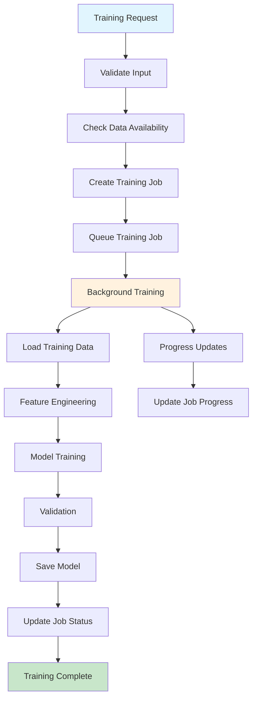

### 2. Prediction Workflow

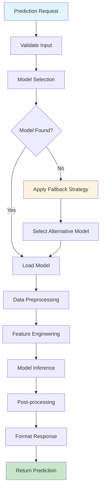

### 3. Data Management Flow

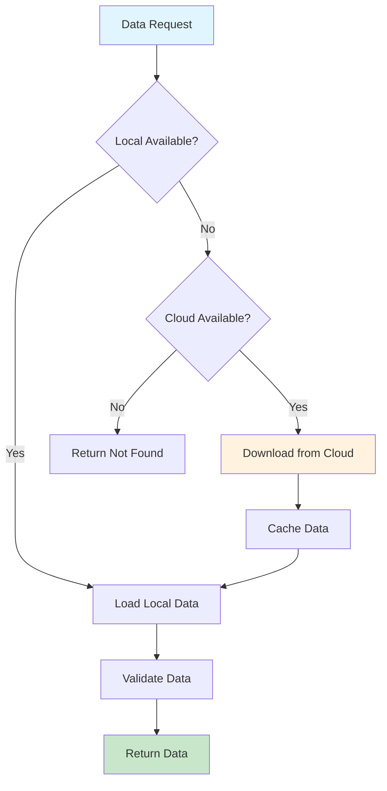

## 🎨 Design Patterns

### 1. Factory Pattern

**Usage**: Creating serving adapters and model instances

```python
class ServingAdapterFactory:
    @classmethod
    def create_adapter(cls, adapter_type: str, config: Dict[str, Any]) -> IModelServingAdapter:
        adapter_class = cls._adapter_classes.get(ServingAdapterType(adapter_type))
        if not adapter_class:
            raise ValueError(f"Unsupported adapter type: {adapter_type}")
        return adapter_class(config)
```

### 2. Strategy Pattern

**Usage**: Fallback strategies and serving backends

```python
class FallbackStrategy(Enum):
    NONE = "none"
    TIMEFRAME_ONLY = "timeframe_only"
    SYMBOL_ONLY = "symbol_only"
    TIMEFRAME_AND_SYMBOL = "timeframe_and_symbol"

class ModelFallbackUtils:
    async def select_model_with_fallback(self, strategy: FallbackStrategy, ...) -> ModelSelectionResult:
        if strategy == FallbackStrategy.TIMEFRAME_AND_SYMBOL:
            return await self._apply_timeframe_and_symbol_fallback(...)
        elif strategy == FallbackStrategy.TIMEFRAME_ONLY:
            return await self._apply_timeframe_fallback(...)
        # ... other strategies
```

### 3. Facade Pattern

**Usage**: Simplified interface for complex subsystems

```python
class UnifiedModelFacade:
    def __init__(self, serving_adapter: Optional[IModelServingAdapter] = None):
        self.training = ModelTrainingFacade()
        self.serving = ModelServingFacade(serving_adapter)

    async def train_and_predict(self, ...) -> Dict[str, Any]:
        # Complex orchestration hidden behind simple interface
        training_result = await self.training.train_model(...)
        prediction_result = await self.serving.predict(...)
        return self._combine_results(training_result, prediction_result)
```

### 4. Repository Pattern

**Usage**: Data access abstraction

```python
class TrainingJobRepositoryInterface(ABC):
    @abstractmethod
    async def create_job(self, job_info: TrainingJobInfo) -> bool:
        pass

    @abstractmethod
    async def get_job(self, job_id: str) -> Optional[TrainingJobInfo]:
        pass

class FileTrainingJobRepository(TrainingJobRepositoryInterface):
    async def create_job(self, job_info: TrainingJobInfo) -> bool:
        # File-based implementation

class RedisTrainingJobRepository(TrainingJobRepositoryInterface):
    async def create_job(self, job_info: TrainingJobInfo) -> bool:
        # Redis-based implementation
```

### 5. Observer Pattern

**Usage**: Progress tracking and event notification

```python
class TrainingProgressObserver:
    def __init__(self, job_id: str):
        self.job_id = job_id

    def on_progress_update(self, progress: float, stage: str):
        # Notify progress updates
        asyncio.create_task(self._notify_progress(progress, stage))

    def on_completion(self, result: Dict[str, Any]):
        # Notify completion
        asyncio.create_task(self._notify_completion(result))
```

## 🛠️ Technology Stack

### Core Framework

- **FastAPI**: Modern, fast web framework for building APIs
- **Pydantic**: Data validation and settings management
- **Uvicorn**: ASGI server for production deployment

### Machine Learning

- **PyTorch**: Deep learning framework
- **Transformers**: Hugging Face transformer models
- **PyTorch Lightning**: Training framework
- **MLflow**: Experiment tracking and model registry

### Data Processing

- **Pandas**: Data manipulation and analysis
- **NumPy**: Numerical computing
- **Scikit-learn**: Machine learning utilities

### Serving & Inference

- **Triton Inference Server**: NVIDIA's inference server
- **TorchServe**: PyTorch model serving
- **TorchScript**: Optimized model format

### Storage & Infrastructure

- **Redis**: In-memory data store and job queue
- **MinIO**: S3-compatible object storage
- **AWS S3**: Cloud object storage
- **DigitalOcean Spaces**: S3-compatible storage

### Monitoring & Observability

- **Eureka**: Service discovery and registration
- **Custom Logging**: Structured logging with correlation IDs
- **Health Checks**: Comprehensive health monitoring

## 🔗 Dependencies

### External Dependencies

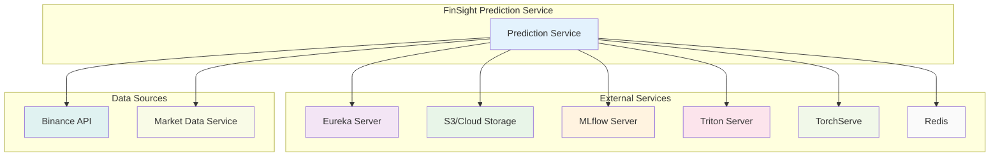

### Internal Dependencies

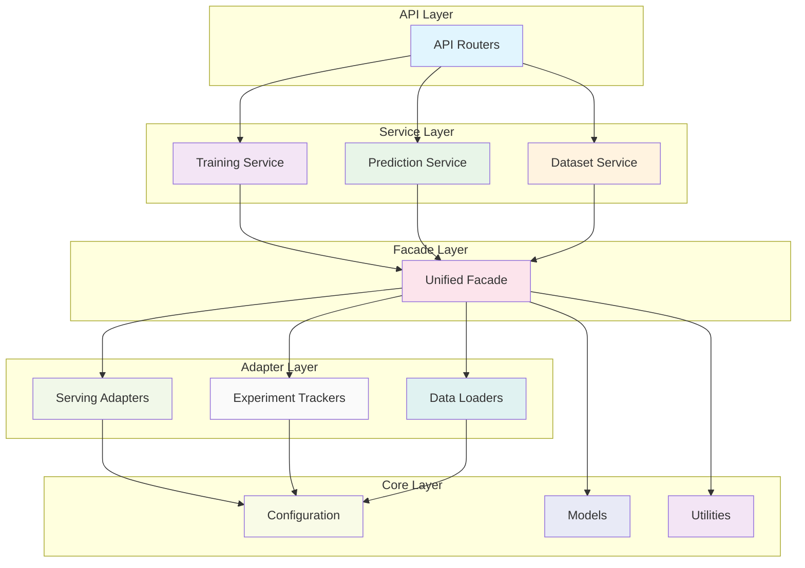

## 📈 Scalability & Performance

### Horizontal Scaling

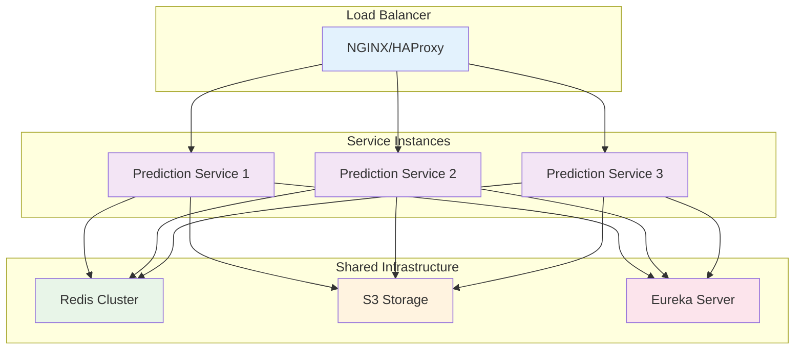

### Performance Optimizations

1. **Async Processing**: Full async/await support for I/O operations
2. **Connection Pooling**: Database and storage connection reuse
3. **Model Caching**: Intelligent model loading and eviction
4. **Batch Processing**: Configurable batch sizes for inference
5. **Memory Management**: Automatic memory cleanup and optimization

### Caching Strategy

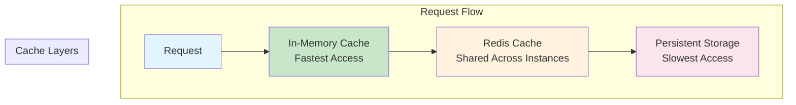

## 🔒 Security Architecture

### Security Layers

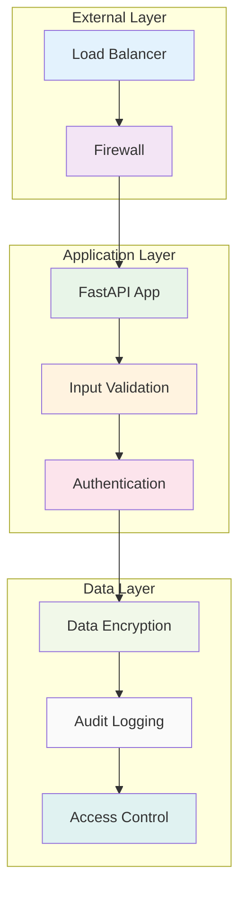

### Security Features

1. **Input Validation**: Pydantic schema validation
2. **Rate Limiting**: Configurable API rate limiting
3. **Error Handling**: Secure error responses
4. **Logging**: Security event logging
5. **Data Encryption**: At-rest and in-transit encryption

## 📊 Monitoring & Observability

### Monitoring Architecture

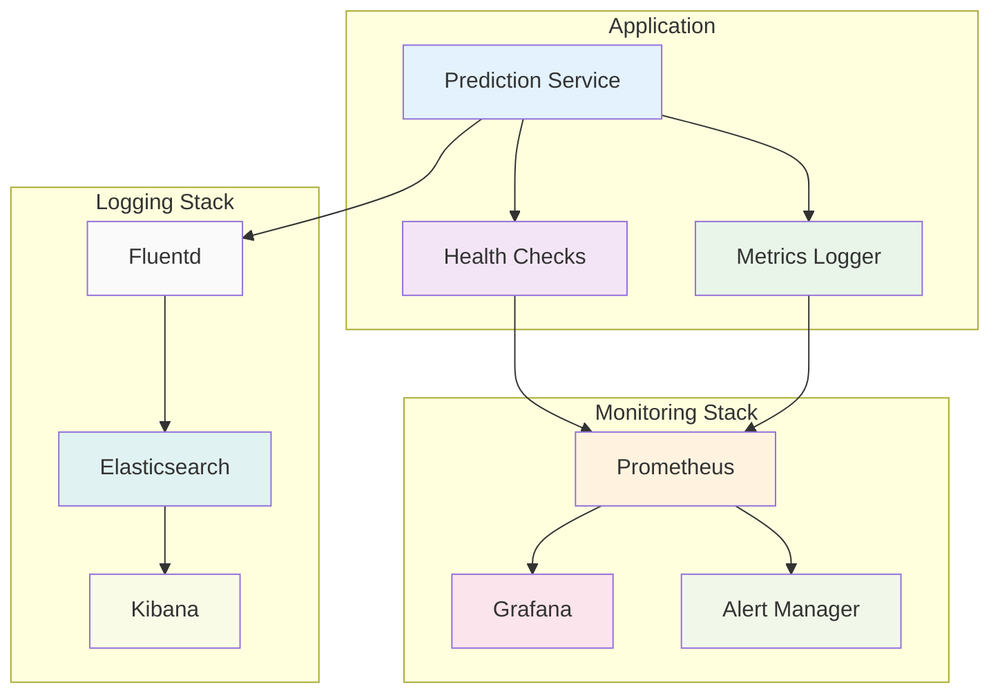

### Health Check Endpoints

- **`/health`**: Overall service health
- **`/serving/health`**: Model serving health
- **`/eureka/status`**: Service discovery status
- **`/cleanup/status`**: Background maintenance status

### Metrics Collection

1. **Application Metrics**: Request rates, response times, error rates
2. **Business Metrics**: Training success rates, prediction accuracy
3. **Infrastructure Metrics**: Memory usage, CPU utilization, disk I/O
4. **Custom Metrics**: Model loading times, inference latency

### Logging Strategy

1. **Structured Logging**: JSON format with correlation IDs
2. **Log Levels**: Configurable per component
3. **Log Rotation**: Automatic log file management
4. **Centralized Logging**: Aggregated log collection

## 🚀 Deployment Architecture

### Container Architecture

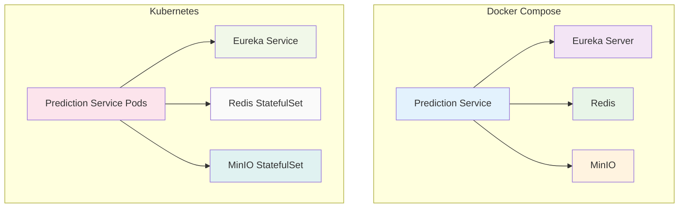

### Environment Configurations

1. **Development**: Local Docker Compose with simple adapters
2. **Staging**: Kubernetes with production-like configuration
3. **Production**: High-availability Kubernetes with external services

## 🔮 Future Architecture

### Planned Enhancements

1. **Event Sourcing**: CQRS pattern for training events
2. **GraphQL API**: Flexible data querying
3. **WebSocket Support**: Real-time prediction streaming
4. **Multi-Tenancy**: Isolated environments per client
5. **Federated Learning**: Distributed model training

### Architecture Evolution

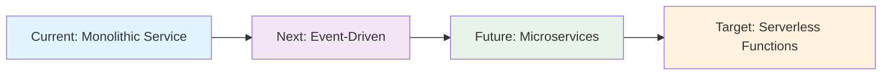

---

**For more information, see the [Configuration Guide](configuration.md) and [API Documentation](api.md).**
