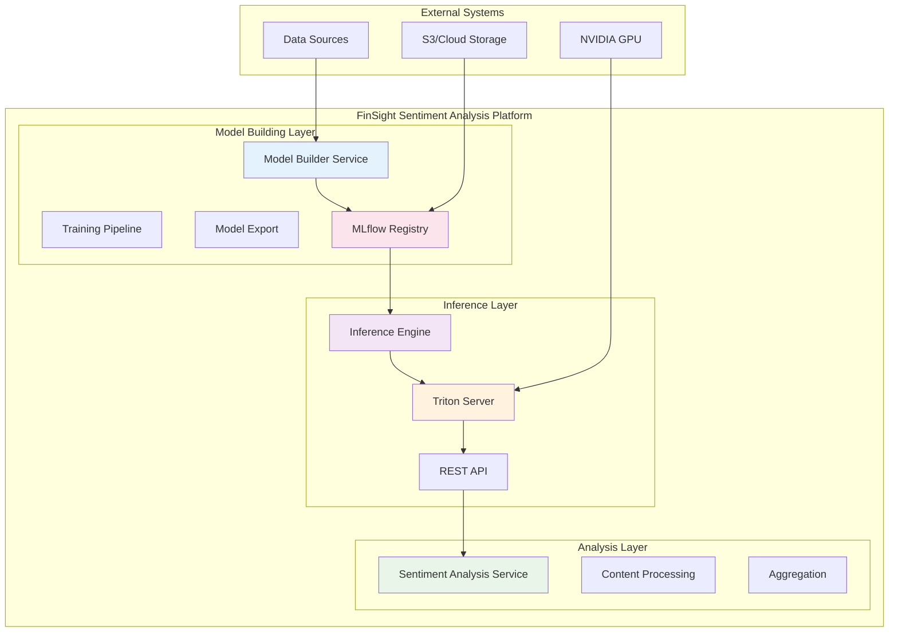

# FinSight Sentiment Analysis Platform

[](https://www.python.org/downloads/)
[](https://fastapi.tiangolo.com/)
[](https://pytorch.org/)
[](LICENSE)

> **AI-Powered Financial Sentiment Analysis Platform**  
> Enterprise-grade sentiment analysis services for cryptocurrency news using state-of-the-art transformer models

## 🚀 Overview

The FinSight Sentiment Analysis platform is a comprehensive, production-ready solution for financial sentiment analysis. Built with modern Python technologies and following microservices architecture principles, this platform delivers high-accuracy sentiment classification for cryptocurrency news and market data.

### 🏗️ Platform Architecture



## 🎯 Key Features

### **Sentiment Analysis Model Builder** 🧠

- **Fine-tune FinBERT** and other transformer models for crypto news sentiment analysis
- **Multi-format data support**: JSON, JSONL, CSV, Parquet
- **Reproducible training** with deterministic seeds and comprehensive logging
- **Model export** to ONNX and TorchScript formats with validation
- **MLflow integration** for experiment tracking and model versioning
- **S3/MinIO support** for artifact storage
- **Clean CLI interface** using Typer

### **Sentiment Analysis Inference Engine** ⚡

- **Automated Triton Server Management**: Automatic Docker container lifecycle management
- **High-Performance API**: GPU-accelerated inference with dynamic batching
- **Production Ready**: Comprehensive error handling, logging, and monitoring
- **Async Support**: Full async/await implementation for optimal performance
- **Health Monitoring**: Built-in health checks and metrics collection

### **Sentiment Analysis Service** 🔍

- **Content Processing**: Advanced text preprocessing and normalization
- **Batch Processing**: Efficient handling of large volumes of text data
- **Real-time Analysis**: Low-latency sentiment classification
- **Integration Ready**: RESTful API for easy integration with other services

## 🏛️ Architecture Overview

The platform follows **Hexagonal Architecture** (Ports & Adapters) principles, providing:

- **Clean Architecture**: Clear separation of concerns with dependency inversion
- **Hexagonal Design**: Adapter pattern for external integrations
- **Event-Driven**: Asynchronous processing with message queues
- **Microservices-Ready**: Service discovery and health monitoring
- **Cloud-Native**: Stateless design with externalized configuration
- **ML-First**: Optimized for machine learning workflows and model serving

### **Technology Stack**

- **Core Framework**: FastAPI, PyTorch, Transformers
- **ML Pipeline**: MLflow, Hugging Face, ONNX
- **Inference**: NVIDIA Triton Server, TorchScript
- **Storage**: S3/MinIO, SQLite, Redis
- **Monitoring**: Prometheus, Grafana, Custom logging
- **Containerization**: Docker, Docker Compose

## 🚀 Quick Start

### **Prerequisites**

- **Python**: 3.11+ (3.12 recommended)
- **Docker**: 20.10+ with Docker Compose 2.0+
- **GPU**: NVIDIA GPU with CUDA support (optional but recommended)
- **Memory**: 8GB+ RAM (16GB+ recommended)
- **Storage**: 50GB+ available space

### **1. Clone Repository**

```bash
git clone <repository-url>
cd FinSight/sentiment_analysis
```

### **2. Start Model Builder Service**

```bash
cd sentiment_analysis_model_builder

# Create virtual environment
python -m venv .venv
source .venv/bin/activate  # Linux/Mac
# .venv\Scripts\activate  # Windows

# Install dependencies
pip install -r requirements.txt

# Configure environment
cp env.example .env
# Edit .env with your settings

# Train a model
sentiment-train \
    --data data/news_dataset_sample.json \
    --output outputs/training_run \
    --experiment crypto-sentiment-v1
```

### **3. Start Inference Engine**

```bash
cd ../sentiment_analysis_inference_engine

# Create virtual environment
python -m venv .venv
source .venv/bin/activate

# Install dependencies
pip install -r requirements.txt

# Configure environment
cp env.example .env
# Edit .env with your settings

# Start service
python main.py
```

### **4. Test API**

```bash
# Single text analysis
curl -X POST "http://localhost:8080/predict" \
     -H "Content-Type: application/json" \
     -d '{"text": "Bitcoin shows strong bullish signals today."}'

# Batch analysis
curl -X POST "http://localhost:8080/predict/batch" \
     -H "Content-Type: application/json" \
     -d '{"texts": ["Bullish market", "Bearish signals"]}'
```

## 🐳 Docker Deployment

### **Quick Start with Docker Compose**

```bash
# Start all services
docker-compose up -d

# View logs
docker-compose logs -f

# Stop services
docker-compose down
```

### **Individual Service Deployment**

```bash
# Model Builder
cd sentiment_analysis_model_builder
docker build -t finsight/sentiment-model-builder .
docker run -p 8000:8000 finsight/sentiment-model-builder

# Inference Engine
cd sentiment_analysis_inference_engine
docker build -t finsight/sentiment-inference-engine .
docker run -p 8080:8080 finsight/sentiment-inference-engine
```

## 🧪 Testing

### **Unit Tests**

```bash
# Model Builder
cd sentiment_analysis_model_builder
pytest tests/ -v

# Inference Engine
cd sentiment_analysis_inference_engine
pytest tests/ -v
```

### **Integration Tests**

```bash
# Test complete pipeline
python -m pytest tests/integration/ -v

# Test with sample data
python scripts/test_pipeline.py
```

### **Performance Testing**

```bash
# Load testing
python scripts/load_test.py --requests 1000 --concurrent 10

# Benchmark inference
python scripts/benchmark.py --model-path models/exported
```

## 📊 Monitoring & Health Checks

### **Health Endpoints**

- **Model Builder**: `http://localhost:8000/health`
- **Inference Engine**: `http://localhost:8080/health`
- **Sentiment Service**: `http://localhost:8001/health`

### **Metrics & Observability**

- **Prometheus Metrics**: `/metrics` endpoints
- **Application Logs**: Structured logging with correlation IDs
- **Performance Monitoring**: Request latency, throughput, error rates
- **Model Performance**: Accuracy, confidence scores, inference time

## 🔧 Configuration

### **Environment Variables**

Each service has its own configuration file:

- **Model Builder**: `sentiment_analysis_model_builder/env.example`
- **Inference Engine**: `sentiment_analysis_inference_engine/env.example`
- **Sentiment Service**: `sentiment_analysis_service/env.example`

### **Key Configuration Areas**

- **Model Training**: Backbone models, hyperparameters, data preprocessing
- **Inference**: Triton server settings, GPU configuration, batch processing
- **API**: Rate limiting, CORS, authentication, logging levels
- **Storage**: S3 endpoints, MLflow tracking, artifact locations

## 📚 Documentation

### **Service-Specific Documentation**

- **[Model Builder Documentation](sentiment_analysis_model_builder/docs/)**: Training pipeline, model export, MLflow integration
- **[Inference Engine Documentation](sentiment_analysis_inference_engine/docs/)**: API reference, deployment, performance tuning
- **[Sentiment Service Documentation](sentiment_analysis_service/docs/)**: Service architecture, integration patterns

### **Platform Documentation**

- **[API Documentation](docs/api.md)**: Complete API reference with examples
- **[Configuration Guide](docs/configuration.md)**: Environment variables and settings
- **[Architecture Documentation](docs/architecture.md)**: System design and workflows
- **[Deployment Guide](docs/deployment.md)**: Production deployment and CI/CD

## 🚀 Production Deployment

### **Kubernetes Deployment**

```bash
# Apply manifests
kubectl apply -f k8s/namespace.yaml
kubectl apply -f k8s/configmap.yaml
kubectl apply -f k8s/deployment.yaml
kubectl apply -f k8s/service.yaml

# Check status
kubectl get pods -n sentiment-analysis
```

### **Helm Charts**

```bash
# Install charts
helm install sentiment-analysis ./helm-charts/sentiment-analysis \
    --namespace sentiment-analysis \
    --create-namespace

# Upgrade deployment
helm upgrade sentiment-analysis ./helm-charts/sentiment-analysis \
    --namespace sentiment-analysis
```

## 🤝 Contributing

### **Development Setup**

1. **Fork the repository**
2. **Create feature branch**: `git checkout -b feature/amazing-feature`
3. **Make changes** following the coding standards
4. **Run tests**: `pytest tests/ -v`
5. **Submit pull request**

### **Code Standards**

- **Python**: PEP 8, Black, isort, flake8
- **Type Hints**: Full type annotations for all functions
- **Documentation**: Google-style docstrings
- **Testing**: Minimum 80% code coverage
- **Logging**: Structured logging with correlation IDs

## 📄 License

This project is licensed under the MIT License - see the [LICENSE](LICENSE) file for details.

**For detailed information about each service, see the [service-specific documentation](sentiment_analysis_model_builder/docs/) and [platform documentation](docs/).**
