# FinSight Sentiment Analysis Platform - Architecture & Design

> **Complete System Architecture Documentation and Design Patterns**

## 🌐 Overview

The FinSight Sentiment Analysis platform is built using **Hexagonal Architecture** (Ports & Adapters) principles, providing a robust, scalable, and maintainable foundation for AI-powered financial sentiment analysis. The platform consists of three specialized services that work together to provide end-to-end sentiment analysis capabilities.

### **Key Architectural Features**

- **Clean Architecture**: Clear separation of concerns with dependency inversion
- **Hexagonal Design**: Adapter pattern for external integrations
- **Event-Driven**: Asynchronous processing with message queues
- **Microservices-Ready**: Service discovery and health monitoring
- **Cloud-Native**: Stateless design with externalized configuration
- **ML-First**: Optimized for machine learning workflows and model serving

## 🏗️ Architecture Principles

### 1. Separation of Concerns

- **Domain Layer**: Core business logic and sentiment analysis algorithms
- **Application Layer**: Use cases and orchestration workflows
- **Infrastructure Layer**: External integrations and persistence
- **Interface Layer**: API endpoints and controllers

### 2. Dependency Inversion

- High-level modules don't depend on low-level modules
- Both depend on abstractions (interfaces)
- Abstractions don't depend on details

### 3. Single Responsibility

- Each service has one reason to change
- Clear boundaries and interfaces
- Focused functionality per service

### 4. Open/Closed Principle

- Open for extension, closed for modification
- Plugin architecture for model backbones and serving backends
- Configurable preprocessing and post-processing pipelines

## 🏛️ System Architecture

### **High-Level Platform Architecture**

```mermaid
graph TB
    subgraph "External Systems"
        DS[Data Sources]
        S3[S3/Cloud Storage]
        GPU[NVIDIA GPU]
        ML[MLflow Server]
        TR[Triton Server]
    end

    subgraph "FinSight Sentiment Analysis Platform"
        subgraph "Model Building Layer"
            MB[Model Builder Service]
            TR2[Training Pipeline]
            EX[Model Export]
            ML2[MLflow Registry]
        end

        subgraph "Inference Layer"
            IE[Inference Engine]
            TS[Triton Server]
            API[REST API]
        end

        subgraph "Analysis Layer"
            SA[Sentiment Analysis Service]
            CR[Content Processing]
            AG[Aggregation]
        end
    end

    subgraph "Data Flow"
        DS --> MB
        MB --> ML2
        ML2 --> IE
        IE --> TS
        TS --> API
        API --> SA

        S3 --> ML2
        GPU --> TS

        style MB fill:#e3f2fd
        style IE fill:#f3e5f5
        style SA fill:#e8f5e8
        style TS fill:#fff3e0
        style ML2 fill:#fce4ec
```

### **Service Interaction Flow**

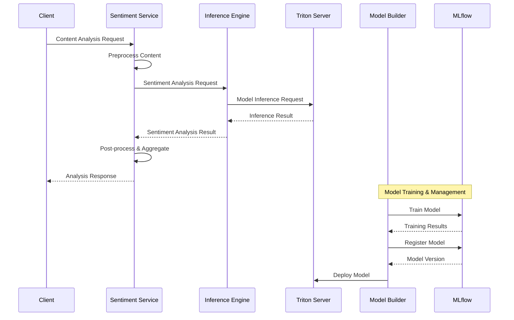

## 🧩 Service Architecture

## 🧠 Model Builder Service

### **Purpose**

The Model Builder Service is responsible for training, fine-tuning, and managing sentiment analysis models. It provides a complete ML pipeline from data preparation to model deployment.

### **Core Components**

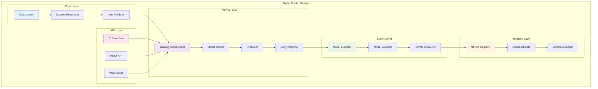

### **Module Architecture**

#### **1. Data Layer (`src/data/`)**

**Purpose**: Data loading, preprocessing, and validation

**Components**:

- **DataLoader**: Multi-format data loading (JSON, JSONL, CSV, Parquet)
- **DatasetPreparator**: Data splitting, tokenization, and formatting
- **DataValidator**: Data quality checks and validation

**Design Pattern**: Strategy pattern for different data formats

```python
class DataLoader:
    """Abstract data loader with format-specific implementations."""

    def __init__(self, format_type: DataFormat):
        self.loader = self._get_loader(format_type)

    def load_data(self, file_path: Path) -> pd.DataFrame:
        return self.loader.load(file_path)

class JSONDataLoader(DataLoader):
    """JSON-specific data loader implementation."""

    def load(self, file_path: Path) -> pd.DataFrame:
        with open(file_path, 'r') as f:
            data = json.load(f)
        return pd.DataFrame(data)
```

#### **2. Training Layer (`src/models/`)**

**Purpose**: Model training orchestration and execution

**Components**:

- **SentimentTrainer**: Training workflow management
- **ModelTrainer**: PyTorch Lightning training implementation
- **Evaluator**: Model performance evaluation
- **EarlyStopping**: Training optimization

**Design Pattern**: Template method pattern for training workflows

```python
class SentimentTrainer:
    """Training orchestration with configurable components."""

    async def train_model(self, config: TrainingConfig) -> TrainingResult:
        # 1. Prepare data
        train_data, val_data = await self._prepare_data(config)

        # 2. Initialize model
        model = self._initialize_model(config)

        # 3. Train model
        trainer = self._setup_trainer(config)
        result = await self._train(model, trainer, train_data, val_data)

        # 4. Evaluate and save
        return await self._finalize_training(result, config)
```

#### **3. Export Layer (`src/models/export/`)**

**Purpose**: Model export and format conversion

**Components**:

- **ModelExporter**: Export to different formats (ONNX, TorchScript)
- **ModelValidator**: Export validation and testing
- **FormatConverter**: Format-specific optimizations

**Design Pattern**: Factory pattern for export formats

```python
class ModelExporterFactory:
    """Factory for creating model exporters."""

    _exporters = {
        ExportFormat.ONNX: ONNXExporter,
        ExportFormat.TORCHSCRIPT: TorchScriptExporter,
        ExportFormat.TRITON: TritonExporter,
    }

    @classmethod
    def create_exporter(cls, format_type: ExportFormat) -> BaseExporter:
        exporter_class = cls._exporters.get(format_type)
        if not exporter_class:
            raise ValueError(f"Unsupported export format: {format_type}")
        return exporter_class()
```

#### **4. Registry Layer (`src/registry/`)**

**Purpose**: Model versioning and artifact management

**Components**:

- **MLflowRegistry**: MLflow integration for experiment tracking
- **ModelArtifacts**: Artifact storage and management
- **VersionManager**: Model versioning and lifecycle

**Design Pattern**: Repository pattern for model storage

```python
class MLflowRegistry:
    """MLflow-based model registry implementation."""

    async def register_model(self, model_path: Path, metadata: Dict) -> ModelVersion:
        with mlflow.start_run():
            # Log model artifacts
            mlflow.pytorch.log_model(model_path, "model")

            # Log parameters and metrics
            mlflow.log_params(metadata.get("parameters", {}))
            mlflow.log_metrics(metadata.get("metrics", {}))

            # Register model
            return mlflow.register_model(
                f"runs:/{mlflow.active_run().info.run_id}/model",
                metadata["model_name"]
            )
```

## ⚡ Inference Engine

### Purpose

The Inference Engine provides high-performance sentiment analysis using NVIDIA Triton Inference Server. It manages the complete inference pipeline from request handling to model serving.

### Core Components

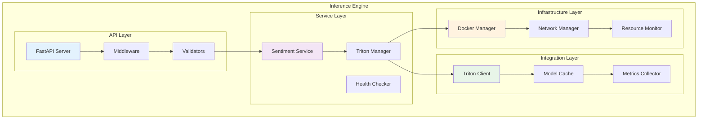

### Module Architecture

#### 1. API Layer (`src/api/`)

**Purpose**: HTTP API endpoints and request handling

**Components**:

- **FastAPI Server**: Main application server
- **Middleware**: CORS, rate limiting, authentication
- **Validators**: Request validation and sanitization

**Design Pattern**: Controller pattern with dependency injection

```python
@router.post("/predict")
async def predict_sentiment(
    request: SentimentRequest,
    sentiment_service: SentimentAnalysisService = Depends(get_sentiment_service)
) -> SentimentResult:
    """Predict sentiment for single text."""
    return await sentiment_service.predict(request.text)

@router.post("/predict/batch")
async def predict_batch_sentiment(
    request: BatchSentimentRequest,
    sentiment_service: SentimentAnalysisService = Depends(get_sentiment_service)
) -> BatchSentimentResult:
    """Predict sentiment for multiple texts."""
    return await sentiment_service.predict_batch(request.texts)
```

#### 2. Service Layer (`src/services/`)

**Purpose**: Business logic and service orchestration

**Components**:

- **SentimentAnalysisService**: Core sentiment analysis logic
- **TritonServerManager**: Triton server lifecycle management
- **HealthChecker**: Service health monitoring

**Design Pattern**: Service layer pattern with async support

```python
class SentimentAnalysisService:
    """Core sentiment analysis service."""

    def __init__(self, config: SentimentConfig, triton_host: str, triton_port: int):
        self.config = config
        self.triton_client = TritonClient(f"{triton_host}:{triton_port}")
        self.cache = LRUCache(config.cache_size, config.cache_ttl)

    async def predict(self, text: str) -> SentimentResult:
        # Check cache first
        cache_key = self._generate_cache_key(text)
        if cache_key in self.cache:
            return self.cache[cache_key]

        # Preprocess text
        processed_text = await self._preprocess_text(text)

        # Get prediction from Triton
        prediction = await self._get_prediction(processed_text)

        # Post-process and cache result
        result = self._postprocess_prediction(prediction, text)
        self.cache[cache_key] = result

        return result
```

#### 3. Integration Layer (`src/integration/`)

**Purpose**: External service integration and communication

**Components**:

- **TritonClient**: Triton server communication
- **ModelCache**: Result caching and optimization
- **MetricsCollector**: Performance metrics collection

**Design Pattern**: Adapter pattern for external services

```python
class TritonClient:
    """Client for communicating with Triton Inference Server."""

    def __init__(self, server_url: str):
        self.http_client = httpx.AsyncClient(base_url=server_url)
        self.grpc_client = grpc.aio.insecure_channel(server_url)

    async def predict(self, model_name: str, inputs: List[np.ndarray]) -> np.ndarray:
        """Send prediction request to Triton server."""

        # Prepare request
        request = {
            "inputs": [
                {
                    "name": "input_ids",
                    "shape": inputs[0].shape,
                    "datatype": "INT64",
                    "data": inputs[0].tolist()
                }
            ]
        }

        # Send request
        response = await self.http_client.post(
            f"/v2/models/{model_name}/infer",
            json=request
        )

        # Parse response
        result = response.json()
        return np.array(result["outputs"][0]["data"])
```

#### 4. Infrastructure Layer (`src/infrastructure/`)

**Purpose**: Infrastructure management and monitoring

**Components**:

- **DockerManager**: Docker container lifecycle management
- **NetworkManager**: Network configuration and management
- **ResourceMonitor**: Resource usage monitoring

**Design Pattern**: Manager pattern for infrastructure components

```python
class TritonServerManager:
    """Manages Triton Inference Server Docker container."""

    def __init__(self, config: TritonConfig):
        self.config = config
        self.docker_client = docker.from_env()
        self.container = None

    async def start_server(self) -> None:
        """Start Triton server container."""

        # Check if container already exists
        try:
            self.container = self.docker_client.containers.get(
                self.config.container_name
            )
            if self.container.status == "running":
                return
        except docker.errors.NotFound:
            pass

        # Start or create container
        if not self.container:
            self.container = await self._create_container()

        await self._start_container()
        await self._wait_for_ready()

    async def _create_container(self) -> Container:
        """Create new Triton server container."""

        return self.docker_client.containers.run(
            self.config.docker_image,
            name=self.config.container_name,
            ports={
                f"{self.config.http_port}/tcp": self.config.http_port,
                f"{self.config.grpc_port}/tcp": self.config.grpc_port,
                f"{self.config.metrics_port}/tcp": self.config.metrics_port,
            },
            volumes={
                self.config.model_repository: {
                    "bind": "/models",
                    "mode": "ro"
                }
            },
            environment={
                "CUDA_VISIBLE_DEVICES": "0" if self.config.gpu_enabled else "",
                "TRITON_GPU_MEMORY_FRACTION": str(self.config.gpu_memory_fraction),
            },
            detach=True,
            remove=True
        )
```

## 🔍 Sentiment Analysis Service

### Purpose

The Sentiment Analysis Service provides content processing, batch analysis, and sentiment aggregation capabilities. It acts as a high-level orchestrator for sentiment analysis workflows.

### Core Components

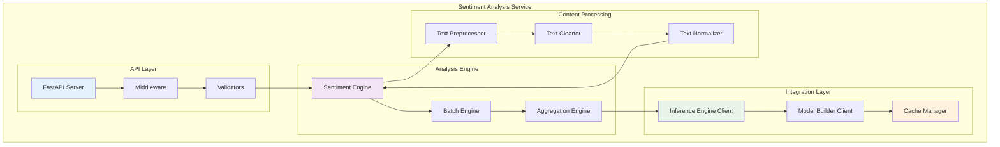

## 🔄 Data Flow

### 1. Model Training Workflow

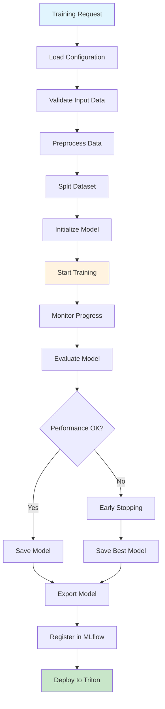

### 2. Inference Workflow

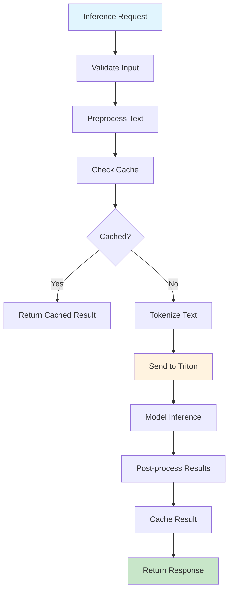

### 3. Batch Processing Workflow

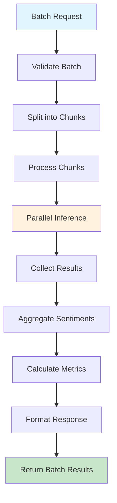

## 🎨 Design Patterns

### 1. Factory Pattern

**Usage**: Creating model exporters, data loaders, and service instances

```python
class ServiceFactory:
    """Factory for creating service instances."""

    @classmethod
    def create_sentiment_service(cls, config: Config) -> SentimentAnalysisService:
        if config.service_type == ServiceType.TRITON:
            return TritonSentimentService(config)
        elif config.service_type == ServiceType.DIRECT:
            return DirectSentimentService(config)
        else:
            raise ValueError(f"Unknown service type: {config.service_type}")
```

### 2. Strategy Pattern

**Usage**: Different preprocessing strategies and model backbones

```python
class PreprocessingStrategy(Enum):
    FINANCIAL = "financial"
    GENERAL = "general"
    CRYPTO = "crypto"

class PreprocessingFactory:
    """Factory for creating preprocessing strategies."""

    _strategies = {
        PreprocessingStrategy.FINANCIAL: FinancialPreprocessor,
        PreprocessingStrategy.GENERAL: GeneralPreprocessor,
        PreprocessingStrategy.CRYPTO: CryptoPreprocessor,
    }

    @classmethod
    def create_preprocessor(cls, strategy: PreprocessingStrategy) -> BasePreprocessor:
        strategy_class = cls._strategies.get(strategy)
        if not strategy_class:
            raise ValueError(f"Unknown preprocessing strategy: {strategy}")
        return strategy_class()
```

### 3. Observer Pattern

**Usage**: Training progress monitoring and event notification

```python
class TrainingObserver:
    """Observer for training progress updates."""

    def __init__(self, job_id: str):
        self.job_id = job_id
        self.callbacks = []

    def add_callback(self, callback: Callable):
        self.callbacks.append(callback)

    def notify_progress(self, progress: float, metrics: Dict):
        for callback in self.callbacks:
            callback(self.job_id, progress, metrics)

class TrainingProgressCallback:
    """Callback for training progress updates."""

    async def on_progress_update(self, job_id: str, progress: float, metrics: Dict):
        # Update job status in database
        await self.job_repository.update_progress(job_id, progress, metrics)

        # Send WebSocket notification
        await self.websocket_manager.broadcast_progress(job_id, progress, metrics)
```

### 4. Repository Pattern

**Usage**: Data access abstraction for models and artifacts

```python
class ModelRepository(ABC):
    """Abstract model repository interface."""

    @abstractmethod
    async def save_model(self, model: Model, metadata: Dict) -> ModelVersion:
        pass

    @abstractmethod
    async def get_model(self, version: str) -> Optional[Model]:
        pass

    @abstractmethod
    async def list_models(self, stage: Optional[str] = None) -> List[ModelVersion]:
        pass

class MLflowModelRepository(ModelRepository):
    """MLflow-based model repository implementation."""

    async def save_model(self, model: Model, metadata: Dict) -> ModelVersion:
        with mlflow.start_run():
            mlflow.pytorch.log_model(model.path, "model")
            mlflow.log_params(metadata.get("parameters", {}))
            mlflow.log_metrics(metadata.get("metrics", {}))

            return mlflow.register_model(
                f"runs:/{mlflow.active_run().info.run_id}/model",
                metadata["model_name"]
            )
```

### 5. Adapter Pattern

**Usage**: External service integration and format conversion

```python
class ModelServingAdapter(ABC):
    """Abstract model serving adapter interface."""

    @abstractmethod
    async def predict(self, inputs: List[np.ndarray]) -> np.ndarray:
        pass

    @abstractmethod
    async def health_check(self) -> bool:
        pass

class TritonAdapter(ModelServingAdapter):
    """Triton Inference Server adapter."""

    def __init__(self, config: TritonConfig):
        self.config = config
        self.client = TritonClient(f"{config.host}:{config.http_port}")

    async def predict(self, inputs: List[np.ndarray]) -> np.ndarray:
        return await self.client.predict(self.config.model_name, inputs)

    async def health_check(self) -> bool:
        try:
            response = await self.client.health_check()
            return response.status_code == 200
        except Exception:
            return False
```

## 🛠️ Technology Stack

### Core Framework

- **FastAPI**: Modern, fast web framework for building APIs
- **Pydantic**: Data validation and settings management
- **Uvicorn**: ASGI server for production deployment

### Machine Learning

- **PyTorch**: Deep learning framework
- **Transformers**: Hugging Face transformer models
- **PyTorch Lightning**: Training framework
- **MLflow**: Experiment tracking and model registry

### Model Serving

- **NVIDIA Triton**: High-performance inference server
- **ONNX**: Open Neural Network Exchange format
- **TorchScript**: Optimized PyTorch model format

### Data Processing

- **Pandas**: Data manipulation and analysis
- **NumPy**: Numerical computing
- **Scikit-learn**: Machine learning utilities

### Storage & Infrastructure

- **MinIO**: S3-compatible object storage
- **SQLite**: Local database for development
- **Redis**: Caching and session management

### Monitoring & Observability

- **Custom Logging**: Structured logging with correlation IDs
- **Health Checks**: Comprehensive health monitoring
- **Metrics Collection**: Performance and business metrics

## 🔗 Dependencies

### External Dependencies

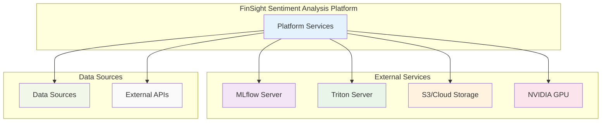

### Internal Dependencies

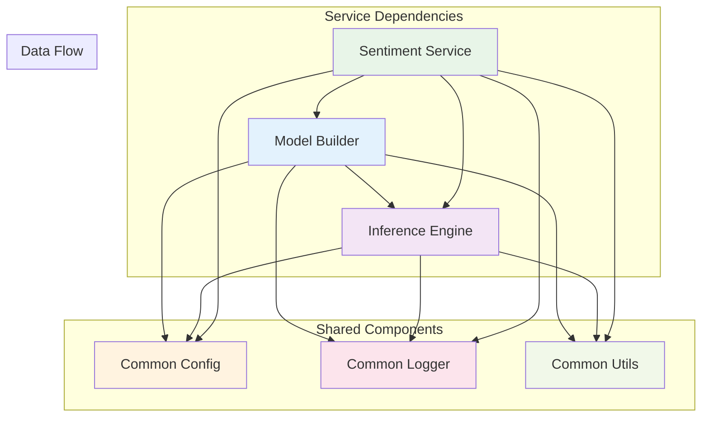

## 📈 Scalability & Performance

### Horizontal Scaling

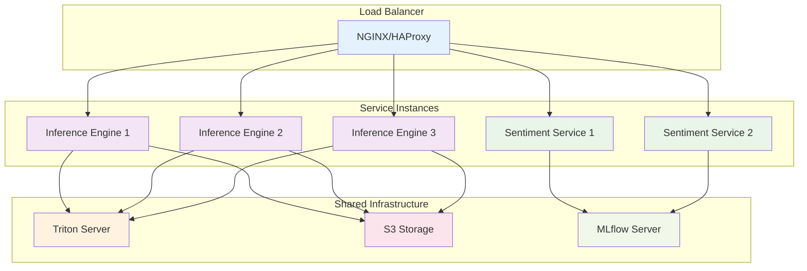

### Performance Optimizations

1. **Async Processing**: Full async/await support for I/O operations
2. **Model Caching**: Intelligent model loading and eviction
3. **Batch Processing**: Configurable batch sizes for inference
4. **GPU Optimization**: CUDA optimization and memory management
5. **Connection Pooling**: HTTP client connection reuse

### Caching Strategy

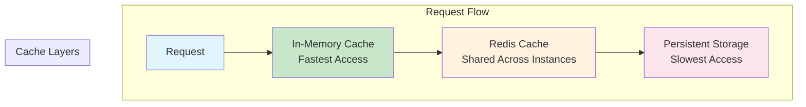

## 🔒 Security Architecture

### Security Layers

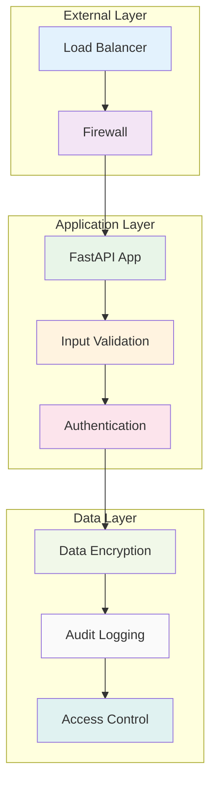

### Security Features

1. **Input Validation**: Pydantic schema validation
2. **Rate Limiting**: Configurable API rate limiting
3. **Error Handling**: Secure error responses
4. **Logging**: Security event logging
5. **Data Encryption**: At-rest and in-transit encryption

## 📊 Monitoring & Observability

### Monitoring Architecture

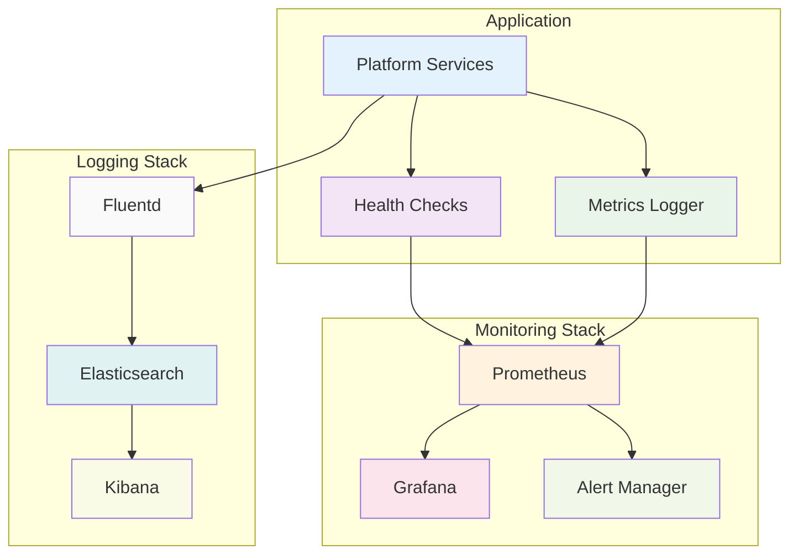

### Health Check Endpoints

- **`/health`**: Overall service health
- **`/health/detailed`**: Detailed health status
- **`/model/health`**: Model serving health
- **`/triton/health`**: Triton server health

### Metrics Collection

1. **Application Metrics**: Request rates, response times, error rates
2. **Business Metrics**: Sentiment accuracy, processing throughput
3. **Infrastructure Metrics**: GPU utilization, memory usage, disk I/O
4. **Custom Metrics**: Model loading times, inference latency

### Logging Strategy

1. **Structured Logging**: JSON format with correlation IDs
2. **Log Levels**: Configurable per component
3. **Log Rotation**: Automatic log file management
4. **Centralized Logging**: Aggregated log collection

## 🚀 Deployment Architecture

### Container Architecture

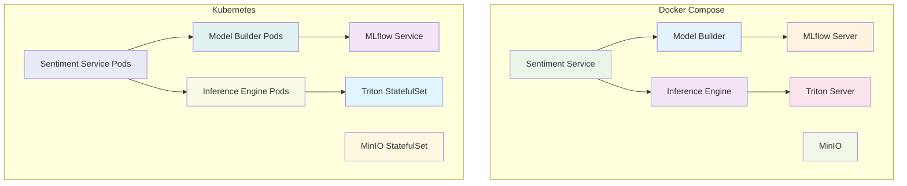

### Environment Configurations

1. **Development**: Local Docker Compose with simple configurations
2. **Staging**: Kubernetes with production-like configuration
3. **Production**: High-availability Kubernetes with external services

## 🔮 Future Architecture

### Planned Enhancements

1. **Event Sourcing**: CQRS pattern for training events
2. **GraphQL API**: Flexible data querying
3. **WebSocket Support**: Real-time training progress updates
4. **Multi-Tenancy**: Isolated environments per client
5. **Federated Learning**: Distributed model training

### Architecture Evolution


---

**For more information, see the [Configuration Guide](configuration.md) and [API Documentation](api.md).**
