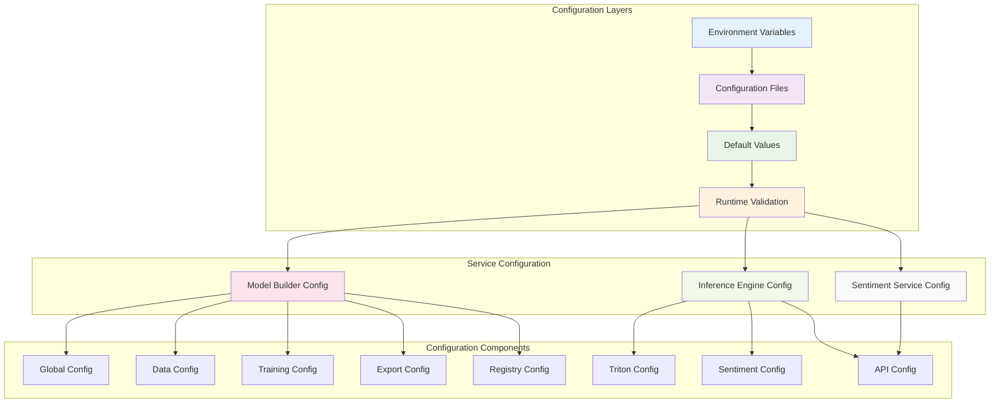

# FinSight Sentiment Analysis Platform - Configuration Guide

> **Complete Configuration Reference for Environment Variables and Settings**

## 🌐 Overview

The FinSight Sentiment Analysis platform uses environment-based configuration with Pydantic settings management. Each service has its own configuration namespace and validation rules, ensuring type safety and runtime validation.

### **Configuration Management**

- **Environment Variables**: Primary configuration method
- **Configuration Files**: YAML and .env file support
- **Validation**: Pydantic-based validation with custom validators
- **Type Safety**: Full type annotations and runtime type checking
- **Documentation**: Self-documenting configuration with descriptions

## 🏗️ Configuration Structure

### **Service Configuration Hierarchy**



## 🔧 Environment Variables

## 🌍 Global Configuration

### **Core Settings**

| Variable      | Description            | Default       | Required | Type   |
| ------------- | ---------------------- | ------------- | -------- | ------ |
| `ENVIRONMENT` | Deployment environment | `development` | No       | `str`  |
| `LOG_LEVEL`   | Logging level          | `INFO`        | No       | `str`  |
| `DEBUG`       | Enable debug mode      | `false`       | No       | `bool` |
| `OUTPUT_DIR`  | Base output directory  | `outputs`     | No       | `str`  |
| `CACHE_DIR`   | Cache directory        | `.cache`      | No       | `str`  |

### **Environment Values**

```bash
# Valid environment values
ENVIRONMENT=development    # Development environment
ENVIRONMENT=staging       # Staging environment
ENVIRONMENT=production    # Production environment

# Valid log levels
LOG_LEVEL=DEBUG          # Debug logging
LOG_LEVEL=INFO           # Info logging
LOG_LEVEL=WARNING        # Warning logging
LOG_LEVEL=ERROR          # Error logging
```

## 🧠 Model Builder Service

### **Data Configuration**

| Variable                   | Description             | Default                         | Required | Type   |
| -------------------------- | ----------------------- | ------------------------------- | -------- | ------ |
| `DATA_INPUT_PATH`          | Input data file path    | `data/news_dataset_sample.json` | Yes      | `str`  |
| `DATA_INPUT_FORMAT`        | Input data format       | `json`                          | No       | `str`  |
| `DATA_TEXT_COLUMN`         | Text column name        | `text`                          | No       | `str`  |
| `DATA_LABEL_COLUMN`        | Label column name       | `label`                         | No       | `str`  |
| `DATA_ID_COLUMN`           | ID column name          | `id`                            | No       | `str`  |
| `DATA_TITLE_COLUMN`        | Title column name       | `title`                         | No       | `str`  |
| `DATA_PUBLISHED_AT_COLUMN` | Published date column   | `published_at`                  | No       | `str`  |
| `DATA_TICKERS_COLUMN`      | Tickers column name     | `tickers`                       | No       | `str`  |
| `DATA_SPLIT_COLUMN`        | Split column name       | `split`                         | No       | `str`  |
| `DATA_VALIDATE_DATA`       | Enable data validation  | `true`                          | No       | `bool` |
| `DATA_MAX_SAMPLES`         | Maximum samples to load | ``                              | No       | `int`  |

### **Preprocessing Configuration**

| Variable                          | Description                  | Default                                        | Required | Type   |
| --------------------------------- | ---------------------------- | ---------------------------------------------- | -------- | ------ |
| `PREPROCESSING_REMOVE_HTML`       | Remove HTML tags             | `true`                                         | No       | `bool` |
| `PREPROCESSING_NORMALIZE_UNICODE` | Normalize Unicode characters | `true`                                         | No       | `bool` |
| `PREPROCESSING_LOWERCASE`         | Convert to lowercase         | `true`                                         | No       | `bool` |
| `PREPROCESSING_REMOVE_URLS`       | Remove URLs                  | `true`                                         | No       | `bool` |
| `PREPROCESSING_REMOVE_EMAILS`     | Remove email addresses       | `true`                                         | No       | `bool` |
| `PREPROCESSING_MAX_LENGTH`        | Maximum sequence length      | `512`                                          | No       | `int`  |
| `PREPROCESSING_MIN_LENGTH`        | Minimum sequence length      | `10`                                           | No       | `int`  |
| `PREPROCESSING_LABEL_MAPPING`     | Label to integer mapping     | `{"NEGATIVE": 0, "NEUTRAL": 1, "POSITIVE": 2}` | No       | `str`  |

### **Training Configuration**

| Variable                            | Description               | Default            | Required | Type    |
| ----------------------------------- | ------------------------- | ------------------ | -------- | ------- |
| `TRAINING_BACKBONE`                 | Model backbone            | `ProsusAI/finbert` | No       | `str`   |
| `TRAINING_BATCH_SIZE`               | Training batch size       | `16`               | No       | `int`   |
| `TRAINING_EVAL_BATCH_SIZE`          | Evaluation batch size     | `32`               | No       | `int`   |
| `TRAINING_LEARNING_RATE`            | Learning rate             | `2e-5`             | No       | `float` |
| `TRAINING_NUM_EPOCHS`               | Number of training epochs | `3`                | No       | `int`   |
| `TRAINING_WARMUP_STEPS`             | Warmup steps              | `500`              | No       | `int`   |
| `TRAINING_WEIGHT_DECAY`             | Weight decay              | `0.01`             | No       | `float` |
| `TRAINING_GRADIENT_CLIP_VAL`        | Gradient clipping value   | `1.0`              | No       | `float` |
| `TRAINING_TRAIN_SPLIT`              | Training split ratio      | `0.7`              | No       | `float` |
| `TRAINING_VAL_SPLIT`                | Validation split ratio    | `0.15`             | No       | `float` |
| `TRAINING_TEST_SPLIT`               | Test split ratio          | `0.15`             | No       | `float` |
| `TRAINING_RANDOM_SEED`              | Random seed               | `42`               | No       | `int`   |
| `TRAINING_EARLY_STOPPING_PATIENCE`  | Early stopping patience   | `3`                | No       | `int`   |
| `TRAINING_EARLY_STOPPING_THRESHOLD` | Early stopping threshold  | `0.001`            | No       | `float` |
| `TRAINING_PRIMARY_METRIC`           | Primary evaluation metric | `f1_macro`         | No       | `str`   |

### **Export Configuration**

| Variable                    | Description                | Default           | Required | Type   |
| --------------------------- | -------------------------- | ----------------- | -------- | ------ |
| `EXPORT_FORMAT`             | Export format              | `onnx`            | No       | `str`  |
| `EXPORT_ONNX_OPSET_VERSION` | ONNX opset version         | `17`              | No       | `int`  |
| `EXPORT_ONNX_DYNAMIC_AXES`  | Enable dynamic axes        | `true`            | No       | `bool` |
| `EXPORT_OUTPUT_DIR`         | Export output directory    | `models/exported` | No       | `str`  |
| `EXPORT_VALIDATE_EXPORT`    | Validate exported model    | `true`            | No       | `bool` |
| `EXPORT_TEST_BATCH_SIZE`    | Test batch size for export | `1`               | No       | `int`  |

### **Registry Configuration (MLflow)**

| Variable                     | Description         | Default                  | Required | Type  |
| ---------------------------- | ------------------- | ------------------------ | -------- | ----- |
| `REGISTRY_TRACKING_URI`      | MLflow tracking URI | `http://localhost:5000`  | No       | `str` |
| `REGISTRY_REGISTRY_URI`      | MLflow registry URI | ``                       | No       | `str` |
| `REGISTRY_BACKEND_STORE_URI` | Backend store URI   | `sqlite:///mlflow.db`    | No       | `str` |
| `REGISTRY_MODEL_NAME`        | Model name          | `crypto-news-sentiment`  | No       | `str` |
| `REGISTRY_MODEL_STAGE`       | Model stage         | `Staging`                | No       | `str` |
| `REGISTRY_ARTIFACT_LOCATION` | Artifact location   | `s3://mlflow-artifacts/` | No       | `str` |
| `REGISTRY_MLFLOW_HOST`       | MLflow host         | `0.0.0.0`                | No       | `str` |
| `REGISTRY_MLFLOW_PORT`       | MLflow port         | `5000`                   | No       | `int` |

### **MinIO Configuration (S3-compatible storage)**

| Variable                         | Description           | Default                 | Required | Type  |
| -------------------------------- | --------------------- | ----------------------- | -------- | ----- |
| `REGISTRY_AWS_ACCESS_KEY_ID`     | AWS access key ID     | `minioadmin`            | No       | `str` |
| `REGISTRY_AWS_SECRET_ACCESS_KEY` | AWS secret access key | `minioadmin`            | No       | `str` |
| `REGISTRY_AWS_REGION`            | AWS region            | `us-east-1`             | No       | `str` |
| `REGISTRY_S3_ENDPOINT_URL`       | S3 endpoint URL       | `http://localhost:9000` | No       | `str` |

### **API Configuration**

| Variable                        | Description               | Default                                        | Required | Type   |
| ------------------------------- | ------------------------- | ---------------------------------------------- | -------- | ------ |
| `API_HOST`                      | API host                  | `0.0.0.0`                                      | No       | `str`  |
| `API_PORT`                      | API port                  | `8000`                                         | No       | `int`  |
| `API_DEBUG`                     | Enable debug mode         | `false`                                        | No       | `bool` |
| `API_RELOAD`                    | Enable auto-reload        | `false`                                        | No       | `bool` |
| `API_TITLE`                     | API title                 | `FinBERT Sentiment Analysis API`               | No       | `str`  |
| `API_DESCRIPTION`               | API description           | `RESTful API for financial sentiment analysis` | No       | `str`  |
| `API_VERSION`                   | API version               | `1.0.0`                                        | No       | `str`  |
| `API_MODEL_PATH`                | Model path                | `outputs/model`                                | No       | `str`  |
| `API_PREPROCESSING_CONFIG_PATH` | Preprocessing config path | `outputs/preprocessing_config.json`            | No       | `str`  |
| `API_LABEL_MAPPING_PATH`        | Label mapping path        | `outputs/id2label.json`                        | No       | `str`  |
| `API_MAX_BATCH_SIZE`            | Maximum batch size        | `32`                                           | No       | `int`  |
| `API_MAX_TEXT_LENGTH`           | Maximum text length       | `512`                                          | No       | `int`  |
| `API_DEVICE`                    | Device for inference      | `auto`                                         | No       | `str`  |
| `API_WORKERS`                   | Number of workers         | `1`                                            | No       | `int`  |
| `API_TIMEOUT`                   | Request timeout           | `30`                                           | No       | `int`  |

### **CORS Configuration**

| Variable                | Description       | Default | Required | Type   |
| ----------------------- | ----------------- | ------- | -------- | ------ |
| `API_ALLOW_ORIGINS`     | Allowed origins   | `["*"]` | No       | `str`  |
| `API_ALLOW_CREDENTIALS` | Allow credentials | `true`  | No       | `bool` |
| `API_ALLOW_METHODS`     | Allowed methods   | `["*"]` | No       | `str`  |
| `API_ALLOW_HEADERS`     | Allowed headers   | `["*"]` | No       | `str`  |

## ⚡ Inference Engine

### **Triton Server Configuration**

| Variable                       | Description                     | Default                                                              | Required | Type    |
| ------------------------------ | ------------------------------- | -------------------------------------------------------------------- | -------- | ------- |
| `TRITON_HOST`                  | Triton server host              | `localhost`                                                          | No       | `str`   |
| `TRITON_HTTP_PORT`             | Triton HTTP port                | `8000`                                                               | No       | `int`   |
| `TRITON_GRPC_PORT`             | Triton gRPC port                | `8001`                                                               | No       | `int`   |
| `TRITON_METRICS_PORT`          | Triton metrics port             | `8002`                                                               | No       | `int`   |
| `TRITON_MODEL_REPOSITORY`      | Model repository path           | `../sentiment_analysis_model_builder/models/triton_model_repository` | Yes      | `str`   |
| `TRITON_MODEL_NAME`            | Model name                      | `finbert_sentiment`                                                  | No       | `str`   |
| `TRITON_DOCKER_IMAGE`          | Docker image                    | `nvcr.io/nvidia/tritonserver:23.10-py3`                              | No       | `str`   |
| `TRITON_CONTAINER_NAME`        | Container name                  | `triton-inference-server`                                            | No       | `str`   |
| `TRITON_STARTUP_TIMEOUT`       | Startup timeout (seconds)       | `120`                                                                | No       | `int`   |
| `TRITON_HEALTH_CHECK_INTERVAL` | Health check interval (seconds) | `5`                                                                  | No       | `int`   |
| `TRITON_GPU_ENABLED`           | Enable GPU support              | `true`                                                               | No       | `bool`  |
| `TRITON_GPU_MEMORY_FRACTION`   | GPU memory fraction             | `0.8`                                                                | No       | `float` |

### **Sentiment Analysis Configuration**

| Variable                     | Description                  | Default             | Required | Type  |
| ---------------------------- | ---------------------------- | ------------------- | -------- | ----- |
| `SENTIMENT_MODEL_NAME`       | Model name                   | `finbert_sentiment` | No       | `str` |
| `SENTIMENT_TOKENIZER_NAME`   | Tokenizer name               | `ProsusAI/finbert`  | No       | `str` |
| `SENTIMENT_MAX_LENGTH`       | Maximum sequence length      | `512`               | No       | `int` |
| `SENTIMENT_MAX_BATCH_SIZE`   | Maximum batch size           | `32`                | No       | `int` |
| `SENTIMENT_BATCH_TIMEOUT_MS` | Batch timeout (milliseconds) | `100`               | No       | `int` |
| `SENTIMENT_CACHE_SIZE`       | Cache size                   | `1000`              | No       | `int` |
| `SENTIMENT_CACHE_TTL`        | Cache TTL (seconds)          | `3600`              | No       | `int` |

### API Configuration

| Variable                  | Description               | Default   | Required | Type   |
| ------------------------- | ------------------------- | --------- | -------- | ------ |
| `API_HOST`                | API host                  | `0.0.0.0` | No       | `str`  |
| `API_PORT`                | API port                  | `8080`    | No       | `int`  |
| `API_RELOAD`              | Enable auto-reload        | `false`   | No       | `bool` |
| `API_LOG_LEVEL`           | Log level                 | `INFO`    | No       | `str`  |
| `API_ACCESS_LOG`          | Enable access logging     | `true`    | No       | `bool` |
| `API_RATE_LIMIT_ENABLED`  | Enable rate limiting      | `true`    | No       | `bool` |
| `API_RATE_LIMIT_REQUESTS` | Rate limit requests       | `100`     | No       | `int`  |
| `API_REQUEST_TIMEOUT`     | Request timeout (seconds) | `30`      | No       | `int`  |

### CORS Configuration

| Variable            | Description     | Default           | Required | Type  |
| ------------------- | --------------- | ----------------- | -------- | ----- |
| `API_ALLOW_ORIGINS` | Allowed origins | `["*"]`           | No       | `str` |
| `API_ALLOW_METHODS` | Allowed methods | `["GET", "POST"]` | No       | `str` |
| `API_ALLOW_HEADERS` | Allowed headers | `["*"]`           | No       | `str` |

### **Global Configuration**

| Variable      | Description    | Default       | Required | Type   |
| ------------- | -------------- | ------------- | -------- | ------ |
| `ENVIRONMENT` | Environment    | `development` | No       | `str`  |
| `DEBUG`       | Debug mode     | `false`       | No       | `bool` |
| `LOG_DIR`     | Log directory  | `logs`        | No       | `str`  |
| `DATA_DIR`    | Data directory | `data`        | No       | `str`  |

## 🔍 Sentiment Analysis Service

### **Service Configuration**

| Variable                  | Description         | Default   | Required | Type  |
| ------------------------- | ------------------- | --------- | -------- | ----- |
| `SERVICE_HOST`            | Service host        | `0.0.0.0` | No       | `str` |
| `SERVICE_PORT`            | Service port        | `8001`    | No       | `int` |
| `SERVICE_LOG_LEVEL`       | Log level           | `INFO`    | No       | `str` |
| `SERVICE_WORKERS`         | Number of workers   | `4`       | No       | `int` |
| `SERVICE_MAX_CONNECTIONS` | Maximum connections | `1000`    | No       | `int` |

### **Processing Configuration**

| Variable                     | Description           | Default | Required | Type   |
| ---------------------------- | --------------------- | ------- | -------- | ------ |
| `PROCESSING_MAX_TEXT_LENGTH` | Maximum text length   | `2048`  | No       | `int`  |
| `PROCESSING_BATCH_SIZE`      | Batch processing size | `100`   | No       | `int`  |
| `PROCESSING_TIMEOUT_SECONDS` | Processing timeout    | `60`    | No       | `int`  |
| `PROCESSING_ENABLE_CACHING`  | Enable result caching | `true`  | No       | `bool` |
| `PROCESSING_CACHE_TTL_HOURS` | Cache TTL (hours)     | `24`    | No       | `int`  |

### **Integration Configuration**

| Variable                  | Description          | Default                 | Required | Type  |
| ------------------------- | -------------------- | ----------------------- | -------- | ----- |
| `INFERENCE_ENGINE_URL`    | Inference engine URL | `http://localhost:8080` | Yes      | `str` |
| `MODEL_BUILDER_URL`       | Model builder URL    | `http://localhost:8000` | No       | `str` |
| `API_TIMEOUT_SECONDS`     | API timeout          | `30`                    | No       | `int` |
| `API_RETRY_ATTEMPTS`      | Retry attempts       | `3`                     | No       | `int` |
| `API_RETRY_DELAY_SECONDS` | Retry delay          | `1`                     | No       | `int` |

## 📁 Configuration Files

### **Environment File Structure**

```bash
# .env file structure
sentiment_analysis/
├── sentiment_analysis_model_builder/
│   ├── .env                    # Model builder configuration
│   └── env.example            # Example configuration
├── sentiment_analysis_inference_engine/
│   ├── .env                   # Inference engine configuration
│   └── env.example            # Example configuration
└── sentiment_analysis_service/
    ├── .env                   # Sentiment service configuration
    └── env.example            # Example configuration
```

### **YAML Configuration Support**

```yaml
# config.yaml example
environment: production
log_level: INFO
debug: false

model_builder:
  data:
    input_path: "data/production_dataset.json"
    validate_data: true
  training:
    backbone: "ProsusAI/finbert"
    batch_size: 32
    learning_rate: 1e-5
    num_epochs: 10

inference_engine:
  triton:
    host: "triton.production.finsight.ai"
    port: 8000
    gpu_enabled: true
  api:
    host: "0.0.0.0"
    port: 8080
    rate_limit_enabled: true

sentiment_service:
  host: "0.0.0.0"
  port: 8001
  workers: 8
  max_connections: 2000
```

### **Configuration Loading Priority**

1. **Environment Variables** (highest priority)
2. **Configuration Files** (YAML, .env)
3. **Default Values** (lowest priority)

```python
# Configuration loading example
from pydantic_settings import BaseSettings

class Config(BaseSettings):
    # Load from environment variables first
    # Then from .env file
    # Finally use default values
    model_config = SettingsConfigDict(
        env_file=".env",
        env_file_encoding="utf-8",
        case_sensitive=False
    )
```

## 🌍 Environment-Specific Configurations

### **Development Environment**

```bash
# .env.development
ENVIRONMENT=development
LOG_LEVEL=DEBUG
DEBUG=true

# Model Builder
DATA_INPUT_PATH=data/news_dataset_sample.json
TRAINING_BATCH_SIZE=8
TRAINING_NUM_EPOCHS=2

# Inference Engine
TRITON_HOST=localhost
TRITON_GPU_ENABLED=false
API_LOG_LEVEL=DEBUG

# Sentiment Service
SERVICE_WORKERS=2
PROCESSING_BATCH_SIZE=50
```

### **Staging Environment**

```bash
# .env.staging
ENVIRONMENT=staging
LOG_LEVEL=INFO
DEBUG=false

# Model Builder
DATA_INPUT_PATH=data/staging_dataset.json
TRAINING_BATCH_SIZE=16
TRAINING_NUM_EPOCHS=5

# Inference Engine
TRITON_HOST=triton.staging.finsight.ai
TRITON_GPU_ENABLED=true
API_RATE_LIMIT_ENABLED=true

# Sentiment Service
SERVICE_WORKERS=4
PROCESSING_BATCH_SIZE=100
```

### **Production Environment**

```bash
# .env.production
ENVIRONMENT=production
LOG_LEVEL=WARNING
DEBUG=false

# Model Builder
DATA_INPUT_PATH=data/production_dataset.json
TRAINING_BATCH_SIZE=32
TRAINING_NUM_EPOCHS=10

# Inference Engine
TRITON_HOST=triton.production.finsight.ai
TRITON_GPU_ENABLED=true
API_RATE_LIMIT_ENABLED=true
API_RATE_LIMIT_REQUESTS=1000

# Sentiment Service
SERVICE_WORKERS=8
PROCESSING_BATCH_SIZE=200
PROCESSING_ENABLE_CACHING=true
```

## ✅ Validation Rules

### **Data Validation**

```python
# Pydantic validation example
from pydantic import BaseSettings, Field, validator

class TrainingConfig(BaseSettings):
    batch_size: int = Field(default=16, ge=1, le=128)
    learning_rate: float = Field(default=2e-5, gt=0, le=1)
    num_epochs: int = Field(default=3, ge=1, le=100)

    @validator('batch_size')
    def validate_batch_size(cls, v):
        if v % 2 != 0:
            raise ValueError('batch_size must be even for mixed precision')
        return v
```

### **Configuration Validation**

| Field                        | Validation Rule       | Example                |
| ---------------------------- | --------------------- | ---------------------- |
| `TRAINING_BATCH_SIZE`        | Must be even, 1-128   | `16`, `32`, `64`       |
| `TRAINING_LEARNING_RATE`     | Must be positive, ≤ 1 | `1e-5`, `2e-5`, `1e-4` |
| `TRAINING_NUM_EPOCHS`        | Must be 1-100         | `3`, `10`, `50`        |
| `PREPROCESSING_MAX_LENGTH`   | Must be 64-512        | `256`, `384`, `512`    |
| `API_PORT`                   | Must be 1024-65535    | `8000`, `8080`, `9000` |
| `TRITON_GPU_MEMORY_FRACTION` | Must be 0.1-1.0       | `0.5`, `0.8`, `1.0`    |

### **Required vs Optional Fields**

#### **Required Fields**

- `DATA_INPUT_PATH`: Input data file path
- `TRITON_MODEL_REPOSITORY`: Model repository path
- `INFERENCE_ENGINE_URL`: Inference engine URL

#### **Optional Fields with Sensible Defaults**

- `LOG_LEVEL`: Defaults to `INFO`
- `TRAINING_BATCH_SIZE`: Defaults to `16`
- `API_PORT`: Defaults to service-specific port
- `TRITON_GPU_ENABLED`: Defaults to `true`

## 🎯 Best Practices

### Configuration Management

1. **Environment Separation**: Use different .env files for each environment
2. **Secret Management**: Store sensitive data in environment variables, not in files
3. **Validation**: Always validate configuration at startup
4. **Documentation**: Document all configuration options with examples
5. **Defaults**: Provide sensible defaults for all optional configurations

### **Security Considerations**

```bash
# Secure configuration practices
# ❌ Don't do this
API_KEY=hardcoded_secret_key
DATABASE_PASSWORD=password123

# ✅ Do this instead
API_KEY=${SENTIMENT_API_KEY}
DATABASE_PASSWORD=${DB_PASSWORD}
```

### **Performance Tuning**

```bash
# Performance-optimized configuration
# High-throughput inference
TRITON_GPU_MEMORY_FRACTION=0.9
SENTIMENT_MAX_BATCH_SIZE=64
API_WORKERS=8

# Memory-optimized training
TRAINING_BATCH_SIZE=8
TRAINING_GRADIENT_ACCUMULATION_STEPS=4
```

### **Monitoring and Observability**

```bash
# Monitoring configuration
LOG_LEVEL=INFO
API_ACCESS_LOG=true
API_METRICS_ENABLED=true
HEALTH_CHECK_INTERVAL=30
```

---

**For more information, see the [API Documentation](api.md) and [Architecture Documentation](architecture.md).**
