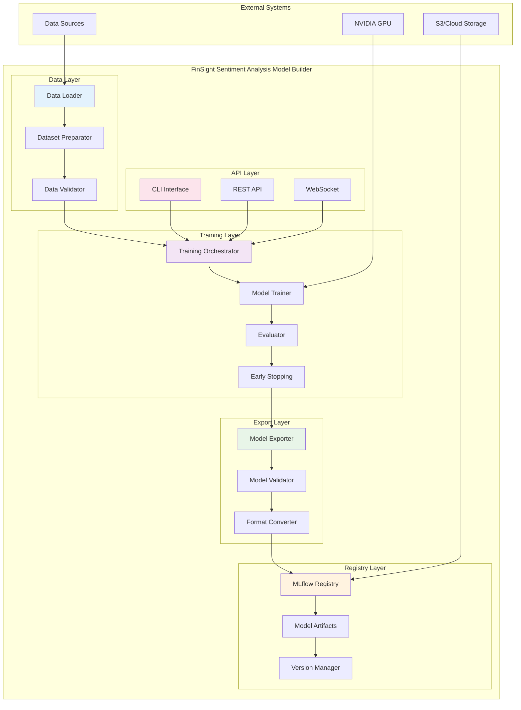

# FinSight Sentiment Analysis Model Builder

[](https://www.python.org/downloads/)
[](https://pytorch.org/)
[](https://mlflow.org/)
[](LICENSE)

> **Production-Ready Model Training Pipeline for Financial Sentiment Analysis**  
> Enterprise-grade model builder for fine-tuning transformer models on cryptocurrency news data

## 🚀 Overview

The FinSight Sentiment Analysis Model Builder is a comprehensive, production-ready solution for training and packaging sentiment analysis models for cryptocurrency news. Built with modern Python technologies and following enterprise-grade practices, this service provides a complete ML pipeline from data preparation to model deployment.

### 🏗️ Service Architecture



## 🎯 Key Features

### **Advanced Model Training** 🧠

- **Fine-tune FinBERT** and other transformer models for crypto news sentiment analysis
- **Multi-format data support**: JSON, JSONL, CSV, Parquet with automatic format detection
- **Reproducible training** with deterministic seeds and comprehensive logging
- **Advanced preprocessing** with configurable text cleaning and normalization
- **Multi-GPU support** with distributed training capabilities

### **Model Export & Deployment** 📦

- **Multi-format export**: ONNX, TorchScript, and Triton-ready formats
- **Model validation** with comprehensive testing and performance verification
- **Optimization pipeline** with quantization and pruning support
- **Deployment artifacts** including preprocessing configs and label mappings

### **Experiment Management** 📊

- **MLflow integration** for experiment tracking and model versioning
- **S3/MinIO support** for artifact storage and model registry
- **Comprehensive metrics** with detailed evaluation reports
- **Model comparison** with A/B testing capabilities

### **Production Ready** 🏭

- **Clean CLI interface** using Typer with rich output
- **Docker support** with optimized containerization
- **Comprehensive testing** with unit and integration tests
- **Configuration management** with environment-based settings

## 🏛️ Architecture Overview

The service follows **Hexagonal Architecture** (Ports & Adapters) principles, providing:

- **Clean Architecture**: Clear separation of concerns with dependency inversion
- **Hexagonal Design**: Adapter pattern for external integrations
- **SOLID Principles**: Single responsibility, open/closed, Liskov substitution, interface segregation, dependency inversion
- **ML-First**: Optimized for machine learning workflows and model serving

### **Technology Stack**

- **Core Framework**: PyTorch, Transformers, PyTorch Lightning
- **ML Pipeline**: MLflow, Hugging Face, ONNX
- **Data Processing**: Pandas, NumPy, Scikit-learn
- **Storage**: S3/MinIO, SQLite, Local file system
- **Monitoring**: MLflow tracking, custom logging
- **Containerization**: Docker, Docker Compose

## 🚀 Quick Start

### **Prerequisites**

- **Python**: 3.11+ (3.12 recommended)
- **PyTorch**: 2.0+ with CUDA support (optional but recommended)
- **Memory**: 8GB+ RAM (16GB+ recommended for large datasets)
- **Storage**: 50GB+ available space
- **GPU**: NVIDIA GPU with CUDA support (optional but recommended)

### **1. Installation**

```bash
# Clone the repository
git clone <repository-url>
cd sentiment_analysis_model_builder

# Create virtual environment
python -m venv .venv
source .venv/bin/activate  # Linux/Mac
# .venv\Scripts\activate  # Windows

# Install dependencies
pip install -r requirements.txt

# Install in development mode
pip install -e .
```

### **2. Configuration**

```bash
# Copy example configuration
cp env.example .env

# Edit configuration (see Configuration section below)
nano .env
```

### **3. Train a Model**

```bash
# Train using the sample dataset
sentiment-train \
    --data data/news_dataset_sample.json \
    --output outputs/training_run_$(date +%Y%m%d_%H%M%S) \
    --experiment crypto-sentiment-v1
```

### **4. Export Model**

```bash
# Export to ONNX format
sentiment-export \
    outputs/training_run_*/model \
    --output models/exported \
    --format onnx
```

### **5. Register Model**

```bash
# Register in MLflow (use run_id from training output)
sentiment-register \
    outputs/training_run_*/model \
    --run-id <mlflow_run_id> \
    --stage Staging
```

## 🐳 Docker Deployment

### **Quick Start with Docker**

```bash
# Build and run with Docker Compose
docker-compose up -d

# View logs
docker-compose logs -f

# Stop services
docker-compose down
```

### **Individual Service Deployment**

```bash
# Build image
docker build -t finsight/sentiment-model-builder .

# Run container
docker run -p 8000:8000 \
    -v $(pwd)/data:/app/data \
    -v $(pwd)/outputs:/app/outputs \
    finsight/sentiment-model-builder
```

## 🧪 Testing

### **Unit Tests**

```bash
# Run all tests
pytest tests/ -v

# Run with coverage
pytest tests/ --cov=src --cov-report=html

# Run specific test categories
pytest tests/unit/ -v
pytest tests/integration/ -v
```

### **Integration Tests**

```bash
# Test complete pipeline
python -m pytest tests/integration/test_pipeline.py -v

# Test with sample data
python scripts/test_pipeline.py
```

### **Performance Testing**

```bash
# Benchmark training
python scripts/benchmark_training.py --epochs 1

# Benchmark export
python scripts/benchmark_export.py --format onnx
```

## 📊 Monitoring & Health Checks

### **Health Endpoints**

- **Service Health**: `http://localhost:8000/health`
- **Model Status**: `http://localhost:8000/model/status`
- **Training Progress**: `http://localhost:8000/training/progress`

### **Metrics & Observability**

- **MLflow Tracking**: Experiment tracking and model versioning
- **Training Metrics**: Loss curves, accuracy, F1 scores
- **Performance Monitoring**: Training time, memory usage, GPU utilization
- **Model Performance**: Evaluation metrics and comparison reports

## 🔧 Configuration

### **Environment Variables**

The service uses environment-based configuration with comprehensive validation:

- **Data Configuration**: Input formats, preprocessing settings, validation rules
- **Training Configuration**: Model backbones, hyperparameters, optimization settings
- **Export Configuration**: Output formats, validation settings, optimization options
- **Registry Configuration**: MLflow settings, S3/MinIO integration

### **Key Configuration Areas**

- **Model Training**: Backbone models, hyperparameters, data preprocessing
- **Data Management**: Input formats, validation rules, preprocessing pipelines
- **Export Settings**: Format options, validation, optimization
- **Registry Integration**: MLflow tracking, artifact storage

## 📚 Documentation

### **Service Documentation**

- **[API Documentation](docs/api.md)**: Complete API reference with examples
- **[Configuration Guide](docs/configuration.md)**: Environment variables and settings
- **[Architecture Documentation](docs/architecture.md)**: System design and workflows
- **[Deployment Guide](docs/deployment.md)**: Production deployment and CI/CD

### **Platform Documentation**

- **[Platform README](../README.md)**: Overview of the entire FinSight platform
- **[Platform API Docs](../docs/api.md)**: Complete platform API reference
- **[Platform Architecture](../docs/architecture.md)**: System architecture and design

## 🚀 Production Deployment

### **Kubernetes Deployment**

```bash
# Apply manifests
kubectl apply -f k8s/namespace.yaml
kubectl apply -f k8s/configmap.yaml
kubectl apply -f k8s/deployment.yaml
kubectl apply -f k8s/service.yaml

# Check status
kubectl get pods -n sentiment-analysis
```

### **Helm Charts**

```bash
# Install charts
helm install sentiment-model-builder ./helm-charts/sentiment-model-builder \
    --namespace sentiment-analysis \
    --create-namespace

# Upgrade deployment
helm upgrade sentiment-model-builder ./helm-charts/sentiment-model-builder \
    --namespace sentiment-analysis
```

## 🤝 Contributing

### **Development Setup**

1. **Fork the repository**
2. **Create feature branch**: `git checkout -b feature/amazing-feature`
3. **Make changes** following the coding standards
4. **Run tests**: `pytest tests/ -v`
5. **Submit pull request**

### **Code Standards**

- **Python**: PEP 8, Black, isort, flake8
- **Type Hints**: Full type annotations for all functions
- **Documentation**: Google-style docstrings
- **Testing**: Minimum 80% code coverage
- **Logging**: Structured logging with correlation IDs

## 📄 License

This project is licensed under the MIT License - see the [LICENSE](LICENSE) file for details.

---

**For detailed information, see the [service-specific documentation](docs/) and [platform documentation](../docs/).**
