# FinSight Sentiment Analysis Model Builder - Architecture Documentation

> **Complete System Architecture and Design Patterns**  
> Comprehensive guide to system design, workflows, dependencies, and architectural decisions

## 🏗️ Architecture Overview

The FinSight Sentiment Analysis Model Builder follows **Hexagonal Architecture** (Ports & Adapters) principles, providing a clean separation between core business logic and external dependencies. The system is designed for high performance, scalability, and maintainability.

### **High-Level Architecture**

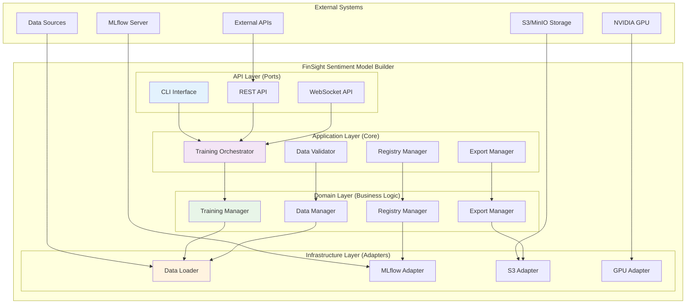

## 🎯 Design Principles

### **Hexagonal Architecture (Ports & Adapters)**

The system follows the Hexagonal Architecture pattern, also known as Ports and Adapters:

- **Ports**: Define interfaces for external interactions
- **Adapters**: Implement concrete interactions with external systems
- **Core**: Contains business logic independent of external dependencies

### **SOLID Principles**

1. **Single Responsibility**: Each class has one reason to change
2. **Open/Closed**: Open for extension, closed for modification
3. **Liskov Substitution**: Derived classes can substitute base classes
4. **Interface Segregation**: Clients depend only on interfaces they use
5. **Dependency Inversion**: High-level modules don't depend on low-level modules

### **Clean Architecture**

- **Independence of Frameworks**: Core logic independent of external libraries
- **Testability**: Easy to test business logic in isolation
- **Independence of UI**: Business logic independent of user interface
- **Independence of Database**: Business logic independent of data persistence
- **Independence of External Agency**: Business logic independent of external systems

### **ML-First Design**

- **Model-Centric**: All operations revolve around model lifecycle
- **Reproducibility**: Deterministic training and evaluation
- **Versioning**: Comprehensive model versioning and tracking
- **Optimization**: Built-in performance optimization features

## 🏛️ System Architecture

### **Layered Architecture**

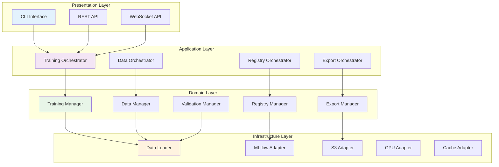

### **Component Architecture**

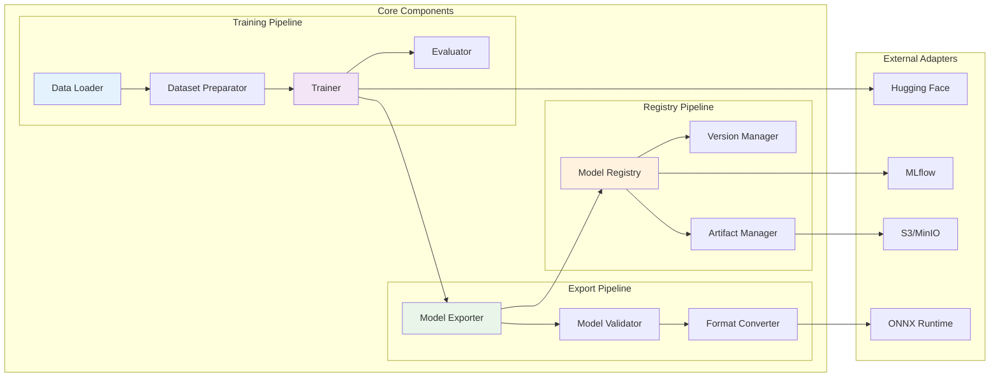

## 📦 Module Architecture

### **Core Module Structure**

```bash
src/
├── core/                    # Configuration and core utilities
│   ├── config.py           # Pydantic configuration classes
│   ├── constants.py        # System constants
│   └── exceptions.py       # Custom exceptions
├── data/                   # Data handling and preprocessing
│   ├── data_loader.py      # Data loading and validation
│   ├── dataset_preparator.py # Dataset preparation
│   └── preprocessing.py    # Text preprocessing utilities
├── models/                 # Model training and export
│   ├── trainer.py          # Training orchestration
│   ├── exporter.py         # Model export logic
│   └── validators.py       # Model validation
├── registry/               # Model registry integration
│   ├── mlflow_registry.py  # MLflow integration
│   └── model_manager.py    # Model lifecycle management
└── cli.py                  # Command-line interface
```

### **Module Dependencies**

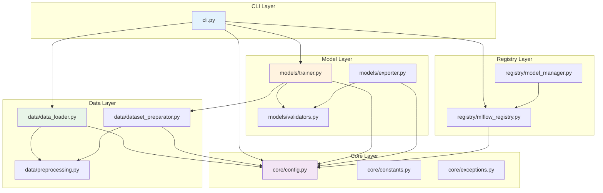

## 🔄 Data Flow

### **Training Workflow**

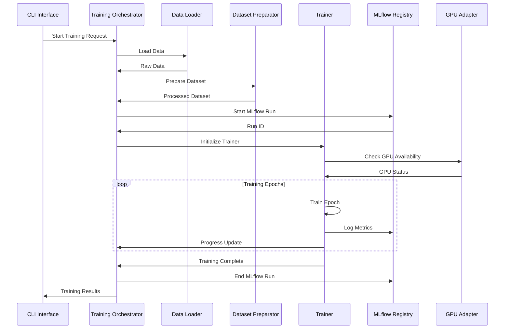

### **Export Workflow**

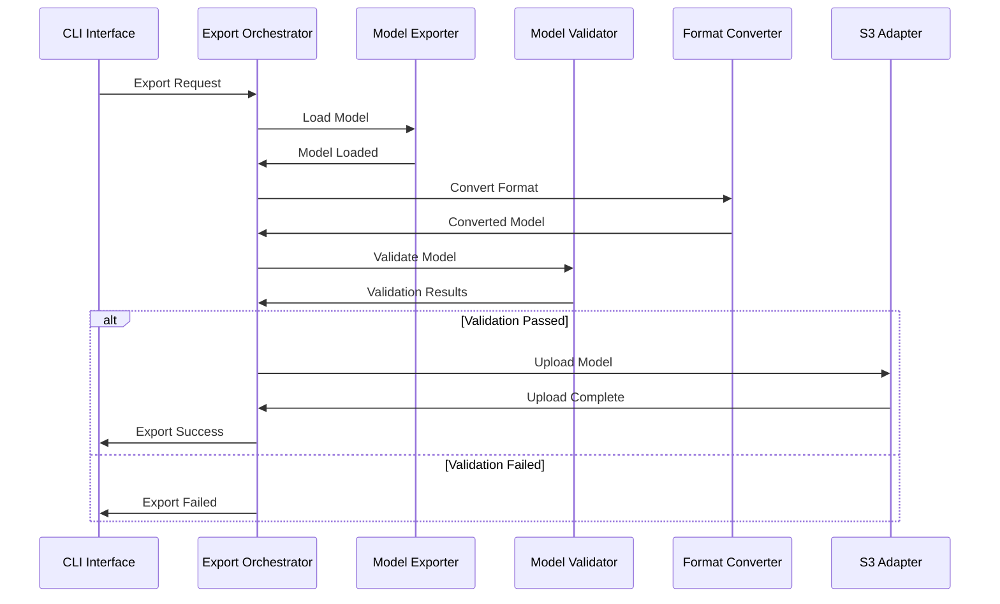

### **Registry Workflow**

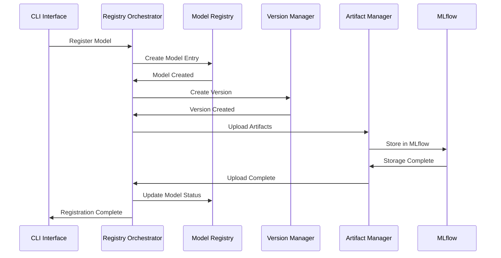

## 🎨 Design Patterns

### **Factory Pattern**

Used for creating instances of different components:

```python
class ModelFactory:
    """Factory for creating model instances."""

    @staticmethod
    def create_trainer(config: TrainingConfig) -> BaseTrainer:
        """Create trainer instance based on configuration."""
        if config.backbone == ModelBackbone.FINBERT:
            return FinBERTTrainer(config)
        elif config.backbone == ModelBackbone.BERT:
            return BERTTrainer(config)
        else:
            raise ValueError(f"Unsupported backbone: {config.backbone}")
```

### **Strategy Pattern**

Used for different training and export strategies:

```python
class TrainingStrategy(ABC):
    """Abstract training strategy."""

    @abstractmethod
    def train(self, model, dataset, config) -> TrainingResult:
        pass

class FinBERTStrategy(TrainingStrategy):
    """FinBERT-specific training strategy."""

    def train(self, model, dataset, config) -> TrainingResult:
        # FinBERT-specific training logic
        pass

class BERTStrategy(TrainingStrategy):
    """BERT-specific training strategy."""

    def train(self, model, dataset, config) -> TrainingResult:
        # BERT-specific training logic
        pass
```

### **Observer Pattern**

Used for training progress monitoring:

```python
class TrainingObserver(ABC):
    """Abstract training observer."""

    @abstractmethod
    def on_epoch_complete(self, epoch: int, metrics: Dict[str, float]):
        pass

    @abstractmethod
    def on_training_complete(self, result: TrainingResult):
        pass

class MLflowObserver(TrainingObserver):
    """MLflow observer for logging metrics."""

    def on_epoch_complete(self, epoch: int, metrics: Dict[str, float]):
        mlflow.log_metrics(metrics, step=epoch)

    def on_training_complete(self, result: TrainingResult):
        mlflow.log_artifact(result.model_path)
```

### **Repository Pattern**

Used for data access abstraction:

```python
class ModelRepository(ABC):
    """Abstract model repository."""

    @abstractmethod
    async def save(self, model: Model) -> str:
        pass

    @abstractmethod
    async def load(self, model_id: str) -> Model:
        pass

    @abstractmethod
    async def delete(self, model_id: str) -> bool:
        pass

class MLflowRepository(ModelRepository):
    """MLflow-based model repository."""

    async def save(self, model: Model) -> str:
        # MLflow-specific save logic
        pass

    async def load(self, model_id: str) -> Model:
        # MLflow-specific load logic
        pass
```

### **Adapter Pattern**

Used for external system integration:

```python
class StorageAdapter(ABC):
    """Abstract storage adapter."""

    @abstractmethod
    async def upload(self, file_path: str, destination: str) -> str:
        pass

    @abstractmethod
    async def download(self, source: str, destination: str) -> str:
        pass

class S3Adapter(StorageAdapter):
    """S3 storage adapter."""

    async def upload(self, file_path: str, destination: str) -> str:
        # S3-specific upload logic
        pass

    async def download(self, source: str, destination: str) -> str:
        # S3-specific download logic
        pass
```

## 🛠️ Technology Stack

### **Core Technologies**

| Component         | Technology   | Version | Purpose                      |
| ----------------- | ------------ | ------- | ---------------------------- |
| **Language**      | Python       | 3.11+   | Primary development language |
| **Framework**     | FastAPI      | 0.100+  | Web framework for API        |
| **ML Framework**  | PyTorch      | 2.0+    | Deep learning framework      |
| **Transformers**  | Hugging Face | 4.30+   | Pre-trained models           |
| **Configuration** | Pydantic     | 2.0+    | Data validation and settings |
| **CLI**           | Typer        | 0.9+    | Command-line interface       |

### **ML & Data Processing**

| Component               | Technology   | Version | Purpose                                |
| ----------------------- | ------------ | ------- | -------------------------------------- |
| **Model Registry**      | MLflow       | 2.0+    | Experiment tracking and model registry |
| **Data Processing**     | Pandas       | 2.0+    | Data manipulation and analysis         |
| **Numerical Computing** | NumPy        | 1.24+   | Numerical operations                   |
| **Machine Learning**    | Scikit-learn | 1.3+    | ML utilities and metrics               |
| **Model Export**        | ONNX         | 1.14+   | Model format conversion                |
| **TorchScript**         | PyTorch      | 2.0+    | Model optimization                     |

### **Infrastructure & Deployment**

| Component            | Technology     | Version | Purpose                       |
| -------------------- | -------------- | ------- | ----------------------------- |
| **Containerization** | Docker         | 20.10+  | Application containerization  |
| **Orchestration**    | Docker Compose | 2.0+    | Multi-container orchestration |
| **Kubernetes**       | K8s            | 1.25+   | Container orchestration       |
| **Helm**             | Helm           | 3.10+   | Kubernetes package manager    |
| **CI/CD**            | GitHub Actions | Latest  | Continuous integration        |
| **Monitoring**       | Prometheus     | 2.40+   | Metrics collection            |

### **Storage & External Services**

| Component          | Technology   | Version | Purpose                |
| ------------------ | ------------ | ------- | ---------------------- |
| **Object Storage** | AWS S3/MinIO | Latest  | Model artifact storage |
| **Database**       | SQLite       | 3.40+   | Local MLflow backend   |
| **Message Queue**  | Redis        | 7.0+    | Caching and job queue  |
| **GPU Support**    | CUDA         | 11.8+   | GPU acceleration       |
| **Cloud Storage**  | boto3        | 1.26+   | AWS S3 integration     |

## 📈 Scalability & Performance

### **Horizontal Scaling**

The system is designed for horizontal scaling through:

- **Stateless Design**: No local state dependencies
- **External Storage**: All data stored in external systems
- **Load Balancing**: Support for multiple instances
- **Microservices**: Modular architecture for independent scaling

### **Performance Optimization**

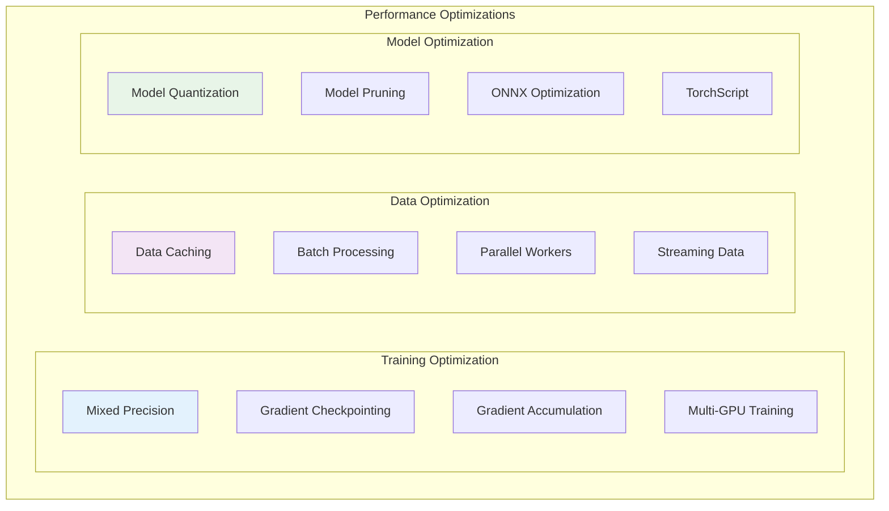

### **Resource Management**

- **Memory Management**: Efficient memory usage with garbage collection
- **GPU Memory**: Dynamic GPU memory allocation and cleanup
- **Disk I/O**: Optimized file operations and caching
- **Network**: Connection pooling and retry mechanisms

### **Caching Strategy**

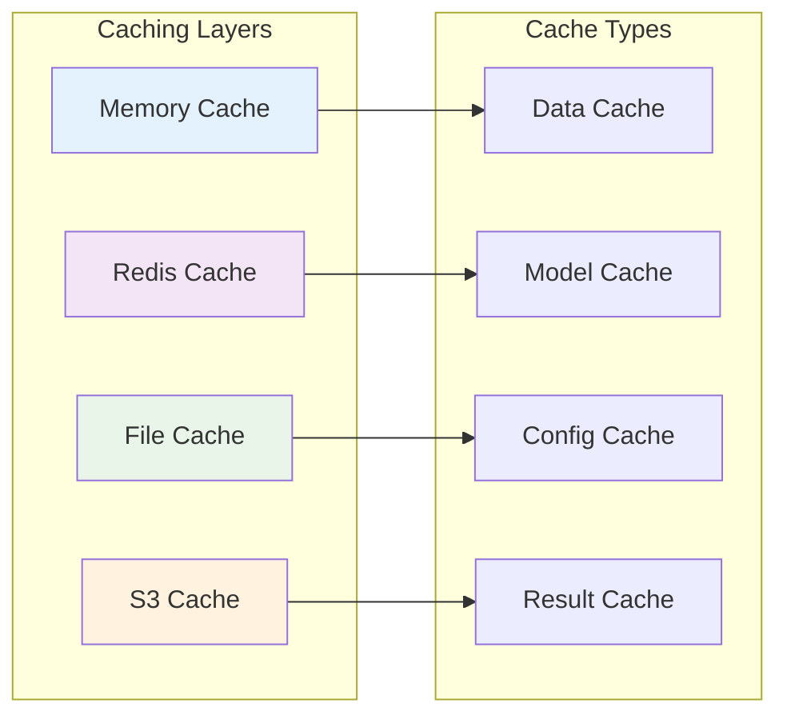

## 🔒 Security Architecture

### **Authentication & Authorization**

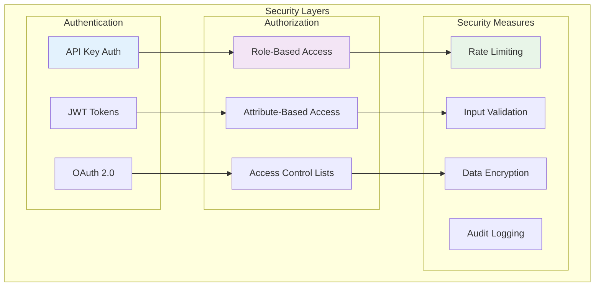

### **Data Security**

- **Encryption at Rest**: All sensitive data encrypted
- **Encryption in Transit**: TLS/SSL for all communications
- **Secret Management**: Secure handling of API keys and credentials
- **Data Sanitization**: Input validation and sanitization

### **Network Security**

- **Firewall Rules**: Restricted network access
- **VPN Access**: Secure remote access
- **Load Balancer**: SSL termination and DDoS protection
- **API Gateway**: Request filtering and rate limiting

## 📊 Monitoring & Observability

### **Monitoring Architecture**

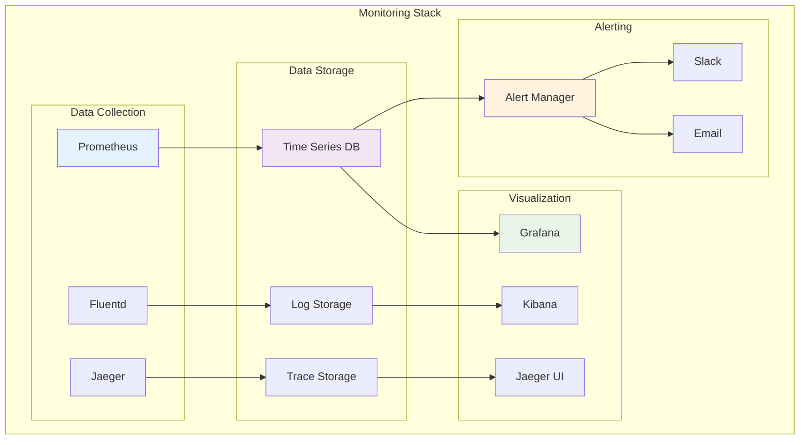

### **Metrics Collection**

- **Application Metrics**: Request rates, response times, error rates
- **Business Metrics**: Training success rates, model performance
- **Infrastructure Metrics**: CPU, memory, disk, network usage
- **Custom Metrics**: Model accuracy, training duration, export success

### **Logging Strategy**

```python
# Structured logging with correlation IDs
logger = LoggerFactory.get_logger(__name__)

def train_model(correlation_id: str, config: TrainingConfig):
    logger.info("Starting model training", extra={
        "correlation_id": correlation_id,
        "model_backbone": config.backbone,
        "batch_size": config.batch_size,
        "epochs": config.num_epochs
    })
```

### **Health Checks**

- **Liveness Probe**: Service is running and responsive
- **Readiness Probe**: Service is ready to handle requests
- **Startup Probe**: Service has completed initialization
- **Custom Health Checks**: MLflow connectivity, GPU availability

### **Distributed Tracing**

- **Request Tracing**: Track requests across service boundaries
- **Performance Profiling**: Identify bottlenecks and slow operations
- **Error Tracking**: Detailed error context and stack traces
- **Dependency Mapping**: Service dependency visualization

---

**For more information, see the [API Documentation](api.md) and [Configuration Guide](configuration.md).**
