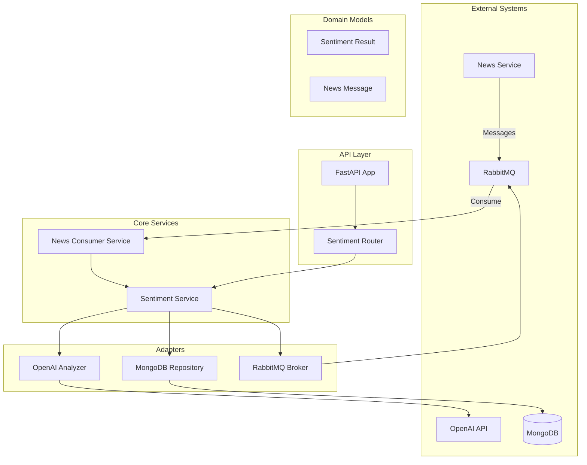

# FinSight Sentiment Analysis Service

[](https://opensource.org/licenses/MIT)
[](https://www.python.org/downloads/)
[](https://fastapi.tiangolo.com/)
[](https://openai.com/)

## Overview

The **FinSight Sentiment Analysis Service** is a high-performance, AI-powered microservice that provides real-time sentiment analysis for financial news and market content. Built with FastAPI and powered by OpenAI's GPT models, this service integrates seamlessly with the FinSight platform to deliver accurate sentiment insights for cryptocurrency trading decisions.

## 🚀 Key Features

- **AI-Powered Analysis**: Leverages OpenAI GPT-4o-mini for state-of-the-art sentiment classification
- **Real-time Processing**: Asynchronous message processing with RabbitMQ integration
- **Financial Domain Expertise**: Specialized prompts for cryptocurrency and financial market content
- **High Availability**: Resilient architecture with graceful degradation and health monitoring
- **Scalable Design**: Horizontal scaling support with connection pooling and caching
- **Comprehensive Monitoring**: Health checks, metrics, and structured logging
- **Message-Driven Architecture**: Event-driven processing with automatic result publishing

## 🏗️ Architecture Overview

The service follows **Hexagonal Architecture** principles with clear separation of concerns:



## 🛠️ Technology Stack

- **Framework**: FastAPI with Uvicorn
- **AI/ML**: OpenAI GPT-4o-mini, LangChain
- **Database**: MongoDB with Motor (async driver)
- **Message Broker**: RabbitMQ with aio-pika
- **Configuration**: Pydantic Settings
- **Dependency Injection**: dependency-injector
- **Logging**: Custom LoggerFactory
- **Validation**: Pydantic models with comprehensive schemas

## 📋 Prerequisites

- Python 3.9+
- MongoDB 5.0+
- RabbitMQ 3.8+
- OpenAI API key
- Docker & Docker Compose (for containerized deployment)

## 🚀 Quick Start

### Local Development

1. **Clone and Setup**

   ```bash
   cd sentiment_analysis/sentiment_analysis_service
   python -m venv venv
   source venv/bin/activate  # On Windows: venv\Scripts\activate
   pip install -r requirements.txt
   ```

2. **Environment Configuration**

   ```bash
   cp env.example .env
   # Edit .env with your configuration
   ```

3. **Run the Service**

   ```bash
   python -m src.main
   # Or with uvicorn directly
   uvicorn src.main:app --host 0.0.0.0 --port 8002 --reload
   ```

4. **Access the API**
   - Service: http://localhost:8002
   - Health Check: http://localhost:8002/health
   - API Docs: http://localhost:8002/docs
   - Test Endpoint: http://localhost:8002/api/v1/sentiment/test

### Docker Deployment

1. **Build and Run**

   ```bash
   docker-compose up --build
   ```

2. **Or with Docker directly**
   ```bash
   docker build -t finsight-sentiment-service .
   docker run -p 8002:8002 --env-file .env finsight-sentiment-service
   ```

## 🧪 Testing

### Run Tests

```bash
# Unit tests
pytest tests/unit/

# Integration tests
pytest tests/integration/

# All tests with coverage
pytest --cov=src --cov-report=html
```

### Test Endpoints

```bash
# Health check
curl http://localhost:8002/health

# Test sentiment analysis
curl -X POST http://localhost:8002/api/v1/sentiment/test \
  -H "Content-Type: application/json" \
  -d '{"text": "Bitcoin reaches new all-time high as institutional adoption grows"}'
```

## 📊 Monitoring & Health

- **Health Endpoint**: `/health` - Comprehensive service health status
- **Metrics Endpoint**: `/metrics` - Service performance metrics
- **Structured Logging**: JSON-formatted logs with correlation IDs
- **Health Checks**: Database, message broker, and analyzer health monitoring

## 🔧 Configuration

The service uses environment variables for configuration. Key settings include:

- **OpenAI**: API key, model selection, temperature, max tokens
- **MongoDB**: Connection URL, database name, collection names
- **RabbitMQ**: Connection URL, exchange names, queue routing
- **Processing**: Batch size, concurrency limits, timeouts
- **Caching**: TTL settings, cache enable/disable

See [Configuration Guide](docs/configuration.md) for complete details.

## 🚀 Production Deployment

### Docker Compose

```bash
docker-compose -f docker-compose.prod.yml up -d
```

### Kubernetes

```bash
kubectl apply -f k8s/
```

### CI/CD Pipeline

The service includes GitHub Actions workflows for automated testing and deployment.

## 📚 Documentation

- [API Documentation](docs/api.md) - Complete API reference
- [Configuration Guide](docs/configuration.md) - Environment variables and settings
- [Architecture & Design](docs/architecture.md) - System design and patterns
- [Deployment Guide](docs/deployment.md) - Production deployment instructions

## 🤝 Contributing

1. Fork the repository
2. Create a feature branch (`git checkout -b feature/amazing-feature`)
3. Commit your changes (`git commit -m 'Add amazing feature'`)
4. Push to the branch (`git push origin feature/amazing-feature`)
5. Open a Pull Request

### Development Guidelines

- Follow PEP 8 style guidelines
- Include comprehensive tests for new features
- Update documentation for API changes
- Use conventional commit messages

## 📄 License

This project is licensed under the MIT License - see the [LICENSE](LICENSE) file for details.

## 🆘 Support

- **Documentation**: Check the [docs/](docs/) directory
- **Issues**: Report bugs and feature requests via GitHub Issues
- **Discussions**: Join community discussions in GitHub Discussions

## 🔗 Related Services

- [News Service](../news_service/) - News collection and management
- [Model Builder](../sentiment_analysis_model_builder/) - Custom model training
- [Inference Engine](../sentiment_analysis_inference_engine/) - Model serving
- [Prediction Service](../../prediction_service/) - Market prediction models

---

**Built with ❤️ by the FinSight Team**
