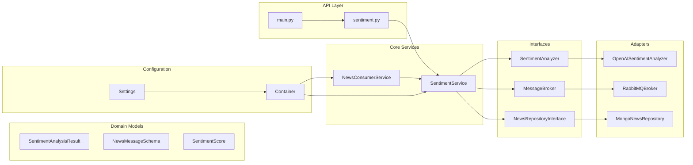
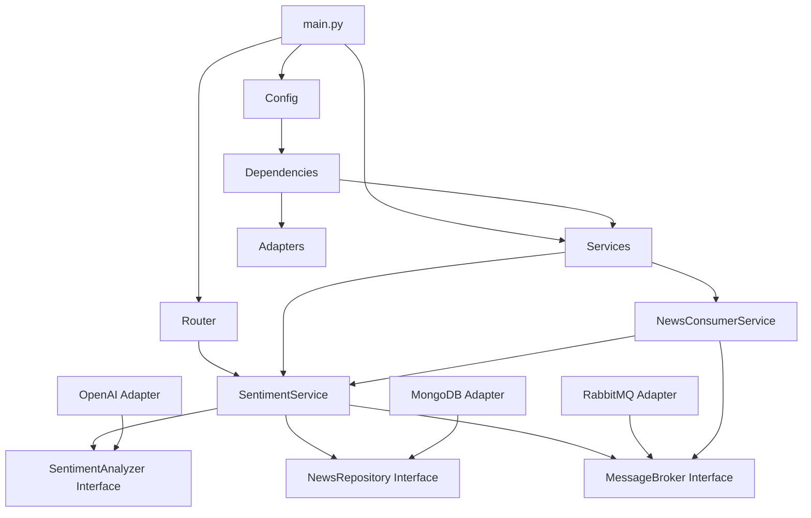
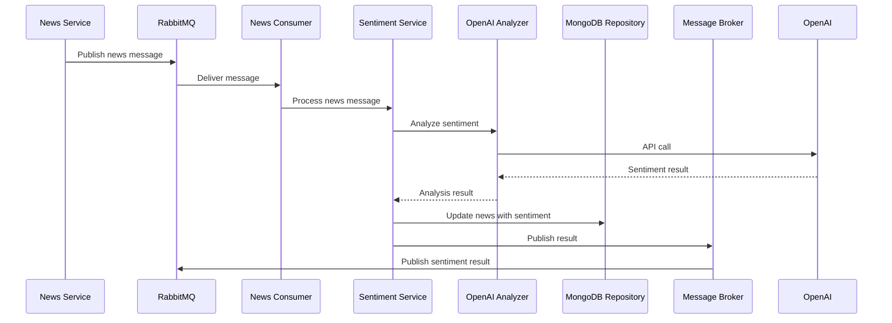
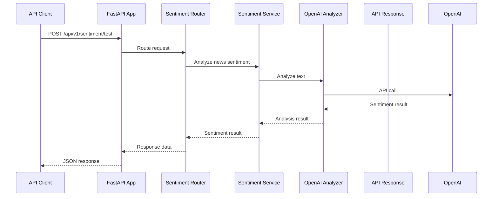
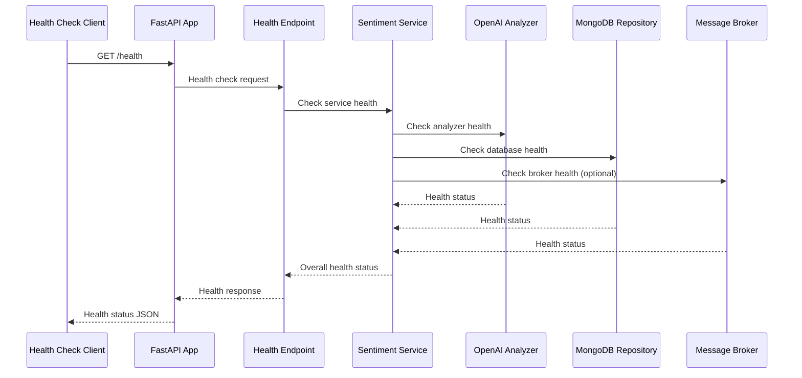

# Architecture & Design - FinSight Sentiment Analysis Service

## Overview

The FinSight Sentiment Analysis Service is built using **Hexagonal Architecture** (Ports & Adapters) principles, providing a clean separation between business logic, external dependencies, and infrastructure concerns. The service is designed for high availability, scalability, and maintainability in production environments.

## Architectural Principles

### 1. Hexagonal Architecture

The service follows the Hexagonal Architecture pattern, also known as Ports & Adapters:

- **Core Domain**: Business logic and domain models
- **Ports**: Interfaces defining contracts for external interactions
- **Adapters**: Concrete implementations of external system integrations

### 2. SOLID Principles

- **Single Responsibility**: Each class has one reason to change
- **Open/Closed**: Open for extension, closed for modification
- **Liskov Substitution**: Implementations can be swapped without breaking contracts
- **Interface Segregation**: Clients depend only on interfaces they use
- **Dependency Inversion**: High-level modules don't depend on low-level modules

### 3. Clean Architecture

- **Independence of Frameworks**: Business logic independent of FastAPI
- **Testability**: Easy to unit test with mocked dependencies
- **Independence of UI**: API layer can be changed without affecting business logic
- **Independence of Database**: Business logic independent of MongoDB implementation

### 4. Event-Driven Architecture

- **Asynchronous Processing**: Non-blocking message consumption and publishing
- **Loose Coupling**: Services communicate through message queues
- **Scalability**: Easy to scale individual components independently

## System Architecture

### High-Level Architecture

```mermaid
graph TB
    subgraph "External Systems"
        News[News Service]
        OpenAI[OpenAI API]
        MongoDB[(MongoDB)]
        RabbitMQ[RabbitMQ]
    end

    subgraph "API Layer (Ports)"
        FastAPI[FastAPI App]
        Router[Sentiment Router]
        Middleware[CORS, Exception Handler]
    end

    subgraph "Core Services (Application)"
        SentimentService[Sentiment Service]
        NewsConsumer[News Consumer Service]
    end

    subgraph "Domain Models (Core)"
        SentimentResult[Sentiment Result]
        NewsMessage[News Message]
        SentimentLabel[Sentiment Label]
        SentimentScore[Sentiment Score]
    end

    subgraph "Adapters (Infrastructure)"
        OpenAIAnalyzer[OpenAI Analyzer]
        RabbitMQBroker[RabbitMQ Broker]
        MongoRepo[MongoDB Repository]
    end

    subgraph "Interfaces (Ports)"
        SentimentAnalyzer[Sentiment Analyzer Interface]
        MessageBroker[Message Broker Interface]
        NewsRepository[News Repository Interface]
    end

    News -->|Messages| RabbitMQ
    RabbitMQ -->|Consume| NewsConsumer
    NewsConsumer --> SentimentService
    SentimentService --> SentimentAnalyzer
    SentimentAnalyzer --> OpenAIAnalyzer
    OpenAIAnalyzer --> OpenAI
    SentimentService --> NewsRepository
    NewsRepository --> MongoRepo
    MongoRepo --> MongoDB
    SentimentService --> MessageBroker
    MessageBroker --> RabbitMQBroker
    RabbitMQBroker --> RabbitMQ
    FastAPI --> Router
    Router --> SentimentService
    SentimentService --> Domain Models
```

### Component Architecture



## Module Architecture

### Directory Structure

```
src/
├── __init__.py
├── main.py                 # FastAPI application entry point
├── core/
│   ├── __init__.py
│   └── config.py          # Configuration management
├── models/
│   ├── __init__.py
│   ├── sentiment.py       # Domain models
│   └── news_model.py      # News data models
├── schemas/
│   ├── __init__.py
│   ├── common_schemas.py  # Shared schemas
│   ├── message_schemas.py # Message queue schemas
│   └── news_schemas.py    # News API schemas
├── interfaces/
│   ├── __init__.py
│   ├── sentiment_analyzer.py    # Sentiment analysis contract
│   ├── news_repository_interface.py # Data access contract
│   └── message_broker.py        # Message broker contract
├── adapters/
│   ├── __init__.py
│   ├── openai_sentiment_analyzer.py # OpenAI implementation
│   └── rabbitmq_broker.py       # RabbitMQ implementation
├── repositories/
│   ├── __init__.py
│   └── mongo_news_repository.py # MongoDB implementation
├── services/
│   ├── __init__.py
│   ├── sentiment_service.py     # Core business logic
│   └── news_consumer_service.py # Message consumer
├── routers/
│   ├── __init__.py
│   └── sentiment.py      # API endpoints
└── utils/
    ├── __init__.py
    └── dependencies.py    # Dependency injection
```

### Module Dependencies



## Data Flow Architecture

### 1. News Processing Flow



### 2. API Request Flow



### 3. Health Check Flow



## Design Patterns

### 1. Factory Pattern

**Purpose**: Create complex objects with proper initialization

```python
# utils/dependencies.py
class Container(containers.DeclarativeContainer):
    """Dependency injection container for sentiment analysis service."""

    # Sentiment Analyzer Factory
    sentiment_analyzer = providers.Singleton(
        OpenAISentimentAnalyzer,
        api_key=config.openai_api_key.as_(str),
        model=config.openai_model.as_(str),
        temperature=config.openai_temperature.as_(float),
        max_tokens=config.openai_max_tokens.as_(int),
        max_retries=config.analysis_retry_attempts.as_(int),
    )
```

### 2. Strategy Pattern

**Purpose**: Interchangeable algorithms for sentiment analysis

```python
# interfaces/sentiment_analyzer.py
class SentimentAnalyzer(ABC):
    """Abstract base class for sentiment analyzers."""

    @abstractmethod
    async def analyze(self, text: str) -> SentimentAnalysisResult:
        """Analyze sentiment of given text."""
        pass

# adapters/openai_sentiment_analyzer.py
class OpenAISentimentAnalyzer(SentimentAnalyzer):
    """OpenAI-powered sentiment analyzer implementation."""

    async def analyze(self, text: str) -> SentimentAnalysisResult:
        # OpenAI-specific implementation
        pass
```

### 3. Observer Pattern

**Purpose**: Notify multiple components of sentiment analysis results

```python
# services/sentiment_service.py
class SentimentService:
    async def publish_sentiment_result(self, news_id: str, result: SentimentAnalysisResult):
        """Publish sentiment analysis result to message broker."""
        if self.message_broker:
            await self.message_broker.publish(
                exchange=settings.rabbitmq_exchange,
                routing_key=settings.rabbitmq_routing_key_sentiment_results,
                message=result_message
            )
```

### 4. Repository Pattern

**Purpose**: Abstract data access layer

```python
# interfaces/news_repository_interface.py
class NewsRepositoryInterface(ABC):
    """Abstract interface for news data access."""

    @abstractmethod
    async def update_news_sentiment(self, item_id: str, **kwargs) -> bool:
        """Update news item with sentiment analysis results."""
        pass

# repositories/mongo_news_repository.py
class MongoNewsRepository(NewsRepositoryInterface):
    """MongoDB implementation of news repository."""

    async def update_news_sentiment(self, item_id: str, **kwargs) -> bool:
        # MongoDB-specific implementation
        pass
```

### 5. Adapter Pattern

**Purpose**: Integrate external services with consistent interfaces

```python
# adapters/rabbitmq_broker.py
class RabbitMQBroker(MessageBroker):
    """RabbitMQ implementation of message broker interface."""

    async def publish(self, exchange: str, routing_key: str, message: dict):
        """Publish message to RabbitMQ exchange."""
        # RabbitMQ-specific implementation
        pass
```

### 6. Dependency Injection Pattern

**Purpose**: Manage service dependencies and lifecycle

```python
# utils/dependencies.py
async def get_sentiment_service() -> SentimentService:
    """Get sentiment service instance with dependencies."""
    return container.sentiment_service()

async def get_news_repository() -> NewsRepositoryInterface:
    """Get news repository instance."""
    return container.news_repository()
```

## Technology Stack

### Core Framework

- **FastAPI**: Modern, fast web framework for building APIs
- **Uvicorn**: ASGI server for running FastAPI applications
- **Pydantic**: Data validation using Python type annotations

### AI/ML Integration

- **OpenAI API**: GPT-4o-mini for sentiment analysis
- **LangChain**: LLM orchestration and structured output
- **Structured Output**: Pydantic models for AI responses

### Data Storage

- **MongoDB**: Document database for news and sentiment data
- **Motor**: Async MongoDB driver for Python
- **Connection Pooling**: Efficient database connection management

### Message Broker

- **RabbitMQ**: Message queue for asynchronous processing
- **aio-pika**: Async RabbitMQ client for Python
- **Topic Exchanges**: Flexible message routing

### Configuration Management

- **Pydantic Settings**: Environment-based configuration
- **Validation**: Automatic configuration validation
- **Environment Files**: Support for .env files

### Dependency Injection

- **dependency-injector**: Container-based dependency injection
- **Providers**: Factory and singleton providers
- **Lifecycle Management**: Service initialization and cleanup

### Logging & Monitoring

- **Custom LoggerFactory**: Structured logging across services
- **Health Checks**: Comprehensive service health monitoring
- **Metrics**: Service performance and operational metrics

## Scalability & Performance

### Horizontal Scaling

- **Stateless Design**: Services can be scaled horizontally
- **Load Balancing**: Multiple instances can share load
- **Connection Pooling**: Efficient resource utilization

### Performance Optimization

- **Async/Await**: Non-blocking I/O operations
- **Concurrent Processing**: Multiple analysis tasks in parallel
- **Caching**: Response caching for repeated requests
- **Batch Processing**: Efficient handling of multiple news items

### Resource Management

- **Connection Limits**: Configurable connection pool sizes
- **Timeout Management**: Configurable timeouts for external calls
- **Memory Management**: Efficient data structures and cleanup

## Security Architecture

### Input Validation

- **Pydantic Models**: Automatic request validation
- **Field Constraints**: Type and range validation
- **Sanitization**: Input sanitization and cleaning

### API Security

- **Rate Limiting**: Configurable request rate limits
- **Error Handling**: Secure error messages without information leakage
- **CORS Configuration**: Configurable cross-origin resource sharing

### Data Security

- **Environment Variables**: Secure credential management
- **Connection Encryption**: TLS for external API calls
- **Access Control**: Repository-level access control

## Monitoring & Observability

### Health Monitoring

- **Health Endpoints**: Comprehensive health check endpoints
- **Component Health**: Individual component health status
- **Dependency Health**: External service health monitoring

### Logging Strategy

- **Structured Logging**: JSON-formatted logs for easy parsing
- **Log Levels**: Configurable logging levels per environment
- **Correlation IDs**: Request tracking across service boundaries

### Metrics Collection

- **Performance Metrics**: Response times and throughput
- **Operational Metrics**: Service uptime and message processing
- **Business Metrics**: Sentiment analysis accuracy and volume

### Distributed Tracing

- **Request Correlation**: Track requests across service boundaries
- **Performance Profiling**: Identify bottlenecks in processing
- **Error Tracking**: Comprehensive error context and stack traces

## Error Handling & Resilience

### Error Categories

- **Validation Errors**: Input validation failures
- **External Service Errors**: OpenAI API, MongoDB, RabbitMQ failures
- **System Errors**: Internal service failures
- **Network Errors**: Connection and timeout failures

### Resilience Patterns

- **Circuit Breaker**: Prevent cascading failures
- **Retry Logic**: Automatic retry with exponential backoff
- **Graceful Degradation**: Continue operation with reduced functionality
- **Fallback Mechanisms**: Alternative processing paths

### Error Recovery

- **Automatic Recovery**: Self-healing for transient failures
- **Manual Intervention**: Clear error messages for manual resolution
- **Monitoring Alerts**: Proactive notification of failures
- **Log Analysis**: Comprehensive error logging for debugging

## Testing Strategy

### Test Types

- **Unit Tests**: Individual component testing
- **Integration Tests**: Service interaction testing
- **End-to-End Tests**: Complete workflow testing
- **Performance Tests**: Load and stress testing

### Test Architecture

- **Mock Dependencies**: External service mocking
- **Test Containers**: Isolated testing environments
- **Test Data**: Representative test datasets
- **Coverage Targets**: Minimum 80% code coverage

## Deployment Architecture

### Container Strategy

- **Docker Images**: Optimized container images
- **Multi-stage Builds**: Efficient image construction
- **Health Checks**: Container health monitoring
- **Resource Limits**: CPU and memory constraints

### Orchestration

- **Kubernetes**: Production deployment orchestration
- **Service Discovery**: Automatic service discovery
- **Load Balancing**: Built-in load balancing
- **Auto-scaling**: Horizontal pod auto-scaling

### CI/CD Pipeline

- **Automated Testing**: Comprehensive test automation
- **Security Scanning**: Vulnerability and dependency scanning
- **Automated Deployment**: Staging and production deployment
- **Rollback Strategy**: Quick rollback for failed deployments
